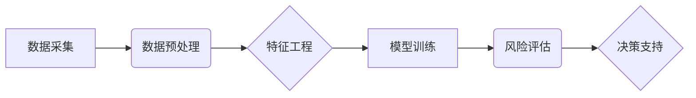

                 

## 洞察力与风险评估：预见与管理的能力

> 关键词：人工智能、风险评估、洞察力、预测模型、数据分析、机器学习、可视化、决策支持

## 1. 背景介绍

在当今瞬息万变的科技时代，数据爆炸和计算能力的飞速发展为我们提供了前所未有的机遇，但也带来了前所未有的挑战。人工智能（AI）技术的蓬勃发展，特别是机器学习和深度学习的突破，为我们提供了强大的工具，可以从海量数据中提取有价值的洞察，并预测未来趋势。然而，AI技术也带来了新的风险，例如算法偏差、数据安全和伦理问题。因此，如何有效地利用AI技术，同时规避潜在风险，成为一个至关重要的议题。

风险评估是企业和组织在决策过程中不可或缺的一部分。传统的风险评估方法往往依赖于经验和主观判断，难以应对复杂性和不确定性的挑战。而AI技术可以帮助我们构建更精准、更全面的风险评估模型，并提供更有效的风险管理策略。

## 2. 核心概念与联系

**2.1 核心概念**

* **洞察力 (Insight):** 指从数据中发现隐藏的模式、趋势和关系，并将其转化为有价值的知识和理解。
* **风险评估 (Risk Assessment):**  系统性地识别、分析和评估潜在的风险，并制定相应的应对措施。
* **预测模型 (Predictive Model):** 利用历史数据和统计方法，构建一个能够预测未来事件发生的概率模型。

**2.2 架构关系**



**2.3 核心联系**

洞察力是风险评估的基础，通过对数据的深入分析，我们可以识别潜在的风险因素。预测模型是风险评估的核心工具，它可以帮助我们量化风险，并预测未来风险发生的可能性。最终，风险评估的结果将为决策支持提供依据，帮助企业和组织做出更明智的决策。

## 3. 核心算法原理 & 具体操作步骤

**3.1 算法原理概述**

风险评估算法通常基于机器学习技术，例如监督学习、无监督学习和强化学习。

* **监督学习:** 利用标记数据训练模型，预测未来事件的发生概率。例如，利用历史贷款数据训练模型，预测客户是否会违约。
* **无监督学习:**  从未标记数据中发现隐藏的模式和结构。例如，利用客户交易数据进行聚类分析，识别不同类型的客户。
* **强化学习:**  通过试错学习，优化决策策略。例如，利用游戏环境训练模型，学习如何玩游戏并获得更高的分数。

**3.2 算法步骤详解**

1. **数据采集:** 收集与风险相关的各种数据，例如财务数据、客户数据、市场数据等。
2. **数据预处理:** 清洗、转换和格式化数据，使其适合模型训练。
3. **特征工程:** 从原始数据中提取有价值的特征，用于模型训练。
4. **模型选择:** 根据风险评估的具体需求，选择合适的机器学习算法。
5. **模型训练:** 利用训练数据训练模型，并调整模型参数，使其能够准确预测风险。
6. **模型评估:** 利用测试数据评估模型的性能，例如准确率、召回率、F1-score等。
7. **模型部署:** 将训练好的模型部署到生产环境中，用于实时风险评估。

**3.3 算法优缺点**

* **优点:** 
    * 能够处理海量数据，发现隐藏的风险因素。
    * 能够量化风险，并预测未来风险发生的可能性。
    * 能够提供更精准、更全面的风险评估结果。
* **缺点:** 
    * 需要大量的训练数据，否则模型性能会下降。
    * 模型训练过程可能需要很长时间。
    * 模型结果可能受到数据偏差的影响。

**3.4 算法应用领域**

* 金融风险管理
* 欺诈检测
* 医疗风险评估
* 供应链风险管理
* 网络安全风险评估

## 4. 数学模型和公式 & 详细讲解 & 举例说明

**4.1 数学模型构建**

风险评估模型通常基于概率论和统计学原理，构建一个数学模型来描述风险发生的可能性。

**4.2 公式推导过程**

例如，我们可以使用贝叶斯定理来计算风险发生的概率。

$$P(A|B) = \frac{P(B|A)P(A)}{P(B)}$$

其中：

* $P(A|B)$ 是事件 A 在事件 B 发生的条件下发生的概率。
* $P(B|A)$ 是事件 B 在事件 A 发生的条件下发生的概率。
* $P(A)$ 是事件 A 发生的概率。
* $P(B)$ 是事件 B 发生的概率。

**4.3 案例分析与讲解**

假设我们想评估客户违约的风险。我们可以使用以下数据：

* $P(违约)$: 客户违约的概率 (例如，历史数据显示 5% 的客户违约)。
* $P(信用评分|违约)$: 违约客户的信用评分分布 (例如，违约客户的信用评分通常较低)。
* $P(信用评分)$: 所有客户的信用评分分布 (例如，根据历史数据，平均信用评分为 700)。

利用贝叶斯定理，我们可以计算出客户信用评分为 X 的情况下，违约的概率：

$$P(违约|信用评分=X) = \frac{P(信用评分=X|违约)P(违约)}{P(信用评分=X)}$$

通过计算这个概率，我们可以评估客户违约的风险。

## 5. 项目实践：代码实例和详细解释说明

**5.1 开发环境搭建**

* Python 3.x
* Jupyter Notebook
* scikit-learn

**5.2 源代码详细实现**

```python
from sklearn.linear_model import LogisticRegression
from sklearn.model_selection import train_test_split
from sklearn.metrics import accuracy_score

# 加载数据
data = pd.read_csv('credit_data.csv')

# 划分训练集和测试集
X = data.drop('违约', axis=1)
y = data['违约']
X_train, X_test, y_train, y_test = train_test_split(X, y, test_size=0.2, random_state=42)

# 训练模型
model = LogisticRegression()
model.fit(X_train, y_train)

# 预测结果
y_pred = model.predict(X_test)

# 评估模型性能
accuracy = accuracy_score(y_test, y_pred)
print(f'模型准确率: {accuracy}')
```

**5.3 代码解读与分析**

* 首先，我们加载数据并划分训练集和测试集。
* 然后，我们使用逻辑回归模型训练模型。
* 最后，我们使用测试集评估模型的性能，并打印模型的准确率。

**5.4 运行结果展示**

运行代码后，我们可以得到模型的准确率，例如 0.85，表示模型在测试集上的预测准确率为 85%。

## 6. 实际应用场景

**6.1 金融风险管理**

* 评估贷款风险，预测客户违约概率。
* 识别欺诈交易，防止金融损失。
* 管理投资组合风险，优化投资策略。

**6.2 医疗风险评估**

* 预测患者的疾病风险，进行早期干预。
* 评估医疗服务的风险，提高医疗质量。
* 管理医疗保险风险，控制医疗成本。

**6.3 网络安全风险评估**

* 识别网络攻击的风险，加强网络安全防御。
* 评估漏洞的风险，及时修复安全漏洞。
* 监控网络安全事件，及时响应安全威胁。

**6.4 未来应用展望**

随着AI技术的不断发展，风险评估将更加精准、高效和智能化。未来，我们可以期待以下应用场景：

* 基于深度学习的风险评估模型，能够处理更复杂的数据，并提供更准确的预测结果。
* 基于强化学习的风险评估模型，能够学习和优化风险管理策略，提高风险控制效率。
* 基于云计算和大数据平台的风险评估系统，能够实现实时风险监测和预警，帮助企业和组织及时应对风险。

## 7. 工具和资源推荐

**7.1 学习资源推荐**

* **书籍:**
    * 《机器学习》 by Tom Mitchell
    * 《深入理解机器学习》 by 周志华
    * 《Python机器学习实战》 by Sebastian Raschka
* **在线课程:**
    * Coursera: Machine Learning by Andrew Ng
    * edX: Artificial Intelligence by Columbia University
    * Udacity: Machine Learning Engineer Nanodegree

**7.2 开发工具推荐**

* **Python:** 
    * scikit-learn: 机器学习库
    * TensorFlow: 深度学习库
    * PyTorch: 深度学习库
* **数据可视化工具:**
    * Matplotlib
    * Seaborn
    * Plotly

**7.3 相关论文推荐**

* **《Probabilistic Risk Assessment》 by US Nuclear Regulatory Commission**
* **《A Survey of Risk Assessment Methods》 by International Journal of Risk Assessment and Management**
* **《Deep Learning for Risk Management》 by IEEE Transactions on Neural Networks and Learning Systems**

## 8. 总结：未来发展趋势与挑战

**8.1 研究成果总结**

近年来，AI技术在风险评估领域取得了显著进展，例如：

* 构建了更精准、更全面的风险评估模型。
* 提供了更有效的风险管理策略。
* 提高了风险控制效率。

**8.2 未来发展趋势**

* 深度学习技术将进一步应用于风险评估，提高模型的预测精度。
* 强化学习技术将被用于优化风险管理策略，实现自动化决策。
* 云计算和大数据平台将为风险评估提供更强大的计算能力和数据支持。

**8.3 面临的挑战**

* 数据质量和可用性问题。
* 模型解释性和可信度问题。
* 算法偏差和公平性问题。
* 伦理和法律问题。

**8.4 研究展望**

未来，我们需要继续研究以下问题：

* 如何提高风险评估模型的准确性和鲁棒性。
* 如何更好地解释和理解模型的决策过程。
* 如何解决算法偏差和公平性问题。
* 如何制定相应的伦理和法律规范，确保AI技术在风险评估领域的健康发展。

## 9. 附录：常见问题与解答

**9.1 如何选择合适的风险评估模型？**

选择合适的风险评估模型需要根据具体的需求和数据特点进行选择。例如，对于分类问题，可以使用逻辑回归、支持向量机或决策树等模型；对于回归问题，可以使用线性回归、岭回归或随机森林等模型。

**9.2 如何评估风险评估模型的性能？**

常用的评估指标包括准确率、召回率、F1-score、AUC等。

**9.3 如何解决算法偏差和公平性问题？**

可以采用以下方法解决算法偏差和公平性问题：

* 使用多样化的训练数据，减少数据偏差。
* 使用公平性约束条件，引导模型学习公平的决策规则。
* 定期评估模型的公平性，并进行调整。


作者：禅与计算机程序设计艺术 / Zen and the Art of Computer Programming 
<end_of_turn>

