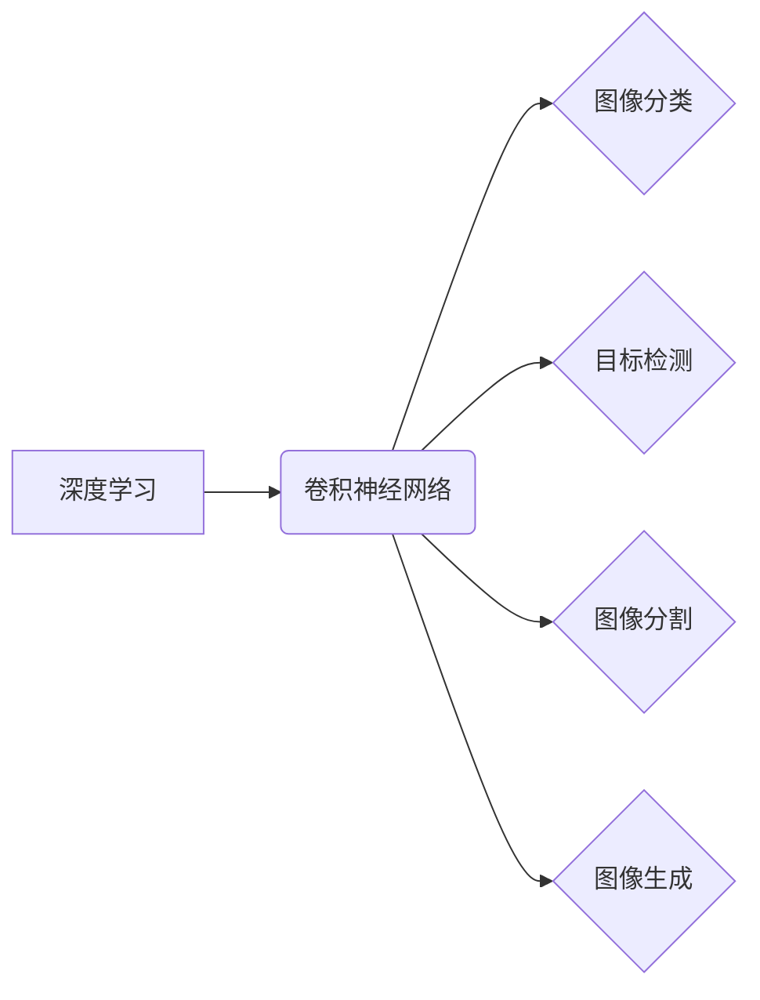

                 

## 深度学习在计算机视觉中的最新进展

> 关键词：深度学习、计算机视觉、卷积神经网络、目标检测、图像分类、图像分割、生成对抗网络、迁移学习

## 1. 背景介绍

计算机视觉作为人工智能领域的重要分支，旨在赋予计算机“看”的能力，使其能够理解和解释图像和视频信息。传统计算机视觉方法主要依赖手工设计的特征提取和规则编码，但随着深度学习技术的兴起，计算机视觉领域迎来了前所未有的发展机遇。

深度学习是一种基于多层神经网络的机器学习方法，能够自动学习图像特征，并实现更准确、更鲁棒的视觉任务。近年来，深度学习在计算机视觉领域取得了突破性进展，例如图像分类、目标检测、图像分割、图像生成等任务的性能大幅提升。

## 2. 核心概念与联系

**2.1 深度学习与计算机视觉**

深度学习通过多层神经网络学习图像特征，从低层特征（如边缘、纹理）到高层特征（如物体、场景），最终实现对图像的理解和分析。

**2.2 卷积神经网络 (CNN)**

卷积神经网络是深度学习中专门用于处理图像数据的网络结构。CNN 利用卷积操作和池化操作提取图像特征，具有参数共享、局部连接和层次化特征学习等特点，使其在图像识别任务中表现出色。

**2.3 常见计算机视觉任务**

* **图像分类:** 将图像分类到预定义的类别中，例如识别猫、狗、车等。
* **目标检测:** 在图像中定位和识别多个目标，并给出每个目标的类别和位置信息。
* **图像分割:** 将图像分割成多个区域，每个区域对应不同的物体或场景。
* **图像生成:** 生成逼真的图像，例如生成人脸、风景等。

**2.4 核心概念关系图**



## 3. 核心算法原理 & 具体操作步骤

### 3.1 算法原理概述

卷积神经网络 (CNN) 是深度学习中用于处理图像数据的核心算法。CNN 通过多层卷积和池化操作，自动学习图像特征，并实现对图像的理解和分析。

**3.1.1 卷积操作**

卷积操作是 CNN 的核心操作之一，它通过一个称为卷积核 (kernel) 的小矩阵，在图像上滑动，计算每个位置的卷积结果。卷积核可以学习到图像中的特征，例如边缘、纹理等。

**3.1.2 池化操作**

池化操作用于降低图像尺寸，并提取图像的鲁棒特征。常见的池化操作包括最大池化和平均池化。

**3.1.3 全连接层**

全连接层将卷积和池化层的输出连接起来，并进行分类或回归。

### 3.2 算法步骤详解

1. **输入图像:** 将图像输入到 CNN 的第一层卷积层。
2. **卷积层:** 使用卷积核对图像进行卷积操作，提取图像特征。
3. **池化层:** 对卷积层的输出进行池化操作，降低图像尺寸并提取鲁棒特征。
4. **重复步骤 2 和 3:** 将卷积层和池化层重复若干层，逐层提取更高级的特征。
5. **全连接层:** 将卷积和池化层的输出连接到全连接层，进行分类或回归。
6. **输出结果:** 输出分类结果或回归值。

### 3.3 算法优缺点

**优点:**

* 自动学习图像特征，无需人工设计特征。
* 性能优异，在图像识别任务中取得了突破性进展。
* 可处理大规模图像数据。

**缺点:**

* 训练数据量大，需要大量的标注数据。
* 计算量大，训练时间长。
* 对超参数设置敏感。

### 3.4 算法应用领域

* **图像分类:** 识别物体、场景、人脸等。
* **目标检测:** 定位和识别图像中的目标。
* **图像分割:** 将图像分割成多个区域。
* **图像生成:** 生成逼真的图像。
* **视频分析:** 识别视频中的动作、事件等。
* **医疗诊断:** 辅助医生诊断疾病。
* **自动驾驶:** 识别道路、交通标志等。

## 4. 数学模型和公式 & 详细讲解 & 举例说明

### 4.1 数学模型构建

CNN 的数学模型主要包括卷积层、池化层和全连接层。

**4.1.1 卷积层**

卷积层的数学模型可以用以下公式表示：

$$
y_{i,j} = \sum_{m=0}^{M-1} \sum_{n=0}^{N-1} x_{i+m,j+n} * w_{m,n} + b
$$

其中：

* $y_{i,j}$ 是卷积层的输出值。
* $x_{i+m,j+n}$ 是输入图像的像素值。
* $w_{m,n}$ 是卷积核的权重值。
* $b$ 是卷积层的偏置值。
* $M$ 和 $N$ 是卷积核的大小。

**4.1.2 池化层**

池化层的数学模型根据不同的池化操作方式有所不同。

* **最大池化:** 选择池化窗口内的最大值作为输出值。
* **平均池化:** 计算池化窗口内的平均值作为输出值。

**4.1.3 全连接层**

全连接层的数学模型可以用以下公式表示：

$$
y_i = \sum_{j=0}^{J-1} x_j * w_{ij} + b_i
$$

其中：

* $y_i$ 是全连接层的输出值。
* $x_j$ 是前一层神经元的输出值。
* $w_{ij}$ 是连接权重值。
* $b_i$ 是全连接层的偏置值。
* $J$ 是前一层神经元的个数。

### 4.2 公式推导过程

卷积层的公式推导过程可以参考相关深度学习教材或论文。

### 4.3 案例分析与讲解

以图像分类为例，假设输入图像大小为 28x28，卷积核大小为 3x3，卷积层输出特征图大小为 26x26。

1. 卷积操作：将卷积核在图像上滑动，计算每个位置的卷积结果，得到 26x26 的特征图。
2. 池化操作：对特征图进行最大池化，例如池化窗口大小为 2x2，步长为 2，得到 13x13 的特征图。
3. 全连接层：将 13x13 的特征图展开成一维向量，连接到全连接层，进行分类。

## 5. 项目实践：代码实例和详细解释说明

### 5.1 开发环境搭建

* Python 3.x
* TensorFlow 或 PyTorch 深度学习框架
* CUDA 和 cuDNN (可选，用于 GPU 加速)

### 5.2 源代码详细实现

```python
import tensorflow as tf

# 定义卷积神经网络模型
model = tf.keras.models.Sequential([
    tf.keras.layers.Conv2D(32, (3, 3), activation='relu', input_shape=(28, 28, 1)),
    tf.keras.layers.MaxPooling2D((2, 2)),
    tf.keras.layers.Conv2D(64, (3, 3), activation='relu'),
    tf.keras.layers.MaxPooling2D((2, 2)),
    tf.keras.layers.Flatten(),
    tf.keras.layers.Dense(10, activation='softmax')
])

# 编译模型
model.compile(optimizer='adam',
              loss='sparse_categorical_crossentropy',
              metrics=['accuracy'])

# 训练模型
model.fit(x_train, y_train, epochs=10)

# 评估模型
loss, accuracy = model.evaluate(x_test, y_test)
print('Test loss:', loss)
print('Test accuracy:', accuracy)
```

### 5.3 代码解读与分析

* **定义模型:** 使用 TensorFlow 的 `keras` API 定义卷积神经网络模型，包括卷积层、池化层和全连接层。
* **编译模型:** 使用 `adam` 优化器、`sparse_categorical_crossentropy` 损失函数和 `accuracy` 评价指标编译模型。
* **训练模型:** 使用 `fit` 方法训练模型，输入训练数据和标签，设置训练轮数。
* **评估模型:** 使用 `evaluate` 方法评估模型在测试数据上的性能。

### 5.4 运行结果展示

训练完成后，可以查看模型在测试数据上的损失值和准确率。

## 6. 实际应用场景

### 6.1 图像分类

* **人脸识别:** 用于解锁手机、验证身份等。
* **物体检测:** 用于自动驾驶、安防监控等。
* **医疗诊断:** 用于辅助医生诊断疾病，例如识别肿瘤、骨折等。

### 6.2 目标检测

* **自动驾驶:** 用于识别道路、交通标志、行人等。
* **安防监控:** 用于检测入侵者、异常行为等。
* **机器人视觉:** 用于帮助机器人识别和抓取物体。

### 6.3 图像分割

* **医学图像分析:** 用于分割器官、肿瘤等。
* **遥感图像分析:** 用于分割土地类型、植被覆盖等。
* **图像编辑:** 用于抠图、图像修复等。

### 6.4 未来应用展望

* **更准确、更鲁棒的视觉识别:** 随着深度学习算法的不断发展，计算机视觉的准确性和鲁棒性将进一步提升。
* **更广泛的应用场景:** 深度学习将应用于更多领域，例如教育、娱乐、金融等。
* **更智能的视觉系统:** 深度学习将使计算机视觉系统更加智能，能够理解和解释图像信息，并做出更合理的决策。

## 7. 工具和资源推荐

### 7.1 学习资源推荐

* **书籍:**
    * 深度学习 (Deep Learning) - Ian Goodfellow, Yoshua Bengio, Aaron Courville
    * 计算机视觉: 基于深度学习的算法 (Computer Vision: Algorithms and Applications) - Richard Szeliski
* **在线课程:**
    * Coursera: 深度学习 Specialization
    * Udacity: 计算机视觉 Nanodegree
* **博客和网站:**
    * TensorFlow Blog: https://blog.tensorflow.org/
    * PyTorch Blog: https://pytorch.org/blog/

### 7.2 开发工具推荐

* **TensorFlow:** https://www.tensorflow.org/
* **PyTorch:** https://pytorch.org/
* **Keras:** https://keras.io/

### 7.3 相关论文推荐

* **AlexNet:** ImageNet Classification with Deep Convolutional Neural Networks
* **VGGNet:** Very Deep Convolutional Networks for Large-Scale Image Recognition
* **ResNet:** Deep Residual Learning for Image Recognition
* **InceptionNet:** Inception-v3, Inception-ResNet v2

## 8. 总结：未来发展趋势与挑战

### 8.1 研究成果总结

深度学习在计算机视觉领域取得了突破性进展，例如图像分类、目标检测、图像分割等任务的性能大幅提升。

### 8.2 未来发展趋势

* **更深更广的网络结构:** 研究更深、更广的网络结构，例如 Transformer 在计算机视觉领域的应用。
* **自监督学习:** 利用未标记数据进行训练，降低对标注数据的依赖。
* **边缘计算:** 将深度学习模型部署到边缘设备，实现实时视觉处理。
* **多模态学习:** 将图像与其他模态数据（例如文本、音频）结合，实现更全面的理解。

### 8.3 面临的挑战

* **数据效率:** 深度学习模型对大量数据训练，数据获取和标注成本高。
* **可解释性:** 深度学习模型的决策过程难以解释，缺乏透明度。
* **安全性和鲁棒性:** 深度学习模型容易受到攻击，需要提高安全性。

### 8.4 研究展望

未来，深度学习在计算机视觉领域将继续发展，带来更多创新和应用。研究者将致力于解决数据效率、可解释性和安全性等挑战，推动计算机视觉技术向更智能、更安全、更可解释的方向发展。

## 9. 附录：常见问题与解答

**Q1: 深度学习与传统计算机视觉方法相比有什么优势？**

A1: 深度学习能够自动学习图像特征，无需人工设计特征，性能优异，可处理大规模图像数据。

**Q2: 如何选择合适的深度学习框架？**

A2: TensorFlow 和 PyTorch 是两个流行的深度学习框架，根据个人喜好和项目需求选择。

**Q3: 如何提高深度学习模型的准确率？**

A3: 可以尝试使用更深、更广的网络结构，增加训练数据，调优超参数等。


作者：禅与计算机程序设计艺术 / Zen and the Art of Computer Programming<end_of_turn>

