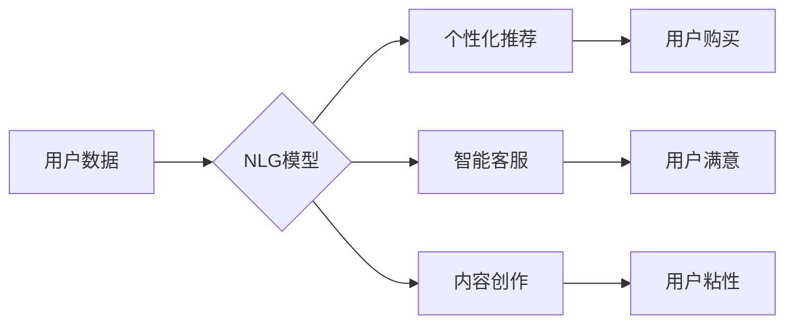

                 

## 电商平台中的自然语言生成：大模型的创新应用

> 关键词：自然语言生成、大模型、电商平台、推荐系统、客户服务、内容创作、Transformer、BERT、GPT

## 1. 背景介绍

随着人工智能技术的飞速发展，自然语言生成（Natural Language Generation，NLG）技术已成为一个备受关注的领域。NLG技术能够使计算机能够理解和生成人类语言，这为电商平台带来了诸多创新应用机会。

电商平台作为连接消费者和商品的桥梁，其核心目标是提升用户体验，促进交易。传统的电商平台主要依靠人工客服、规则引擎和商品描述等方式来满足用户需求。然而，这些方法存在着局限性，例如人工客服成本高、规则引擎难以应对复杂场景、商品描述缺乏个性化等。

NLG技术能够有效解决这些问题，它可以帮助电商平台实现以下功能：

* **个性化商品推荐：**根据用户的浏览历史、购买记录和兴趣偏好，生成个性化的商品推荐文案，提升用户转化率。
* **智能客服：**利用NLG技术构建智能客服系统，能够自动回复用户常见问题，提供24小时在线服务，减轻人工客服压力。
* **内容创作：**自动生成商品描述、促销文案、新闻资讯等内容，提高内容生产效率，降低成本。
* **用户互动：**通过NLG技术，电商平台可以与用户进行更自然的互动，例如聊天机器人、问答系统等，提升用户粘性。

## 2. 核心概念与联系

### 2.1 自然语言生成 (NLG)

自然语言生成是指计算机根据给定的数据或知识，生成自然流畅的人类语言文本的过程。NLG技术的核心是将数据或知识转换为人类可理解的语言表达。

### 2.2 大模型 (Large Language Model)

大模型是指参数量巨大、训练数据海量的人工智能模型。大模型能够学习到语言的复杂结构和语义关系，从而具备更强大的文本生成能力。

### 2.3 电商平台

电商平台是指提供商品展示、交易、支付等服务的在线平台。电商平台需要处理大量用户数据和商品信息，NLG技术可以帮助电商平台更好地利用这些数据，提升用户体验和商业价值。

**Mermaid 流程图**



## 3. 核心算法原理 & 具体操作步骤

### 3.1 算法原理概述

NLG算法的核心是将数据或知识转换为文本表达。常用的NLG算法包括：

* **模板填充法：**将预定义的模板填充数据，生成文本。
* **规则生成法：**根据预设的规则生成文本。
* **统计语言模型：**利用统计方法学习语言模式，生成文本。
* **深度学习模型：**利用深度学习算法，例如Transformer，学习语言的复杂结构和语义关系，生成更自然流畅的文本。

### 3.2 算法步骤详解

以深度学习模型为例，NLG算法的具体步骤如下：

1. **数据预处理：**将原始数据清洗、格式化，并转换为模型可理解的格式。
2. **模型训练：**利用深度学习算法，例如Transformer，训练NLG模型。训练过程中，模型会学习语言的语法和语义规则。
3. **文本生成：**将需要生成的文本内容作为输入，模型根据训练得到的知识和规则，生成相应的文本输出。

### 3.3 算法优缺点

**优点：**

* 生成文本更自然流畅。
* 可以处理更复杂的任务，例如对话生成、机器翻译等。
* 可以根据数据不断学习和改进。

**缺点：**

* 训练成本高，需要大量数据和计算资源。
* 模型解释性差，难以理解模型是如何生成文本的。
* 可能存在偏差和错误，需要进行严格的测试和评估。

### 3.4 算法应用领域

NLG技术广泛应用于各个领域，例如：

* **电商平台：**个性化推荐、智能客服、内容创作等。
* **新闻媒体：**自动生成新闻报道、财经分析等。
* **教育行业：**自动生成学习材料、个性化辅导等。
* **医疗保健：**自动生成病历摘要、医疗建议等。

## 4. 数学模型和公式 & 详细讲解 & 举例说明

### 4.1 数学模型构建

NLG模型通常基于深度学习框架，例如TensorFlow或PyTorch。模型结构通常包括编码器和解码器。

* **编码器：**负责将输入文本转换为隐藏表示，提取文本的语义信息。
* **解码器：**根据编码器的输出，生成目标文本。

### 4.2 公式推导过程

NLG模型的训练过程基于最大似然估计，目标是最大化模型生成目标文本的概率。

$$
P(y|x) = \prod_{t=1}^{T} P(y_t|y_{<t}, x)
$$

其中：

* $y$ 是目标文本
* $x$ 是输入文本
* $y_t$ 是目标文本的第 $t$ 个词
* $y_{<t}$ 是目标文本的前 $t-1$ 个词

### 4.3 案例分析与讲解

例如，训练一个生成商品描述的NLG模型，输入文本可以是商品的属性信息，例如颜色、材质、尺寸等，输出文本就是商品的描述。

训练过程中，模型会学习到不同属性信息与描述之间的关系，例如“红色”属性可能对应描述“鲜艳夺目”，“皮革”属性可能对应描述“质感细腻”。

## 5. 项目实践：代码实例和详细解释说明

### 5.1 开发环境搭建

NLG模型的开发环境通常包括：

* **操作系统：**Linux或Windows
* **编程语言：**Python
* **深度学习框架：**TensorFlow或PyTorch
* **GPU：**加速模型训练

### 5.2 源代码详细实现

以下是一个使用TensorFlow构建简单NLG模型的代码示例：

```python
import tensorflow as tf

# 定义模型结构
model = tf.keras.Sequential([
    tf.keras.layers.Embedding(input_dim=10000, output_dim=128),
    tf.keras.layers.LSTM(128),
    tf.keras.layers.Dense(10000, activation='softmax')
])

# 编译模型
model.compile(loss='sparse_categorical_crossentropy', optimizer='adam')

# 训练模型
model.fit(x_train, y_train, epochs=10)

# 生成文本
text = model.predict(x_test)
```

### 5.3 代码解读与分析

* **Embedding层：**将输入词转换为向量表示。
* **LSTM层：**学习文本的上下文信息。
* **Dense层：**将隐藏表示转换为输出词的概率分布。

### 5.4 运行结果展示

训练完成后，模型可以用于生成新的文本。例如，输入一个商品的属性信息，模型可以生成相应的商品描述。

## 6. 实际应用场景

### 6.1 个性化商品推荐

NLG技术可以帮助电商平台生成个性化的商品推荐文案，例如：

* “根据您的浏览历史，我们推荐您购买这款新款手机。”
* “您可能也喜欢这款与您之前购买的衣服相配的包包。”

### 6.2 智能客服

NLG技术可以构建智能客服系统，自动回复用户常见问题，例如：

* “请问您的订单状态如何？”
* “我们的营业时间是每天9点到18点。”

### 6.3 内容创作

NLG技术可以自动生成商品描述、促销文案、新闻资讯等内容，例如：

* “这款手机拥有强大的性能和时尚的外观，是您的最佳选择。”
* “限时抢购，购买此商品可享受8折优惠。”

### 6.4 未来应用展望

NLG技术的应用场景还在不断扩展，未来可能应用于：

* **个性化营销：**根据用户的兴趣和行为，生成个性化的营销文案。
* **虚拟助手：**构建更智能的虚拟助手，能够进行更自然的对话和交互。
* **自动写作：**自动生成各种类型的文本，例如小说、诗歌、剧本等。

## 7. 工具和资源推荐

### 7.1 学习资源推荐

* **书籍：**
    * 《Speech and Language Processing》
    * 《Deep Learning》
* **在线课程：**
    * Coursera: Natural Language Processing Specialization
    * edX: Artificial Intelligence

### 7.2 开发工具推荐

* **深度学习框架：**TensorFlow, PyTorch
* **自然语言处理库：**NLTK, spaCy
* **代码编辑器：**VS Code, Sublime Text

### 7.3 相关论文推荐

* **BERT：** Devlin, J., Chang, M. W., Lee, K., & Toutanova, K. (2018). BERT: Pre-training of deep bidirectional transformers for language understanding. arXiv preprint arXiv:1810.04805.
* **GPT：**Radford, A., Wu, J., Child, R., Luan, D., Amodei, D., & Sutskever, I. (2019). Language models are few-shot learners. OpenAI blog.

## 8. 总结：未来发展趋势与挑战

### 8.1 研究成果总结

NLG技术取得了显著的进展，能够生成更自然流畅的文本，并应用于越来越多的领域。

### 8.2 未来发展趋势

* **模型规模和能力的提升：**未来NLG模型将更加强大，能够处理更复杂的任务，生成更高质量的文本。
* **多模态NLG：**NLG模型将融合多模态信息，例如图像、音频、视频，生成更丰富的文本内容。
* **个性化和定制化：**NLG模型将更加个性化和定制化，能够根据用户的需求生成特定类型的文本。

### 8.3 面临的挑战

* **数据质量和标注问题：**NLG模型的训练需要大量高质量的数据，数据标注工作量大，成本高。
* **模型解释性和可控性：**深度学习模型的内部机制复杂，难以解释模型是如何生成文本的，这限制了模型的应用场景。
* **伦理和社会影响：**NLG技术可能被用于生成虚假信息、进行恶意攻击等，需要关注其伦理和社会影响。

### 8.4 研究展望

未来NLG研究将继续探索以下方向：

* **开发更有效的训练方法：**降低模型训练成本，提高模型效率。
* **提升模型的解释性和可控性：**使模型的决策过程更加透明，提高模型的安全性。
* **研究NLG技术的伦理和社会影响：**确保NLG技术被用于良善的目的，造福人类社会。

## 9. 附录：常见问题与解答

**Q1：NLG技术与机器翻译有什么区别？**

**A1：** NLG技术和机器翻译都是自然语言处理领域的重要技术，但它们的目标不同。机器翻译的目标是将一种语言翻译成另一种语言，而NLG的目标是生成新的文本内容。

**Q2：NLG技术有哪些应用场景？**

**A2：** NLG技术应用场景广泛，例如电商平台的个性化推荐、智能客服、内容创作、新闻报道、教育辅导等。

**Q3：如何评估NLG模型的性能？**

**A3：** NLG模型的性能通常通过BLEU、ROUGE等指标进行评估，这些指标可以衡量生成的文本与参考文本的相似度。


作者：禅与计算机程序设计艺术 / Zen and the Art of Computer Programming 
<end_of_turn>

