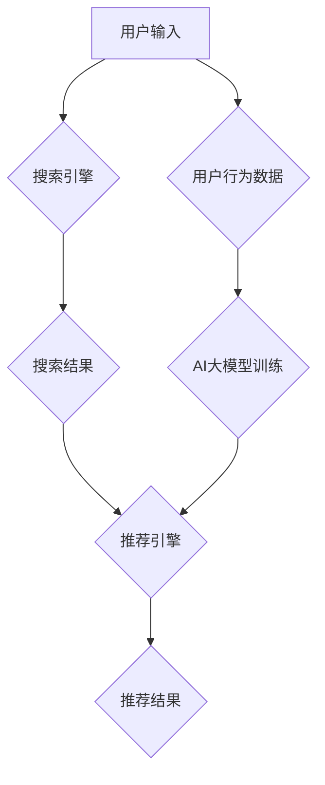

                 

## 电商平台搜索推荐系统的架构设计：AI 大模型是核心

> 关键词：电商平台、搜索推荐系统、AI 大模型、深度学习、推荐算法、个性化推荐、架构设计、数据处理、模型训练、线上部署

## 1. 背景介绍

在当今数据爆炸的时代，电商平台面临着巨大的用户规模和商品种类，传统的搜索和推荐系统已经难以满足用户对个性化、精准的商品发现需求。为了提升用户体验，提高转化率，电商平台迫切需要构建更智能、更精准的搜索推荐系统。

近年来，人工智能（AI）技术，特别是深度学习技术，取得了长足的进步，为电商平台搜索推荐系统的升级提供了强有力的技术支撑。AI 大模型凭借其强大的学习能力和泛化能力，能够从海量数据中挖掘出用户兴趣、商品特征等隐含关系，从而实现更精准的商品推荐。

## 2. 核心概念与联系

### 2.1 核心概念

* **搜索推荐系统:**  电商平台的核心功能之一，旨在帮助用户快速找到所需商品，并根据用户偏好和行为推荐相关商品。
* **AI 大模型:**  指在海量数据上训练的深度学习模型，具有强大的学习和泛化能力，能够处理复杂的任务，例如自然语言处理、图像识别、推荐系统等。
* **深度学习:**  一种机器学习的子领域，利用多层神经网络模拟人类大脑的学习过程，能够从数据中学习更深层的特征和模式。

### 2.2 架构关系

电商平台搜索推荐系统的架构设计，需要将搜索和推荐功能有机结合，并充分利用AI大模型的优势。



**架构说明:**

1. 用户输入关键词或商品信息，进入搜索引擎进行搜索。
2. 搜索引擎根据关键词匹配算法，返回相关商品搜索结果。
3. 推荐引擎根据用户搜索历史、浏览记录、购买行为等数据，以及AI大模型的训练结果，推荐相关商品。
4. 用户查看搜索结果和推荐结果，并进行商品选择。
5. 用户行为数据被收集并用于AI大模型的训练，不断提升推荐系统的精准度。

## 3. 核心算法原理 & 具体操作步骤

### 3.1 算法原理概述

电商平台搜索推荐系统通常采用基于协同过滤、内容过滤、混合过滤等算法进行推荐。

* **协同过滤:**  根据用户的历史行为数据，预测用户对特定商品的兴趣。
* **内容过滤:**  根据商品的特征信息，推荐与用户兴趣相符的商品。
* **混合过滤:**  结合协同过滤和内容过滤算法，实现更精准的推荐。

### 3.2 算法步骤详解

以协同过滤算法为例，其具体操作步骤如下：

1. **数据收集:**  收集用户历史行为数据，例如用户对商品的评分、购买记录、浏览记录等。
2. **数据预处理:**  对收集到的数据进行清洗、转换、填充等预处理操作，以确保数据质量。
3. **相似度计算:**  计算用户之间的相似度，例如使用余弦相似度、皮尔逊相关系数等方法。
4. **推荐生成:**  根据用户与其他用户的相似度，推荐与相似用户喜欢的商品。

### 3.3 算法优缺点

**优点:**

* 能够发现用户隐含的兴趣，推荐个性化商品。
* 不需要明确的商品特征信息，能够推荐新商品。

**缺点:**

* 数据稀疏性问题，当用户行为数据不足时，推荐效果会下降。
* 冷启动问题，对于新用户和新商品，难以进行推荐。

### 3.4 算法应用领域

协同过滤算法广泛应用于电商平台、音乐平台、电影平台等场景，用于商品推荐、音乐推荐、电影推荐等。

## 4. 数学模型和公式 & 详细讲解 & 举例说明

### 4.1 数学模型构建

协同过滤算法的数学模型通常基于矩阵分解技术，将用户-商品交互矩阵分解成用户特征矩阵和商品特征矩阵。

假设用户集合为U，商品集合为I，用户-商品交互矩阵为R，其中R(u,i)表示用户u对商品i的评分。

则用户特征矩阵为U，商品特征矩阵为V，可以表示为：

$$R \approx U V^T$$

其中，U(u,k)表示用户u在第k个特征维度上的特征值，V(i,k)表示商品i在第k个特征维度上的特征值。

### 4.2 公式推导过程

通过最小化用户-商品交互矩阵与预测矩阵之间的误差，可以得到用户特征矩阵和商品特征矩阵的最佳解。

常用的误差函数为均方误差（MSE）：

$$MSE = \frac{1}{N} \sum_{u \in U} \sum_{i \in I} (R(u,i) - \hat{R}(u,i))^2$$

其中，N为用户-商品交互矩阵中的非零元素个数，$\hat{R}(u,i)$为预测的评分。

通过梯度下降算法等优化方法，可以迭代更新用户特征矩阵和商品特征矩阵，最终得到最优的解。

### 4.3 案例分析与讲解

假设有一个用户-商品交互矩阵，其中用户1对商品1评分为5，用户2对商品1评分为3，用户1对商品2评分为4，用户2对商品2评分为2。

通过矩阵分解技术，可以得到用户特征矩阵和商品特征矩阵，例如：

* 用户特征矩阵：

```
[ 
  [ 1, 2 ],
  [ 0, 1 ]
]
```

* 商品特征矩阵：

```
[ 
  [ 2, 1 ],
  [ 1, 0 ]
]
```

通过将这两个矩阵相乘，可以得到预测的评分矩阵：

```
[ 
  [ 5, 4 ],
  [ 3, 2 ]
]
```

可以看到，预测的评分与实际评分基本一致，说明矩阵分解技术能够有效地学习用户和商品的特征，并进行预测。

## 5. 项目实践：代码实例和详细解释说明

### 5.1 开发环境搭建

* 操作系统：Linux/macOS
* Python 版本：3.7+
* 依赖库：TensorFlow/PyTorch、Scikit-learn、pandas、numpy等

### 5.2 源代码详细实现

以下代码示例展示了使用TensorFlow实现协同过滤算法的简单代码：

```python
import tensorflow as tf

# 定义用户-商品交互矩阵
ratings = tf.constant([
    [5, 4, 0],
    [3, 2, 0],
    [0, 0, 5]
])

# 定义用户特征矩阵和商品特征矩阵
num_users = ratings.shape[0]
num_items = ratings.shape[1]
latent_dim = 10

user_embeddings = tf.Variable(tf.random.normal([num_users, latent_dim]))
item_embeddings = tf.Variable(tf.random.normal([num_items, latent_dim]))

# 计算预测评分
predictions = tf.matmul(user_embeddings, item_embeddings, transpose_b=True)

# 定义损失函数
loss = tf.reduce_mean(tf.square(ratings - predictions))

# 定义优化器
optimizer = tf.keras.optimizers.Adam()

# 训练模型
for epoch in range(100):
    with tf.GradientTape() as tape:
        loss_value = loss
    gradients = tape.gradient(loss_value, [user_embeddings, item_embeddings])
    optimizer.apply_gradients(zip(gradients, [user_embeddings, item_embeddings]))

# 打印损失值
print(f"Epoch {epoch}, Loss: {loss_value.numpy()}")
```

### 5.3 代码解读与分析

* 代码首先定义了用户-商品交互矩阵，以及用户特征矩阵和商品特征矩阵的维度。
* 然后，使用TensorFlow的张量操作计算预测评分。
* 定义了均方误差作为损失函数，并使用Adam优化器进行模型训练。
* 训练过程中，迭代更新用户特征矩阵和商品特征矩阵，最终得到最优的解。

### 5.4 运行结果展示

训练完成后，可以将预测评分与实际评分进行比较，评估模型的性能。

## 6. 实际应用场景

电商平台搜索推荐系统广泛应用于以下场景：

* **商品推荐:**  根据用户的历史行为数据，推荐与用户兴趣相符的商品。
* **搜索结果排序:**  根据商品的特征信息和用户行为数据，对搜索结果进行排序，提升用户体验。
* **个性化广告:**  根据用户的兴趣和行为数据，推送个性化的广告，提高广告转化率。

### 6.4 未来应用展望

随着AI技术的不断发展，电商平台搜索推荐系统将朝着以下方向发展：

* **更精准的推荐:**  利用更先进的深度学习算法和更丰富的用户数据，实现更精准的商品推荐。
* **更个性化的体验:**  根据用户的个性化需求，提供更个性化的搜索和推荐体验。
* **更智能的交互:**  利用自然语言处理技术，实现更智能的商品搜索和推荐交互。

## 7. 工具和资源推荐

### 7.1 学习资源推荐

* **书籍:**

    * 《深度学习》 - Ian Goodfellow, Yoshua Bengio, Aaron Courville
    * 《推荐系统实践》 -  李航

* **在线课程:**

    * Coursera: 深度学习
    * Udacity: 机器学习工程师

### 7.2 开发工具推荐

* **深度学习框架:** TensorFlow, PyTorch
* **数据处理工具:** pandas, numpy
* **云计算平台:** AWS, Azure, GCP

### 7.3 相关论文推荐

* **协同过滤:**

    * "Collaborative Filtering: A User-Based Approach" - Goldberg, E., Nichols, D., Oki, B., & Terry, D. (1992).
    * "Memory-Based Collaborative Filtering" - Breese, M. S., Heckerman, D., & Kadie, C. (1998).

* **深度学习推荐:**

    * "Deep Learning for Recommender Systems" - Wang-Cheng Kang, et al. (2019).
    * "Neural Collaborative Filtering" - He, X., Liao, L., Chen, H., & Ma, W. Y. (2017).

## 8. 总结：未来发展趋势与挑战

### 8.1 研究成果总结

电商平台搜索推荐系统已经取得了显著的成果，AI大模型的应用使得推荐系统更加精准、个性化。

### 8.2 未来发展趋势

* **更深层的模型:**  利用更深层的深度学习模型，挖掘更深层的用户和商品特征。
* **多模态融合:**  融合文本、图像、视频等多模态数据，实现更全面的商品理解和推荐。
* **联邦学习:**  利用联邦学习技术，保护用户隐私，同时实现模型的联合训练。

### 8.3 面临的挑战

* **数据稀疏性:**  用户行为数据往往稀疏，难以训练出高质量的推荐模型。
* **冷启动问题:**  对于新用户和新商品，难以进行推荐。
* **公平性问题:**  推荐算法可能存在偏见，导致不公平的推荐结果。

### 8.4 研究展望

未来，电商平台搜索推荐系统将继续朝着更智能、更精准、更公平的方向发展，为用户提供更优质的商品发现体验。


## 9. 附录：常见问题与解答

* **Q1:  如何解决数据稀疏性问题？**

    * **A1:**  可以使用矩阵分解技术、嵌入式表示学习等方法，将稀疏数据转换为稠密的向量表示。

* **Q2:  如何解决冷启动问题？**

    * **A2:**  可以使用基于内容过滤、基于社会关系的推荐等方法，为新用户和新商品提供初始推荐。

* **Q3:  如何保证推荐系统的公平性？**

    * **A3:**  可以使用公平性度量指标，评估推荐算法的公平性，并进行相应的调整。


作者：禅与计算机程序设计艺术 / Zen and the Art of Computer Programming 
<end_of_turn>

