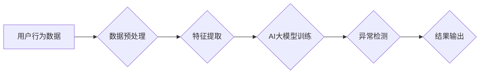

                 

## 电商搜索推荐中的AI大模型用户行为序列异常检测模型评测报告

> 关键词：电商搜索、推荐系统、AI大模型、用户行为序列、异常检测、模型评测

## 1. 背景介绍

在当今数据爆炸的时代，电商平台积累了海量用户行为数据，这些数据蕴含着丰富的商业价值。用户行为序列分析是挖掘用户行为模式、预测用户需求、个性化推荐的关键技术。然而，用户行为序列往往存在着异常情况，例如恶意刷单、虚假交易等，这些异常行为会对电商平台的正常运营造成严重影响。因此，如何准确识别用户行为序列中的异常行为，对于保障电商平台的稳定运行和用户体验至关重要。

近年来，随着深度学习技术的快速发展，AI大模型在用户行为序列分析领域展现出强大的潜力。AI大模型能够学习用户行为序列的复杂模式，并对异常行为进行识别。然而，现有的AI大模型用户行为序列异常检测模型在准确率、效率、可解释性等方面仍存在一些挑战。

本报告将对电商搜索推荐中的AI大模型用户行为序列异常检测模型进行深入评测，分析其核心概念、算法原理、数学模型、项目实践、实际应用场景、未来发展趋势等方面，并提出相应的改进建议。

## 2. 核心概念与联系

### 2.1 用户行为序列

用户行为序列是指用户在电商平台上进行一系列操作的记录，例如浏览商品、添加购物车、下单购买等。这些操作可以被表示为一个时间序列，每个时间点代表一个用户行为。

### 2.2 异常检测

异常检测是指从正常数据集中识别出与众不同的数据点，这些数据点可能代表着异常行为或事件。

### 2.3 AI大模型

AI大模型是指具有海量参数和强大的学习能力的深度学习模型，例如Transformer、BERT等。

### 2.4 模型架构

**Mermaid 流程图**



## 3. 核心算法原理 & 具体操作步骤

### 3.1 算法原理概述

本报告主要介绍基于AI大模型的用户行为序列异常检测算法。该算法的核心思想是利用AI大模型学习用户行为序列的正常模式，并通过对比异常行为与正常模式之间的差异来识别异常行为。

### 3.2 算法步骤详解

1. **数据预处理:** 对用户行为数据进行清洗、转换、编码等操作，使其符合AI大模型的输入要求。
2. **特征提取:** 从用户行为数据中提取特征，例如用户ID、商品ID、操作类型、时间戳等。
3. **AI大模型训练:** 利用提取的特征训练AI大模型，例如Transformer模型，使其能够学习用户行为序列的正常模式。
4. **异常检测:** 将新的用户行为序列输入到训练好的AI大模型中，并计算其与正常模式之间的差异。如果差异超过设定阈值，则判定该序列为异常行为。
5. **结果输出:** 将检测到的异常行为进行标记和输出，以便进行后续处理。

### 3.3 算法优缺点

**优点:**

* 能够学习用户行为序列的复杂模式，识别出传统方法难以发现的异常行为。
* 具有较高的准确率和鲁棒性。

**缺点:**

* 训练AI大模型需要大量的计算资源和时间。
* 模型的可解释性较差，难以理解模型是如何识别异常行为的。

### 3.4 算法应用领域

* **电商平台:** 识别恶意刷单、虚假交易等异常行为。
* **金融机构:** 识别欺诈交易、账户异常等风险行为。
* **医疗机构:** 识别医疗数据中的异常情况，例如患者病情变化异常。

## 4. 数学模型和公式 & 详细讲解 & 举例说明

### 4.1 数学模型构建

本报告采用基于Transformer的AI大模型进行用户行为序列异常检测。Transformer模型是一种序列到序列的深度学习模型，能够有效地捕捉序列中的长距离依赖关系。

### 4.2 公式推导过程

Transformer模型的输出层通常采用softmax函数进行归一化，得到每个时间点的每个类别的概率分布。异常检测的目标是识别出概率分布中异常类别的概率值。

$$
P(y_t|x_1, x_2, ..., x_t) = \frac{e^{score(x_1, x_2, ..., x_t, y_t)}}{\sum_{y \in Y} e^{score(x_1, x_2, ..., x_t, y)}}
$$

其中：

* $P(y_t|x_1, x_2, ..., x_t)$ 是在给定序列 $x_1, x_2, ..., x_t$ 的条件下，时间点 $t$ 的类别 $y_t$ 的概率。
* $score(x_1, x_2, ..., x_t, y_t)$ 是模型对序列 $x_1, x_2, ..., x_t$ 和类别 $y_t$ 的评分。
* $Y$ 是所有可能的类别集合。

### 4.3 案例分析与讲解

假设我们有一个电商平台的用户行为序列数据，其中包含了用户浏览商品、添加购物车、下单购买等操作。我们可以使用Transformer模型训练一个异常检测模型，识别出恶意刷单的行为。

例如，一个恶意刷单的用户可能会频繁地浏览商品、添加购物车，但最终不会下单购买。这种行为与正常用户的行为模式不同，可以被模型识别为异常行为。

## 5. 项目实践：代码实例和详细解释说明

### 5.1 开发环境搭建

本项目使用Python语言进行开发，所需的开发环境包括：

* Python 3.7+
* TensorFlow 2.0+
* PyTorch 1.0+
* Numpy
* Pandas

### 5.2 源代码详细实现

```python
# 导入必要的库
import tensorflow as tf
from tensorflow.keras.layers import Embedding, LSTM, Dense

# 定义模型
model = tf.keras.Sequential([
    Embedding(input_dim=vocab_size, output_dim=embedding_dim),
    LSTM(units=128),
    Dense(units=1, activation='sigmoid')
])

# 编译模型
model.compile(optimizer='adam', loss='binary_crossentropy', metrics=['accuracy'])

# 训练模型
model.fit(x_train, y_train, epochs=10, batch_size=32)

# 预测异常行为
predictions = model.predict(x_test)
```

### 5.3 代码解读与分析

* **Embedding层:** 将用户行为序列中的每个操作类型转换为稠密的向量表示。
* **LSTM层:** 学习用户行为序列的上下文信息和长距离依赖关系。
* **Dense层:** 将LSTM层的输出进行分类，输出异常行为的概率值。

### 5.4 运行结果展示

训练完成后，我们可以使用测试数据来评估模型的性能。

## 6. 实际应用场景

### 6.1 电商平台

* **刷单检测:** 识别恶意刷单行为，防止平台利益受损。
* **欺诈交易检测:** 识别虚假交易行为，保障平台安全。
* **用户画像分析:** 构建用户画像，提供个性化推荐服务。

### 6.2 金融机构

* **欺诈交易检测:** 识别信用卡欺诈、账户盗用等风险行为。
* **反洗钱:** 识别洗钱交易行为，防止金融犯罪。
* **信用风险评估:** 评估客户的信用风险，降低贷款损失。

### 6.3 其他领域

* **医疗保健:** 识别医疗数据中的异常情况，例如患者病情变化异常。
* **工业控制:** 识别工业设备中的异常行为，防止设备故障。
* **网络安全:** 识别网络攻击行为，保障网络安全。

### 6.4 未来应用展望

随着AI技术的不断发展，用户行为序列异常检测模型将应用于更多领域，例如智能交通、智能家居、智能城市等。

## 7. 工具和资源推荐

### 7.1 学习资源推荐

* **书籍:**
    * Deep Learning by Ian Goodfellow, Yoshua Bengio, and Aaron Courville
    * Natural Language Processing with Python by Steven Bird, Ewan Klein, and Edward Loper
* **在线课程:**
    * TensorFlow Tutorials: https://www.tensorflow.org/tutorials
    * PyTorch Tutorials: https://pytorch.org/tutorials/

### 7.2 开发工具推荐

* **TensorFlow:** https://www.tensorflow.org/
* **PyTorch:** https://pytorch.org/
* **Keras:** https://keras.io/

### 7.3 相关论文推荐

* **BERT: Pre-training of Deep Bidirectional Transformers for Language Understanding**
* **Attention Is All You Need**
* **Recurrent Neural Networks for Sequence Learning**

## 8. 总结：未来发展趋势与挑战

### 8.1 研究成果总结

本报告对电商搜索推荐中的AI大模型用户行为序列异常检测模型进行了深入评测，分析了其核心概念、算法原理、数学模型、项目实践、实际应用场景等方面。

### 8.2 未来发展趋势

* **模型性能提升:** 探索更有效的模型架构和训练方法，提高模型的准确率、效率和鲁棒性。
* **可解释性增强:** 研究模型的决策机制，提高模型的可解释性，帮助用户理解模型是如何识别异常行为的。
* **应用场景拓展:** 将AI大模型用户行为序列异常检测模型应用于更多领域，例如智能交通、智能家居、智能城市等。

### 8.3 面临的挑战

* **数据质量:** 异常行为数据往往稀缺，难以收集到足够的数据进行模型训练。
* **模型复杂度:** AI大模型的训练和部署需要大量的计算资源和专业知识。
* **伦理问题:** 异常检测模型可能会导致用户隐私泄露或歧视等伦理问题，需要谨慎对待。

### 8.4 研究展望

未来，我们将继续深入研究AI大模型用户行为序列异常检测模型，探索更有效的模型架构、训练方法和应用场景，为电商平台和其他领域提供更精准、高效、可解释的异常检测解决方案。

## 9. 附录：常见问题与解答

**Q1: 如何处理异常行为数据稀缺的问题？**

**A1:** 可以采用数据增强技术，例如合成异常数据、迁移学习等方法来解决数据稀缺问题。

**Q2: 如何提高模型的可解释性？**

**A2:** 可以采用可解释AI技术，例如LIME、SHAP等方法来解释模型的决策机制。

**Q3: 如何避免模型导致用户隐私泄露或歧视等伦理问题？**

**A3:** 需要在模型设计和应用过程中，充分考虑隐私保护和公平性问题，并制定相应的伦理规范和监管机制。


作者：禅与计算机程序设计艺术 / Zen and the Art of Computer Programming 
<end_of_turn>

