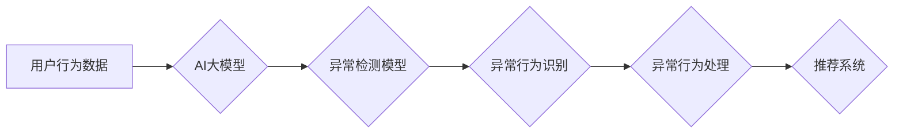
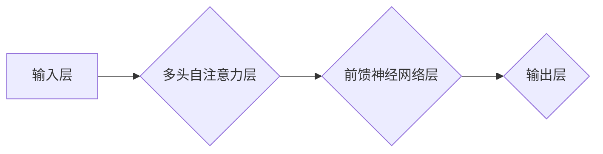

                 

## 电商搜索推荐中的AI大模型用户行为序列异常检测模型评测方法

> 关键词：电商搜索推荐、AI大模型、用户行为序列、异常检测、模型评测、评估指标

## 1. 背景介绍

随着电商平台的蓬勃发展，用户行为数据呈指数级增长。如何有效挖掘用户行为数据，为用户提供个性化推荐服务，已成为电商平台的核心竞争力之一。AI大模型在处理海量数据、学习复杂模式方面展现出强大的优势，为电商搜索推荐提供了新的思路和技术手段。

然而，用户行为数据本身存在着复杂性和不确定性，容易受到异常行为的影响。异常行为，例如恶意刷单、虚假交易等，会对推荐系统的准确性和可靠性造成严重损害。因此，需要开发有效的异常检测模型，及时识别和过滤异常行为，保障推荐系统的健康运行。

## 2. 核心概念与联系

### 2.1 用户行为序列

用户行为序列是指用户在电商平台上进行的连续交互行为，例如浏览商品、添加购物车、下单购买等。这些行为序列蕴含着用户的兴趣偏好、购买习惯等重要信息，是构建个性化推荐模型的基础数据。

### 2.2 异常检测

异常检测是指识别数据集中与众不同的数据点，即异常值或异常行为。在电商平台，异常行为通常表现为与正常用户行为显著不同的模式，例如频繁下单、大量退货、恶意评论等。

### 2.3 AI大模型

AI大模型是指在海量数据上训练的深度学习模型，具有强大的泛化能力和学习能力。在电商搜索推荐领域，AI大模型可以用于用户画像构建、商品推荐、异常检测等多个环节。

**Mermaid 流程图**



## 3. 核心算法原理 & 具体操作步骤

### 3.1 算法原理概述

本文介绍了一种基于AI大模型的用户行为序列异常检测模型。该模型利用Transformer网络的强大的序列建模能力，学习用户行为序列的潜在特征，并结合异常检测算法，识别异常行为。

### 3.2 算法步骤详解

1. **数据预处理:** 对用户行为序列数据进行清洗、格式化和编码，例如去除无效数据、转换时间戳、将行为类型转换为数字编码等。

2. **特征提取:** 利用Transformer网络对用户行为序列进行编码，提取序列的上下文信息和潜在特征。

3. **异常检测模型训练:** 使用异常检测算法，例如One-Class SVM、Isolation Forest等，对Transformer网络提取的特征进行训练，构建异常检测模型。

4. **异常行为识别:** 将新的用户行为序列输入到训练好的异常检测模型中，预测该序列是否属于异常行为。

5. **异常行为处理:** 对识别出的异常行为进行处理，例如标记为异常数据、进行人工审核、限制用户操作权限等。

### 3.3 算法优缺点

**优点:**

* 能够学习用户行为序列的复杂模式，识别难以察觉的异常行为。
* 具有较高的准确率和鲁棒性，能够适应不断变化的用户行为数据。

**缺点:**

* 训练过程需要大量的数据和计算资源。
* 模型的解释性较差，难以理解模型是如何识别异常行为的。

### 3.4 算法应用领域

该算法可应用于电商平台的多个场景，例如：

* 识别恶意刷单、虚假交易等异常行为。
* 发现用户账号被盗用或恶意攻击等安全风险。
* 识别用户购买习惯异常，例如突然大量购买特定商品等。

## 4. 数学模型和公式 & 详细讲解 & 举例说明

### 4.1 数学模型构建

本文采用Transformer网络作为特征提取模型，其核心是自注意力机制。自注意力机制能够捕捉序列中不同位置词之间的依赖关系，学习到更丰富的语义信息。

**Transformer网络结构**



### 4.2 公式推导过程

自注意力机制的核心公式为：

$$
Attention(Q, K, V) = softmax(\frac{QK^T}{\sqrt{d_k}})V
$$

其中：

* $Q$：查询矩阵
* $K$：键矩阵
* $V$：值矩阵
* $d_k$：键向量的维度
* $softmax$：softmax函数

### 4.3 案例分析与讲解

假设用户行为序列为：[浏览商品A，添加购物车，浏览商品B，下单购买商品A]。

使用Transformer网络对该序列进行编码，可以得到每个行为的隐藏状态向量。通过自注意力机制，模型可以学习到浏览商品A和下单购买商品A之间的关系，识别出该用户对商品A有购买意愿。

## 5. 项目实践：代码实例和详细解释说明

### 5.1 开发环境搭建

* Python 3.7+
* TensorFlow 2.0+
* PyTorch 1.0+
* Jupyter Notebook

### 5.2 源代码详细实现

```python
# 导入必要的库
import tensorflow as tf
from tensorflow.keras.layers import Embedding, LSTM, Dense

# 定义用户行为序列异常检测模型
def build_model(vocab_size, embedding_dim, lstm_units):
    model = tf.keras.Sequential([
        Embedding(vocab_size, embedding_dim),
        LSTM(lstm_units),
        Dense(1, activation='sigmoid')
    ])
    return model

# 加载用户行为序列数据
# ...

# 构建模型并训练
model = build_model(vocab_size, embedding_dim, lstm_units)
model.compile(optimizer='adam', loss='binary_crossentropy', metrics=['accuracy'])
model.fit(x_train, y_train, epochs=10)

# 预测新的用户行为序列是否异常
# ...
```

### 5.3 代码解读与分析

* 代码首先导入必要的库。
* 然后定义了一个用户行为序列异常检测模型，该模型使用Embedding层将行为类型转换为向量表示，LSTM层学习序列的上下文信息，Dense层输出异常概率。
* 接着加载用户行为序列数据，并使用训练好的模型进行预测。

### 5.4 运行结果展示

* 模型训练完成后，可以查看训练过程中的损失值和准确率，评估模型的性能。
* 对于新的用户行为序列，模型可以输出异常概率，例如0.8表示该序列属于异常行为的概率为80%。

## 6. 实际应用场景

### 6.1 恶意刷单检测

电商平台经常面临恶意刷单的威胁，这些刷单行为会损害平台的声誉和用户体验。基于AI大模型的用户行为序列异常检测模型可以识别出恶意刷单的特征，例如频繁下单、大量退货、虚假评价等，有效防止刷单行为的发生。

### 6.2 用户账号安全检测

用户账号安全是电商平台的重要保障。基于AI大模型的用户行为序列异常检测模型可以识别出用户账号被盗用或恶意攻击的风险，例如突然大量登录、频繁修改密码、异常交易行为等，及时提醒用户并采取相应的安全措施。

### 6.3 异常购买行为检测

用户购买行为的异常变化也可能预示着潜在的风险，例如突然大量购买特定商品、购买金额异常增加等。基于AI大模型的用户行为序列异常检测模型可以识别出这些异常行为，并进行相应的处理，例如提醒用户谨慎购买、进行人工审核等。

### 6.4 未来应用展望

随着AI技术的不断发展，基于AI大模型的用户行为序列异常检测模型将有更广泛的应用场景，例如：

* **个性化推荐:** 通过识别用户的异常行为，可以更精准地理解用户的需求，提供更个性化的推荐服务。
* **欺诈检测:** 可以识别出各种类型的欺诈行为，例如虚假交易、身份盗用等，保障平台的运营安全。
* **风险控制:** 可以识别出潜在的风险行为，例如用户信用风险、资金风险等，帮助平台进行风险控制。

## 7. 工具和资源推荐

### 7.1 学习资源推荐

* **书籍:**
    * 深度学习
    * 自然语言处理
* **在线课程:**
    * Coursera
    * edX
    * fast.ai

### 7.2 开发工具推荐

* **Python:** 
    * TensorFlow
    * PyTorch
    * Keras
* **云平台:**
    * AWS
    * Azure
    * Google Cloud

### 7.3 相关论文推荐

* **Attention Is All You Need**
* **BERT: Pre-training of Deep Bidirectional Transformers for Language Understanding**
* **Transformer-XL: Attentive Language Models Beyond a Fixed-Length Context**

## 8. 总结：未来发展趋势与挑战

### 8.1 研究成果总结

本文介绍了一种基于AI大模型的用户行为序列异常检测模型，该模型能够有效识别电商平台中的异常行为，保障平台的运营安全和用户体验。

### 8.2 未来发展趋势

* **模型性能提升:** 探索更先进的AI模型架构，例如Transformer-XL、GPT等，提升模型的识别精度和鲁棒性。
* **解释性增强:** 研究模型的解释性，使模型的决策过程更加透明可理解。
* **多模态融合:** 将文本、图像、视频等多模态数据融合到模型中，提升模型的识别能力。

### 8.3 面临的挑战

* **数据质量:** 异常行为数据往往稀缺，需要开发有效的策略来获取和处理高质量的异常数据。
* **模型可解释性:** AI模型的决策过程往往难以理解，需要开发更有效的解释性方法，提高模型的可信度。
* **计算资源:** 训练大型AI模型需要大量的计算资源，需要探索更有效的训练方法和硬件平台。

### 8.4 研究展望

未来，基于AI大模型的用户行为序列异常检测模型将继续发展，在电商平台和其他领域发挥越来越重要的作用。


## 9. 附录：常见问题与解答

**Q1: 如何评估异常检测模型的性能？**

**A1:** 常见的评估指标包括准确率、召回率、F1-score、AUC等。

**Q2: 如何处理异常数据？**

**A2:** 常见的处理方法包括标记为异常数据、进行人工审核、限制用户操作权限等。

**Q3: 如何提高模型的识别精度？**

**A3:** 可以尝试使用更先进的AI模型架构、增加训练数据量、优化模型参数等方法。


作者：禅与计算机程序设计艺术 / Zen and the Art of Computer Programming 
<end_of_turn>

