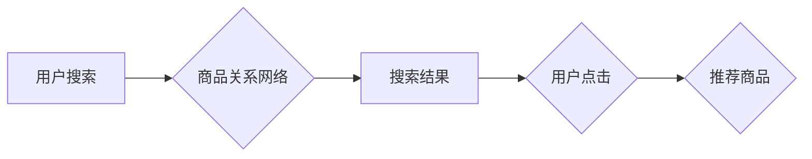

                 

## 电商搜索的AI知识图谱：构建商品关系网络

> 关键词：电商搜索、知识图谱、商品关系网络、AI推荐、自然语言处理、机器学习

## 1. 背景介绍

随着电商行业的蓬勃发展，用户对商品搜索的需求日益增长。传统的基于关键词匹配的搜索方式已难以满足用户多样化的搜索需求，搜索结果往往缺乏精准性和相关性。为了提升用户搜索体验，电商平台纷纷探索新的搜索技术，其中AI知识图谱技术成为一个备受关注的解决方案。

知识图谱是一种以实体和关系为核心的数据结构，能够有效地捕捉和表示现实世界中的知识。在电商领域，知识图谱可以构建商品关系网络，将商品、品牌、属性、用户评论等信息进行关联，形成一个庞大的知识库。基于此知识库，电商平台可以实现更精准、更智能的商品搜索和推荐。

## 2. 核心概念与联系

### 2.1 知识图谱

知识图谱是一种数据结构，它以实体和关系为基础，将知识表示为一个网络结构。

* **实体:** 代表现实世界中的事物，例如商品、品牌、用户、店铺等。
* **关系:** 描述实体之间的连接和关联，例如“商品属于品牌”、“用户购买商品”、“商品具有属性”等。

知识图谱能够有效地捕捉和表示复杂的关系，并支持对知识进行推理和查询。

### 2.2 商品关系网络

商品关系网络是基于知识图谱构建的电商领域专用知识图谱，它以商品为中心，构建商品之间的各种关系，例如：

* **类别关系:** 商品所属的类别、子类别、父类别等关系。
* **属性关系:** 商品的品牌、颜色、尺寸、价格等属性关系。
* **用户关系:** 用户对商品的评价、购买记录、收藏记录等关系。
* **相似关系:** 基于商品属性、用户评价等信息计算出的商品相似度关系。

商品关系网络能够全面地刻画商品之间的关联，为电商搜索提供更丰富的语义信息。

### 2.3 AI知识图谱

AI知识图谱是指利用人工智能技术构建和维护的知识图谱。它能够自动从海量数据中提取实体和关系，并进行知识推理和更新，从而实现知识图谱的动态性和智能化。

在电商领域，AI知识图谱可以自动构建商品关系网络，并根据用户行为和市场趋势进行动态更新，从而提供更精准、更智能的搜索和推荐服务。

**Mermaid 流程图**



## 3. 核心算法原理 & 具体操作步骤

### 3.1 算法原理概述

构建商品关系网络的核心算法主要包括：

* **实体识别:** 从电商平台的数据中识别出商品、品牌、属性等实体。
* **关系抽取:** 从文本数据中抽取商品之间的关系，例如“商品属于品牌”、“商品具有属性”。
* **知识表示:** 将识别出的实体和关系表示为知识图谱的形式。

这些算法通常基于自然语言处理（NLP）和机器学习（ML）技术。

### 3.2 算法步骤详解

1. **数据预处理:** 对电商平台的数据进行清洗、格式化和标注，以便于后续算法的训练和应用。
2. **实体识别:** 使用命名实体识别（NER）模型识别出商品、品牌、属性等实体。
3. **关系抽取:** 使用关系抽取模型从文本数据中抽取商品之间的关系。
4. **知识表示:** 将识别出的实体和关系表示为知识图谱的形式，例如使用RDF或OWL语言。
5. **知识图谱推理:** 使用知识图谱推理引擎进行知识推理，例如发现新的商品关系或预测商品属性。

### 3.3 算法优缺点

**优点:**

* 能够捕捉和表示商品之间的复杂关系。
* 支持对知识进行推理和查询，提供更精准的搜索结果。
* 可以根据用户行为和市场趋势进行动态更新，提升搜索和推荐的智能化。

**缺点:**

* 构建知识图谱需要大量的标注数据和计算资源。
* 算法的准确性依赖于训练数据的质量。
* 知识图谱的维护和更新需要持续的投入。

### 3.4 算法应用领域

* **电商搜索:** 提供更精准、更智能的商品搜索服务。
* **商品推荐:** 基于商品关系网络，推荐与用户兴趣相关的商品。
* **个性化营销:** 根据用户购买历史和偏好，进行个性化商品推荐和营销活动。
* **商品分类:** 自动识别商品类别和属性，进行商品分类和管理。

## 4. 数学模型和公式 & 详细讲解 & 举例说明

### 4.1 数学模型构建

商品关系网络可以表示为一个图结构，其中：

* **节点:** 代表商品、品牌、属性等实体。
* **边:** 代表商品之间的关系，例如“商品属于品牌”、“商品具有属性”。

可以使用图论中的概念和算法来分析和处理商品关系网络。

### 4.2 公式推导过程

**商品相似度计算:**

可以使用余弦相似度或Jaccard相似度等算法来计算商品之间的相似度。

* **余弦相似度:**

$$
\text{相似度} = \frac{\mathbf{A} \cdot \mathbf{B}}{||\mathbf{A}|| ||\mathbf{B}||}
$$

其中：

* $\mathbf{A}$ 和 $\mathbf{B}$ 是两个商品的特征向量。
* $\cdot$ 表示向量点积。
* $||\mathbf{A}||$ 和 $||\mathbf{B}||$ 分别表示向量 $\mathbf{A}$ 和 $\mathbf{B}$ 的模长。

* **Jaccard相似度:**

$$
\text{相似度} = \frac{|\mathbf{A} \cap \mathbf{B}|}{|\mathbf{A} \cup \mathbf{B}|}
$$

其中：

* $\mathbf{A}$ 和 $\mathbf{B}$ 是两个商品的属性集合。
* $\cap$ 表示集合交集。
* $\cup$ 表示集合并集。

### 4.3 案例分析与讲解

假设有两个商品，商品 A 的属性为 {颜色: 红色, 尺寸: 大, 品牌: 苹果}，商品 B 的属性为 {颜色: 红色, 尺寸: 中, 品牌: 谷歌}。

使用余弦相似度计算商品 A 和商品 B 的相似度：

1. 将商品 A 和商品 B 的属性转换为特征向量：

* $\mathbf{A} = [1, 1, 1, 0, 0]$
* $\mathbf{B} = [1, 0, 1, 1, 0]$

2. 计算向量点积：

* $\mathbf{A} \cdot \mathbf{B} = 1 * 1 + 1 * 0 + 1 * 1 + 0 * 1 + 0 * 0 = 2$

3. 计算向量模长：

* $||\mathbf{A}|| = \sqrt{1^2 + 1^2 + 1^2 + 0^2 + 0^2} = \sqrt{3}$
* $||\mathbf{B}|| = \sqrt{1^2 + 0^2 + 1^2 + 1^2 + 0^2} = \sqrt{3}$

4. 计算余弦相似度：

* $\text{相似度} = \frac{2}{\sqrt{3} * \sqrt{3}} = \frac{2}{3}$

因此，商品 A 和商品 B 的余弦相似度为 0.67，说明它们有一定的相似性。

## 5. 项目实践：代码实例和详细解释说明

### 5.1 开发环境搭建

* **操作系统:** Ubuntu 20.04
* **编程语言:** Python 3.8
* **库依赖:**

```
pip install rdflib networkx numpy pandas
```

### 5.2 源代码详细实现

```python
# 实体识别
import spacy

nlp = spacy.load("en_core_web_sm")

def extract_entities(text):
    doc = nlp(text)
    entities = [(ent.text, ent.label_) for ent in doc.ents]
    return entities

# 关系抽取
# 使用预训练的模型或自定义模型进行关系抽取

# 知识表示
from rdflib import Graph, Literal, URIRef

g = Graph()

# 添加实体
g.add((URIRef("http://example.org/product/A"), "name", Literal("商品 A")))
g.add((URIRef("http://example.org/brand/Apple"), "name", Literal("苹果")))

# 添加关系
g.add((URIRef("http://example.org/product/A"), "hasBrand", URIRef("http://example.org/brand/Apple")))

# 知识图谱推理
# 使用 OWLReasoner 进行推理

```

### 5.3 代码解读与分析

* 实体识别部分使用 spaCy 库进行实体识别，识别出商品、品牌等实体。
* 关系抽取部分需要使用预训练的模型或自定义模型进行关系抽取，例如使用 BERT 或 Transformer 模型。
* 知识表示部分使用 RDF 库将实体和关系表示为知识图谱的形式。
* 知识图谱推理部分可以使用 OWLReasoner 进行推理，例如发现新的商品关系或预测商品属性。

### 5.4 运行结果展示

运行上述代码可以生成一个简单的商品关系网络知识图谱，并进行基本的推理操作。

## 6. 实际应用场景

### 6.1 电商搜索

基于商品关系网络的搜索引擎可以理解用户搜索意图，并提供更精准、更相关的搜索结果。例如，用户搜索 “红色手机”，搜索引擎可以根据商品颜色、品牌、型号等信息，推荐与用户搜索意图相符的商品。

### 6.2 商品推荐

商品关系网络可以用于个性化商品推荐。例如，用户购买过苹果手机，系统可以根据商品品牌、型号、用户评价等信息，推荐其他苹果手机产品或其他品牌的相似手机产品。

### 6.3 个性化营销

基于商品关系网络，电商平台可以进行个性化营销活动。例如，针对购买过运动鞋的用户，可以推荐运动服、运动配件等相关商品。

### 6.4 未来应用展望

随着人工智能技术的不断发展，商品关系网络的应用场景将会更加广泛。例如：

* **智能客服:** 基于商品关系网络，可以构建智能客服系统，帮助用户解决商品相关问题。
* **商品溯源:** 利用商品关系网络，可以追踪商品的生产、流通、销售过程，实现商品溯源。
* **供应链管理:** 商品关系网络可以帮助电商平台优化供应链管理，提高商品的供应效率。

## 7. 工具和资源推荐

### 7.1 学习资源推荐

* **书籍:**

* 《知识图谱》
* 《深度学习》

* **在线课程:**

* Coursera: Knowledge Graphs
* edX: Introduction to Artificial Intelligence

### 7.2 开发工具推荐

* **知识图谱构建工具:**

* Neo4j
* RDF4J

* **机器学习库:**

* TensorFlow
* PyTorch

### 7.3 相关论文推荐

* **构建商品关系网络的论文:**

* “构建电商商品关系网络的算法研究”
* “基于深度学习的商品关系抽取方法”

## 8. 总结：未来发展趋势与挑战

### 8.1 研究成果总结

构建商品关系网络是电商搜索和推荐的重要技术，能够提升用户体验和商业价值。

### 8.2 未来发展趋势

* **更智能的知识图谱:** 利用更先进的人工智能技术，构建更智能、更动态的商品关系网络。
* **多模态知识图谱:** 将文本、图像、视频等多模态数据融合到商品关系网络中，构建更丰富的知识表示。
* **联邦学习:** 利用联邦学习技术，在保护用户隐私的前提下，构建更精准的商品关系网络。

### 8.3 面临的挑战

* **数据质量:** 构建高质量的商品关系网络需要大量的标注数据，数据质量直接影响算法的准确性。
* **算法复杂度:** 构建和维护商品关系网络的算法复杂度较高，需要强大的计算资源。
* **知识更新:** 商品信息和用户需求不断变化，需要持续更新商品关系网络，保持其有效性。

### 8.4 研究展望

未来，商品关系网络的研究将更加注重智能化、多模态化和隐私保护，为电商行业提供更精准、更智能的搜索和推荐服务。

## 9. 附录：常见问题与解答

* **Q1: 如何构建商品关系网络？**

* **A1:** 构建商品关系网络需要以下步骤：数据预处理、实体识别、关系抽取、知识表示、知识图谱推理。

* **Q2: 商品关系网络的应用场景有哪些？**

* **A2:** 商品关系网络的应用场景包括电商搜索、商品推荐、个性化营销、智能客服、商品溯源等。

* **Q3: 如何评估商品关系网络的质量？**

* **A3:** 可以使用准确率、召回率、F1-score等指标来评估商品关系网络的质量。

作者：禅与计算机程序设计艺术 / Zen and the Art of Computer Programming


<end_of_turn>

