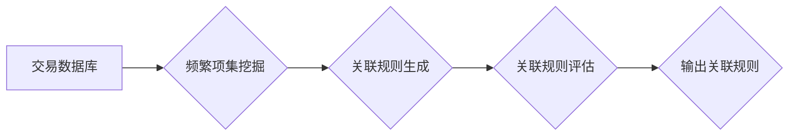

                 

## 电商搜索的商品关联规则挖掘与推荐

> 关键词：电商搜索、关联规则挖掘、推荐系统、市场营销、数据挖掘、Apriori算法、FP-Growth算法

## 1. 背景介绍

在当今数据爆炸的时代，电商平台面临着海量商品和用户数据。如何有效地挖掘这些数据中的潜在关联关系，并将其应用于商品推荐，成为了提升用户体验、促进销售的关键问题。商品关联规则挖掘是指从交易数据中发现商品之间存在的频繁购买关联关系，例如“买手机的人也经常买耳机”。这些关联规则可以为电商平台提供宝贵的洞察，帮助其制定更精准的商品推荐策略，从而提高用户满意度和转化率。

传统的电商搜索主要依赖于关键词匹配，但这种方式往往局限于用户已知的商品信息，难以挖掘用户潜在的需求。商品关联规则挖掘则可以突破这一局限性，通过分析用户历史购买行为，发现用户可能感兴趣但尚未搜索的商品，从而提供更个性化、更精准的推荐。

## 2. 核心概念与联系

### 2.1  关联规则

关联规则是指在交易数据库中，频繁同时出现的项之间的关系。例如，在超市的购物篮中，如果发现“牛奶”和“面包”经常同时被购买，则可以推断出“牛奶”和“面包”之间存在关联规则。

### 2.2  频繁项集

频繁项集是指在交易数据库中，至少满足一定支持度的项集。支持度是指项集在所有交易中的出现频率。例如，如果数据库中有1000笔交易，其中有200笔交易同时购买了“牛奶”和“面包”，则“牛奶”和“面包”的频繁项集的支持度为20%。

### 2.3  关联规则挖掘

关联规则挖掘是指从交易数据库中挖掘出频繁项集之间的关联规则的过程。

**关联规则挖掘流程图**



## 3. 核心算法原理 & 具体操作步骤

### 3.1  算法原理概述

关联规则挖掘算法主要分为两类：

* 基于候选生成算法：例如Apriori算法，通过生成所有可能的候选项集，并根据支持度和置信度进行筛选。
* 基于树状结构算法：例如FP-Growth算法，通过构建频繁项集树，高效地挖掘关联规则。

### 3.2  算法步骤详解

**Apriori算法步骤：**

1. **构建频繁项集候选集：** 从交易数据库中找出所有频繁项集，并根据频繁项集的性质生成候选项集。
2. **计算候选项集的支持度：** 对每个候选项集进行计数，计算其在所有交易中的出现频率。
3. **筛选频繁项集：** 根据预设的支持度阈值，筛选出支持度大于阈值的频繁项集。
4. **生成关联规则：** 从频繁项集之间挖掘出关联规则，并根据置信度和提升度进行评估。

**FP-Growth算法步骤：**

1. **构建FP树：** 将交易数据库中的频繁项集信息组织成FP树，并根据项集的频率进行排序。
2. **路径挖掘：** 从FP树中挖掘出所有频繁路径，并根据路径的频率生成关联规则。

### 3.3  算法优缺点

**Apriori算法：**

* **优点：** 算法原理简单易懂，易于实现。
* **缺点：** 候选项集生成过程复杂，计算量大，效率较低。

**FP-Growth算法：**

* **优点：** 效率高，能够有效地处理大规模的数据集。
* **缺点：** 算法原理相对复杂，实现难度较大。

### 3.4  算法应用领域

关联规则挖掘算法广泛应用于以下领域：

* **电商推荐：** 挖掘商品之间的关联关系，为用户推荐相关商品。
* **市场营销：** 分析客户购买行为，制定精准的营销策略。
* **医疗诊断：** 挖掘疾病之间的关联关系，辅助医生进行诊断。
* **金融风险控制：** 识别潜在的金融风险，进行风险控制。

## 4. 数学模型和公式 & 详细讲解 & 举例说明

### 4.1  数学模型构建

**支持度：**

$$
Support(X) = \frac{Number of transactions containing X}{Total number of transactions}
$$

其中，X表示一个项集，例如“牛奶”和“面包”。

**置信度：**

$$
Confidence(X \rightarrow Y) = \frac{Support(X \cup Y)}{Support(X)}
$$

其中，X和Y分别表示两个项集，例如“牛奶”和“面包”。

**提升度：**

$$
Lift(X \rightarrow Y) = \frac{Confidence(X \rightarrow Y)}{Support(Y)}
$$

### 4.2  公式推导过程

* **支持度：** 支持度反映了项集在交易数据库中的出现频率，可以用来衡量项集的普遍性。
* **置信度：** 置信度反映了在给定项集X的情况下，项集Y出现的概率，可以用来衡量项集之间的关联强度。
* **提升度：** 提升度反映了项集X对项集Y出现的提升程度，可以用来衡量项集之间的关联显著性。

### 4.3  案例分析与讲解

假设我们有一个超市的购物篮数据，其中包含了以下交易：

* 牛奶，面包
* 牛奶，鸡蛋
* 牛奶，面包，鸡蛋
* 鸡蛋，牛奶
* 面包，鸡蛋

**计算支持度：**

* 支持度(牛奶) = 4/5 = 0.8
* 支持度(面包) = 3/5 = 0.6
* 支持度(牛奶，面包) = 2/5 = 0.4

**计算置信度：**

* 置信度(牛奶 -> 面包) = 支持度(牛奶，面包) / 支持度(牛奶) = 0.4 / 0.8 = 0.5

**计算提升度：**

* 提升度(牛奶 -> 面包) = 置信度(牛奶 -> 面包) / 支持度(面包) = 0.5 / 0.6 = 0.83

从计算结果可以看出，牛奶和面包之间存在关联关系，置信度和提升度都高于0.5，表明牛奶购买者中面包购买的概率高于随机购买概率。

## 5. 项目实践：代码实例和详细解释说明

### 5.1  开发环境搭建

* Python 3.x
* pandas
* scikit-learn

### 5.2  源代码详细实现

```python
import pandas as pd
from mlxtend.frequent_patterns import apriori, association_rules

# 加载数据
data = pd.read_csv('transactions.csv')

# 转换数据格式
transactions = data.values.tolist()

# 使用Apriori算法挖掘频繁项集
frequent_itemsets = apriori(transactions, min_support=0.2, use_colnames=True)

# 使用关联规则生成器生成关联规则
rules = association_rules(frequent_itemsets, metric="confidence", min_threshold=0.7)

# 打印关联规则
print(rules)
```

### 5.3  代码解读与分析

* `pandas`库用于数据处理和分析。
* `mlxtend`库提供了一些机器学习算法的实现，包括Apriori算法和关联规则生成器。
* `transactions.csv`文件包含了交易数据，其中每一行代表一个交易，每一列代表一个商品。
* `min_support`参数指定了频繁项集的支持度阈值，即项集在所有交易中出现的频率。
* `min_threshold`参数指定了关联规则的置信度阈值，即在给定项集X的情况下，项集Y出现的概率。

### 5.4  运行结果展示

运行代码后，会输出一个包含关联规则的DataFrame，其中包含了关联规则的 antecedent (前件)、consequent (后件)、support (支持度)、confidence (置信度)、lift (提升度) 等信息。

## 6. 实际应用场景

### 6.1  电商商品推荐

电商平台可以利用商品关联规则挖掘算法，分析用户购买历史，推荐与用户之前购买商品相关的商品。例如，如果用户购买了手机，平台可以推荐耳机、充电器、手机壳等相关商品。

### 6.2  个性化营销

电商平台可以根据用户的购买行为，挖掘用户的兴趣爱好，并进行个性化营销。例如，如果用户经常购买运动鞋，平台可以推荐运动服、运动耳机等相关商品。

### 6.3  库存管理

电商平台可以利用商品关联规则挖掘算法，分析商品之间的关联关系，预测商品的销售趋势，并进行合理的库存管理。例如，如果平台发现“牛奶”和“面包”经常同时被购买，则可以适当增加这两款商品的库存。

### 6.4  未来应用展望

随着数据量的不断增长，商品关联规则挖掘算法将发挥越来越重要的作用。未来，我们可以期待以下应用场景：

* **更精准的商品推荐：** 利用深度学习等先进算法，挖掘更复杂的商品关联关系，提供更精准的商品推荐。
* **更个性化的营销策略：** 利用用户画像和行为分析，制定更个性化的营销策略，提高营销效果。
* **更智能的库存管理：** 利用预测模型，预测商品的销售趋势，实现更智能的库存管理。

## 7. 工具和资源推荐

### 7.1  学习资源推荐

* **书籍：**
    * 《数据挖掘：概念与技术》
    * 《机器学习》
* **在线课程：**
    * Coursera: Data Mining Specialization
    * edX: Introduction to Data Mining

### 7.2  开发工具推荐

* **Python:** 
    * pandas
    * scikit-learn
    * mlxtend
* **R:** 
    * arules

### 7.3  相关论文推荐

* Agrawal, R., Imielinski, T., & Swami, A. (1993). Mining association rules between sets of items in large databases. Proceedings of the ACM SIGMOD International Conference on Management of Data, 206-216.
* Han, J., Pei, J., & Kamber, M. (2000). Data mining: concepts and techniques. Morgan Kaufmann.

## 8. 总结：未来发展趋势与挑战

### 8.1  研究成果总结

商品关联规则挖掘算法在电商搜索、推荐系统等领域取得了显著的成果，为提升用户体验和促进销售提供了有效的方法。

### 8.2  未来发展趋势

* **更精准的关联规则挖掘：** 利用深度学习等先进算法，挖掘更复杂的商品关联关系，提高关联规则的精准度。
* **更个性化的推荐系统：** 将商品关联规则与用户画像、行为分析等信息结合，构建更个性化的推荐系统。
* **跨平台关联规则挖掘：** 将不同平台的数据进行整合，挖掘跨平台的商品关联关系，提供更全面的商品推荐。

### 8.3  面临的挑战

* **数据质量问题：** 关联规则挖掘算法对数据质量要求较高，需要处理缺失值、错误值等问题。
* **计算复杂度问题：** 随着数据量的不断增长，关联规则挖掘算法的计算复杂度也会增加，需要开发更高效的算法。
* **隐私保护问题：** 关联规则挖掘算法可能会泄露用户的隐私信息，需要采取相应的措施进行隐私保护。

### 8.4  研究展望

未来，商品关联规则挖掘算法将继续朝着更精准、更个性化、更智能的方向发展，为电商平台提供更强大的数据分析和决策支持工具。


## 9. 附录：常见问题与解答

**Q1：什么是频繁项集？**

A1：频繁项集是指在交易数据库中，至少满足一定支持度的项集。支持度是指项集在所有交易中的出现频率。

**Q2：什么是关联规则？**

A2：关联规则是指在交易数据库中，频繁同时出现的项之间的关系。例如，在超市的购物篮中，如果发现“牛奶”和“面包”经常同时被购买，则可以推断出“牛奶”和“面包”之间存在关联规则。

**Q3：Apriori算法和FP-Growth算法有什么区别？**

A3：Apriori算法是基于候选生成算法，而FP-Growth算法是基于树状结构算法。Apriori算法的效率相对较低，而FP-Growth算法的效率更高。

**Q4：如何选择合适的关联规则挖掘算法？**

A4：选择合适的关联规则挖掘算法需要根据实际情况进行考虑，例如数据量、支持度阈值、置信度阈值等因素。

**Q5：如何评估关联规则的质量？**

A5：关联规则的质量可以根据支持度、置信度、提升度等指标进行评估。

作者：禅与计算机程序设计艺术 / Zen and the Art of Computer Programming


<end_of_turn>

