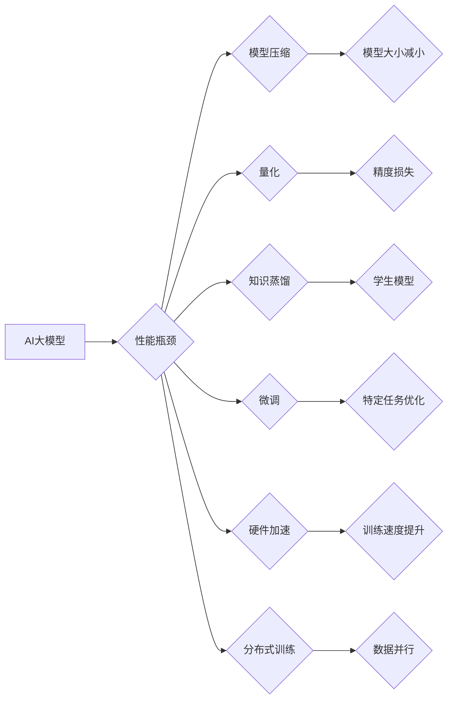

                 

## 电商行业中AI大模型的性能优化策略

> 关键词：电商、AI大模型、性能优化、模型压缩、量化、知识蒸馏、微调、硬件加速、分布式训练

## 1. 背景介绍

近年来，人工智能（AI）技术蓬勃发展，特别是大规模语言模型（LLM）的涌现，为电商行业带来了前所未有的机遇。从智能客服、商品推荐、内容生成到精准营销，AI大模型在电商各个环节都展现出强大的应用潜力。然而，部署和运行大型AI模型也面临着诸多挑战，其中性能优化尤为关键。

电商行业对AI模型的性能要求极高，需要模型在有限的时间内提供准确、高效的响应。同时，电商平台通常需要处理海量数据，对模型的资源消耗也提出了严格要求。因此，如何有效地优化AI大模型的性能，使其能够在电商环境中发挥最佳作用，成为当前研究的热点问题。

## 2. 核心概念与联系

### 2.1 AI大模型

AI大模型是指参数规模庞大、训练数据海量的人工智能模型。它们通常基于深度学习架构，例如Transformer，能够学习复杂的模式和关系，从而实现强大的泛化能力和应用潜力。

### 2.2 电商场景

电商场景是指围绕电子商务活动展开的各种应用场景，包括商品展示、搜索、推荐、支付、物流等。这些场景对AI模型的性能要求各不相同，例如商品推荐需要快速响应，精准营销需要高准确率，智能客服需要流畅的对话体验。

### 2.3 性能优化

性能优化是指通过各种技术手段提高AI模型的效率和准确性，使其能够在给定的资源约束下达到最佳的性能表现。

**Mermaid 流程图**



## 3. 核心算法原理 & 具体操作步骤

### 3.1 算法原理概述

性能优化算法主要针对AI模型的规模、精度、速度等方面进行改进，常用的方法包括模型压缩、量化、知识蒸馏、微调、硬件加速和分布式训练等。

### 3.2 算法步骤详解

#### 3.2.1 模型压缩

模型压缩是指通过减少模型参数数量来降低模型大小和计算复杂度。常用的压缩方法包括：

* **权重剪枝:** 移除模型中不重要的权重参数。
* **权重共享:** 将多个相同的权重参数合并为一个。
* **通道裁剪:** 移除模型中冗余的通道。

#### 3.2.2 量化

量化是指将模型参数的精度降低，例如将32位浮点数转换为8位整数。量化可以有效减少模型的内存占用和计算量，但可能会导致精度损失。

#### 3.2.3 知识蒸馏

知识蒸馏是指将知识从一个大型模型（教师模型）转移到一个小型模型（学生模型）中。学生模型可以学习到教师模型的知识，从而达到更高的性能。

#### 3.2.4 微调

微调是指在预训练模型的基础上，针对特定任务进行进一步的训练。微调可以提高模型在特定任务上的性能。

#### 3.2.5 硬件加速

利用GPU、TPU等专用硬件加速模型训练和推理过程，可以显著提高模型的训练速度和推理效率。

#### 3.2.6 分布式训练

将模型训练任务分解到多个机器上进行并行训练，可以有效缩短训练时间和降低训练成本。

### 3.3 算法优缺点

| 算法 | 优点 | 缺点 |
|---|---|---|
| 模型压缩 | 模型大小减小，计算量减少 | 可能导致精度损失 |
| 量化 | 降低内存占用，提高推理速度 | 可能导致精度损失 |
| 知识蒸馏 | 提高学生模型性能，降低训练成本 | 需要训练教师模型 |
| 微调 | 提高模型在特定任务上的性能 | 需要训练数据 |
| 硬件加速 | 提高训练速度和推理效率 | 需要专用硬件 |
| 分布式训练 | 缩短训练时间，降低训练成本 | 需要分布式系统架构 |

### 3.4 算法应用领域

* **模型压缩:** 适用于资源受限的设备，例如移动端、嵌入式系统。
* **量化:** 适用于需要高推理效率的应用，例如实时语音识别、图像分类。
* **知识蒸馏:** 适用于需要训练小型模型的场景，例如边缘计算、物联网。
* **微调:** 适用于需要针对特定任务优化的场景，例如医疗诊断、金融风险评估。
* **硬件加速:** 适用于需要高性能训练的场景，例如深度学习研究、大规模数据分析。
* **分布式训练:** 适用于需要训练大型模型的场景，例如自然语言处理、计算机视觉。

## 4. 数学模型和公式 & 详细讲解 & 举例说明

### 4.1 数学模型构建

模型压缩、量化、知识蒸馏等算法都依赖于数学模型来实现。例如，模型压缩的权重剪枝算法可以使用L1正则化来构建一个数学模型，该模型的目标是找到一个权重矩阵，使得模型的损失函数最小化，同时权重矩阵的L1范数也最小化。

### 4.2 公式推导过程

假设模型的损失函数为L(W)，其中W是模型的参数。L1正则化项为λ||W||1，其中λ是正则化参数。则模型的优化目标函数为：

$$
J(W) = L(W) + λ||W||1
$$

可以使用梯度下降算法来优化该目标函数，找到最优的模型参数W。

### 4.3 案例分析与讲解

例如，在图像分类任务中，可以使用L1正则化来进行模型压缩。通过训练一个L1正则化的模型，可以找到一个权重矩阵，其中许多权重参数为零。这些零权重参数可以被移除，从而减小模型的大小。

## 5. 项目实践：代码实例和详细解释说明

### 5.1 开发环境搭建

* Python 3.7+
* TensorFlow 2.0+
* PyTorch 1.0+
* CUDA Toolkit 10.2+

### 5.2 源代码详细实现

```python
import tensorflow as tf

# 定义一个简单的卷积神经网络模型
model = tf.keras.models.Sequential([
    tf.keras.layers.Conv2D(32, (3, 3), activation='relu', input_shape=(28, 28, 1)),
    tf.keras.layers.MaxPooling2D((2, 2)),
    tf.keras.layers.Conv2D(64, (3, 3), activation='relu'),
    tf.keras.layers.MaxPooling2D((2, 2)),
    tf.keras.layers.Flatten(),
    tf.keras.layers.Dense(10, activation='softmax')
])

# 使用L1正则化进行模型压缩
model.add(tf.keras.layers.Dense(10, activation='softmax', kernel_regularizer=tf.keras.regularizers.l1(0.01)))

# 编译模型
model.compile(optimizer='adam',
              loss='sparse_categorical_crossentropy',
              metrics=['accuracy'])

# 训练模型
model.fit(x_train, y_train, epochs=10)

# 保存模型
model.save('compressed_model.h5')
```

### 5.3 代码解读与分析

* 代码首先定义了一个简单的卷积神经网络模型。
* 然后，使用L1正则化来进行模型压缩。L1正则化项被添加到模型的损失函数中，它会鼓励模型学习更稀疏的权重矩阵。
* 最后，模型被编译并训练，训练后的模型被保存为`compressed_model.h5`文件。

### 5.4 运行结果展示

训练后的压缩模型的性能与原始模型相比会有所下降，但模型的大小会显著减小。

## 6. 实际应用场景

### 6.1 商品推荐

AI大模型可以分析用户的浏览历史、购买记录、评价等数据，学习用户的偏好，并推荐相关的商品。

### 6.2 内容生成

AI大模型可以生成商品描述、促销文案、产品评论等内容，帮助电商平台提高内容生产效率。

### 6.3 智能客服

AI大模型可以理解用户的自然语言问题，并提供准确的回复，帮助电商平台提高客户服务效率。

### 6.4 未来应用展望

* **个性化推荐:** 基于用户的行为数据和偏好，提供更精准的商品推荐。
* **智能营销:** 利用AI大模型分析用户画像，进行精准的营销推广。
* **虚拟试衣间:** 利用AI技术模拟用户的穿着效果，帮助用户在线试衣。
* **智能物流:** 利用AI技术优化物流路线，提高物流效率。

## 7. 工具和资源推荐

### 7.1 学习资源推荐

* **书籍:**
    * 《深度学习》
    * 《自然语言处理》
    * 《机器学习实战》
* **在线课程:**
    * Coursera
    * edX
    * Udacity

### 7.2 开发工具推荐

* **TensorFlow:** 开源深度学习框架
* **PyTorch:** 开源深度学习框架
* **Keras:** 高级深度学习API

### 7.3 相关论文推荐

* 《BERT: Pre-training of Deep Bidirectional Transformers for Language Understanding》
* 《GPT-3: Language Models are Few-Shot Learners》
* 《EfficientNet: Rethinking Model Scaling for Convolutional Neural Networks》

## 8. 总结：未来发展趋势与挑战

### 8.1 研究成果总结

近年来，AI大模型在电商行业取得了显著的成果，例如商品推荐、内容生成、智能客服等应用取得了突破性进展。

### 8.2 未来发展趋势

* **模型规模进一步扩大:** 随着计算资源的不断提升，AI大模型的规模将继续扩大，模型的性能将得到进一步提升。
* **模型效率不断提高:** 研究人员将继续探索新的模型压缩、量化、知识蒸馏等技术，提高模型的效率和部署便捷性。
* **模型应用场景更加广泛:** AI大模型将应用于电商行业的更多场景，例如虚拟试衣间、智能物流等。

### 8.3 面临的挑战

* **数据安全和隐私保护:** AI大模型的训练需要海量数据，如何保证数据的安全和隐私保护是一个重要的挑战。
* **模型可解释性和信任度:** AI大模型的决策过程往往是复杂的，如何提高模型的可解释性和信任度是一个重要的研究方向。
* **模型公平性和偏见:** AI大模型可能会学习到数据中的偏见，导致不公平的结果，如何解决模型公平性和偏见问题是一个重要的挑战。

### 8.4 研究展望

未来，AI大模型在电商行业将继续发挥重要作用，推动电商行业的数字化转型和智能化发展。研究人员将继续探索新的算法、技术和应用场景，解决AI大模型面临的挑战，推动AI技术在电商行业的落地和应用。

## 9. 附录：常见问题与解答

### 9.1 模型压缩会影响模型精度吗？

是的，模型压缩可能会导致模型精度下降。这是因为模型压缩会移除一些模型参数，从而减少模型的复杂度。

### 9.2 如何选择合适的模型压缩方法？

选择合适的模型压缩方法需要根据具体的应用场景和模型结构进行考虑。例如，对于资源受限的设备，可以使用更 aggressive 的压缩方法，例如权重剪枝；对于需要高精度应用，可以使用更温和的压缩方法，例如量化。

### 9.3 如何评估模型压缩的效果？

可以使用模型在测试集上的准确率、召回率、F1-score等指标来评估模型压缩的效果。

### 9.4 如何解决模型量化导致的精度损失问题？

可以使用更精细的量化方法，例如混合精度量化，来减少量化导致的精度损失。

### 9.5 如何进行知识蒸馏？

知识蒸馏需要两个模型：一个教师模型和一个学生模型。教师模型是预训练的模型，学生模型是需要训练的模型。知识蒸馏的目标是让学生模型学习到教师模型的知识，从而提高学生模型的性能。

作者：禅与计算机程序设计艺术 / Zen and the Art of Computer Programming


<end_of_turn>

