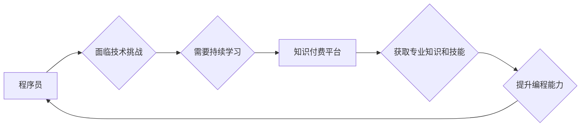

                 

## 关键词：知识付费、程序员、持续学习、技术发展、学习策略、在线教育、编程技能

## 1. 背景介绍

在当今科技飞速发展的时代，程序员作为数字世界的核心力量，面临着前所未有的挑战和机遇。新技术层出不穷，编程语言不断演进，软件开发模式也在不断变革。为了保持竞争力，程序员必须不断学习新知识，提升技能，才能在激烈的市场竞争中立于不败之地。

知识付费作为一种新型的教育模式，近年来在程序员群体中迅速兴起。它以提供专业技术知识和技能培训为核心，通过线上课程、视频教程、书籍等形式，满足程序员对专业技能提升的需求。知识付费的出现，为程序员提供了更加便捷、高效、个性化的学习方式，也为技术发展注入了新的活力。

## 2. 核心概念与联系

### 2.1 知识付费

知识付费是指以知识、技能、经验等为核心内容，通过付费的方式获取知识和技能的商业模式。它打破了传统教育的模式，让知识的获取不再受限于时间、地点和经济条件，更加灵活、便捷。

### 2.2 程序员持续学习

程序员持续学习是指程序员在职业生涯中不断学习新知识、新技能，以适应技术发展和市场需求的动态变化。持续学习是程序员保持竞争力的关键，也是职业发展的重要保障。

### 2.3 关系

知识付费为程序员持续学习提供了新的途径和资源。通过付费获取专业知识和技能培训，程序员可以更有效地提升自身能力，缩短学习周期，提高学习效率。

**Mermaid 流程图**



## 3. 核心算法原理 & 具体操作步骤

### 3.1 算法原理概述

知识付费平台的推荐算法是其核心技术之一，它通过分析用户的学习行为、兴趣偏好等数据，推荐最适合用户的学习内容。常见的推荐算法包括：

* **协同过滤算法:** 基于用户的相似性或物品的相似性进行推荐。
* **内容过滤算法:** 基于用户的兴趣偏好和学习内容的特征进行推荐。
* **混合推荐算法:** 将协同过滤算法和内容过滤算法相结合，提高推荐效果。

### 3.2 算法步骤详解

**协同过滤算法:**

1. **数据收集:** 收集用户的学习行为数据，例如学习过的课程、观看过的视频、点赞过的内容等。
2. **用户相似度计算:** 计算用户之间的相似度，例如使用余弦相似度或皮尔逊相关系数。
3. **推荐内容:** 根据用户的相似用户，推荐他们学习过的课程或内容。

**内容过滤算法:**

1. **特征提取:** 从学习内容中提取特征，例如课程主题、难度等级、学习时长等。
2. **用户兴趣建模:** 建立用户的兴趣模型，例如使用词袋模型或主题模型。
3. **推荐内容:** 根据用户的兴趣模型，推荐与用户兴趣相符的学习内容。

### 3.3 算法优缺点

**协同过滤算法:**

* **优点:** 可以发现用户之间的隐性关系，推荐个性化内容。
* **缺点:** 数据稀疏性问题，新用户或新内容难以推荐。

**内容过滤算法:**

* **优点:** 不需要用户历史数据，可以推荐新内容。
* **缺点:** 难以捕捉用户之间的隐性关系，推荐内容可能过于单一。

### 3.4 算法应用领域

推荐算法广泛应用于电子商务、社交媒体、在线教育等领域，帮助用户发现感兴趣的内容，提高用户体验。

## 4. 数学模型和公式 & 详细讲解 & 举例说明

### 4.1 数学模型构建

协同过滤算法中的用户相似度计算可以使用余弦相似度公式：

$$
\text{相似度} = \frac{\mathbf{u} \cdot \mathbf{v}}{\|\mathbf{u}\| \|\mathbf{v}\|}
$$

其中：

* $\mathbf{u}$ 和 $\mathbf{v}$ 是两个用户的向量表示，每个向量元素代表用户对某个项目的评分。
* $\cdot$ 表示向量点积。
* $\|\mathbf{u}\|$ 和 $\|\mathbf{v}\|$ 分别表示向量 $\mathbf{u}$ 和 $\mathbf{v}$ 的模长。

### 4.2 公式推导过程

余弦相似度公式的推导过程如下：

1. 两个向量的点积代表了两个向量在同一方向上的投影长度。
2. 向量的模长代表了向量的长度。
3. 将点积除以两个向量的模长乘积，可以得到两个向量在同一方向上的投影长度与两个向量长度的比值，即余弦相似度。

### 4.3 案例分析与讲解

假设有两个用户 A 和 B，他们的评分向量分别为：

* $\mathbf{u}_A = [1, 2, 3, 4]$
* $\mathbf{u}_B = [2, 3, 4, 1]$

则它们的余弦相似度为：

$$
\text{相似度} = \frac{\mathbf{u}_A \cdot \mathbf{u}_B}{\|\mathbf{u}_A\| \|\mathbf{u}_B\|} = \frac{1\cdot2 + 2\cdot3 + 3\cdot4 + 4\cdot1}{\sqrt{1^2 + 2^2 + 3^2 + 4^2} \sqrt{2^2 + 3^2 + 4^2 + 1^2}} = \frac{30}{\sqrt{30} \sqrt{30}} = 1
$$

结果表明，用户 A 和 B 的评分向量完全相同，因此它们的相似度为 1。

## 5. 项目实践：代码实例和详细解释说明

### 5.1 开发环境搭建

* Python 3.x
* Pandas
* Scikit-learn

### 5.2 源代码详细实现

```python
import pandas as pd
from sklearn.metrics.pairwise import cosine_similarity

# 加载用户评分数据
ratings_data = pd.read_csv('ratings.csv')

# 计算用户之间的余弦相似度
user_similarity = cosine_similarity(ratings_data)

# 获取用户 A 和用户 B 的相似度
user_A_id = 1
user_B_id = 2
similarity_score = user_similarity[user_A_id - 1, user_B_id - 1]

# 打印相似度
print(f'用户 {user_A_id} 和用户 {user_B_id} 的相似度为: {similarity_score}')
```

### 5.3 代码解读与分析

* 代码首先加载用户评分数据，假设数据存储在 `ratings.csv` 文件中。
* 然后使用 Scikit-learn 库中的 `cosine_similarity` 函数计算用户之间的余弦相似度。
* 最后获取用户 A 和用户 B 的相似度，并打印输出。

### 5.4 运行结果展示

运行代码后，将输出用户 A 和用户 B 的相似度值。

## 6. 实际应用场景

知识付费平台可以利用推荐算法，为用户提供个性化的学习推荐，例如：

* **推荐相关课程:** 根据用户的学习历史和兴趣，推荐与之相关的课程。
* **推荐优质内容:** 推荐平台上评分较高、用户评价好的学习内容。
* **推荐学习路径:** 根据用户的学习目标，推荐一条适合的学习路径。

### 6.4 未来应用展望

随着人工智能技术的不断发展，知识付费平台的推荐算法将更加智能化、个性化。未来，推荐算法可能能够：

* **预测用户的学习需求:** 通过分析用户的学习行为和兴趣，预测用户的未来学习需求。
* **提供个性化的学习计划:** 根据用户的学习目标和进度，制定个性化的学习计划。
* **提供实时学习支持:** 在用户学习过程中，提供实时反馈和建议。

## 7. 工具和资源推荐

### 7.1 学习资源推荐

* **Coursera:** https://www.coursera.org/
* **edX:** https://www.edx.org/
* **Udacity:** https://www.udacity.com/
* **Udemy:** https://www.udemy.com/

### 7.2 开发工具推荐

* **Python:** https://www.python.org/
* **Pandas:** https://pandas.pydata.org/
* **Scikit-learn:** https://scikit-learn.org/stable/

### 7.3 相关论文推荐

* **Collaborative Filtering for Implicit Feedback Datasets**
* **Content-Based Recommendation Systems: A Review**
* **Hybrid Recommender Systems: Methods and Challenges**

## 8. 总结：未来发展趋势与挑战

### 8.1 研究成果总结

知识付费为程序员持续学习提供了新的途径和资源，推荐算法是其核心技术之一。通过分析用户的学习行为和兴趣，推荐算法可以为用户提供个性化的学习推荐，提高学习效率和用户体验。

### 8.2 未来发展趋势

未来，知识付费平台的推荐算法将更加智能化、个性化，能够预测用户的学习需求，提供个性化的学习计划，并提供实时学习支持。

### 8.3 面临的挑战

知识付费平台的推荐算法也面临着一些挑战，例如：

* **数据稀疏性问题:** 新用户或新内容难以推荐。
* **冷启动问题:** 新用户或新内容缺乏历史数据，难以进行推荐。
* **推荐结果的解释性:** 用户难以理解推荐算法是如何生成推荐结果的。

### 8.4 研究展望

未来研究方向包括：

* 开发更加有效的推荐算法，解决数据稀疏性和冷启动问题。
* 提高推荐结果的解释性，让用户更好地理解推荐机制。
* 将推荐算法与其他技术结合，例如自然语言处理和机器学习，提供更加智能化的学习体验。

## 9. 附录：常见问题与解答

**Q1: 如何选择合适的知识付费平台？**

**A1:** 选择知识付费平台时，可以考虑以下因素：

* 平台的口碑和信誉
* 平台提供的课程质量和内容
* 平台的学习模式和价格

**Q2: 如何有效利用知识付费资源？**

**A2:** 

* 制定学习计划，明确学习目标。
* 选择适合自己的学习模式和节奏。
* 积极参与课程讨论，与其他学习者交流。
* 将所学知识应用到实际项目中，巩固学习成果。

**作者：禅与计算机程序设计艺术 / Zen and the Art of Computer Programming**<end_of_turn>

