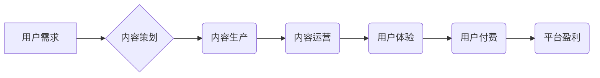

                 

## 知识付费创业中的内容产品化策略

> 关键词：知识付费、内容产品化、内容运营、用户体验、商业模式

### 1. 背景介绍

知识付费行业近年来发展迅速，成为互联网经济的重要组成部分。随着人们对知识的需求不断增长，以及互联网技术的发展，知识付费模式也逐渐成熟，涌现出众多成功案例。然而，知识付费创业并非易事，如何将知识转化为有价值的产品，并有效地运营和推广，是众多创业者面临的挑战。

**1.1 知识付费行业的现状与趋势**

知识付费行业呈现出蓬勃发展的态势，市场规模持续扩大。根据相关数据显示，中国知识付费市场规模已突破百亿元，预计未来几年将保持高速增长。

* **用户需求不断增长:**  人们对知识的需求日益强烈，渴望提升自身技能、拓展知识面，并获得更专业的指导。
* **内容生产能力提升:**  互联网平台的普及和技术的发展，使得内容生产更加便捷高效，涌现出大量优质的知识内容。
* **商业模式不断创新:**  除了传统的线上课程和付费文章，知识付费模式也逐渐拓展到直播、会员、咨询等领域，更加多元化。

**1.2 知识付费创业面临的挑战**

尽管知识付费行业前景广阔，但创业者也面临着诸多挑战：

* **内容质量竞争激烈:**  优质内容是知识付费的核心竞争力，如何打造独具特色的内容，并保持持续更新，是关键。
* **用户粘性难以提升:**  知识付费用户往往具有较高的流动性，如何提高用户粘性，并建立长期关系，是难题。
* **商业模式探索不断:**  知识付费的商业模式仍处于探索阶段，如何找到可持续的盈利模式，是创业者需要思考的问题。

### 2. 核心概念与联系

**2.1 内容产品化**

内容产品化是指将知识内容转化为具有商业价值的产品，并通过有效的运营和推广，实现盈利。

**2.2 内容运营**

内容运营是指围绕知识内容，进行策划、生产、推广、维护等全流程的运营活动，以提升内容价值和用户体验。

**2.3 用户体验**

用户体验是指用户使用知识付费产品时，感受到的整体感受和满意度。良好的用户体验是知识付费产品成功的关键因素。

**2.4 商业模式**

商业模式是指知识付费平台或企业如何创造价值、获取收入和实现可持续发展的模式。

**2.5 流程图**



### 3. 核心算法原理 & 具体操作步骤

**3.1 算法原理概述**

知识付费内容产品化需要结合多种算法和技术，例如推荐算法、内容分发算法、用户画像算法等，以实现内容精准匹配、用户个性化推荐和运营效率提升。

**3.2 算法步骤详解**

* **用户画像构建:**  通过用户行为数据、兴趣偏好、学习习惯等信息，构建用户画像，了解用户的需求和特征。
* **内容推荐:**  基于用户画像和内容标签，利用推荐算法，推荐用户感兴趣的内容。
* **内容分发:**  根据用户活跃度、内容热度等因素，优化内容分发策略，提高内容曝光率。
* **用户反馈收集:**  收集用户对内容的评价、反馈和互动数据，用于算法模型的优化和迭代。

**3.3 算法优缺点**

* **优点:**  能够提高内容精准匹配度，提升用户体验，并促进平台盈利。
* **缺点:**  算法模型需要不断优化，数据安全和隐私保护需要重视。

**3.4 算法应用领域**

* **内容推荐系统:**  推荐用户感兴趣的课程、文章、视频等内容。
* **个性化学习路径:**  根据用户的学习进度和能力，定制个性化的学习路径。
* **用户行为分析:**  分析用户学习行为，了解用户需求和痛点。

### 4. 数学模型和公式 & 详细讲解 & 举例说明

**4.1 数学模型构建**

知识付费内容产品化可以构建数学模型，例如用户价值模型、内容价值模型、平台盈利模型等，以量化分析和预测相关指标。

**4.2 公式推导过程**

例如，用户价值模型可以采用以下公式：

$$
用户价值 = 购买意愿 * 内容质量 * 用户体验
$$

其中：

* 购买意愿：用户对知识付费产品的购买意愿，受用户需求、价格、信任度等因素影响。
* 内容质量：知识付费产品的质量，包括内容的准确性、实用性、趣味性等。
* 用户体验：用户使用知识付费产品时，感受到的整体感受和满意度。

**4.3 案例分析与讲解**

假设一个知识付费平台，其用户价值模型如下：

* 购买意愿：0.8
* 内容质量：0.7
* 用户体验：0.9

则该平台的用户价值为：0.8 * 0.7 * 0.9 = 0.504。

### 5. 项目实践：代码实例和详细解释说明

**5.1 开发环境搭建**

* 操作系统：Windows/macOS/Linux
* 编程语言：Python
* 开发工具：VS Code/PyCharm

**5.2 源代码详细实现**

```python
# 用户价值模型
def calculate_user_value(purchase_intention, content_quality, user_experience):
  return purchase_intention * content_quality * user_experience

# 示例代码
purchase_intention = 0.8
content_quality = 0.7
user_experience = 0.9

user_value = calculate_user_value(purchase_intention, content_quality, user_experience)

print(f"用户价值: {user_value}")
```

**5.3 代码解读与分析**

* `calculate_user_value()` 函数计算用户价值，输入参数分别为购买意愿、内容质量和用户体验。
* 示例代码设置了购买意愿、内容质量和用户体验的值，并调用 `calculate_user_value()` 函数计算用户价值。

**5.4 运行结果展示**

```
用户价值: 0.504
```

### 6. 实际应用场景

**6.1 在线课程平台**

知识付费平台可以利用算法推荐课程，根据用户学习进度和能力定制个性化学习路径，提升用户学习体验和课程转化率。

**6.2 内容创作平台**

内容创作平台可以根据用户兴趣偏好，推荐相关内容，并提供内容分发和推广服务，帮助创作者获得更多收益。

**6.3 社区平台**

社区平台可以利用算法分析用户行为，推荐相关用户和内容，促进用户互动和社区活跃度。

**6.4 未来应用展望**

随着人工智能技术的不断发展，知识付费内容产品化将更加智能化、个性化和高效化。例如，未来可能出现基于深度学习的个性化学习推荐系统、虚拟导师等应用场景。

### 7. 工具和资源推荐

**7.1 学习资源推荐**

* **书籍:** 《数据科学》、《机器学习》、《深度学习》
* **在线课程:** Coursera、edX、Udacity
* **博客:** Towards Data Science、Machine Learning Mastery

**7.2 开发工具推荐**

* **Python:**  NumPy、Pandas、Scikit-learn
* **机器学习框架:** TensorFlow、PyTorch
* **数据可视化工具:** Matplotlib、Seaborn

**7.3 相关论文推荐**

* **推荐系统:** 《Collaborative Filtering for Implicit Feedback Datasets》
* **内容分发:** 《Personalized News Recommendation with Deep Learning》
* **用户画像:** 《User Profiling with Deep Learning》

### 8. 总结：未来发展趋势与挑战

**8.1 研究成果总结**

知识付费内容产品化已经取得了一定的成果，算法和技术不断发展，为用户提供更加个性化、高效的学习体验。

**8.2 未来发展趋势**

* **人工智能驱动:**  人工智能技术将更加深入地应用于知识付费内容产品化，实现更智能化的内容推荐、个性化学习路径定制和用户运营。
* **沉浸式体验:**  虚拟现实、增强现实等技术将为用户提供更加沉浸式的学习体验，提升学习兴趣和效果。
* **跨界融合:**  知识付费将与其他行业融合，例如游戏、娱乐、社交等，形成新的商业模式和应用场景。

**8.3 面临的挑战**

* **数据安全和隐私保护:**  知识付费平台需要重视用户数据安全和隐私保护，避免数据泄露和滥用。
* **内容质量监管:**  知识付费平台需要加强内容质量监管，杜绝虚假信息和低质量内容的传播。
* **商业模式创新:**  知识付费平台需要不断探索新的商业模式，以实现可持续发展。

**8.4 研究展望**

未来，知识付费内容产品化将继续朝着智能化、个性化、沉浸式和跨界融合的方向发展，为用户提供更加优质的学习体验和服务。


### 9. 附录：常见问题与解答

**9.1 如何提高用户粘性？**

* 提供高质量、有价值的内容。
* 建立用户社区，促进用户互动。
* 定期举办线上线下活动，增强用户参与感。
* 提供个性化学习推荐和定制服务。

**9.2 如何保证内容质量？**

* 建立严格的内容审核机制。
* 邀请专业领域专家进行内容创作和审核。
* 鼓励用户反馈，不断优化内容质量。

**9.3 如何选择合适的商业模式？**

* 考虑目标用户群体、内容类型和平台资源。
* 探索多种商业模式，例如订阅制、课程销售、会员制等。
* 持续分析市场趋势和用户需求，调整商业模式。


作者：禅与计算机程序设计艺术 / Zen and the Art of Computer Programming 
<end_of_turn>

