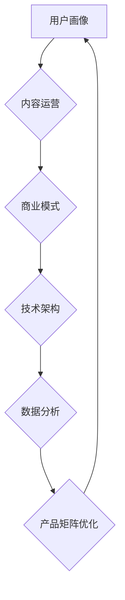

                 

## 知识付费创业的产品矩阵构建

> 关键词：知识付费、产品矩阵、用户画像、内容运营、商业模式、技术架构、数据分析

## 1. 背景介绍

知识付费行业近年来发展迅速，从线上课程、付费咨询到会员体系，各种模式层出不穷。然而，在激烈的市场竞争中，单纯依靠优质内容难以获得持续的成功。构建一个完善的产品矩阵，才能有效地吸引用户、提升用户粘性，最终实现商业化目标。

本篇文章将从用户画像、内容运营、商业模式、技术架构、数据分析等多个维度，探讨知识付费创业的产品矩阵构建，并结合实际案例，提供一些建设性的建议。

## 2. 核心概念与联系

**2.1 知识付费产品矩阵**

知识付费产品矩阵是指一个知识付费平台或企业，根据用户需求和市场趋势，构建的多层次、多类型的产品组合。这些产品可以是独立的，也可以相互关联，形成一个完整的生态系统。

**2.2 用户画像**

用户画像是指对目标用户进行深入分析，包括他们的年龄、性别、职业、兴趣爱好、学习习惯、消费能力等，以便更好地了解用户的需求和痛点，从而开发更精准的产品。

**2.3 内容运营**

内容运营是指围绕知识付费产品，进行内容策划、生产、发布、推广和维护的全流程管理。高质量的内容是知识付费产品的核心竞争力，而有效的运营策略可以帮助内容更好地触达目标用户。

**2.4 商业模式**

商业模式是指知识付费平台或企业如何盈利，常见的模式包括：

* **订阅制：**用户付费订阅平台或课程，获得持续的内容更新和服务。
* **课程销售：**平台或企业销售单个课程或课程套餐。
* **会员体系：**用户付费成为会员，享受平台或课程的专属权益。
* **付费咨询：**用户付费咨询专家或导师。

**2.5 技术架构**

技术架构是指知识付费平台或企业的基础设施和技术体系，包括内容管理系统、支付系统、用户管理系统、数据分析系统等。

**2.6 数据分析**

数据分析是指对平台或产品的用户行为、内容表现、市场趋势等数据进行分析，以便更好地优化产品、运营策略和商业模式。

**2.7 产品矩阵构建流程**



## 3. 核心算法原理 & 具体操作步骤

**3.1 算法原理概述**

知识付费产品矩阵构建的核心算法原理是基于用户画像、内容运营、商业模式、技术架构、数据分析的相互关联和反馈机制。通过不断收集和分析用户数据，了解用户的需求和行为模式，并根据这些数据进行产品迭代和优化，最终构建一个满足用户需求、实现商业化目标的产品矩阵。

**3.2 算法步骤详解**

1. **用户画像构建:** 收集用户数据，包括用户基本信息、学习习惯、兴趣爱好、消费能力等，并进行分析和建模，构建用户画像。
2. **内容运营策略制定:** 根据用户画像，制定内容运营策略，包括内容主题、内容形式、内容发布频率等。
3. **商业模式选择:** 根据用户画像和内容运营策略，选择合适的商业模式，例如订阅制、课程销售、会员体系等。
4. **技术架构设计:** 设计平台或企业的技术架构，包括内容管理系统、支付系统、用户管理系统、数据分析系统等。
5. **数据分析和产品优化:** 收集用户行为数据，分析用户对产品的使用情况和反馈，并根据分析结果进行产品迭代和优化。

**3.3 算法优缺点**

* **优点:** 能够根据用户需求和市场趋势，构建一个灵活、高效的产品矩阵。
* **缺点:** 需要大量的用户数据和技术支持，并且需要不断迭代和优化。

**3.4 算法应用领域**

* 知识付费平台
* 在线教育平台
* 社交媒体平台
* 内容创作平台

## 4. 数学模型和公式 & 详细讲解 & 举例说明

**4.1 数学模型构建**

知识付费产品矩阵构建可以抽象为一个多变量优化问题，目标是最大化平台或企业的利润，约束条件包括用户需求、市场竞争、技术成本等。

**4.2 公式推导过程**

假设平台或企业有n种产品，每个产品的利润率为p_i，用户对每个产品的需求量为q_i，则平台或企业的总利润可以表示为：

$$
Profit = \sum_{i=1}^{n} p_i * q_i
$$

**4.3 案例分析与讲解**

假设一个知识付费平台有两种产品：

* 产品A：在线课程，利润率为20%，用户需求量为1000人。
* 产品B：付费咨询，利润率为50%，用户需求量为500人。

则平台或企业的总利润为：

$$
Profit = 0.2 * 1000 + 0.5 * 500 = 200 + 250 = 450
$$

## 5. 项目实践：代码实例和详细解释说明

**5.1 开发环境搭建**

* 操作系统：Windows/macOS/Linux
* 编程语言：Python
* 开发工具：VS Code/PyCharm

**5.2 源代码详细实现**

```python
# 用户画像数据
user_data = {
    "age": [25, 30, 35, 40],
    "gender": ["男", "女", "男", "女"],
    "occupation": ["程序员", "设计师", "教师", "学生"],
    "interest": ["编程", "设计", "教育", "游戏"],
}

# 内容运营策略
content_strategy = {
    "theme": "技术",
    "format": ["文章", "视频", "直播"],
    "frequency": "每周发布2篇",
}

# 商业模式
business_model = "订阅制"

# 技术架构
tech_architecture = {
    "cms": "Django",
    "payment": "Stripe",
    "user_management": "Firebase",
    "data_analysis": "TensorFlow",
}

# 数据分析
def analyze_user_data(user_data):
    # 分析用户年龄、性别、职业、兴趣等数据
    # ...

# 产品矩阵优化
def optimize_product_matrix(user_data, content_strategy, business_model, tech_architecture):
    # 根据分析结果，优化产品矩阵
    # ...
```

**5.3 代码解读与分析**

以上代码示例展示了知识付费产品矩阵构建的一些基本步骤，包括用户画像构建、内容运营策略制定、商业模式选择、技术架构设计和数据分析。

**5.4 运行结果展示**

运行以上代码可以生成用户画像、内容运营策略、商业模式、技术架构等信息，并进行初步的数据分析，为产品矩阵构建提供参考依据。

## 6. 实际应用场景

**6.1 在线教育平台**

在线教育平台可以根据用户的学习目标、学习习惯、学习进度等信息，构建个性化的学习路径和推荐课程，提升用户学习体验和学习效率。

**6.2 社交媒体平台**

社交媒体平台可以根据用户的兴趣爱好、社交关系、行为模式等信息，推荐个性化的内容和服务，提升用户粘性和活跃度。

**6.3 内容创作平台**

内容创作平台可以根据用户的创作水平、创作风格、创作主题等信息，推荐创作工具、创作素材、创作技巧等，帮助用户提升创作能力和创作效率。

**6.4 未来应用展望**

随着人工智能、大数据、云计算等技术的不断发展，知识付费产品矩阵构建将更加智能化、个性化、自动化。未来，我们可以期待看到更多基于用户画像、内容运营、商业模式、技术架构、数据分析的智能化产品矩阵，为用户提供更加个性化、定制化的知识付费服务。

## 7. 工具和资源推荐

**7.1 学习资源推荐**

* **书籍:** 《产品经理的成长之路》、《互联网产品设计》、《数据驱动产品决策》
* **课程:** 网易云课堂、慕课网、Udemy等平台的知识付费课程
* **博客:** 产品经理之家、产品设计网、程序员之家等技术博客

**7.2 开发工具推荐**

* **内容管理系统:** WordPress、Drupal、Django
* **支付系统:** Stripe、PayPal、支付宝
* **用户管理系统:** Firebase、AWS Cognito、Azure Active Directory
* **数据分析工具:** Google Analytics、Tableau、Power BI

**7.3 相关论文推荐**

* **用户画像构建:** 《基于深度学习的用户画像构建方法》
* **内容运营策略:** 《基于用户行为分析的内容运营策略研究》
* **商业模式创新:** 《知识付费商业模式创新研究》

## 8. 总结：未来发展趋势与挑战

**8.1 研究成果总结**

本篇文章探讨了知识付费创业的产品矩阵构建，从用户画像、内容运营、商业模式、技术架构、数据分析等多个维度，分析了构建产品矩阵的关键要素和步骤。

**8.2 未来发展趋势**

* **智能化:** 利用人工智能技术，实现用户画像的自动构建、内容运营策略的智能化推荐、产品矩阵的动态优化。
* **个性化:** 根据用户的个性化需求，提供更加定制化的知识付费服务。
* **多元化:** 探索新的知识付费模式，例如虚拟现实、增强现实等新技术应用。

**8.3 面临的挑战**

* **数据安全:** 如何保障用户数据的安全和隐私。
* **内容质量:** 如何保证知识付费内容的质量和权威性。
* **商业模式创新:** 如何探索新的知识付费商业模式，实现可持续发展。

**8.4 研究展望**

未来，我们将继续深入研究知识付费创业的产品矩阵构建，探索更智能、更个性化、更多元化的知识付费服务模式，为用户提供更加优质的知识付费体验。

## 9. 附录：常见问题与解答

**9.1 如何构建用户画像？**

可以通过收集用户基本信息、学习习惯、兴趣爱好、消费能力等数据，并进行分析和建模，构建用户画像。

**9.2 如何制定内容运营策略？**

需要根据用户画像、市场趋势、平台资源等因素，制定内容主题、内容形式、内容发布频率等策略。

**9.3 如何选择合适的商业模式？**

需要根据用户需求、平台资源、市场竞争等因素，选择合适的商业模式，例如订阅制、课程销售、会员体系等。


作者：禅与计算机程序设计艺术 / Zen and the Art of Computer Programming 
<end_of_turn>

