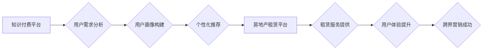

                 

## 关键词：知识付费、跨界营销、房地产租赁、人工智能、数据分析、用户画像、个性化推荐

## 1. 背景介绍

近年来，知识付费和跨界营销成为互联网行业发展的新趋势。知识付费以其独特的价值传递模式，为创作者提供了新的收入来源，也为用户提供了更高质量的学习和成长机会。跨界营销则通过打破传统行业壁垒，将不同领域的资源和用户进行整合，创造新的商业价值。

房地产租赁行业作为传统产业，近年来也开始探索新的发展模式。随着互联网技术的普及，线上租赁平台的兴起，房地产租赁行业面临着新的机遇和挑战。如何利用知识付费和跨界营销的优势，提升用户体验，拓展市场空间，成为房地产租赁行业亟待解决的问题。

## 2. 核心概念与联系

### 2.1 知识付费

知识付费是指通过付费的方式获取知识、技能和服务的商业模式。它以内容为核心，通过线上平台或线下活动，将知识和技能转化为有价值的产品或服务，并向用户提供付费订阅、课程购买、咨询服务等多种形式。

### 2.2 跨界营销

跨界营销是指企业将自身产品或服务与其他行业或品牌的资源进行整合，共同进行营销推广，以达到扩大市场影响力、提升品牌知名度和用户粘性的目的。

### 2.3 房地产租赁

房地产租赁是指将房屋或其他不动产出租给用户，并收取租金的商业模式。传统的房地产租赁模式主要依赖线下渠道，而随着互联网技术的普及，线上租赁平台的兴起，房地产租赁行业也开始向线上化、智能化发展。

**Mermaid 流程图**



## 3. 核心算法原理 & 具体操作步骤

### 3.1 算法原理概述

知识付费与房地产租赁跨界营销的核心算法原理在于用户画像构建和个性化推荐。通过对用户的行为数据、兴趣偏好、需求特征等进行分析，构建精准的用户画像，并根据用户画像，推荐符合用户需求的知识付费产品和房地产租赁服务。

### 3.2 算法步骤详解

1. **数据收集:** 收集用户在知识付费平台和房地产租赁平台上的行为数据，包括浏览记录、搜索历史、购买记录、评价反馈等。

2. **数据清洗:** 对收集到的数据进行清洗和预处理，去除无效数据、重复数据和噪声数据，确保数据质量。

3. **特征提取:** 从用户行为数据中提取特征，例如用户年龄、性别、职业、居住地、兴趣爱好、消费习惯等。

4. **用户画像构建:** 利用机器学习算法，对用户特征进行聚类分析，构建不同类型的用户画像，例如“年轻白领”、“家庭用户”、“投资客”等。

5. **个性化推荐:** 根据用户的画像特征，推荐符合用户需求的知识付费产品和房地产租赁服务。

6. **效果评估:** 对推荐结果进行评估，分析用户点击率、转化率等指标，不断优化推荐算法。

### 3.3 算法优缺点

**优点:**

* **精准推荐:** 通过用户画像构建，可以精准推荐符合用户需求的产品和服务，提高用户体验。
* **个性化服务:** 可以根据用户的不同需求，提供个性化的服务，增强用户粘性。
* **数据驱动:** 基于数据分析，可以不断优化推荐算法，提高推荐效果。

**缺点:**

* **数据依赖:** 算法效果依赖于数据的质量和数量，数据不足或数据质量低会影响推荐效果。
* **隐私保护:** 用户数据收集和使用需要注重隐私保护，避免泄露用户隐私。
* **算法解释性:** 一些机器学习算法的解释性较差，难以理解算法推荐的原因，影响用户信任。

### 3.4 算法应用领域

* **电商推荐:** 根据用户的购买历史、浏览记录等数据，推荐商品。
* **内容推荐:** 根据用户的阅读习惯、兴趣爱好等数据，推荐新闻、文章、视频等内容。
* **社交推荐:** 根据用户的社交关系、兴趣爱好等数据，推荐好友、群组等。
* **金融推荐:** 根据用户的投资偏好、风险承受能力等数据，推荐理财产品。

## 4. 数学模型和公式 & 详细讲解 & 举例说明

### 4.1 数学模型构建

用户画像构建可以采用聚类分析算法，例如K-means算法。K-means算法将用户数据划分为K个簇，每个簇代表一个用户类型。

**K-means算法步骤:**

1. 随机选择K个用户作为初始聚类中心。
2. 计算每个用户到每个聚类中心的距离。
3. 将每个用户分配到距离最近的聚类中心。
4. 更新每个聚类中心的坐标，为该簇中所有用户的平均值。
5. 重复步骤2-4，直到聚类中心不再变化。

### 4.2 公式推导过程

K-means算法的目标是最小化所有用户到其所属聚类中心的距离之和。

**目标函数:**

$$J(C) = \sum_{i=1}^{K} \sum_{x \in C_i} ||x - c_i||^2$$

其中:

* $J(C)$ 是目标函数值。
* $K$ 是聚类数。
* $C_i$ 是第i个聚类。
* $x$ 是第i个用户。
* $c_i$ 是第i个聚类中心。
* $||x - c_i||^2$ 是用户 $x$ 到聚类中心 $c_i$ 的距离平方。

### 4.3 案例分析与讲解

假设我们有100个用户，想要将其划分为3个用户类型。我们可以使用K-means算法进行聚类分析。

通过算法迭代，最终得到3个用户类型，每个类型包含大约33个用户。我们可以根据每个类型的用户特征，构建相应的用户画像，例如“年轻白领”、“家庭用户”、“投资客”等。

## 5. 项目实践：代码实例和详细解释说明

### 5.1 开发环境搭建

* Python 3.x
* scikit-learn 库

### 5.2 源代码详细实现

```python
from sklearn.cluster import KMeans
import pandas as pd

# 加载用户数据
data = pd.read_csv('user_data.csv')

# 选择特征变量
features = ['age', 'income', 'education', 'occupation']
X = data[features]

# 确定聚类数
n_clusters = 3

# 使用K-means算法进行聚类
kmeans = KMeans(n_clusters=n_clusters, random_state=0)
kmeans.fit(X)

# 获取聚类标签
labels = kmeans.labels_

# 将聚类标签添加到用户数据中
data['cluster'] = labels

# 分析每个聚类用户的特征
for i in range(n_clusters):
    print(f'Cluster {i+1}:')
    print(data[data['cluster'] == i][features].describe())
```

### 5.3 代码解读与分析

* 首先，我们加载用户数据，并选择需要进行聚类的特征变量。
* 然后，我们使用K-means算法进行聚类，并确定聚类数。
* 接着，我们获取聚类标签，并将标签添加到用户数据中。
* 最后，我们分析每个聚类用户的特征，了解不同用户类型的特点。

### 5.4 运行结果展示

运行代码后，我们可以得到每个聚类用户的特征描述，例如年龄、收入、教育程度、职业等。通过分析这些特征，我们可以构建不同类型的用户画像，例如“年轻白领”、“家庭用户”、“投资客”等。

## 6. 实际应用场景

### 6.1 知识付费推荐

根据用户的兴趣爱好、职业背景等特征，推荐相关的知识付费课程和服务。例如，对“金融投资”感兴趣的用户，可以推荐“股票投资”、“基金理财”等课程；对“编程开发”感兴趣的用户，可以推荐“Python编程”、“数据分析”等课程。

### 6.2 房地产租赁推荐

根据用户的居住需求、预算范围等特征，推荐符合用户需求的租赁房屋。例如，对“城市中心”居住的用户，可以推荐靠近商业区、交通便利的房屋；对“预算有限”的用户，可以推荐价格适中的房屋。

### 6.3 个性化营销

根据用户的画像特征，进行个性化的营销推广。例如，可以针对“年轻白领”用户，推出“便捷通勤”的租赁服务；针对“家庭用户”，推出“温馨舒适”的租赁房屋。

### 6.4 未来应用展望

随着人工智能技术的不断发展，知识付费与房地产租赁跨界营销将更加智能化、个性化。未来，我们可以期待以下应用场景：

* **智能化推荐:** 利用深度学习算法，实现更精准、更智能的推荐。
* **虚拟现实体验:** 利用虚拟现实技术，为用户提供更真实的租赁房屋体验。
* **个性化定制:** 根据用户的需求，提供个性化的租赁服务和知识付费内容。

## 7. 工具和资源推荐

### 7.1 学习资源推荐

* **机器学习课程:** Coursera、edX、Udacity 等平台提供丰富的机器学习课程。
* **数据分析工具:** Python、R 等编程语言，以及 Pandas、NumPy 等数据分析库。
* **聚类算法研究:** K-means算法、DBSCAN算法等聚类算法的研究论文。

### 7.2 开发工具推荐

* **Python:** 作为数据分析和机器学习的常用语言，Python 提供丰富的库和工具。
* **scikit-learn:** Python 的机器学习库，包含各种聚类算法和数据分析工具。
* **TensorFlow、PyTorch:** 深度学习框架，可以用于构建更复杂的推荐模型。

### 7.3 相关论文推荐

* **K-means Clustering:** MacQueen, J. (1967). Some methods for classification and analysis of multivariate observations.
* **DBSCAN Clustering:** Ester, M., Kriegel, H. P., Sander, J., & Xu, X. (2000). A density-based algorithm for discovering clusters in large spatial databases with noise.

## 8. 总结：未来发展趋势与挑战

### 8.1 研究成果总结

知识付费与房地产租赁跨界营销的结合，为用户提供了更便捷、更个性化的服务体验，同时也为企业带来了新的商业机会。通过用户画像构建和个性化推荐，可以提高用户粘性，提升品牌知名度，拓展市场空间。

### 8.2 未来发展趋势

* **人工智能技术的应用:** 利用深度学习、自然语言处理等人工智能技术，实现更精准、更智能的推荐和个性化服务。
* **数据安全和隐私保护:** 加强数据安全和隐私保护措施，确保用户数据的安全和合法使用。
* **跨界合作:** 鼓励不同行业、不同平台之间的跨界合作，构建更完善的生态系统。

### 8.3 面临的挑战

* **数据质量:** 算法效果依赖于数据的质量和数量，数据不足或数据质量低会影响推荐效果。
* **算法解释性:** 一些机器学习算法的解释性较差，难以理解算法推荐的原因，影响用户信任。
* **用户隐私保护:** 用户数据收集和使用需要注重隐私保护，避免泄露用户隐私。

### 8.4 研究展望

未来，知识付费与房地产租赁跨界营销将朝着更智能化、更个性化、更安全的方向发展。我们需要不断探索新的算法和技术，提升用户体验，同时也要关注数据安全和隐私保护，构建一个更加可持续发展的生态系统。

## 9. 附录：常见问题与解答

**Q1: 如何构建精准的用户画像？**

**A1:** 构建精准的用户画像需要收集用户多方面的行为数据，并利用机器学习算法进行分析和聚类。

**Q2: 如何保证用户数据的安全和隐私？**

**A2:** 在收集和使用用户数据时，需要严格遵守相关法律法规，并采取相应的安全措施，例如数据加密、匿名化处理等。

**Q3: 如何评估推荐算法的效果？**

**A3:** 可以通过用户点击率、转化率、用户满意度等指标来评估推荐算法的效果。

**作者：禅与计算机程序设计艺术 / Zen and the Art of Computer Programming**<end_of_turn>

