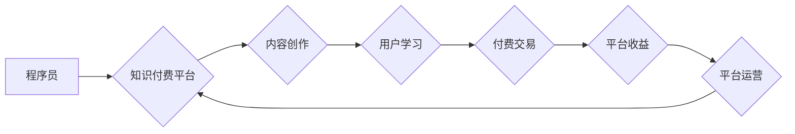

                 

## 知识付费平台运营:程序员创业案例分析

> 关键词：知识付费、程序员创业、平台运营、技术架构、商业模式、用户增长、数据分析

## 1. 背景介绍

近年来，随着互联网技术的快速发展和知识经济的兴起，知识付费行业蓬勃发展，成为新的经济增长点。程序员作为技术人才，拥有丰富的专业知识和经验，越来越多的程序员选择通过知识付费平台分享自己的技能和经验，并从中获得收益。

知识付费平台为程序员提供了展示自我、积累财富、实现自我价值的平台。同时，对于学习者来说，知识付费平台也提供了便捷、高效、经济的学习途径。

然而，知识付费平台运营并非易事，需要程序员具备一定的商业运营能力和技术架构设计能力。本文将从程序员创业的角度出发，分析知识付费平台的运营模式、技术架构、商业策略等方面，并结合实际案例进行深入探讨。

## 2. 核心概念与联系

### 2.1 知识付费平台

知识付费平台是指提供付费学习内容的在线平台，用户可以通过支付一定的费用，获取课程、教程、书籍、咨询等知识资源。

### 2.2 程序员创业

程序员创业是指程序员利用自身的技术优势和经验，创办自己的技术公司或项目，并从中获得收益。

### 2.3 平台运营

平台运营是指对知识付费平台进行管理和维护，包括用户运营、内容运营、技术运营、财务运营等多个方面。

**Mermaid 流程图**



## 3. 核心算法原理 & 具体操作步骤

### 3.1 算法原理概述

知识付费平台的核心算法主要围绕用户匹配、内容推荐、交易安全等方面。

* **用户匹配算法:** 根据用户的学习兴趣、技能水平、学习目标等信息，匹配合适的课程和导师。
* **内容推荐算法:** 根据用户的学习历史、浏览记录、评价反馈等信息，推荐相关的课程和学习资源。
* **交易安全算法:** 保证用户支付和课程获取的安全性和可靠性。

### 3.2 算法步骤详解

**用户匹配算法:**

1. 收集用户基本信息：包括用户年龄、性别、职业、教育背景、学习兴趣、技能水平、学习目标等。
2. 建立用户兴趣标签：根据用户的学习兴趣和技能水平，构建用户兴趣标签体系。
3. 匹配课程和导师：根据用户的兴趣标签和学习目标，匹配合适的课程和导师。

**内容推荐算法:**

1. 收集用户学习行为数据：包括用户浏览记录、课程评价、学习时长、学习进度等。
2. 建立内容相似度模型：根据课程内容、学习目标、用户评价等信息，建立课程之间的相似度模型。
3. 推荐相关课程：根据用户的学习历史和兴趣标签，推荐相关的课程和学习资源。

**交易安全算法:**

1. 使用加密技术保护用户支付信息：确保用户支付信息的安全传输和存储。
2. 使用第三方支付平台进行交易：降低平台交易风险。
3. 建立用户身份验证机制：防止用户账号被盗用。

### 3.3 算法优缺点

**优点:**

* 提高用户匹配效率，帮助用户找到合适的学习资源。
* 提供个性化的学习推荐，提升用户学习体验。
* 保障交易安全，提高用户信任度。

**缺点:**

* 算法模型需要不断优化，才能准确匹配用户需求。
* 数据隐私安全需要得到保障。
* 算法可能会存在偏差，导致推荐结果不准确。

### 3.4 算法应用领域

* 在线教育平台
* 知识付费平台
* 内容推荐系统
* 用户画像分析

## 4. 数学模型和公式 & 详细讲解 & 举例说明

### 4.1 数学模型构建

用户匹配算法可以采用基于用户的协同过滤模型，该模型基于用户的历史行为数据，预测用户对特定课程的兴趣。

**用户兴趣评分模型:**

$$
r_{ui} = \beta_0 + \beta_1 * u_i + \beta_2 * c_j + \beta_3 * u_i * c_j + \epsilon_{ui}
$$

其中：

* $r_{ui}$: 用户 $u$ 对课程 $c$ 的兴趣评分
* $u_i$: 用户 $u$ 的特征向量
* $c_j$: 课程 $c$ 的特征向量
* $\beta_0$, $\beta_1$, $\beta_2$, $\beta_3$: 模型参数
* $\epsilon_{ui}$: 随机误差项

### 4.2 公式推导过程

该模型通过线性回归的方式，预测用户对课程的兴趣评分。模型参数可以通过最小二乘法进行估计。

### 4.3 案例分析与讲解

假设有一个用户 $u$ 和一个课程 $c$，用户的特征向量 $u_i$ 包含用户的年龄、性别、职业等信息，课程的特征向量 $c_j$ 包含课程的主题、难度、时长等信息。通过训练模型，我们可以得到模型参数 $\beta_0$, $\beta_1$, $\beta_2$, $\beta_3$，然后将用户和课程的特征向量代入公式，即可预测用户对课程的兴趣评分。

## 5. 项目实践：代码实例和详细解释说明

### 5.1 开发环境搭建

* 操作系统：Windows/macOS/Linux
* 编程语言：Python
* 开发框架：Flask/Django
* 数据库：MySQL/PostgreSQL
* 云服务平台：AWS/Azure/GCP

### 5.2 源代码详细实现

```python
# Flask 框架示例代码

from flask import Flask, render_template, request

app = Flask(__name__)

@app.route('/')
def index():
    return render_template('index.html')

@app.route('/predict', methods=['POST'])
def predict():
    user_features = request.form.get('user_features')
    course_features = request.form.get('course_features')
    # 使用训练好的模型进行预测
    predicted_score = predict_score(user_features, course_features)
    return render_template('result.html', predicted_score=predicted_score)

if __name__ == '__main__':
    app.run(debug=True)
```

### 5.3 代码解读与分析

* 该代码示例使用 Flask 框架构建了一个简单的知识付费平台。
* 用户可以通过表单提交用户特征和课程特征，平台会使用训练好的模型进行预测，并返回预测的兴趣评分。
* 实际项目中，需要根据具体需求，实现用户注册、登录、课程管理、支付处理等功能。

### 5.4 运行结果展示

* 用户提交表单后，平台会返回预测的兴趣评分，并展示给用户。
* 用户可以根据预测的兴趣评分，选择是否购买课程。

## 6. 实际应用场景

### 6.1 在线编程课程平台

程序员可以通过知识付费平台分享自己的编程经验和技能，例如：

* 教授编程语言基础知识
* 分享开发经验和技巧
* 提供项目实战指导

### 6.2 技术博客和社区

程序员可以利用知识付费平台，将自己的技术博客和社区内容进行付费订阅，并获得收益。

### 6.3 软件开发工具和资源

程序员可以开发自己的软件开发工具和资源，并通过知识付费平台进行销售。

### 6.4 未来应用展望

* **人工智能驱动的个性化学习:** 利用人工智能技术，为用户提供更加个性化的学习推荐和学习路径。
* **虚拟现实和增强现实技术:** 将虚拟现实和增强现实技术应用于知识付费平台，提供更加沉浸式的学习体验。
* **区块链技术:** 利用区块链技术，保障知识产权和交易安全。

## 7. 工具和资源推荐

### 7.1 学习资源推荐

* **在线课程平台:** Coursera, Udemy, edX
* **技术博客:** Hacker News, Stack Overflow, Medium
* **开源社区:** GitHub, GitLab

### 7.2 开发工具推荐

* **Python:** Flask, Django, PyTorch
* **前端框架:** React, Vue.js, Angular
* **数据库:** MySQL, PostgreSQL, MongoDB

### 7.3 相关论文推荐

* **Collaborative Filtering for Recommender Systems**
* **Deep Learning for Recommender Systems**
* **Knowledge Graph Embedding for Recommender Systems**

## 8. 总结：未来发展趋势与挑战

### 8.1 研究成果总结

* 知识付费平台为程序员提供了新的创业机会，也为学习者提供了便捷高效的学习途径。
* 算法模型和技术架构不断发展，为知识付费平台的运营提供了技术支持。
* 知识付费平台的商业模式也日益成熟，并逐渐形成了一定的生态体系。

### 8.2 未来发展趋势

* **个性化学习:** 利用人工智能技术，为用户提供更加个性化的学习推荐和学习路径。
* **沉浸式学习:** 将虚拟现实和增强现实技术应用于知识付费平台，提供更加沉浸式的学习体验。
* **知识图谱:** 利用知识图谱技术，构建更加丰富的知识体系，并提供更加智能化的知识服务。

### 8.3 面临的挑战

* **内容质量:** 确保平台上内容的质量和原创性。
* **用户增长:** 吸引更多用户注册和使用平台。
* **商业模式:** 探索更加可持续的商业模式。

### 8.4 研究展望

* **算法模型的优化:** 开发更加精准、高效的算法模型，提升用户匹配和内容推荐的准确性。
* **技术架构的创新:** 探索更加灵活、可扩展的技术架构，满足平台的快速发展需求。
* **商业模式的创新:** 探索更加多元化的商业模式，实现平台的可持续发展。

## 9. 附录：常见问题与解答

* **如何注册成为平台用户？**

用户可以通过点击平台首页上的“注册”按钮，填写个人信息并完成注册流程。

* **如何购买课程？**

用户可以选择自己喜欢的课程，点击“购买”按钮，并完成支付流程。

* **如何联系平台客服？**

用户可以通过点击平台首页上的“联系客服”按钮，与平台客服人员进行沟通。


作者：禅与计算机程序设计艺术 / Zen and the Art of Computer Programming 
<end_of_turn>

