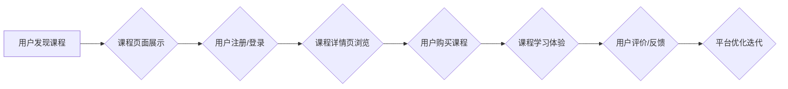

                 

## 知识付费赚钱的用户课程体验优化与UI设计策略

> 关键词：知识付费、用户体验、UI设计、课程体验优化、学习平台、用户行为分析、转化率提升

## 1. 背景介绍

知识付费行业近年来发展迅速，线上课程平台蓬勃兴起。用户可以通过支付费用获取专业知识和技能的学习资源。然而，在激烈的市场竞争中，仅仅拥有优质课程内容并不能保证平台的成功。如何提升用户课程体验，提高用户粘性和转化率，成为知识付费平台面临的重大挑战。

用户课程体验涵盖了用户从课程发现、购买到学习完成的全过程，包括课程内容质量、学习方式、平台交互、用户支持等多个方面。良好的用户体验可以增强用户对平台的信任和满意度，促进用户付费和复购。

## 2. 核心概念与联系

**2.1 用户课程体验优化**

用户课程体验优化是指通过对课程内容、学习方式、平台交互等方面的改进，提升用户在学习过程中的满意度和积极性。

**2.2 UI设计策略**

UI设计策略是指在用户界面设计中，根据用户需求和行为习惯，采用特定的设计原则和方法，以提高用户体验和平台使用效率。

**2.3 用户行为分析**

用户行为分析是指通过收集和分析用户在平台上的行为数据，例如用户访问路径、学习时长、课程评价等，以了解用户需求和痛点，为课程体验优化和UI设计提供数据支持。

**2.4 转化率提升**

转化率是指用户在平台上完成特定行为的比例，例如用户注册、付费购买、完成课程学习等。提升转化率是知识付费平台的重要目标，可以通过优化用户课程体验和UI设计来实现。

**Mermaid 流程图**



## 3. 核心算法原理 & 具体操作步骤

**3.1 算法原理概述**

用户课程体验优化和UI设计策略的实施需要结合多种算法和技术，例如推荐算法、用户行为分析算法、A/B测试算法等。

**3.2 算法步骤详解**

1. **用户行为数据收集:** 通过平台日志、用户行为追踪等方式收集用户在平台上的行为数据，例如用户访问页面、点击链接、观看视频、完成作业等。

2. **用户画像构建:** 对收集到的用户行为数据进行分析和处理，构建用户画像，例如用户年龄、性别、兴趣爱好、学习习惯等。

3. **课程推荐算法:** 基于用户画像和课程内容特征，采用协同过滤、内容过滤、深度学习等算法，推荐用户感兴趣的课程。

4. **UI设计优化:** 根据用户行为分析结果和设计原则，优化课程页面布局、交互设计、视觉风格等，提升用户体验。

5. **A/B测试:** 对不同的UI设计方案进行A/B测试，比较不同方案的用户转化率和体验效果，选择最佳方案。

6. **持续迭代优化:**  根据用户反馈和数据分析结果，不断迭代优化课程体验和UI设计，提升平台的用户粘性和转化率。

**3.3 算法优缺点**

**优点:**

* 能够精准推荐用户感兴趣的课程，提高用户学习兴趣和参与度。
* 能够根据用户行为数据，个性化定制课程学习体验，提升用户满意度。
* 能够通过A/B测试，验证UI设计方案的有效性，提高设计效率。

**缺点:**

* 需要收集和分析大量用户行为数据，数据处理和分析成本较高。
* 算法模型的构建和优化需要专业技术人员，技术门槛较高。
* 用户行为数据存在隐私问题，需要妥善处理和保护用户隐私。

**3.4 算法应用领域**

* 知识付费平台
* 在线教育平台
* 内容推荐系统
* 用户行为分析系统

## 4. 数学模型和公式 & 详细讲解 & 举例说明

**4.1 数学模型构建**

用户课程体验可以被量化成一个指标，例如用户满意度、学习效率、复购率等。我们可以构建一个数学模型来描述用户课程体验与相关因素之间的关系。

例如，我们可以构建一个用户满意度模型，其中用户满意度取决于课程内容质量、学习方式、平台交互等因素。

**用户满意度模型:**

$$
满意度 = f(内容质量, 学习方式, 平台交互)
$$

其中，f()是一个函数，代表用户满意度与各个因素之间的关系。

**4.2 公式推导过程**

为了构建更精确的用户满意度模型，我们可以进一步推导公式，将各个因素的权重进行量化。

例如，我们可以使用层次分析法来确定各个因素的权重，然后将权重代入公式中。

**4.3 案例分析与讲解**

假设我们对一个知识付费平台的用户满意度进行分析，发现课程内容质量对用户满意度影响最大，其次是学习方式，最后是平台交互。

我们可以将这些因素的权重代入用户满意度模型中，得到一个更精确的用户满意度预测模型。

## 5. 项目实践：代码实例和详细解释说明

**5.1 开发环境搭建**

* 操作系统: Windows/macOS/Linux
* 编程语言: Python
* 开发工具: Jupyter Notebook/VS Code
* 库依赖: pandas, numpy, scikit-learn

**5.2 源代码详细实现**

```python
import pandas as pd
from sklearn.model_selection import train_test_split
from sklearn.linear_model import LinearRegression

# 加载用户数据
data = pd.read_csv('user_data.csv')

# 选择特征和目标变量
features = ['content_quality', 'learning_method', 'platform_interaction']
target = 'satisfaction'

# 将数据分为训练集和测试集
X_train, X_test, y_train, y_test = train_test_split(data[features], data[target], test_size=0.2)

# 创建线性回归模型
model = LinearRegression()

# 训练模型
model.fit(X_train, y_train)

# 预测测试集的用户满意度
y_pred = model.predict(X_test)

# 评估模型性能
from sklearn.metrics import mean_squared_error
mse = mean_squared_error(y_test, y_pred)
print(f'Mean Squared Error: {mse}')
```

**5.3 代码解读与分析**

这段代码实现了用户满意度预测模型的构建和训练。

1. 首先，加载用户数据，并选择特征和目标变量。
2. 将数据分为训练集和测试集，用于模型训练和评估。
3. 创建线性回归模型，并使用训练集训练模型。
4. 使用训练好的模型预测测试集的用户满意度。
5. 评估模型性能，例如使用均方误差 (MSE) 来衡量模型预测的准确性。

**5.4 运行结果展示**

运行代码后，会输出模型的均方误差值，表示模型预测的用户满意度与实际用户满意度的差异程度。

## 6. 实际应用场景

**6.1 课程推荐系统**

知识付费平台可以利用用户行为分析和推荐算法，推荐用户感兴趣的课程，提高用户学习兴趣和参与度。

**6.2 个性化学习路径**

根据用户的学习进度、学习习惯和目标，平台可以构建个性化的学习路径，帮助用户更有效地完成学习目标。

**6.3 用户反馈收集与优化**

平台可以收集用户对课程内容、学习方式、平台交互等方面的反馈，并根据反馈进行课程优化和UI设计改进。

**6.4 课程营销推广**

平台可以利用用户画像和行为数据，进行精准的课程营销推广，提高课程的曝光率和转化率。

**6.5 未来应用展望**

随着人工智能技术的不断发展，用户课程体验优化和UI设计策略将更加智能化和个性化。

例如，未来平台可以利用自然语言处理技术，理解用户的学习需求，并提供更精准的课程推荐和学习指导。

## 7. 工具和资源推荐

**7.1 学习资源推荐**

* **书籍:**
    * 《用户体验设计》
    * 《设计心理学》
    * 《数据分析与机器学习》
* **在线课程:**
    * Coursera: 用户体验设计
    * Udemy: UI/UX设计
    * edX: 数据科学与机器学习

**7.2 开发工具推荐**

* **UI设计工具:**
    * Figma
    * Sketch
    * Adobe XD
* **数据分析工具:**
    * Jupyter Notebook
    * pandas
    * scikit-learn

**7.3 相关论文推荐**

* **用户体验设计:**
    * Nielsen, J. (1993). Usability engineering.
* **推荐算法:**
    * Resnick, P., Iacovou, N., Suchak, M., Bergstrom, P., & Riedl, J. (1994). GroupLens: An open architecture for collaborative filtering of netnews.
* **机器学习:**
    * Bishop, C. M. (2006). Pattern recognition and machine learning.

## 8. 总结：未来发展趋势与挑战

**8.1 研究成果总结**

用户课程体验优化和UI设计策略的研究取得了显著成果，为知识付费平台的发展提供了重要的理论和实践指导。

**8.2 未来发展趋势**

未来，用户课程体验优化和UI设计策略将更加注重以下几个方面:

* **个性化定制:** 利用人工智能技术，为每个用户提供个性化的课程推荐、学习路径和学习体验。
* **沉浸式体验:** 利用虚拟现实、增强现实等技术，打造更加沉浸式的学习体验。
* **跨平台融合:** 打破平台的边界，实现课程内容和学习资源的跨平台共享和互联互通。

**8.3 面临的挑战**

* **数据隐私保护:** 用户行为数据涉及个人隐私，需要妥善处理和保护用户隐私。
* **算法公平性:** 算法模型的训练数据可能存在偏差，导致算法结果不公平。
* **技术可持续性:** 随着技术的不断发展，需要不断更新和迭代算法模型和UI设计方案，以保持平台的竞争力。

**8.4 研究展望**

未来，我们需要继续深入研究用户课程体验优化和UI设计策略，探索更有效的算法模型、更人性化的设计方案，为用户提供更加优质的学习体验。

## 9. 附录：常见问题与解答

**9.1 如何提高用户课程体验？**

* 提供高质量的课程内容
* 设计人性化的学习方式
* 优化平台交互体验
* 提供优质的用户支持

**9.2 如何进行UI设计优化？**

* 遵循用户体验设计原则
* 进行用户行为分析
* 使用A/B测试验证设计方案
* 持续迭代优化设计方案

**9.3 如何提升知识付费平台的转化率？**

* 精准推荐课程
* 提供个性化学习路径
* 优化用户支付流程
* 增强用户粘性和复购率


作者：禅与计算机程序设计艺术 / Zen and the Art of Computer Programming 
<end_of_turn>

