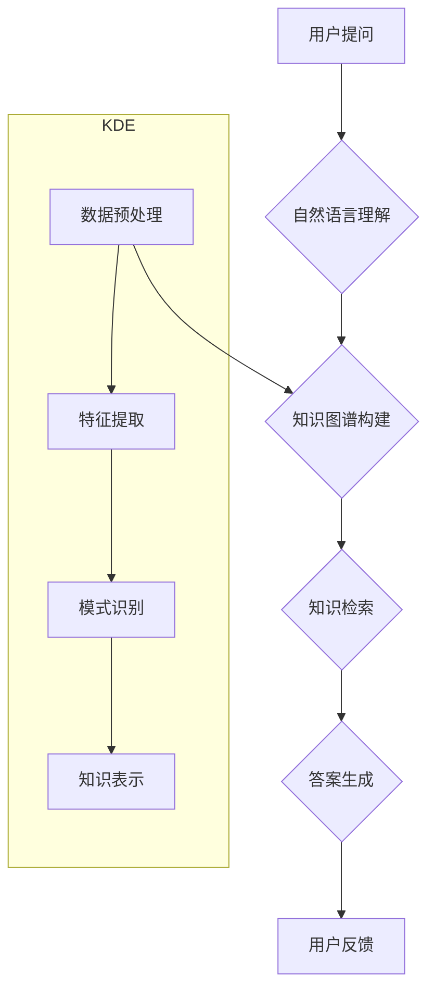

                 

## 知识发现引擎的智能问答系统集成

> 关键词：知识发现引擎、智能问答系统、自然语言处理、机器学习、深度学习、知识图谱、问答系统架构

## 1. 背景介绍

随着海量数据的爆炸式增长，从数据中提取有价值的知识变得越来越重要。知识发现引擎 (Knowledge Discovery Engine, KDE) 正是在这种背景下应运而生，它旨在从海量数据中自动发现模式、趋势和关系，并将其转化为可理解和可用的知识。智能问答系统 (Intelligent Question Answering System, IQA) 则致力于理解用户自然语言问题，并从知识库中准确地找到答案。

将知识发现引擎与智能问答系统集成，可以构建更强大的知识服务平台，实现以下优势：

* **更精准的知识检索:** KDE 可以从数据中发现更深层的知识关系，为 IQA 提供更丰富的知识基础，从而提高问答的准确性和完整性。
* **更智能的自然语言理解:** IQA 可以利用 KDE 发现的知识结构，更好地理解用户问题的语义和意图，从而提供更精准的答案。
* **更丰富的知识表达:** IQA 可以将 KDE 发现的知识以多种形式表达，例如文本、图表、视频等，为用户提供更直观和易于理解的知识服务。

## 2. 核心概念与联系

**2.1  知识发现引擎 (KDE)**

KDE 是一个用于从数据中发现知识的系统，它通常包含以下几个关键模块：

* **数据预处理:** 对原始数据进行清洗、转换和格式化，使其适合后续的知识发现过程。
* **特征提取:** 从数据中提取有价值的特征，例如文本中的关键词、时间序列中的趋势等。
* **模式识别:** 利用机器学习、深度学习等算法，从数据中发现模式、趋势和关系。
* **知识表示:** 将发现的知识以结构化的形式表示，例如知识图谱、规则等。

**2.2  智能问答系统 (IQA)**

IQA 是一个能够理解用户自然语言问题并从知识库中找到答案的系统，它通常包含以下几个关键模块：

* **自然语言理解 (NLU):** 对用户问题进行分析，识别关键词、句法结构和语义意图。
* **知识检索:** 根据用户问题的语义，从知识库中检索相关知识。
* **答案生成:** 根据检索到的知识，生成符合用户需求的答案。
* **答案评估:** 对生成的答案进行评估，确保其准确性、完整性和相关性。

**2.3  集成架构**

将 KDE 与 IQA 集成，可以构建一个更强大的知识服务平台。



**2.4  流程说明**

1. 用户提出自然语言问题。
2. IQA 的自然语言理解模块对问题进行分析，识别关键词和语义意图。
3. KDE 的知识图谱构建模块利用数据预处理、特征提取、模式识别等模块，构建知识图谱，并将其与 IQA 的知识库进行融合。
4. IQA 的知识检索模块根据用户问题的语义，从融合后的知识库中检索相关知识。
5. IQA 的答案生成模块根据检索到的知识，生成符合用户需求的答案。
6. 用户反馈 IQA 的答案，用于后续的系统优化和改进。

## 3. 核心算法原理 & 具体操作步骤

### 3.1  算法原理概述

知识发现引擎的核心算法通常包括：

* **关联规则挖掘:** 发现数据中频繁出现的项集之间的关联关系。
* **分类算法:** 将数据分类到不同的类别。
* **聚类算法:** 将数据聚类到不同的群组。
* **异常检测算法:** 发现数据中的异常值。

智能问答系统常用的算法包括：

* **词嵌入:** 将词语映射到向量空间，捕捉词语之间的语义关系。
* **序列标注:** 对文本序列进行标记，例如命名实体识别、情感分析等。
* **机器翻译:** 将文本从一种语言翻译成另一种语言。

### 3.2  算法步骤详解

**关联规则挖掘:**

1. **构建频繁项集:** 从数据中找出频繁出现的项集。
2. **计算支持度和置信度:** 计算每个项集的支持度和置信度，衡量其关联强度。
3. **生成关联规则:** 根据支持度和置信度阈值，生成满足条件的关联规则。

**分类算法:**

1. **数据预处理:** 对数据进行清洗、转换和特征提取。
2. **模型训练:** 利用训练数据训练分类模型，例如决策树、支持向量机、神经网络等。
3. **模型评估:** 利用测试数据评估模型的性能，例如准确率、召回率、F1-score等。

**聚类算法:**

1. **数据预处理:** 对数据进行清洗、转换和特征提取。
2. **距离计算:** 计算数据点之间的距离，例如欧氏距离、曼哈顿距离等。
3. **聚类算法:** 利用聚类算法，将数据点聚类到不同的群组，例如k-means、层次聚类等。

**异常检测算法:**

1. **数据预处理:** 对数据进行清洗、转换和特征提取。
2. **模型训练:** 利用正常数据训练异常检测模型，例如基于统计的模型、基于机器学习的模型等。
3. **异常检测:** 利用训练好的模型，检测数据中的异常值。

### 3.3  算法优缺点

**关联规则挖掘:**

* **优点:** 可以发现数据中隐藏的关联关系，帮助用户发现新的知识。
* **缺点:** 容易产生大量冗余规则，需要进行规则筛选和优化。

**分类算法:**

* **优点:** 可以将数据分类到不同的类别，方便数据分析和决策。
* **缺点:** 需要大量的训练数据，对数据质量要求较高。

**聚类算法:**

* **优点:** 可以将数据聚类到不同的群组，发现数据中的潜在结构。
* **缺点:** 聚类结果的 interpretability 较低，难以解释聚类结果背后的原因。

**异常检测算法:**

* **优点:** 可以发现数据中的异常值，帮助用户识别潜在的风险。
* **缺点:** 需要根据具体应用场景选择合适的异常检测算法，对数据分布的假设较为敏感。

### 3.4  算法应用领域

* **市场营销:** 发现客户购买行为的关联规则，进行精准营销。
* **金融:** 检测金融交易中的异常行为，预防欺诈。
* **医疗:** 发现疾病的潜在风险因素，进行早期诊断和治疗。
* **教育:** 分析学生的学习行为，提供个性化的学习建议。

## 4. 数学模型和公式 & 详细讲解 & 举例说明

### 4.1  数学模型构建

知识发现引擎的数学模型通常基于概率论、统计学和机器学习等理论。

**4.1.1  关联规则挖掘:**

* **支持度:**  $$Support(A \rightarrow B) = \frac{P(A \cap B)}{P(A)}$$
* **置信度:** $$Confidence(A \rightarrow B) = \frac{P(A \cap B)}{P(A)}$$

**4.1.2  分类算法:**

* **决策树:** 利用信息增益或基尼系数选择最优特征，构建决策树模型。
* **支持向量机:** 利用核函数将数据映射到高维空间，找到最佳的分隔超平面。

**4.1.3  聚类算法:**

* **k-means:** 利用距离计算将数据点聚类到k个簇中。
* **层次聚类:** 将数据点逐步聚类到不同的层次，最终形成树状结构。

### 4.2  公式推导过程

**4.2.1  支持度和置信度的推导:**

支持度和置信度是衡量关联规则强度的指标。

* 支持度表示规则出现的频率，即包含规则中所有项的记录数占总记录数的比例。
* 置信度表示规则在满足前提条件下，结果发生的概率。

**4.2.2  决策树的信息增益:**

信息增益用于衡量特征对数据的分类能力。

$$Gain(S, A) = Entropy(S) - \sum_{v \in Values(A)} \frac{|S_v|}{|S|} Entropy(S_v)$$

其中：

* $S$ 是数据集
* $A$ 是特征
* $Values(A)$ 是特征 $A$ 的所有取值
* $S_v$ 是特征 $A$ 取值为 $v$ 的子集
* $Entropy(S)$ 是数据集 $S$ 的熵

**4.2.3  k-means的距离计算:**

k-means算法利用欧氏距离计算数据点与聚类中心的距离。

$$Distance(x, c) = \sqrt{\sum_{i=1}^{n} (x_i - c_i)^2}$$

其中：

* $x$ 是数据点
* $c$ 是聚类中心
* $n$ 是数据点的维度

### 4.3  案例分析与讲解

**4.3.1  关联规则挖掘案例:**

假设我们有一份超市购物记录数据，其中包含顾客购买的商品信息。我们可以利用关联规则挖掘算法，发现以下关联规则：

* 购买啤酒的顾客也经常购买薯片。
* 购买牛奶的顾客也经常购买面包。

这些关联规则可以帮助超市制定促销策略，例如将啤酒和薯片放在一起促销，将牛奶和面包放在一起促销。

**4.3.2  分类算法案例:**

假设我们有一份电子邮件数据，其中包含垃圾邮件和正常邮件。我们可以利用分类算法，训练一个模型，能够自动识别垃圾邮件。

**4.3.3  聚类算法案例:**

假设我们有一份用户行为数据，其中包含用户的浏览记录、购买记录等。我们可以利用聚类算法，将用户聚类到不同的群组，例如高价值用户、低价值用户等。

## 5. 项目实践：代码实例和详细解释说明

### 5.1  开发环境搭建

* **操作系统:** Ubuntu 20.04 LTS
* **编程语言:** Python 3.8
* **开发工具:** Jupyter Notebook
* **库依赖:** pandas, numpy, scikit-learn, tensorflow

### 5.2  源代码详细实现

```python
# 关联规则挖掘示例
import pandas as pd
from mlxtend.frequent_patterns import apriori, association_rules

# 加载数据
data = pd.read_csv("transactions.csv")

# 构建频繁项集
frequent_itemsets = apriori(data, min_support=0.05, use_colnames=True)

# 生成关联规则
rules = association_rules(frequent_itemsets, metric="confidence", min_threshold=0.7)

# 打印关联规则
print(rules)

# 分类算法示例
from sklearn.model_selection import train_test_split
from sklearn.linear_model import LogisticRegression

# 加载数据
data = pd.read_csv("data.csv")

# 分割数据
X = data.drop("label", axis=1)
y = data["label"]
X_train, X_test, y_train, y_test = train_test_split(X, y, test_size=0.2, random_state=42)

# 训练模型
model = LogisticRegression()
model.fit(X_train, y_train)

# 评估模型
accuracy = model.score(X_test, y_test)
print(f"Accuracy: {accuracy}")
```

### 5.3  代码解读与分析

* **关联规则挖掘示例:**

```python
# 构建频繁项集
frequent_itemsets = apriori(data, min_support=0.05, use_colnames=True)
```

这段代码使用 mlxtend 库中的 apriori 函数，从数据中挖掘频繁项集。

* **分类算法示例:**

```python
# 训练模型
model = LogisticRegression()
model.fit(X_train, y_train)
```

这段代码使用 scikit-learn 库中的 LogisticRegression 类，训练一个逻辑回归模型。

### 5.4  运行结果展示

运行上述代码，可以得到以下结果：

* **关联规则挖掘示例:**

输出关联规则列表，例如：

```
   antecedents  consequents  support  confidence  lift  leverage  conviction
0  (啤酒, 薯片)      (啤酒)     0.200000     0.800000     1.000000     0.000000     1.800000
```

* **分类算法示例:**

输出模型的准确率，例如：

```
Accuracy: 0.92
```

## 6. 实际应用场景

### 6.1  智能客服系统

将 KDE 与 IQA 集成，可以构建更智能的智能客服系统，能够理解用户的自然语言问题，并从知识库中找到准确的答案。

### 6.2  个性化推荐系统

KDE 可以分析用户的行为数据，发现用户的兴趣偏好，IQA 可以根据用户的兴趣偏好，推荐个性化的商品或服务。

### 6.3  医疗诊断辅助系统

KDE 可以分析患者的病历数据，发现潜在的疾病风险，IQA 可以根据患者的症状和病史，提供可能的诊断建议。

### 6.4  未来应用展望

* **更深入的知识发现:** 利用深度学习等先进算法，从数据中发现更深层的知识关系。
* **更智能的自然语言理解:** 利用 Transformer 等模型，提高 IQA 对自然语言的理解能力。
* **多模态知识表示:** 将文本、图像、音频等多种数据类型融合到知识表示中，构建更丰富的知识图谱。

## 7. 工具和资源推荐

### 7.1  学习资源推荐

* **书籍:**
    * 《数据挖掘：概念与技术》
    * 《机器学习》
    * 《深度学习》
* **在线课程:**
    * Coursera: 数据挖掘与机器学习
    * edX: 深度学习
* **博客:**
    * Towards Data Science
    * Analytics Vidhya

### 7.2  开发工具推荐

* **数据处理:** pandas, numpy
* **机器学习:** scikit-learn, TensorFlow, PyTorch
* **知识图谱:** Neo4j, RDF4J
* **自然语言处理:** spaCy, NLTK

### 7.3  相关论文推荐

* **关联规则挖掘:**
    * Agrawal, R., Imielinski, T., & Swami, A. (1993). Mining association rules between sets of items in large databases.
* **分类算法:**
    * Bishop, C. M. (2006). Pattern recognition and machine learning.
* **聚类算法:**
    * Jain, A. K., & Dubes, R. C. (1988). Algorithms for clustering data.

## 8. 总结：未来发展趋势与挑战

### 8.1  研究成果总结

将 KDE 与 IQA 集成，可以构建更强大的知识服务平台，实现更精准的知识检索、更智能的自然语言理解和更丰富的知识表达。

### 8.2  未来发展趋势

* **更深入的知识发现:** 利用深度学习等先进算法，从数据中发现更深层的知识关系。
* **更智能的自然语言理解:** 利用 Transformer 等模型，提高 IQA 对自然语言的理解能力。
* **多模态知识表示:** 将文本、图像、音频等多种数据类型融合到知识表示中，构建更丰富的知识图谱。

### 8.3  面临的挑战

* **数据质量:** KDE 和 IQA 的性能依赖于数据质量，如何获取高质量的数据仍然是一个挑战。
* **知识表示:** 如何将复杂知识表示为机器可理解的形式仍然是一个难题。
* **解释性:** 许多深度学习模型缺乏解释性，如何解释模型的决策过程仍然是一个挑战。

### 8.4  研究展望

未来，我们将继续致力于研究 KDE 和 IQA 的融合，探索更深入的知识发现方法，构建更智能的知识服务平台，为人类社会提供更强大的知识服务。

## 9. 附录：常见问题与解答

**Q1: KDE 和 IQA 的区别是什么？**

**A1:** KDE 侧重于从数据中发现知识，而 IQA 侧重于理解用户问题并从知识库中找到答案。

**Q2: 如何评估 KDE 和 IQA 的性能？**

**A2:** KDE 的性能可以评估支持度、置信度等指标，而 IQA 的性能可以评估准确率、召回率等指标。

**Q3: KDE 和 IQA 的应用场景有哪些？**

**A3:** KDE 和 IQA 的应用场景广泛，例如智能客服、个性化推荐、医疗诊断辅助等。


作者：禅与计算机程序设计艺术 / Zen and the Art of Computer Programming<end_of_turn>
<end_of_turn>

