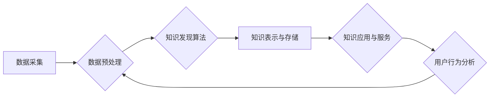

                 

## 知识发现引擎的用户留存与活跃度提升

> 关键词：知识发现引擎、用户留存、活跃度提升、推荐算法、个性化推荐、数据挖掘、机器学习、用户行为分析

## 1. 背景介绍

知识发现引擎 (Knowledge Discovery Engine, KDE) 作为一种智能化的信息处理系统，旨在从海量数据中挖掘出有价值的知识和洞察力，为用户提供个性化服务和决策支持。然而，在实际应用中，许多 KDE 面临着用户留存率低、用户活跃度不足等问题。这不仅影响了 KDE 的商业价值，也阻碍了其在各领域的广泛应用。

用户留存和活跃度是衡量 KDE 成功与否的关键指标。用户留存率是指在特定时间段内，仍然活跃使用 KDE 的用户比例，而用户活跃度则指用户在 KDE 上的交互频率和参与程度。提升用户留存和活跃度对于 KDE 的长期发展至关重要。

## 2. 核心概念与联系

### 2.1 用户留存与活跃度

用户留存和活跃度是相互关联的两个重要概念。用户留存率高意味着用户对 KDE 的体验良好，愿意持续使用，而活跃度高则表明用户在 KDE 上的参与度高，对 KDE 的价值认可度高。两者共同构成了 KDE 的用户生命周期，也是衡量 KDE 成功与否的关键指标。

### 2.2 KDE 的核心功能

KDE 的核心功能包括：

* **数据采集与存储:** 从各种数据源收集和存储海量数据，为知识发现提供基础数据。
* **数据预处理:** 对收集到的数据进行清洗、转换、整合等预处理，确保数据质量和一致性。
* **知识发现算法:** 利用数据挖掘、机器学习等算法，从数据中挖掘出有价值的知识和模式。
* **知识表示与存储:** 将发现的知识以可理解的形式表示和存储，方便用户访问和利用。
* **知识应用与服务:** 将发现的知识应用于实际场景，为用户提供个性化服务和决策支持。

### 2.3 用户行为分析

用户行为分析是提升用户留存和活跃度的关键环节。通过分析用户的访问记录、交互行为、反馈意见等数据，可以了解用户的需求、偏好和使用习惯，从而制定针对性的策略提升用户体验。

**Mermaid 流程图**



## 3. 核心算法原理 & 具体操作步骤

### 3.1 算法原理概述

提升用户留存和活跃度的核心算法通常基于以下原理：

* **个性化推荐:** 根据用户的历史行为、偏好和兴趣，推荐个性化的内容和服务，提高用户体验和参与度。
* **内容聚类与分类:** 将海量数据进行聚类和分类，帮助用户快速找到感兴趣的内容，提高用户搜索效率和满意度。
* **用户画像构建:** 通过分析用户的行为数据，构建用户画像，了解用户的特征和需求，为个性化服务提供基础。
* **行为预测:** 利用机器学习算法预测用户的未来行为，例如用户是否会再次访问 KDE、用户对哪些内容感兴趣等，为用户留存和活跃度提升提供决策依据。

### 3.2 算法步骤详解

以个性化推荐算法为例，其具体操作步骤如下：

1. **数据收集:** 收集用户的历史行为数据，例如用户访问过的页面、点击过的链接、收藏过的内容、评论过的信息等。
2. **特征提取:** 从用户的行为数据中提取特征，例如用户喜欢的主题、浏览过的网站类型、评论过的内容风格等。
3. **模型训练:** 利用机器学习算法，例如协同过滤、内容基准、深度学习等，训练个性化推荐模型。
4. **推荐生成:** 根据用户的特征和模型预测，生成个性化的推荐列表，推荐用户可能感兴趣的内容和服务。
5. **效果评估:** 通过评估推荐列表的点击率、转化率等指标，不断优化推荐算法和模型。

### 3.3 算法优缺点

**优点:**

* **个性化:** 可以根据用户的个性化需求提供定制化的服务和内容。
* **精准度高:** 通过数据分析和模型预测，可以提高推荐的精准度和用户满意度。
* **用户留存提升:** 个性化推荐可以提高用户体验和参与度，从而提升用户留存率。

**缺点:**

* **数据依赖:** 个性化推荐算法依赖于海量用户行为数据，数据质量和数量直接影响推荐效果。
* **冷启动问题:** 对新用户或新内容，由于缺乏历史数据，难以进行精准推荐。
* **算法复杂度:** 一些个性化推荐算法的复杂度较高，需要强大的计算资源和技术支持。

### 3.4 算法应用领域

个性化推荐算法广泛应用于以下领域：

* **电商平台:** 推荐商品、优惠券、促销活动等。
* **社交媒体:** 推荐好友、群组、内容等。
* **视频网站:** 推荐视频、电视剧、电影等。
* **音乐平台:** 推荐歌曲、专辑、歌手等。
* **新闻平台:** 推荐新闻、文章、博客等。

## 4. 数学模型和公式 & 详细讲解 & 举例说明

### 4.1 数学模型构建

个性化推荐算法通常基于以下数学模型：

* **协同过滤模型:** 基于用户的相似度或物品的相似度进行推荐。
* **内容基准模型:** 基于用户的兴趣偏好和物品的特征进行推荐。
* **深度学习模型:** 利用神经网络结构进行特征提取和推荐。

### 4.2 公式推导过程

以协同过滤模型为例，其核心公式为：

$$r_{ui} = \mu + b_u + b_i + \epsilon_{ui}$$

其中：

* $r_{ui}$ 表示用户 $u$ 对物品 $i$ 的评分。
* $\mu$ 表示全局平均评分。
* $b_u$ 表示用户 $u$ 的偏差。
* $b_i$ 表示物品 $i$ 的偏差。
* $\epsilon_{ui}$ 表示评分误差。

通过最小化评分误差，可以训练协同过滤模型，预测用户对物品的评分。

### 4.3 案例分析与讲解

假设有一个电影推荐系统，用户 $A$ 对电影 $X$ 评分为 5，用户 $B$ 对电影 $Y$ 评分为 4。如果用户 $A$ 和用户 $B$ 的兴趣偏好相似，则可以推测用户 $A$ 也可能喜欢电影 $Y$。

通过协同过滤模型，可以计算出用户 $A$ 对电影 $Y$ 的评分预测值，并将其作为推荐依据。

## 5. 项目实践：代码实例和详细解释说明

### 5.1 开发环境搭建

* 操作系统: Ubuntu 20.04
* Python 版本: 3.8
* 必要的库: pandas, numpy, scikit-learn, matplotlib

### 5.2 源代码详细实现

```python
import pandas as pd
from sklearn.metrics.pairwise import cosine_similarity

# 加载用户评分数据
ratings_data = pd.read_csv('ratings.csv')

# 计算用户-物品评分矩阵
user_item_matrix = ratings_data.pivot_table(index='user_id', columns='item_id', values='rating')

# 计算用户相似度
user_similarity = cosine_similarity(user_item_matrix)

# 获取用户 A 的相似用户
user_A_id = 1
similar_users = user_similarity[user_A_id].argsort()[:-6:-1]  # 排序获取前 5 个相似用户

# 获取用户 A 未评分的物品
unrated_items = user_item_matrix.loc[user_A_id].isnull().index

# 计算用户 A 对未评分物品的评分预测
for item in unrated_items:
    predicted_rating = 0
    for similar_user in similar_users:
        if user_item_matrix.loc[similar_user, item] is not None:
            predicted_rating += user_item_matrix.loc[similar_user, item] * user_similarity[user_A_id][similar_user]
    predicted_rating /= sum(user_similarity[user_A_id][similar_users])
    print(f'用户 A 对物品 {item} 的预测评分: {predicted_rating}')
```

### 5.3 代码解读与分析

* 代码首先加载用户评分数据，并构建用户-物品评分矩阵。
* 然后利用余弦相似度计算用户之间的相似度。
* 通过获取用户 A 的相似用户，并分析其对未评分物品的评分，预测用户 A 对未评分物品的评分。

### 5.4 运行结果展示

运行代码后，将输出用户 A 对未评分物品的评分预测值。

## 6. 实际应用场景

### 6.1 电商平台

* **商品推荐:** 根据用户的浏览历史、购买记录、收藏列表等数据，推荐个性化的商品。
* **优惠券推荐:** 根据用户的消费习惯和偏好，推荐相关的优惠券和促销活动。
* **个性化营销:** 通过分析用户的行为数据，进行精准的营销推广，提高转化率。

### 6.2 社交媒体

* **好友推荐:** 根据用户的兴趣爱好、社交关系等数据，推荐潜在的好友。
* **群组推荐:** 根据用户的兴趣爱好、社交关系等数据，推荐相关的群组。
* **内容推荐:** 根据用户的阅读习惯、点赞记录等数据，推荐个性化的内容。

### 6.3 视频网站

* **视频推荐:** 根据用户的观看历史、点赞记录、评论等数据，推荐个性化的视频。
* **电视剧推荐:** 根据用户的观看历史、评分等数据，推荐相关的电视剧。
* **电影推荐:** 根据用户的观看历史、评分等数据，推荐相关的电影。

### 6.4 未来应用展望

随着人工智能技术的不断发展，KDE 在未来将有更广泛的应用场景，例如：

* **医疗领域:** 基于患者的病历、检查结果等数据，推荐个性化的治疗方案。
* **教育领域:** 根据学生的学习进度、兴趣爱好等数据，推荐个性化的学习资源。
* **金融领域:** 基于用户的财务状况、投资习惯等数据，推荐个性化的理财方案。

## 7. 工具和资源推荐

### 7.1 学习资源推荐

* **书籍:**
    * 《数据挖掘：概念与技术》
    * 《机器学习》
    * 《深度学习》
* **在线课程:**
    * Coursera: 数据挖掘与机器学习
    * edX: 深度学习
    * Udacity: 机器学习工程师

### 7.2 开发工具推荐

* **Python:** 广泛应用于数据挖掘和机器学习领域。
* **Pandas:** 用于数据分析和处理。
* **Scikit-learn:** 机器学习库，提供各种算法和工具。
* **TensorFlow:** 深度学习框架。
* **PyTorch:** 深度学习框架。

### 7.3 相关论文推荐

* **Collaborative Filtering for Implicit Feedback Datasets**
* **Deep Learning for Recommender Systems**
* **A Survey on Content-Based Recommendation Systems**

## 8. 总结：未来发展趋势与挑战

### 8.1 研究成果总结

近年来，在用户留存和活跃度提升方面取得了显著成果，例如：

* 个性化推荐算法的精度不断提高。
* 深度学习在推荐系统中的应用越来越广泛。
* 用户行为分析技术不断发展，能够更深入地了解用户的需求和偏好。

### 8.2 未来发展趋势

* **更精准的个性化推荐:** 利用更先进的算法和技术，实现更精准的个性化推荐，满足用户的个性化需求。
* **跨平台推荐:** 打破平台的限制，实现跨平台的个性化推荐，为用户提供更全面的服务。
* **多模态推荐:** 利用文本、图像、音频等多模态数据，实现更丰富的个性化推荐。
* **解释性推荐:** 使推荐结果更加透明可解释，提升用户对推荐结果的信任度。

### 8.3 面临的挑战

* **数据隐私保护:** 如何在提升用户体验的同时，保护用户的隐私数据，是一个重要的挑战。
* **算法公平性:** 如何避免推荐算法产生偏差，确保推荐结果公平公正，也是一个重要的挑战。
* **用户信任度:** 如何提升用户对推荐系统的信任度，使其能够更好地接受和利用推荐服务，也是一个重要的挑战。

### 8.4 研究展望

未来，KDE 将继续朝着更智能、更个性化、更安全的方向发展，为用户提供更优质的服务和体验。


## 9. 附录：常见问题与解答

**Q1: KDE 如何保证推荐结果的准确性？**

**A1:** KDE 通过不断收集用户行为数据，并利用先进的算法进行模型训练，不断优化推荐结果的准确性。

**Q2: KDE 如何保护用户的隐私数据？**

**A2:** KDE 将严格遵守数据隐私保护政策，采取必要的技术措施保护用户的隐私数据，确保数据的安全性和保密性。

**Q3: KDE 如何应对冷启动问题？**

**A3:** KDE 可以利用用户的社交关系、兴趣爱好等信息，进行冷启动推荐，并通过用户反馈不断完善推荐模型。


作者：禅与计算机程序设计艺术 / Zen and the Art of Computer Programming<end_of_turn>

