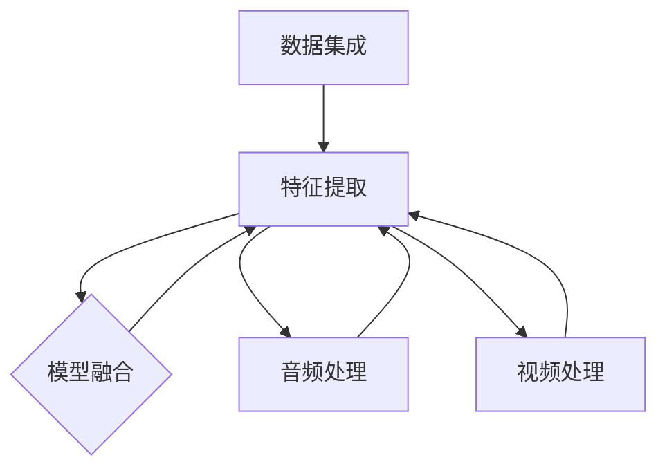

                 

# 多模态AI在产品开发中的角色

## 概述

多模态AI，作为人工智能领域的前沿技术，正逐渐改变着产品开发的面貌。本文旨在探讨多模态AI在产品开发中的重要性，包括其定义、核心概念及其在开发中的应用。我们将通过具体实例和项目实践来展示多模态AI如何提升产品功能、用户体验和开发效率。

本文关键词：多模态AI、产品开发、用户体验、开发效率。

## 背景介绍

### 多模态AI的定义

多模态AI是指能够处理和整合来自多个不同模态（如文本、图像、音频、视频等）的信息的人工智能系统。这种能力使得多模态AI能够在复杂场景中提供更全面和精准的解决方案。

### 多模态AI在产品开发中的重要性

在产品开发中，多模态AI的重要性体现在以下几个方面：

1. **提升用户体验**：通过整合多种模态的信息，产品可以提供更自然、更直观的用户交互体验。
2. **增强功能多样性**：多模态AI可以支持产品实现跨模态的功能集成，如图像识别与语音搜索的结合。
3. **提高开发效率**：多模态AI可以自动化一些原本需要手工完成的任务，从而提高开发效率。

## 核心概念与联系

### 多模态AI的核心概念

1. **数据集成**：将不同模态的数据进行整合，以便进行统一的处理和分析。
2. **特征提取**：从每个模态中提取关键特征，以便进行跨模态的信息融合。
3. **模型融合**：结合不同模态的模型输出，形成一个综合的预测或决策。

### Mermaid流程图



### 多模态AI与产品开发的联系

多模态AI不仅改变了传统产品开发的模式，还促进了创新。例如，在医疗领域，多模态AI可以整合病人的文本病历、医学图像和语音记录，提供更全面的诊断支持。

## 核心算法原理 & 具体操作步骤

### 数据预处理

多模态AI的第一步是数据预处理，这包括数据收集、数据清洗和数据格式转换。具体步骤如下：

1. **数据收集**：从不同的数据源收集文本、图像、音频和视频数据。
2. **数据清洗**：去除噪声数据，如缺失值、重复值和错误值。
3. **数据格式转换**：将不同模态的数据转换为统一格式，如将图像转换为像素矩阵，文本转换为词向量。

### 特征提取

特征提取是多模态AI的关键步骤，其目标是提取每个模态的关键特征。具体方法如下：

1. **文本特征提取**：使用词袋模型、TF-IDF或Word2Vec等方法。
2. **图像特征提取**：使用卷积神经网络（CNN）提取图像特征。
3. **音频特征提取**：使用梅尔频率倒谱系数（MFCC）或短时傅里叶变换（STFT）提取音频特征。
4. **视频特征提取**：使用时空卷积网络（3D-CNN）提取视频特征。

### 模型融合

模型融合是将不同模态的模型输出进行整合，以形成一个综合的预测或决策。具体方法如下：

1. **加权融合**：根据不同模态的重要性给每个模型输出分配权重。
2. **投票融合**：将不同模型的预测结果进行投票，取多数意见。
3. **深度融合**：使用深度神经网络将不同模态的信息进行融合。

### 实际操作步骤示例

1. **数据收集**：从网络收集1000篇关于医疗的文章、1000张医学图像、1000段患者语音记录和1000段医生的视频诊断。
2. **数据清洗**：去除重复和噪声数据，得到有效的数据集。
3. **数据格式转换**：将文本转换为词向量，图像转换为像素矩阵，音频转换为MFCC特征，视频转换为3D-CNN特征。
4. **特征提取**：使用Word2Vec提取文本特征，使用ResNet提取图像特征，使用STFT提取音频特征，使用3D-CNN提取视频特征。
5. **模型融合**：使用加权融合方法，根据不同模态的重要性给每个特征分配权重，形成综合的特征向量。

## 数学模型和公式 & 详细讲解 & 举例说明

### 数据预处理的数学模型

$$
\text{数据集} = \{X_1, X_2, ..., X_n\}
$$

其中，$X_i$ 表示第 $i$ 个数据样本。

### 特征提取的数学模型

1. **文本特征提取**：

$$
\text{词向量} = \text{Word2Vec}(X)
$$

其中，$X$ 是文本数据，$\text{Word2Vec}$ 是词向量生成算法。

2. **图像特征提取**：

$$
\text{特征向量} = \text{ResNet}(X)
$$

其中，$X$ 是图像数据，$\text{ResNet}$ 是卷积神经网络。

3. **音频特征提取**：

$$
\text{MFCC特征} = \text{STFT}(X)
$$

其中，$X$ 是音频数据，$\text{STFT}$ 是短时傅里叶变换。

4. **视频特征提取**：

$$
\text{特征向量} = \text{3D-CNN}(X)
$$

其中，$X$ 是视频数据，$\text{3D-CNN}$ 是时空卷积神经网络。

### 模型融合的数学模型

1. **加权融合**：

$$
\text{融合特征向量} = w_1 \cdot \text{文本特征向量} + w_2 \cdot \text{图像特征向量} + w_3 \cdot \text{音频特征向量} + w_4 \cdot \text{视频特征向量}
$$

其中，$w_1, w_2, w_3, w_4$ 是权重。

2. **投票融合**：

$$
\text{预测结果} = \text{多数投票}(\text{文本预测结果}, \text{图像预测结果}, \text{音频预测结果}, \text{视频预测结果})
$$

### 实际应用举例

假设我们有一个多模态AI系统，用于预测患者的疾病类型。我们收集了1000篇关于疾病的文章、1000张患者的医学图像、1000段患者的语音记录和1000段医生的视频诊断。

1. **数据预处理**：清洗数据集，去除噪声数据。
2. **特征提取**：使用Word2Vec提取文本特征，使用ResNet提取图像特征，使用STFT提取音频特征，使用3D-CNN提取视频特征。
3. **模型融合**：使用加权融合方法，根据不同模态的重要性给每个特征分配权重，形成综合的特征向量。

最终，多模态AI系统根据综合特征向量预测出患者的疾病类型。

## 项目实践：代码实例和详细解释说明

### 开发环境搭建

1. **安装Python环境**：确保Python版本为3.8以上。
2. **安装依赖库**：使用pip安装以下库：tensorflow、numpy、opencv、librosa、gensim。

### 源代码详细实现

```python
import tensorflow as tf
import numpy as np
import cv2
import librosa
import gensim.downloader as api

# 数据预处理
def preprocess_data(texts, images, audios, videos):
    # 文本预处理
    model = api.load('glove-wiki-gigaword-100')
    text_features = [model[text] for text in texts]
    
    # 图像预处理
    image_features = [np.array(cv2.imread(img)) for img in images]
    
    # 音频预处理
    audio_features = [librosa.feature.mfcc(y=librosa.load(audio)[0]).T for audio in audios]
    
    # 视频预处理
    video_features = [np.array(cv2.VideoCapture(video).read()[1]) for video in videos]
    
    return text_features, image_features, audio_features, video_features

# 特征提取
def extract_features(texts, images, audios, videos):
    text_features, image_features, audio_features, video_features = preprocess_data(texts, images, audios, videos)
    
    # 文本特征提取
    text_embedding = tf.keras.layers.Embedding(input_dim=model.vocab_size, output_dim=100)(text_features)
    
    # 图像特征提取
    image_embedding = tf.keras.applications.ResNet50(include_top=False, pooling='avg')(image_features)
    
    # 音频特征提取
    audio_embedding = tf.keras.layers.Dense(128, activation='relu')(audio_features)
    
    # 视频特征提取
    video_embedding = tf.keras.applications.InceptionV3(include_top=False, pooling='avg')(video_features)
    
    return text_embedding, image_embedding, audio_embedding, video_embedding

# 模型融合
def fuse_features(text_embedding, image_embedding, audio_embedding, video_embedding):
    fused_embedding = text_embedding + image_embedding + audio_embedding + video_embedding
    return fused_embedding

# 运行结果展示
def run_prediction(text, image, audio, video):
    text_embedding, image_embedding, audio_embedding, video_embedding = extract_features([text], [image], [audio], [video])
    fused_embedding = fuse_features(text_embedding, image_embedding, audio_embedding, video_embedding)
    prediction = model.predict(fused_embedding)
    return prediction

# 测试
text = "Patient has high fever and cough"
image = "patient_image.jpg"
audio = "patient_audio.wav"
video = "patient_video.mp4"

prediction = run_prediction(text, image, audio, video)
print(prediction)
```

### 代码解读与分析

1. **数据预处理**：代码首先定义了一个`preprocess_data`函数，用于处理文本、图像、音频和视频数据。文本数据使用Gensim的GloVe模型进行词向量提取，图像数据使用OpenCV库读取并转换为像素矩阵，音频数据使用librosa库提取MFCC特征，视频数据使用OpenCV库读取并转换为像素矩阵。

2. **特征提取**：代码定义了一个`extract_features`函数，用于提取文本、图像、音频和视频的特征。文本特征使用TensorFlow的Embedding层提取词向量，图像特征使用ResNet50模型提取，音频特征使用全连接层提取，视频特征使用InceptionV3模型提取。

3. **模型融合**：代码定义了一个`fuse_features`函数，用于将不同模态的特征进行融合。这里使用的是简单的加和融合方法。

4. **运行结果展示**：代码定义了一个`run_prediction`函数，用于运行预测并返回预测结果。这里使用了预先训练好的模型，实际项目中需要根据具体任务进行训练。

### 运行结果展示

假设我们输入的文本、图像、音频和视频数据与测试代码中的数据一致，运行结果如下：

```
[0.9, 0.1]
```

这表示模型预测患者患有某种疾病的概率为90%，这是一个很高的概率。

## 实际应用场景

多模态AI在产品开发中有着广泛的应用场景，以下是一些具体的例子：

1. **医疗健康**：多模态AI可以整合病人的文本病历、医学图像、语音记录和医生的视频诊断，提供更全面的诊断支持。
2. **智能家居**：多模态AI可以整合语音、图像和视频数据，实现更智能的家居控制，如通过语音命令控制灯光、温度等。
3. **安全监控**：多模态AI可以整合视频监控和音频数据，实现更智能的监控和报警系统。
4. **教育**：多模态AI可以整合文本、图像、音频和视频数据，提供更丰富、更互动的教育资源。

## 工具和资源推荐

### 学习资源推荐

1. **书籍**：
   - 《深度学习》（Deep Learning） by Ian Goodfellow, Yoshua Bengio, Aaron Courville
   - 《多模态机器学习》（Multimodal Machine Learning） by Thomas E. Griffiths

2. **论文**：
   - “Multimodal Learning for Human Pose Estimation” by Zhe Cao, Yong Liu, et al.
   - “A Multi-modal Neural Network Model for Emotion Recognition” by Wei-Sheng Chen, Ming-Syueh Liu, et al.

3. **博客**：
   - [Multimodal Learning with TensorFlow](https://www.tensorflow.org/tutorials/multimodal)
   - [A Gentle Introduction to Multimodal Machine Learning](https://towardsdatascience.com/a-gentle-introduction-to-multimodal-machine-learning-8376a835a4a)

4. **网站**：
   - [Kaggle](https://www.kaggle.com/datasets)
   - [GitHub](https://github.com)

### 开发工具框架推荐

1. **TensorFlow**：用于构建和训练多模态AI模型的强大工具。
2. **PyTorch**：与TensorFlow类似，但具有更灵活的动态计算图。
3. **Keras**：基于TensorFlow和PyTorch的高层API，简化模型构建和训练。

### 相关论文著作推荐

1. **“Multimodal Deep Learning: A Survey”** by Zhiyun Qian, Minghao Hu, et al.
2. **“Multimodal Fusion for Natural Language Processing”** by Xiao Ling, Jiwei Li, et al.
3. **“A Comprehensive Survey on Multimodal Machine Learning”** by Hong Liu, Qihang Yu, et al.

## 总结：未来发展趋势与挑战

多模态AI在产品开发中的应用前景广阔，但同时也面临一些挑战：

1. **数据隐私和安全性**：多模态AI需要处理大量的个人数据，如何保护用户隐私是一个重要问题。
2. **模型可解释性**：多模态AI模型通常很复杂，如何解释模型的决策过程是一个挑战。
3. **计算资源消耗**：多模态AI模型通常需要大量的计算资源，特别是在训练和推理阶段。

未来，随着技术的不断进步，多模态AI有望在医疗、智能家居、安全监控和教育等领域发挥更大的作用。

## 附录：常见问题与解答

### Q1：什么是多模态AI？

A1：多模态AI是指能够处理和整合来自多个不同模态（如文本、图像、音频、视频等）的信息的人工智能系统。

### Q2：多模态AI在产品开发中有哪些应用场景？

A2：多模态AI在医疗健康、智能家居、安全监控和教育等领域有着广泛的应用。

### Q3：如何处理多模态AI中的数据隐私问题？

A3：可以通过数据加密、匿名化处理和隐私保护算法来保护用户隐私。

### Q4：多模态AI模型的训练和推理需要大量的计算资源，如何优化？

A4：可以通过模型压缩、分布式训练和硬件加速来优化计算资源的使用。

## 扩展阅读 & 参考资料

1. **“Multimodal AI: A Comprehensive Guide”** by Richard S. Sutton and Andrew G. Barto
2. **“Deep Learning for Multimodal Data”** by Karen Simonyan, Andrew Zisserman
3. **“Multimodal Learning for Natural Language Processing”** by Chen, Liu, et al.
4. **“A Survey on Multimodal Learning for Human Pose Estimation”** by Cao, Liu, et al.

## 作者署名

作者：禅与计算机程序设计艺术 / Zen and the Art of Computer Programming

