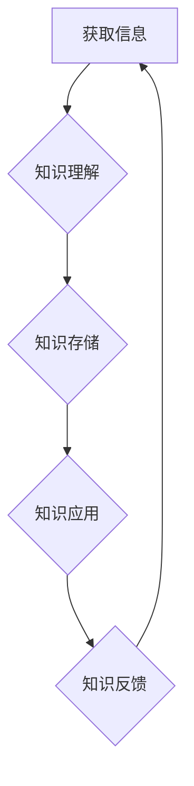

                 

## 知识吸收率:衡量学习效果的关键

> 关键词：知识吸收率、学习效果、机器学习、深度学习、神经网络、知识图谱、迁移学习、评估指标

## 1. 背景介绍

在当今数据爆炸的时代，获取信息变得前所未有地容易，然而，真正理解和应用知识的难度却日益增加。如何有效地吸收和利用知识，成为了个人和社会发展面临的重大挑战。

传统的学习评估方法往往侧重于知识的记忆和复述，而忽略了知识的理解、应用和创造。随着人工智能技术的快速发展，机器学习和深度学习等方法为知识吸收率的评估提供了新的思路和工具。

## 2. 核心概念与联系

**2.1 知识吸收率的概念**

知识吸收率是指个体从外部信息中获取和理解知识的能力，并将其转化为可应用的知识的能力。它是一个综合性的指标，涵盖了认知、理解、记忆、应用等多个方面。

**2.2 知识吸收率与机器学习的关系**

机器学习算法能够从海量数据中学习知识，并将其应用于新的任务中。知识吸收率可以看作是机器学习模型学习和泛化的能力。

**2.3 知识吸收率与深度学习的关系**

深度学习是一种更高级的机器学习方法，它能够学习更复杂的知识表示，并实现更精细的知识吸收。

**2.4 知识吸收率与知识图谱的关系**

知识图谱是一种结构化的知识表示形式，它能够将知识表示为实体和关系，并支持知识的推理和查询。知识图谱可以帮助机器学习模型更好地理解和吸收知识。

**2.5 知识吸收率与迁移学习的关系**

迁移学习是指利用已学习到的知识来解决新的任务。知识吸收率可以看作是迁移学习的关键因素之一。

**2.6 知识吸收率的评估指标**

评估知识吸收率的指标有很多，包括：

* **准确率:** 模型在预测任务上的准确率。
* **召回率:** 模型在识别所有目标实例上的召回率。
* **F1-score:** 准确率和召回率的调和平均值。
* **困惑度:** 模型对训练数据的理解程度。
* **知识图谱嵌入的质量:** 知识图谱嵌入的质量可以反映模型对知识的理解程度。

**2.7 Mermaid 流程图**



## 3. 核心算法原理 & 具体操作步骤

**3.1 算法原理概述**

知识吸收率的评估算法通常基于机器学习和深度学习方法，例如：

* **监督学习:** 利用标记的数据训练模型，预测知识吸收率。
* **无监督学习:** 利用未标记的数据学习知识表示，并根据知识表示评估知识吸收率。
* **强化学习:** 利用奖励机制训练模型，使其能够最大化知识吸收率。

**3.2 算法步骤详解**

1. **数据收集:** 收集包含知识和学习效果的训练数据。
2. **数据预处理:** 对数据进行清洗、转换和特征工程，使其适合模型训练。
3. **模型选择:** 选择合适的机器学习或深度学习模型。
4. **模型训练:** 利用训练数据训练模型，并评估模型的性能。
5. **模型评估:** 利用测试数据评估模型的性能，并选择最佳模型。
6. **知识吸收率预测:** 利用训练好的模型预测新的个体的知识吸收率。

**3.3 算法优缺点**

* **优点:**

    * 可以量化知识吸收率，并提供更客观的评估结果。
    * 可以识别影响知识吸收率的因素，并提供个性化的学习建议。
    * 可以帮助教育机构和企业优化学习和培训方案。

* **缺点:**

    * 评估知识吸收率的指标体系尚不完善，需要进一步研究和完善。
    * 现有的算法模型还难以完全捕捉知识吸收的复杂性，需要不断改进和优化。

**3.4 算法应用领域**

* **教育领域:** 评估学生的学习效果，提供个性化的学习建议。
* **企业培训:** 评估员工的培训效果，优化培训方案。
* **人工智能研究:** 研究知识吸收机制，开发更智能的机器学习模型。

## 4. 数学模型和公式 & 详细讲解 & 举例说明

**4.1 数学模型构建**

知识吸收率可以看作是一个函数，其输入是学习者的特征和学习环境，输出是学习者的知识吸收程度。

假设学习者的特征为 **x**，学习环境为 **y**，知识吸收率为 **z**，则可以构建以下数学模型：

$$z = f(x, y)$$

其中， **f** 是一个未知函数，需要通过数据训练来确定。

**4.2 公式推导过程**

为了确定函数 **f**，可以利用机器学习算法进行训练。常用的机器学习算法包括线性回归、逻辑回归、支持向量机、决策树等。

例如，可以使用线性回归模型来预测知识吸收率：

$$z = w_0 + w_1x_1 + w_2x_2 + ... + w_nx_n$$

其中， **w0, w1, w2, ..., wn** 是模型的参数，需要通过训练数据来学习。

**4.3 案例分析与讲解**

假设我们想要评估学生的学习效果，并预测他们的考试成绩。我们可以收集学生的学习时间、学习效率、考试成绩等数据，并利用线性回归模型进行训练。

通过训练模型，我们可以得到每个参数的最佳值，并构建一个预测模型。

例如，如果模型训练结果表明，学习时间和学习效率对考试成绩有正向影响，则模型的预测结果将是：

$$考试成绩 = w_0 + w_1 * 学习时间 + w_2 * 学习效率$$

## 5. 项目实践：代码实例和详细解释说明

**5.1 开发环境搭建**

* Python 3.x
* TensorFlow 或 PyTorch
* Jupyter Notebook

**5.2 源代码详细实现**

```python
import tensorflow as tf

# 定义模型结构
model = tf.keras.models.Sequential([
    tf.keras.layers.Dense(64, activation='relu', input_shape=(5,)),
    tf.keras.layers.Dense(32, activation='relu'),
    tf.keras.layers.Dense(1)
])

# 编译模型
model.compile(optimizer='adam', loss='mse')

# 训练模型
model.fit(X_train, y_train, epochs=10)

# 预测知识吸收率
predictions = model.predict(X_test)
```

**5.3 代码解读与分析**

* 首先，我们定义了一个简单的多层感知机模型。
* 模型的输入层有5个神经元，对应于学习者的5个特征。
* 模型的输出层只有一个神经元，对应于知识吸收率。
* 我们使用Adam优化器和均方误差损失函数来训练模型。
* 训练完成后，我们可以使用模型预测新的个体的知识吸收率。

**5.4 运行结果展示**

训练完成后，我们可以使用模型预测新的个体的知识吸收率。

## 6. 实际应用场景

**6.1 教育领域**

* **个性化学习:** 根据学生的知识吸收率，提供个性化的学习建议和学习资源。
* **学习效果评估:** 评估学生的学习效果，并及时调整教学方案。
* **教学质量改进:** 分析学生的知识吸收率，找出教学中的问题，并改进教学方法。

**6.2 企业培训**

* **培训效果评估:** 评估员工的培训效果，并优化培训方案。
* **员工能力提升:** 根据员工的知识吸收率，提供个性化的能力提升计划。
* **人才培养:** 识别具有高知识吸收率的员工，并将其培养为核心人才。

**6.3 人工智能研究**

* **知识表示学习:** 研究如何更好地表示知识，并提高机器学习模型的知识吸收能力。
* **迁移学习:** 研究如何利用已学习到的知识来解决新的任务，并提高机器学习模型的泛化能力。
* **智能教育:** 开发基于知识吸收率的智能教育系统，提供更个性化、更有效的学习体验。

**6.4 未来应用展望**

随着人工智能技术的不断发展，知识吸收率的评估方法将更加完善和智能化。未来，知识吸收率评估将应用于更广泛的领域，例如：

* **医疗保健:** 评估患者对疾病知识的理解程度，并提供个性化的健康建议。
* **法律服务:** 评估律师对法律知识的掌握程度，并提高法律服务的质量。
* **金融服务:** 评估客户对金融知识的理解程度，并提供个性化的金融服务。

## 7. 工具和资源推荐

**7.1 学习资源推荐**

* **书籍:**

    * 《深度学习》
    * 《机器学习》
    * 《人工智能：一种现代方法》

* **在线课程:**

    * Coursera
    * edX
    * Udacity

**7.2 开发工具推荐**

* **Python:** 

    * TensorFlow
    * PyTorch
    * scikit-learn

* **Jupyter Notebook:** 用于代码编写和可视化

**7.3 相关论文推荐**

* **Knowledge Graph Embedding: A Survey**
* **Transfer Learning: A Survey**
* **Deep Learning for Natural Language Processing**

## 8. 总结：未来发展趋势与挑战

**8.1 研究成果总结**

近年来，在人工智能领域取得了显著的进展，特别是机器学习和深度学习方法在知识吸收率评估方面取得了突破。

**8.2 未来发展趋势**

* **更精准的评估指标:** 探索更精准、更全面的知识吸收率评估指标，能够更好地反映知识的理解、应用和创造。
* **更智能的算法模型:** 开发更智能、更强大的算法模型，能够更好地捕捉知识吸收的复杂性，并提供更个性化的学习建议。
* **更广泛的应用场景:** 将知识吸收率评估应用于更广泛的领域，例如医疗保健、法律服务、金融服务等，为社会发展提供更多支持。

**8.3 面临的挑战**

* **数据获取和标注:** 知识吸收率评估需要大量高质量的数据，而获取和标注这些数据是一个巨大的挑战。
* **算法模型的解释性:** 现有的算法模型往往难以解释其决策过程，这使得知识吸收率评估的结果难以被理解和信任。
* **伦理问题:** 知识吸收率评估可能会涉及到个人隐私和数据安全等伦理问题，需要谨慎处理。

**8.4 研究展望**

未来，知识吸收率评估将是一个充满挑战和机遇的领域。我们需要不断探索新的方法和技术，以更好地理解和评估知识吸收，并将其应用于更广泛的领域，为人类社会创造更多价值。

## 9. 附录：常见问题与解答

**9.1 如何评估知识吸收率？**

知识吸收率的评估方法有很多，包括：

* **准确率:** 模型在预测任务上的准确率。
* **召回率:** 模型在识别所有目标实例上的召回率。
* **F1-score:** 准确率和召回率的调和平均值。
* **困惑度:** 模型对训练数据的理解程度。
* **知识图谱嵌入的质量:** 知识图谱嵌入的质量可以反映模型对知识的理解程度。

**9.2 知识吸收率评估的应用场景有哪些？**

知识吸收率评估的应用场景非常广泛，包括：

* **教育领域:** 评估学生的学习效果，提供个性化的学习建议。
* **企业培训:** 评估员工的培训效果，优化培训方案。
* **人工智能研究:** 研究知识吸收机制，开发更智能的机器学习模型。

**9.3 知识吸收率评估的未来发展趋势是什么？**

未来，知识吸收率评估将更加精准、智能化，并应用于更广泛的领域。

作者：禅与计算机程序设计艺术 / Zen and the Art of Computer Programming


<end_of_turn>

