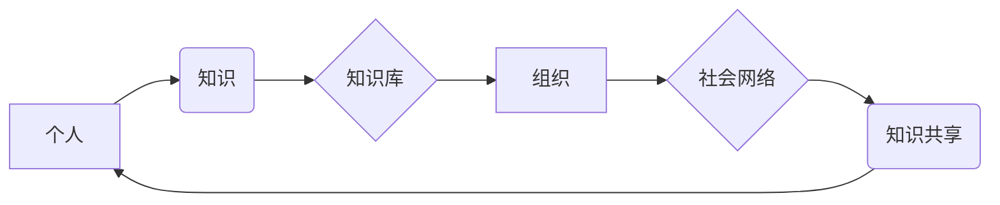

                 

## 知识的生态系统：个人、组织与社会的互动

> 关键词：知识图谱、知识共享、协同学习、人工智能、社会网络、知识管理、开放创新

## 1. 背景介绍

在当今信息爆炸的时代，知识已成为最宝贵的资源。个人、组织和社会都在积极探索如何有效地获取、存储、共享和利用知识，以推动自身发展和进步。知识的生态系统应运而生，它是一个复杂而动态的系统，涉及个人、组织和社会的多重互动。

传统的知识管理模式往往局限于组织内部，而知识的生态系统则强调知识的开放性和共享性。它将个人、组织和社会视为相互关联的节点，通过各种技术手段和社会机制，促进知识的流动和传播。

## 2. 核心概念与联系

### 2.1 知识图谱

知识图谱是一种基于知识表示的结构化数据模型，它将知识表示为实体、关系和属性的网络结构。知识图谱能够有效地捕捉知识之间的关联性，并支持知识的推理、查询和分析。

### 2.2 知识共享

知识共享是指个人、组织或社会群体之间共享知识的行为。它可以采用多种形式，例如开源软件、开放数据、在线课程、学术论文等。知识共享能够打破知识的壁垒，促进知识的传播和创新。

### 2.3 协同学习

协同学习是指多个个体共同参与学习的过程。它可以利用网络技术和社交媒体平台，促进个体之间的知识交流和互动。协同学习能够提高学习效率，并促进知识的深度理解。

### 2.4 人工智能

人工智能技术能够帮助我们自动提取、组织和分析知识。例如，自然语言处理技术能够帮助我们从文本中提取知识，机器学习技术能够帮助我们发现知识之间的模式和关系。

### 2.5 社会网络

社会网络是指个人之间相互连接的网络关系。社会网络能够促进知识的传播和扩散，并为知识共享提供平台。

**知识生态系统架构图**



## 3. 核心算法原理 & 具体操作步骤

### 3.1 算法原理概述

知识生态系统的核心算法通常涉及知识表示、知识推理、知识推荐和知识发现等方面。这些算法通常基于图论、机器学习和自然语言处理等技术。

### 3.2 算法步骤详解

**知识表示:**

1. 识别知识中的实体、关系和属性。
2. 将知识表示为知识图谱的形式。

**知识推理:**

1. 利用知识图谱中的关系进行推理，发现新的知识。
2. 使用规则引擎或逻辑推理引擎进行推理。

**知识推荐:**

1. 根据用户的兴趣和历史行为，推荐相关的知识。
2. 使用协同过滤、内容过滤或混合推荐算法。

**知识发现:**

1. 从海量数据中发现隐藏的知识模式和关系。
2. 使用机器学习算法进行数据挖掘和模式识别。

### 3.3 算法优缺点

**优点:**

* 能够有效地捕捉知识之间的关联性。
* 支持知识的推理、查询和分析。
* 能够促进知识的共享和传播。

**缺点:**

* 知识表示和推理过程复杂。
* 需要大量的训练数据和计算资源。
* 知识的准确性和完整性依赖于数据质量。

### 3.4 算法应用领域

* **教育:** 个性化学习、知识发现、协同学习平台。
* **医疗:** 疾病诊断、药物研发、患者管理。
* **金融:** 风险评估、欺诈检测、投资决策。
* **制造业:** 产品设计、生产优化、故障诊断。

## 4. 数学模型和公式 & 详细讲解 & 举例说明

### 4.1 数学模型构建

知识生态系统可以抽象为一个网络模型，其中节点代表个人、组织或知识资源，边代表知识共享或交互关系。

**节点:**

* 个人：用 $P_i$ 表示，其中 $i$ 为个人标识。
* 组织：用 $O_j$ 表示，其中 $j$ 为组织标识。
* 知识资源：用 $K_k$ 表示，其中 $k$ 为知识资源标识。

**边:**

* 知识共享关系：用 $(P_i, K_k)$ 表示个人 $P_i$ 拥有知识资源 $K_k$。
* 合作关系：用 $(O_j, O_l)$ 表示组织 $O_j$ 与组织 $O_l$ 存在合作关系。

### 4.2 公式推导过程

**知识传播度:**

$$
D(K_k) = \sum_{i} \text{share}(P_i, K_k)
$$

其中，$D(K_k)$ 表示知识资源 $K_k$ 的传播度，$\text{share}(P_i, K_k)$ 表示个人 $P_i$ 分享知识资源 $K_k$ 的次数。

**知识影响力:**

$$
I(O_j) = \sum_{k} \text{influence}(O_j, K_k)
$$

其中，$I(O_j)$ 表示组织 $O_j$ 的知识影响力，$\text{influence}(O_j, K_k)$ 表示组织 $O_j$ 对知识资源 $K_k$ 的影响力。

### 4.3 案例分析与讲解

假设有一个知识生态系统，其中包含多个个人、组织和知识资源。我们可以使用上述公式来计算知识资源的传播度和组织的知识影响力。例如，我们可以计算某个特定主题的知识资源传播度，或者分析某个组织在特定领域的影响力。

## 5. 项目实践：代码实例和详细解释说明

### 5.1 开发环境搭建

* 操作系统：Linux/macOS/Windows
* 编程语言：Python
* 库依赖：NetworkX, Neo4j, scikit-learn

### 5.2 源代码详细实现

```python
# 使用 NetworkX 库构建知识图谱
import networkx as nx

# 创建知识图谱
graph = nx.Graph()

# 添加节点
graph.add_node("个人A", type="个人")
graph.add_node("组织B", type="组织")
graph.add_node("知识资源C", type="知识资源")

# 添加边
graph.add_edge("个人A", "知识资源C", relation="拥有")
graph.add_edge("组织B", "知识资源C", relation="引用")

# 使用 Neo4j 库存储知识图谱
# ...

# 使用 scikit-learn 库进行知识推荐
# ...
```

### 5.3 代码解读与分析

* 使用 NetworkX 库构建知识图谱，并添加节点和边。
* 使用 Neo4j 库存储知识图谱，以便于查询和分析。
* 使用 scikit-learn 库进行知识推荐，例如基于内容过滤或协同过滤的推荐算法。

### 5.4 运行结果展示

* 知识图谱可视化：使用 NetworkX 库可视化知识图谱，展示知识之间的关系。
* 推荐结果展示：展示基于用户兴趣和历史行为的知识推荐结果。

## 6. 实际应用场景

### 6.1 教育领域

* 个性化学习平台：根据学生的学习进度和兴趣，推荐个性化的学习资源。
* 协同学习平台：促进学生之间的知识交流和互动，提高学习效率。
* 知识发现平台：帮助学生发现隐藏的知识模式和关系，加深对知识的理解。

### 6.2 医疗领域

* 疾病诊断辅助系统：根据患者的症状和病史，推荐可能的疾病诊断。
* 药物研发平台：利用知识图谱分析药物之间的关系，加速药物研发过程。
* 患者管理系统：帮助医生管理患者的病历和治疗方案，提高医疗服务质量。

### 6.3 金融领域

* 风险评估系统：分析金融数据的关联性，识别潜在的风险。
* 欺诈检测系统：利用知识图谱分析交易行为，识别欺诈交易。
* 投资决策支持系统：根据市场数据和投资者的风险偏好，推荐投资方案。

### 6.4 未来应用展望

* 更加智能化的知识推荐系统：利用人工智能技术，提供更加精准和个性化的知识推荐。
* 更加开放和共享的知识生态系统：促进知识的跨组织和跨领域的共享。
* 更加融合的知识管理模式：将知识管理与其他业务流程融合，提高企业效率。

## 7. 工具和资源推荐

### 7.1 学习资源推荐

* **书籍:**
    * 《知识图谱》
    * 《人工智能》
    * 《数据挖掘》
* **在线课程:**
    * Coursera: 知识图谱与人工智能
    * edX: 数据科学与机器学习
* **博客和论坛:**
    * 知乎: 知识图谱
    * Stack Overflow: 数据科学

### 7.2 开发工具推荐

* **知识图谱构建工具:**
    * Protégé
    * GraphDB
* **数据分析工具:**
    * Jupyter Notebook
    * Apache Spark
* **机器学习库:**
    * scikit-learn
    * TensorFlow

### 7.3 相关论文推荐

* **知识图谱:**
    * "A Survey on Knowledge Graph Embedding"
    * "Knowledge Graph Construction and Reasoning"
* **人工智能:**
    * "Deep Learning"
    * "Reinforcement Learning"
* **数据挖掘:**
    * "Data Mining: Concepts and Techniques"
    * "Introduction to Data Mining"

## 8. 总结：未来发展趋势与挑战

### 8.1 研究成果总结

知识生态系统的研究取得了显著进展，例如知识图谱的构建、知识推理、知识推荐等技术取得了突破。这些技术为知识的共享、传播和利用提供了新的途径。

### 8.2 未来发展趋势

* **更加智能化的知识生态系统:** 利用人工智能技术，构建更加智能化的知识生态系统，能够自动提取、组织和分析知识，并提供更加精准和个性化的知识服务。
* **更加开放和共享的知识生态系统:** 促进知识的跨组织和跨领域的共享，构建更加开放和共享的知识生态系统。
* **更加融合的知识管理模式:** 将知识管理与其他业务流程融合，提高企业效率。

### 8.3 面临的挑战

* **知识表示和推理的复杂性:** 知识的表示和推理过程仍然非常复杂，需要进一步的研究和探索。
* **数据质量和可信度:** 知识生态系统的构建依赖于高质量的数据，而数据质量和可信度仍然是一个挑战。
* **知识共享和隐私保护:** 知识共享需要考虑隐私保护问题，如何平衡知识共享和个人隐私的保护是一个重要的挑战。

### 8.4 研究展望

未来，知识生态系统的研究将继续深入，探索更加智能、开放和融合的知识管理模式，为推动社会发展和进步做出更大的贡献。

## 9. 附录：常见问题与解答

* **什么是知识生态系统？**

知识生态系统是一个复杂而动态的系统，涉及个人、组织和社会的多重互动，通过各种技术手段和社会机制，促进知识的流动和传播。

* **知识生态系统有哪些应用场景？**

知识生态系统在教育、医疗、金融等多个领域都有广泛的应用场景。

* **如何构建一个知识生态系统？**

构建一个知识生态系统需要考虑知识表示、知识推理、知识推荐、数据管理等多个方面。

* **知识生态系统面临哪些挑战？**

知识生态系统面临着知识表示和推理的复杂性、数据质量和可信度、知识共享和隐私保护等挑战。


作者：禅与计算机程序设计艺术 / Zen and the Art of Computer Programming 
<end_of_turn>

