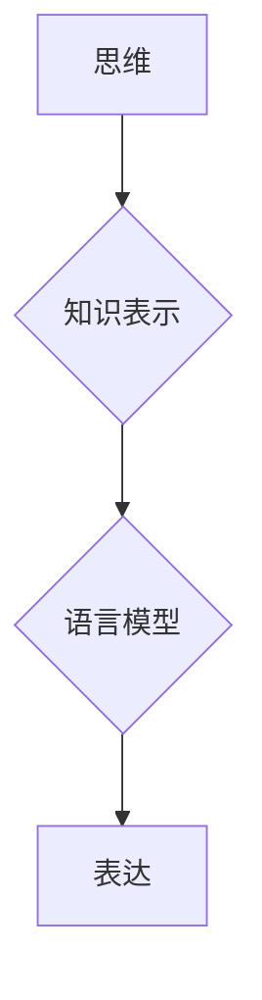

                 

## 知识的语言学基础：思维与表达的关系

> 关键词：知识表示，语言模型，自然语言处理，符号逻辑，语义学，人工智能

### 1. 背景介绍

在当今数据爆炸的时代，如何有效地获取、理解和利用知识成为了人工智能领域的核心挑战之一。知识，作为人类认知和理解世界的基础，其本质是关于事物之间关系的描述和抽象。而语言，作为人类交流和表达思想的工具，承载着丰富的知识信息。因此，探索知识的语言学基础，即思维与表达之间的关系，对于构建更智能、更具理解力的 AI 系统至关重要。

传统的 AI 系统主要依赖于符号逻辑和规则驱动的知识表示方法，但这些方法在处理复杂、模糊、语义丰富的知识时显得捉襟见肘。近年来，随着深度学习技术的兴起，基于神经网络的语言模型取得了突破性的进展，展现出强大的文本理解和生成能力。这些模型能够学习到语言的复杂结构和语义关系，从而更有效地表示和处理知识。

### 2. 核心概念与联系

#### 2.1 知识表示

知识表示是指将知识以计算机可理解的形式进行编码和组织。常见的知识表示方法包括：

* **符号逻辑:** 使用符号和逻辑规则来表示知识，例如命题逻辑、描述逻辑等。
* **本体论:** 定义一个特定领域中的概念、关系和规则，并将其组织成一个层次结构。
* **图数据库:** 使用图结构来表示知识，其中节点代表实体，边代表关系。
* **向量空间模型:** 将知识表示为向量，其中每个维度代表一个特征或属性。

#### 2.2 语言模型

语言模型是能够预测文本序列中下一个词出现的概率的统计模型。常见的语言模型包括：

* **n-gram模型:** 基于词序列的历史上下文预测下一个词。
* **隐马尔可夫模型 (HMM):** 使用状态转移概率和观测概率来建模语言的生成过程。
* **循环神经网络 (RNN):** 使用循环结构来捕捉文本序列中的长距离依赖关系。
* **Transformer:** 使用注意力机制来学习文本序列中的全局上下文信息。

#### 2.3 思维与表达

思维是人类认知和理解世界的过程，而表达是将思维转化为语言或其他形式的符号的过程。两者之间存在着密切的联系，语言模型可以被看作是模拟人类思维的一种工具。

**Mermaid 流程图**



### 3. 核心算法原理 & 具体操作步骤

#### 3.1 算法原理概述

本文将重点介绍基于 Transformer 架构的语言模型在知识表示和表达方面的应用。Transformer 模型通过注意力机制能够有效地捕捉文本序列中的长距离依赖关系，从而学习到更丰富的语义信息。

#### 3.2 算法步骤详解

1. **词嵌入:** 将每个词转换为一个低维向量，表示词的语义信息。
2. **多头注意力:** 使用多个注意力头来捕捉不同类型的语义关系。
3. **前馈神经网络:** 对每个词的嵌入进行非线性变换，提取更深层的语义特征。
4. **位置编码:** 为每个词添加位置信息，以便模型理解词在序列中的顺序关系。
5. **解码器:** 使用循环结构和注意力机制生成目标文本序列。

#### 3.3 算法优缺点

**优点:**

* 能够捕捉长距离依赖关系。
* 训练效率高。
* 表现力强，在各种自然语言处理任务中取得了优异的成绩。

**缺点:**

* 参数量大，需要大量的计算资源进行训练。
* 对训练数据质量要求较高。

#### 3.4 算法应用领域

* **机器翻译:** 将一种语言翻译成另一种语言。
* **文本摘要:** 生成文本的简短摘要。
* **问答系统:** 回答用户提出的问题。
* **对话系统:** 与用户进行自然语言对话。
* **知识图谱构建:** 从文本数据中抽取知识，构建知识图谱。

### 4. 数学模型和公式 & 详细讲解 & 举例说明

#### 4.1 数学模型构建

Transformer 模型的核心是注意力机制，其数学模型可以表示为：

$$
Attention(Q, K, V) = softmax(\frac{QK^T}{\sqrt{d_k}})V
$$

其中：

* $Q$：查询矩阵
* $K$：键矩阵
* $V$：值矩阵
* $d_k$：键向量的维度

#### 4.2 公式推导过程

注意力机制的目的是计算查询向量 $Q$ 与键向量 $K$ 之间的相似度，并根据相似度对值向量 $V$ 进行加权求和。

* $QK^T$：计算查询向量与键向量的点积，得到一个得分矩阵。
* $\frac{QK^T}{\sqrt{d_k}}$：对得分矩阵进行归一化，使得每个元素的范围在0到1之间。
* $softmax(\cdot)$：对归一化后的得分矩阵进行softmax操作，得到每个键向量的权重。
* $V$：使用权重对值向量进行加权求和，得到最终的输出。

#### 4.3 案例分析与讲解

例如，假设我们有一个句子 "The cat sat on the mat"，我们想要计算 "cat" 这个词与整个句子的语义关系。

* 可以将每个词都转换为一个向量，作为 $Q$、$K$ 和 $V$ 的输入。
* 通过注意力机制计算 "cat" 与其他词之间的相似度，得到每个词对 "cat" 的权重。
* 将这些权重与对应的值向量进行加权求和，得到 "cat" 与整个句子的语义表示。

### 5. 项目实践：代码实例和详细解释说明

#### 5.1 开发环境搭建

* Python 3.6+
* TensorFlow 或 PyTorch
* CUDA 和 cuDNN (可选，用于 GPU 加速)

#### 5.2 源代码详细实现

```python
import tensorflow as tf

# 定义 Transformer 模型
class Transformer(tf.keras.Model):
    def __init__(self, vocab_size, embedding_dim, num_heads, num_layers):
        super(Transformer, self).__init__()
        self.embedding = tf.keras.layers.Embedding(vocab_size, embedding_dim)
        self.transformer_layers = tf.keras.layers.StackedRNNCells([
            tf.keras.layers.MultiHeadAttention(num_heads=num_heads, key_dim=embedding_dim)
            for _ in range(num_layers)
        ])
        self.decoder = tf.keras.layers.Dense(vocab_size)

    def call(self, inputs):
        # 词嵌入
        embedded = self.embedding(inputs)
        # Transformer 层
        output = self.transformer_layers(embedded)
        # 解码器
        output = self.decoder(output)
        return output

# 实例化模型
model = Transformer(vocab_size=10000, embedding_dim=512, num_heads=8, num_layers=6)

# 训练模型
# ...
```

#### 5.3 代码解读与分析

* 模型定义了词嵌入层、Transformer 层和解码器层。
* Transformer 层使用多头注意力机制来捕捉文本序列中的长距离依赖关系。
* 解码器层将 Transformer 层的输出转换为目标文本序列。

#### 5.4 运行结果展示

* 模型训练完成后，可以将其用于各种自然语言处理任务，例如机器翻译、文本摘要、问答系统等。
* 运行结果可以评估模型的性能，例如准确率、BLEU 分数等。

### 6. 实际应用场景

#### 6.1 机器翻译

Transformer 模型在机器翻译领域取得了突破性的进展，例如 Google 的 Transformer 模型在 WMT 比赛中获得了最佳成绩。

#### 6.2 文本摘要

Transformer 模型可以用于生成文本的简短摘要，例如 BERT 模型的摘要任务表现优异。

#### 6.3 问答系统

Transformer 模型可以用于构建问答系统，例如 XLNet 模型在问答任务中取得了领先的成绩。

#### 6.4 对话系统

Transformer 模型可以用于构建对话系统，例如 GPT-3 模型能够进行自然流畅的对话。

#### 6.5 知识图谱构建

Transformer 模型可以用于从文本数据中抽取知识，构建知识图谱，例如 BERT 模型可以用于关系抽取任务。

#### 6.6 未来应用展望

随着 Transformer 模型的不断发展，其在知识表示和表达方面的应用前景更加广阔。例如，可以利用 Transformer 模型构建更智能的知识库，实现更精准的知识检索和推理。

### 7. 工具和资源推荐

#### 7.1 学习资源推荐

* **书籍:**
    * 《深度学习》
    * 《自然语言处理》
    * 《Transformer 模型详解》
* **在线课程:**
    * Coursera: 深度学习
    * Udacity: 自然语言处理
    * fast.ai: 深度学习

#### 7.2 开发工具推荐

* **TensorFlow:** 开源深度学习框架
* **PyTorch:** 开源深度学习框架
* **Hugging Face Transformers:** Transformer 模型库

#### 7.3 相关论文推荐

* 《Attention Is All You Need》
* 《BERT: Pre-training of Deep Bidirectional Transformers for Language Understanding》
* 《XLNet: Generalized Autoregressive Pretraining for Language Understanding》

### 8. 总结：未来发展趋势与挑战

#### 8.1 研究成果总结

近年来，基于 Transformer 架构的语言模型取得了显著的进展，在知识表示和表达方面展现出强大的潜力。这些模型能够有效地捕捉文本序列中的长距离依赖关系，学习到更丰富的语义信息，从而在各种自然语言处理任务中取得了优异的成绩。

#### 8.2 未来发展趋势

* **模型规模和能力的提升:** 未来，Transformer 模型的规模和能力将继续提升，能够处理更复杂、更长文本序列，并学习到更深层的语义知识。
* **多模态知识表示:** 将文本、图像、音频等多种模态信息融合到 Transformer 模型中，构建更全面的知识表示。
* **可解释性和鲁棒性:** 提高 Transformer 模型的可解释性和鲁棒性，使其能够更好地理解和解释自己的决策过程，并对噪声和错误数据更加鲁棒。

#### 8.3 面临的挑战

* **训练成本:** Transformer 模型的参数量巨大，训练成本很高，需要大量的计算资源和数据。
* **数据质量:** Transformer 模型的性能依赖于训练数据的质量，需要高质量、多样化的训练数据才能取得最佳效果。
* **伦理问题:** 随着 Transformer 模型的不断发展，其潜在的伦理问题也需要得到重视，例如模型的偏见、误用等。

#### 8.4 研究展望

未来，知识的语言学基础将继续成为人工智能领域的重要研究方向。通过不断探索和创新，相信我们可以构建出更智能、更具理解力的 AI 系统，帮助人类更好地理解和利用知识。

### 9. 附录：常见问题与解答

* **Q: Transformer 模型为什么比传统的 RNN 模型更有效？**

* **A:** Transformer 模型使用注意力机制能够捕捉长距离依赖关系，而 RNN 模型在处理长文本序列时容易出现梯度消失问题。

* **Q: 如何训练 Transformer 模型？**

* **A:** Transformer 模型可以使用自监督学习方法进行训练，例如 masked language modeling、next sentence prediction 等。

* **Q: Transformer 模型有哪些应用场景？**

* **A:** Transformer 模型在机器翻译、文本摘要、问答系统、对话系统、知识图谱构建等多个领域都有广泛的应用。


作者：禅与计算机程序设计艺术 / Zen and the Art of Computer Programming<end_of_turn>

