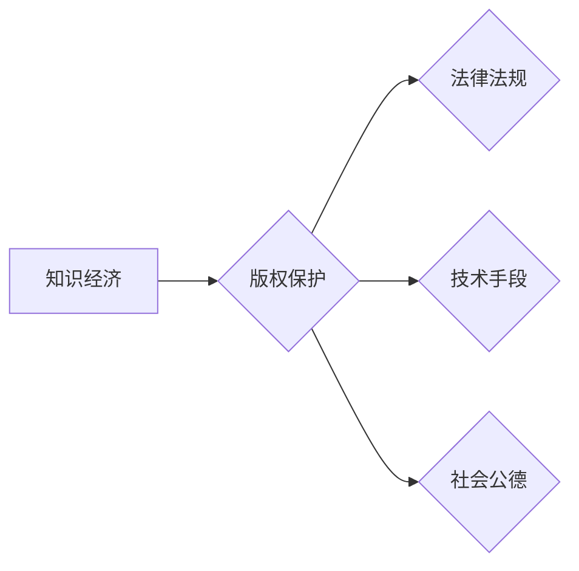

                 

## 知识经济下的版权保护与知识产权策略

> 关键词：知识经济、版权保护、知识产权、数字时代、人工智能、区块链、加密技术、法律法规、策略制定

## 1. 背景介绍

知识经济时代，知识成为最宝贵的生产要素，知识产权（Intellectual Property，IP）也随之成为经济发展的重要驱动力。版权作为知识产权的重要组成部分，保护了作者、发明人等知识创造者的合法权益，促进了知识创新和传播。然而，随着互联网和数字技术的飞速发展，传统版权保护体系面临着前所未有的挑战。

数字化的信息传播方式使得知识复制和传播变得更加便捷，盗版和侵权行为也随之泛滥。网络平台的匿名性、跨国性等特点，进一步加剧了版权保护的难度。同时，人工智能（AI）技术的快速发展也带来了新的挑战和机遇。AI可以自动生成内容，模糊了知识产权的界限，也为版权保护提供了新的技术手段。

## 2. 核心概念与联系

**2.1 知识经济与版权保护**

知识经济是指以知识、技术、信息为主要生产要素，以知识创新和创造为核心驱动的经济发展模式。知识经济的本质是知识的生产、传播和应用，而版权保护是知识经济发展的重要保障。

**2.2 知识产权与版权**

知识产权是指对知识创造的独占权利，包括专利权、商标权、著作权等。其中，版权是指对文学、艺术、科学等作品的独占权利，保护作者对作品的创作、复制、发行、表演等方面的权利。

**2.3 数字时代与版权挑战**

数字时代，信息传播方式发生了根本性变化，互联网和移动互联网的普及使得知识复制和传播变得更加便捷。然而，这也为版权保护带来了新的挑战：

* **盗版和侵权行为泛滥：** 网络平台的匿名性、跨国性等特点，使得盗版和侵权行为更加隐蔽和难以追踪。
* **知识共享和版权冲突：** 数字化的信息传播方式促进了知识共享，但也引发了版权冲突，例如开源软件和商业软件之间的版权纠纷。
* **人工智能和版权问题：** AI技术的快速发展，使得机器可以自动生成内容，模糊了知识产权的界限，也为版权保护带来了新的挑战。

**2.4  版权保护策略**

在数字时代，需要制定新的版权保护策略，以应对新的挑战，保护知识创造者的合法权益，促进知识创新和传播。

**Mermaid 流程图**



## 3. 核心算法原理 & 具体操作步骤

**3.1 算法原理概述**

在数字时代，版权保护算法主要围绕以下几个方面：

* **内容指纹识别：** 利用哈希算法生成作品的唯一指纹，用于识别和追踪作品的复制和传播。
* **数字水印技术：** 将不可见的标识信息嵌入到作品中，用于证明作品的合法性和来源。
* **区块链技术：** 利用区块链的去中心化、不可篡改的特点，记录作品的版权信息和交易记录，防止盗版和侵权。

**3.2 算法步骤详解**

**3.2.1 内容指纹识别算法**

1. 将作品转换为数字格式。
2. 使用哈希算法对作品进行加密处理，生成作品的唯一指纹。
3. 将作品的指纹信息存储在数据库中，用于后续的版权验证。

**3.2.2 数字水印技术算法**

1. 选择合适的嵌入算法，将水印信息嵌入到作品中，例如图像、音频、视频等。
2. 嵌入水印信息不会对作品的质量造成明显影响。
3. 使用特定的提取算法，从作品中提取水印信息，验证作品的合法性和来源。

**3.2.3 区块链技术算法**

1. 将作品的版权信息和交易记录打包成区块，并添加到区块链网络中。
2. 区块链网络的去中心化和不可篡改的特点，确保了版权信息的安全性。
3. 通过区块链网络，可以追踪作品的版权所有者和交易记录，防止盗版和侵权。

**3.3 算法优缺点**

**3.3.1 内容指纹识别算法**

* **优点：** 算法简单易实现，可以快速生成作品的指纹信息。
* **缺点：** 无法证明作品的合法来源，容易受到恶意攻击。

**3.3.2 数字水印技术算法**

* **优点：** 可以嵌入到作品中，不易被察觉，可以证明作品的合法性和来源。
* **缺点：** 水印信息容易被篡改，需要复杂的提取算法。

**3.3.3 区块链技术算法**

* **优点：** 去中心化、不可篡改，可以有效防止盗版和侵权。
* **缺点：** 技术复杂，需要大量的计算资源，成本较高。

**3.4 算法应用领域**

* **版权保护：** 识别和追踪作品的复制和传播，防止盗版和侵权。
* **知识管理：** 管理和跟踪知识资产，提高知识利用效率。
* **供应链管理：** 追踪商品的来源和流通路径，防止假冒伪劣产品。
* **数字身份认证：** 验证用户的身份信息，防止身份盗用。

## 4. 数学模型和公式 & 详细讲解 & 举例说明

**4.1 数学模型构建**

版权保护的数学模型可以基于信息论和博弈论等理论构建。

* **信息论：** 可以用信息熵来衡量作品的独特性和价值，以及版权保护的有效性。
* **博弈论：** 可以用博弈论来分析版权保护者和侵权者之间的博弈关系，寻找最佳的策略组合。

**4.2 公式推导过程**

**4.2.1 信息熵公式**

$$H(X) = - \sum_{i=1}^{n} p(x_i) \log_2 p(x_i)$$

其中：

* $H(X)$ 是随机变量 $X$ 的信息熵。
* $p(x_i)$ 是随机变量 $X$ 取值为 $x_i$ 的概率。

**4.2.2 博弈论中的纳什均衡**

纳什均衡是指在博弈中，每个参与者都选择对自己最有利的策略，并且没有参与者愿意改变自己的策略，从而达到稳定的状态。

**4.3 案例分析与讲解**

**4.3.1 案例：音乐版权保护**

在数字音乐时代，音乐盗版问题十分严重。可以使用信息熵来衡量音乐作品的独特性，以及版权保护的有效性。

* **高信息熵：** 音乐作品的独特性高，版权保护效果好。
* **低信息熵：** 音乐作品的独特性低，版权保护效果差。

可以使用数字水印技术来嵌入音乐作品中，防止盗版和侵权。

**4.3.2 案例：区块链技术在版权保护中的应用**

可以使用区块链技术来记录音乐作品的版权信息和交易记录，防止盗版和侵权。

* **版权登记：** 将音乐作品的版权信息打包成区块，并添加到区块链网络中。
* **交易记录：** 记录音乐作品的交易记录，例如购买、授权等。
* **版权追踪：** 通过区块链网络，可以追踪音乐作品的版权所有者和交易记录，防止盗版和侵权。

## 5. 项目实践：代码实例和详细解释说明

**5.1 开发环境搭建**

* **操作系统：** Linux 或 macOS
* **编程语言：** Python
* **开发工具：** PyCharm 或 VS Code
* **库依赖：** hashlib、cryptography、requests

**5.2 源代码详细实现**

```python
import hashlib

def generate_fingerprint(file_path):
    """
    生成文件的指纹信息
    """
    with open(file_path, 'rb') as f:
        file_content = f.read()
    return hashlib.sha256(file_content).hexdigest()

def main():
    """
    主函数
    """
    file_path = 'example.txt'
    fingerprint = generate_fingerprint(file_path)
    print(f'文件指纹：{fingerprint}')

if __name__ == '__main__':
    main()
```

**5.3 代码解读与分析**

* `generate_fingerprint()` 函数：
    * 读取文件的二进制内容。
    * 使用 SHA256 哈希算法对文件内容进行加密处理。
    * 返回文件的指纹信息，即哈希值。
* `main()` 函数：
    * 指定要生成指纹的文件路径。
    * 调用 `generate_fingerprint()` 函数生成文件的指纹信息。
    * 打印文件的指纹信息。

**5.4 运行结果展示**

运行代码后，会输出文件的指纹信息，例如：

```
文件指纹：a1b2c3d4e5f6g7h8i9j0k1l2m3n4o5p6q7r8s9t0u1v2w3x4y5z6
```

## 6. 实际应用场景

**6.1 数字音乐版权保护**

* **音乐平台：** 使用指纹识别技术识别和追踪音乐作品的复制和传播，防止盗版。
* **音乐发行商：** 使用数字水印技术嵌入音乐作品中，证明作品的合法性和来源。

**6.2 软件版权保护**

* **软件开发公司：** 使用指纹识别技术识别和追踪软件的复制和传播，防止盗版。
* **软件用户：** 使用数字水印技术验证软件的合法性，防止使用盗版软件。

**6.3 图像版权保护**

* **摄影师：** 使用数字水印技术嵌入图像中，证明图像的合法性和来源。
* **艺术机构：** 使用指纹识别技术识别和追踪艺术品的复制和传播，防止盗版。

**6.4 未来应用展望**

* **人工智能和版权保护：** AI可以用于识别和追踪盗版内容，以及生成新的版权保护技术。
* **区块链和版权保护：** 区块链可以用于记录版权信息和交易记录，防止盗版和侵权。
* **虚拟现实和增强现实和版权保护：** VR/AR技术可以为版权保护提供新的应用场景，例如虚拟展览和数字收藏。

## 7. 工具和资源推荐

**7.1 学习资源推荐**

* **书籍：**
    * 《知识经济》
    * 《版权保护》
    * 《数字水印技术》
* **在线课程：**
    * Coursera: Intellectual Property Law
    * edX: Copyright and Creative Commons

**7.2 开发工具推荐**

* **指纹识别工具：**
    * HashTab
    * MD5 Online
* **数字水印工具：**
    * ImageMagick
    * Watermarkly
* **区块链开发平台：**
    * Ethereum
    * Hyperledger Fabric

**7.3 相关论文推荐**

* **数字水印技术：**
    * "A Survey of Digital Watermarking Techniques"
* **区块链技术在版权保护中的应用：**
    * "Blockchain for Copyright Protection: A Comprehensive Review"

## 8. 总结：未来发展趋势与挑战

**8.1 研究成果总结**

在数字时代，版权保护面临着新的挑战和机遇。

* **技术方面：** 
    * 内容指纹识别、数字水印技术、区块链技术等为版权保护提供了新的技术手段。
* **法律方面：** 
    * 需要制定新的法律法规，适应数字时代的版权保护需求。
* **社会方面：** 
    * 需要提高公众对版权保护的意识，营造尊重知识产权的社会氛围。

**8.2 未来发展趋势**

* **人工智能和版权保护：** AI将进一步推动版权保护技术的发展，例如自动识别盗版内容、生成新的版权保护技术。
* **区块链和版权保护：** 区块链技术将为版权保护提供更加安全、透明的解决方案。
* **虚拟现实和增强现实和版权保护：** VR/AR技术将为版权保护提供新的应用场景，例如虚拟展览和数字收藏。

**8.3 面临的挑战**

* **技术挑战：** 
    * 如何开发更加高效、安全的版权保护技术。
* **法律挑战：** 
    * 如何制定更加完善的法律法规，适应数字时代的版权保护需求。
* **社会挑战：** 
    * 如何提高公众对版权保护的意识，营造尊重知识产权的社会氛围。

**8.4 研究展望**

未来，需要继续加强对版权保护技术的研发，制定更加完善的法律法规，提高公众对版权保护的意识，共同构建一个更加公平、公正的知识经济环境。

## 9. 附录：常见问题与解答

**9.1 如何保护我的作品版权？**

* **注册版权：** 在相关机构注册你的作品版权，获得法律保护。
* **使用数字水印技术：** 将水印信息嵌入到你的作品中，证明作品的合法性和来源。
* **使用指纹识别技术：** 生成作品的指纹信息，用于识别和追踪作品的复制和传播。
* **使用区块链技术：** 记录作品的版权信息和交易记录，防止盗版和侵权。

**9.2 如何识别盗版作品？**

* **检查作品的指纹信息：** 使用指纹识别工具，比较作品的指纹信息，判断是否为盗版。
* **检查作品的版权信息：** 查看作品的版权声明，判断作品的合法性。
* **使用数字水印检测工具：** 使用数字水印检测工具，检查作品中是否存在水印信息。

**9.3 如何应对盗版侵权行为？**

* **收集证据：** 收集盗版侵权行为的证据，例如截图、下载记录等。
* **联系版权所有者：** 向版权所有者报告盗版侵权行为。
* **寻求法律帮助：** 向相关机构或律师咨询，寻求法律帮助。


作者：禅与计算机程序设计艺术 / Zen and the Art of Computer Programming<end_of_turn>

