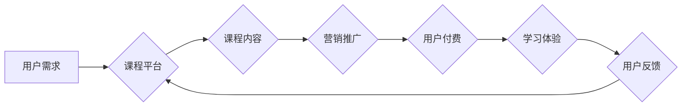

                 

## 知识经济时代下的知识付费创新课程营销策略

> 关键词：知识付费、课程营销、创新策略、在线教育、用户体验

### 1. 背景介绍

知识经济时代，信息化浪潮席卷全球，知识成为最宝贵的资源。传统教育模式面临着挑战，在线教育平台蓬勃发展，知识付费模式逐渐成为主流。知识付费课程，是指以知识、技能、经验等为核心内容，通过付费的方式获取学习资源，并获得相应的学习成果。

近年来，知识付费市场呈现爆发式增长，用户对高质量的在线课程需求不断提升。然而，知识付费市场竞争激烈，如何制定有效的课程营销策略，吸引用户付费学习，成为众多平台和创作者面临的难题。

### 2. 核心概念与联系

#### 2.1 知识付费

知识付费是指以知识、技能、经验等为核心内容，通过付费的方式获取学习资源，并获得相应的学习成果。

#### 2.2 课程营销

课程营销是指围绕知识付费课程，通过一系列的营销活动和策略，吸引目标用户，促成付费购买。

#### 2.3 创新策略

创新策略是指在知识付费课程营销中，采用新颖、独特、有效的营销方法和手段，以突破传统营销模式，提升营销效果。

**Mermaid 流程图**



### 3. 核心算法原理 & 具体操作步骤

#### 3.1 算法原理概述

知识付费课程营销的核心算法原理是基于用户行为数据分析和精准营销。通过对用户学习行为、兴趣偏好、消费习惯等数据的分析，可以精准定位目标用户，推送个性化课程推荐，提高用户转化率。

#### 3.2 算法步骤详解

1. **数据收集:** 收集用户学习行为数据，包括用户浏览记录、课程收藏、学习进度、评价反馈等。
2. **数据清洗:** 对收集到的数据进行清洗和处理，去除无效数据，保证数据质量。
3. **特征提取:** 从用户行为数据中提取特征，例如用户学习时长、学习频率、偏好课程类型、消费能力等。
4. **模型训练:** 利用机器学习算法，对用户特征进行建模，构建用户画像和预测模型。
5. **精准推荐:** 根据用户画像和预测模型，对用户进行精准推荐，推送符合用户兴趣和需求的课程。
6. **效果评估:** 对推荐效果进行评估，不断优化算法模型和推荐策略。

#### 3.3 算法优缺点

**优点:**

* **精准化:** 基于数据分析，精准定位目标用户，提高推荐精准度。
* **个性化:** 根据用户特征，提供个性化课程推荐，提升用户体验。
* **效率化:** 自动化推荐流程，提高营销效率。

**缺点:**

* **数据依赖:** 算法效果依赖于数据质量和量，数据不足或质量差会影响推荐效果。
* **算法复杂:** 模型训练和优化需要专业技术人员，成本较高。
* **用户隐私:** 数据收集和分析需要注重用户隐私保护。

#### 3.4 算法应用领域

* 在线教育平台
* 知识付费平台
* 内容创作平台
* 电商平台

### 4. 数学模型和公式 & 详细讲解 & 举例说明

#### 4.1 数学模型构建

知识付费课程营销的数学模型可以基于用户行为数据和课程特征，构建用户画像和推荐模型。

**用户画像模型:**

$$
u = f(h_1, h_2, ..., h_n)
$$

其中：

* $u$ 表示用户画像
* $h_1, h_2, ..., h_n$ 表示用户特征，例如学习时长、学习频率、偏好课程类型、消费能力等

**推荐模型:**

$$
r = g(u, c)
$$

其中：

* $r$ 表示推荐分数
* $u$ 表示用户画像
* $c$ 表示课程特征，例如课程类型、课程难度、课程价格等

#### 4.2 公式推导过程

用户画像模型和推荐模型的具体公式推导过程需要根据实际情况和算法选择进行调整。常用的算法包括协同过滤、内容过滤、混合推荐等。

#### 4.3 案例分析与讲解

例如，一个在线教育平台可以根据用户的学习时长、学习频率、偏好课程类型等特征，构建用户画像模型，并根据用户的画像和课程特征，构建推荐模型，推荐用户感兴趣的课程。

### 5. 项目实践：代码实例和详细解释说明

#### 5.1 开发环境搭建

* Python 3.x
* TensorFlow 或 PyTorch
* Jupyter Notebook

#### 5.2 源代码详细实现

```python
# 用户画像模型
from sklearn.linear_model import LogisticRegression

# 训练用户画像模型
model = LogisticRegression()
model.fit(X_train, y_train)

# 推荐模型
from sklearn.metrics.pairwise import cosine_similarity

# 计算课程之间的相似度
similarity_matrix = cosine_similarity(X_course)

# 根据用户画像预测推荐课程
def recommend_courses(user_profile):
    # 计算用户与课程之间的相似度
    user_similarity = cosine_similarity(user_profile, X_course)
    # 返回相似度最高的课程
    return user_similarity.argsort()[-5:][::-1]

# 运行推荐模型
recommended_courses = recommend_courses(user_profile)
print(recommended_courses)
```

#### 5.3 代码解读与分析

* 用户画像模型使用逻辑回归算法，根据用户特征预测用户是否会购买课程。
* 推荐模型使用余弦相似度计算用户与课程之间的相似度，并推荐相似度最高的课程。

#### 5.4 运行结果展示

运行代码后，将输出用户推荐的课程列表。

### 6. 实际应用场景

#### 6.1 在线教育平台

在线教育平台可以利用知识付费课程营销策略，精准推荐课程，提高用户转化率。

#### 6.2 知识付费平台

知识付费平台可以根据用户兴趣和需求，定制化课程内容，并通过营销推广，吸引用户付费学习。

#### 6.3 内容创作平台

内容创作平台可以将优质内容转化为知识付费课程，并通过营销推广，获得收益。

#### 6.4 未来应用展望

随着人工智能技术的不断发展，知识付费课程营销策略将更加智能化、个性化、精准化。

### 7. 工具和资源推荐

#### 7.1 学习资源推荐

* **机器学习算法:**

* **推荐系统:**

#### 7.2 开发工具推荐

* **Python:**

* **TensorFlow:**

* **PyTorch:**

#### 7.3 相关论文推荐

* **Collaborative Filtering for Recommender Systems:**

* **Content-Based Recommendation Systems:**

### 8. 总结：未来发展趋势与挑战

#### 8.1 研究成果总结

知识付费课程营销策略在知识经济时代具有重要意义，通过数据分析和算法推荐，可以提高用户体验和营销效果。

#### 8.2 未来发展趋势

* **人工智能技术:**

* **个性化定制:**

* **跨平台融合:**

#### 8.3 面临的挑战

* **数据隐私:**

* **算法可解释性:**

* **用户信任:**

#### 8.4 研究展望

未来研究方向包括：

* **更精准的推荐算法:**

* **更个性化的学习体验:**

* **更有效的营销策略:**

### 9. 附录：常见问题与解答

* **Q1: 如何收集用户行为数据？**

* **A1:** 可以通过网站分析工具、用户行为跟踪系统等方式收集用户行为数据。

* **Q2: 如何保证数据隐私？**

* **A2:** 需要采取数据加密、匿名化等措施，保护用户隐私。

* **Q3: 如何评估推荐效果？**

* **A3:** 可以通过点击率、转化率、用户满意度等指标评估推荐效果。


作者：禅与计算机程序设计艺术 / Zen and the Art of Computer Programming 
<end_of_turn>

