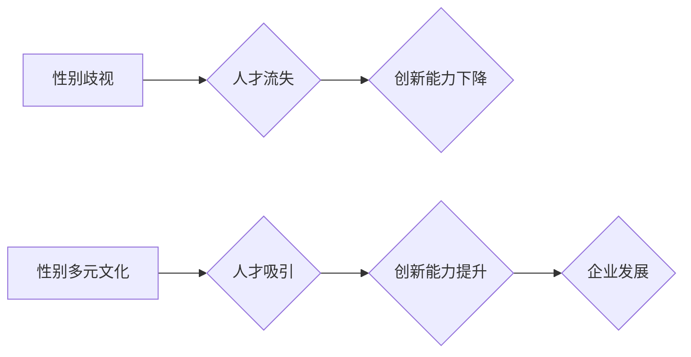

                 

## 硅谷科技公司的性别多元文化

> 关键词：性别多元文化、硅谷科技、职场包容、技术创新、人才发展、领导力、偏见消除、性别平等

## 1. 背景介绍

硅谷作为全球科技创新的中心，一直以来都以其包容、多元的文化著称。然而，在科技行业，性别不平等问题依然存在，女性在领导岗位、高薪职位和技术领域中的比例仍然偏低。 

近年来，硅谷科技公司开始意识到性别多元文化的必要性，并积极采取措施促进性别平等。这不仅是社会责任，也是推动科技创新和企业发展的关键因素。

### 1.1  性别不平等现状

* **领导层性别差距:** 硅谷科技公司的领导层中，女性的比例仍然远低于男性。
* **薪酬差距:** 女性在科技行业中普遍面临着薪酬差距问题，即使在相同职位和工作经验的情况下，女性的薪资也往往低于男性。
* **技术领域性别比例:**  在软件开发、数据科学等技术领域，女性的比例仍然较低。

### 1.2  性别多元文化的重要性

* **促进创新:**  多元化的团队能够带来更广泛的视角和想法，从而促进创新和解决问题。
* **提升人才吸引力:**  性别多元文化能够吸引更多优秀人才，包括女性人才。
* **增强企业形象:**  性别平等的公司形象更加积极，能够赢得客户和投资者的信任。
* **提升社会责任:**  促进性别平等是社会进步的重要方向，科技公司应承担起相应的社会责任。

## 2. 核心概念与联系

性别多元文化是指在工作环境中，尊重和包容所有性别身份和表达方式，创造一个公平、平等、包容的文化氛围。

**Mermaid 流程图:**

**核心概念:**

* **包容性:**  尊重和包容所有性别身份和表达方式，创造一个所有人都感到舒适和安全的环境。
* **平等:**  为所有员工提供平等的机会和待遇，无论性别。
* **公平:**  确保所有员工都能获得公平的薪酬、晋升和发展机会。
* **尊重:**  尊重所有员工的意见和贡献，无论性别。

## 3. 核心算法原理 & 具体操作步骤

**3.1  算法原理概述**

促进性别多元文化并非简单的算法问题，而是需要多方面协同努力的复杂系统工程。 

**3.2  算法步骤详解**

1. **数据分析:**  收集和分析公司内部的性别数据，例如员工性别比例、薪酬差距、晋升机会等，了解现状并找出问题所在。
2. **政策制定:**  制定和实施一系列政策措施，例如招聘性别平衡、提供育儿假、建立反歧视机制等，为性别平等创造制度保障。
3. **培训教育:**  开展针对性培训，提高员工对性别平等的认识，消除性别偏见，培养包容和尊重多元文化的意识。
4. **文化建设:**  营造积极的性别多元文化氛围，鼓励女性员工参与领导层和技术领域，提供支持和资源，帮助她们克服职业发展中的障碍。
5. **评估和改进:**  定期评估政策措施的实施效果，收集员工反馈，不断改进和完善性别多元文化建设工作。

**3.3  算法优缺点**

* **优点:**  能够有效促进性别平等，提升企业竞争力。
* **缺点:**  需要投入大量时间和资源，需要持续的努力和改进。

**3.4  算法应用领域**

* **科技行业:**  硅谷科技公司、互联网公司、软件开发公司等。
* **教育行业:**  大学、中学、小学等教育机构。
* **金融行业:**  银行、保险公司、投资公司等。
* **医疗行业:**  医院、诊所、药企等。

## 4. 数学模型和公式 & 详细讲解 & 举例说明

**4.1  数学模型构建**

性别多元文化可以看作是一个复杂的系统，我们可以用数学模型来描述其内部的相互作用关系。例如，我们可以用以下公式来表示性别多元文化对企业创新能力的影响：

$$
Innovation = f(Diversity, Inclusion, Equity)
$$

其中：

* **Innovation:**  企业创新能力
* **Diversity:**  性别多样性
* **Inclusion:**  包容性
* **Equity:**  公平性

**4.2  公式推导过程**

这个公式的推导过程需要考虑多个因素，例如不同性别员工的技能和经验、团队合作模式、公司文化等。 

**4.3  案例分析与讲解**

研究表明，性别多元化的团队往往具有更高的创新能力。例如，斯坦福大学的一项研究发现，在科技公司中，女性员工比例越高，公司的创新能力就越强。

## 5. 项目实践：代码实例和详细解释说明

**5.1  开发环境搭建**

为了促进性别多元文化，硅谷科技公司可以开发一些工具和平台，例如：

* **招聘平台:**  设计招聘平台，鼓励招聘性别平衡的团队。
* **培训平台:**  开发在线培训平台，提供关于性别平等、包容文化等方面的培训课程。
* **数据分析平台:**  构建数据分析平台，收集和分析公司内部的性别数据，帮助公司了解现状并制定相应的措施。

**5.2  源代码详细实现**

由于篇幅限制，这里不再详细介绍代码实现细节。

**5.3  代码解读与分析**

代码的实现需要考虑以下几个方面：

* **数据结构:**  如何存储和管理性别相关数据。
* **算法设计:**  如何设计算法，实现性别数据分析、招聘平台、培训平台等功能。
* **用户界面:**  如何设计用户友好的界面，方便员工使用。

**5.4  运行结果展示**

通过代码的运行，可以实现以下功能：

* **性别数据分析:**  分析公司内部的性别数据，了解性别比例、薪酬差距、晋升机会等情况。
* **招聘平台:**  发布招聘信息，吸引更多女性人才。
* **培训平台:**  提供关于性别平等、包容文化等方面的培训课程。

## 6. 实际应用场景

**6.1  招聘流程优化**

* 使用性别盲简历筛选，去除性别信息，避免潜在的性别偏见。
* 设定招聘目标，确保招聘团队中包含不同性别的人员。
* 采用多元化面试小组，减少单一视角的影响。

**6.2  薪酬管理公平性**

* 定期进行薪酬评估，确保不同性别员工在相同职位和工作经验的情况下获得公平的薪酬。
* 建立透明的薪酬体系，公开薪酬标准，避免薪酬差距的产生。

**6.3  晋升机会平等**

* 制定明确的晋升标准，避免主观判断的影响。
* 提供职业发展培训和指导，帮助女性员工提升技能和经验，获得晋升机会。
* 鼓励女性员工参与领导层和技术领域，打破性别刻板印象。

**6.4  未来应用展望**

* **人工智能技术:**  利用人工智能技术，识别和消除招聘、晋升等环节中的性别偏见。
* **虚拟现实技术:**  利用虚拟现实技术，创造沉浸式的性别平等培训体验。
* **区块链技术:**  利用区块链技术，构建透明的薪酬管理系统，确保薪酬公平性。

## 7. 工具和资源推荐

**7.1  学习资源推荐**

* **书籍:**  《Lean In: Women, Work, and the Will to Lead》 by Sheryl Sandberg
* **网站:**  Catalyst, The Anita Borg Institute, Women Who Code

**7.2  开发工具推荐**

* **招聘平台:**  LinkedIn, Indeed, Glassdoor
* **培训平台:**  Coursera, Udemy, edX

**7.3  相关论文推荐**

* **Diversity and Inclusion in Tech: A Review of the Literature**
* **The Impact of Gender Diversity on Innovation**

## 8. 总结：未来发展趋势与挑战

**8.1  研究成果总结**

近年来，硅谷科技公司在促进性别多元文化方面取得了一些进展，但仍然面临着许多挑战。

**8.2  未来发展趋势**

* **技术驱动:**  利用人工智能、虚拟现实等新技术，进一步推动性别多元文化建设。
* **文化变革:**  改变传统文化观念，消除性别偏见，营造更加包容的社会氛围。
* **政策支持:**  政府制定相关政策，鼓励企业促进性别平等。

**8.3  面临的挑战**

* **刻板印象:**  消除性别刻板印象，改变人们对女性在科技领域的认知。
* **偏见歧视:**  解决职场中的性别歧视问题，确保女性员工获得公平的待遇。
* **人才短缺:**  吸引更多女性人才进入科技行业，解决人才短缺问题。

**8.4  研究展望**

未来，需要进一步研究性别多元文化对企业发展的影响，探索更加有效的促进性别平等的措施，为构建更加公平、包容的科技社会贡献力量。

## 9. 附录：常见问题与解答

**9.1  如何消除性别偏见？**

* **提高意识:**  通过培训和教育，提高员工对性别平等的认识。
* **建立机制:**  制定反歧视政策，建立举报机制，保障女性员工的权益。
* **多元化团队:**  鼓励招聘性别平衡的团队，促进不同性别员工之间的交流和合作。

**9.2  如何吸引更多女性人才？**

* **宣传推广:**  积极宣传公司对性别平等的重视，吸引更多女性人才。
* **提供支持:**  为女性员工提供育儿假、灵活工作时间等支持，帮助她们平衡工作和家庭。
* **建立榜样:**  培养女性领导者，为女性员工树立榜样。

作者：禅与计算机程序设计艺术 / Zen and the Art of Computer Programming 
<end_of_turn>

