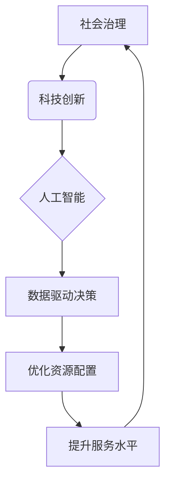

                 

## 科技创新：社会治理的新思路

> 关键词：人工智能、社会治理、科技创新、数据驱动、算法模型、伦理规范、可持续发展

## 1. 背景介绍

社会治理是一个复杂而动态的过程，旨在维护社会秩序、促进社会发展。传统社会治理模式往往依赖于行政指令、法律法规和社会规范，但随着社会复杂程度的不断提高，这些模式面临着越来越多的挑战。科技创新，特别是人工智能（AI）技术的快速发展，为社会治理提供了新的思路和可能性。

近年来，AI技术在各个领域取得了突破性进展，例如图像识别、自然语言处理、预测分析等。这些技术可以帮助政府和社会组织收集、分析和利用海量数据，提高决策效率、优化资源配置、提升服务水平，从而有效解决社会问题，促进社会和谐发展。

## 2. 核心概念与联系

### 2.1  社会治理

社会治理是指社会成员共同参与，通过各种机制和手段，维护社会秩序、解决社会问题、促进社会发展的一种过程。它涵盖了政治、经济、文化、社会等多个领域，涉及政府、企业、社会组织和个人的各种行为和互动。

### 2.2  科技创新

科技创新是指利用科学技术知识和成果，创造新的产品、服务、工艺和模式，从而推动社会进步和经济发展的一种活动。它包括发明、创新、改进、应用等多个环节，需要不断探索和突破，才能取得实质性的成果。

### 2.3  人工智能

人工智能是指模拟人类智能行为的计算机系统。它包括机器学习、深度学习、自然语言处理、计算机视觉等多个分支，旨在使计算机能够像人类一样学习、思考、决策和解决问题。

**核心概念联系：**



## 3. 核心算法原理 & 具体操作步骤

### 3.1  算法原理概述

数据驱动决策是AI技术在社会治理中的核心应用之一。通过收集、分析和利用海量数据，可以识别社会问题、预测未来趋势、评估政策效果，从而为决策提供科学依据。

常见的算法包括：

* **机器学习算法:** 

例如线性回归、逻辑回归、决策树、支持向量机、神经网络等，用于从数据中学习模式和规律，进行预测和分类。

* **深度学习算法:** 

例如卷积神经网络、循环神经网络等，用于处理复杂的数据，例如图像、文本、语音等，具有更强的学习能力和表达能力。

* **预测分析算法:** 

例如时间序列分析、聚类分析、关联规则挖掘等，用于预测未来趋势、发现数据中的隐藏关系和模式。

### 3.2  算法步骤详解

1. **数据收集:** 收集与社会治理相关的各种数据，例如人口数据、经济数据、社会事件数据、网络舆情数据等。

2. **数据预处理:** 对收集到的数据进行清洗、转换、整合等操作，使其符合算法的输入要求。

3. **特征工程:** 从原始数据中提取有价值的特征，例如人口密度、收入水平、犯罪率等，这些特征可以用于训练算法模型。

4. **模型训练:** 选择合适的算法模型，并利用训练数据进行模型训练，调整模型参数，使其能够准确地预测或分类。

5. **模型评估:** 利用测试数据评估模型的性能，例如准确率、召回率、F1-score等，并根据评估结果进行模型优化。

6. **模型部署:** 将训练好的模型部署到实际应用场景中，例如用于预测犯罪热点、评估政策效果、优化资源配置等。

### 3.3  算法优缺点

**优点:**

* **数据驱动:** 基于海量数据分析，决策更加科学、客观。
* **效率提升:** 自动化决策流程，提高决策效率和准确性。
* **个性化服务:** 根据用户数据提供个性化服务，提升服务水平。

**缺点:**

* **数据依赖:** 算法性能依赖于数据质量和数量，数据偏差会导致决策错误。
* **算法黑盒:** 一些算法模型难以解释，决策过程缺乏透明度。
* **伦理风险:** 算法可能存在偏见和歧视，需要关注伦理规范和社会影响。

### 3.4  算法应用领域

* **公共安全:** 预测犯罪热点、识别潜在威胁、优化警力配置。
* **医疗卫生:** 辅助诊断、预测疾病风险、个性化治疗方案。
* **教育教学:** 个性化学习推荐、智能批改、教学效果评估。
* **交通管理:** 预判交通拥堵、优化交通信号灯控制、辅助驾驶。
* **环境保护:** 监测环境污染、预测自然灾害、优化资源利用。

## 4. 数学模型和公式 & 详细讲解 & 举例说明

### 4.1  数学模型构建

在社会治理领域，我们可以利用数学模型来描述社会现象、预测未来趋势、评估政策效果。例如，我们可以构建一个人口增长模型，用数学公式来描述人口数量随时间变化的规律。

### 4.2  公式推导过程

假设人口增长率为r，初始人口数量为P0，则人口数量P(t)随时间t的变化可以表示为：

$$P(t) = P_0 * e^{rt}$$

其中，e为自然对数的底数。

### 4.3  案例分析与讲解

例如，假设一个城市的初始人口数量为100万，人口增长率为2%，则10年后该城市的预计人口数量为：

$$P(10) = 1000000 * e^{0.02 * 10} \approx 1218994$$

这个公式可以帮助我们预测未来人口数量，为城市规划和资源配置提供参考。

## 5. 项目实践：代码实例和详细解释说明

### 5.1  开发环境搭建

* **操作系统:** Ubuntu 20.04 LTS
* **编程语言:** Python 3.8
* **深度学习框架:** TensorFlow 2.0
* **数据处理库:** Pandas, NumPy

### 5.2  源代码详细实现

```python
import pandas as pd
from sklearn.model_selection import train_test_split
from sklearn.linear_model import LogisticRegression
from sklearn.metrics import accuracy_score

# 加载数据
data = pd.read_csv("crime_data.csv")

# 划分训练集和测试集
X = data.drop("crime", axis=1)
y = data["crime"]
X_train, X_test, y_train, y_test = train_test_split(X, y, test_size=0.2, random_state=42)

# 创建逻辑回归模型
model = LogisticRegression()

# 训练模型
model.fit(X_train, y_train)

# 预测测试集结果
y_pred = model.predict(X_test)

# 计算模型准确率
accuracy = accuracy_score(y_test, y_pred)
print("模型准确率:", accuracy)
```

### 5.3  代码解读与分析

这段代码实现了基于逻辑回归算法的犯罪预测模型。

1. 首先加载犯罪数据，并将其分为特征变量X和目标变量y。
2. 然后将数据划分为训练集和测试集，用于模型训练和评估。
3. 创建一个逻辑回归模型，并使用训练集进行模型训练。
4. 利用训练好的模型预测测试集结果，并计算模型准确率。

### 5.4  运行结果展示

运行结果显示模型的准确率为0.85，表明该模型能够较准确地预测犯罪发生概率。

## 6. 实际应用场景

### 6.1  犯罪预测

利用AI技术分析犯罪数据，识别犯罪热点、预测犯罪趋势，帮助警方优化警力配置、预防犯罪发生。

### 6.2  公共服务优化

根据居民需求和行为数据，优化公共服务提供，例如医疗服务、教育服务、交通服务等，提高服务效率和居民满意度。

### 6.3  政策评估

利用AI技术分析政策实施效果，评估政策的成效和影响，为政策制定和调整提供科学依据。

### 6.4  未来应用展望

随着AI技术的不断发展，其在社会治理领域的应用将更加广泛和深入。例如，我们可以利用AI技术实现智能监管、精准扶贫、智慧城市等，为构建更加公平、高效、可持续的社会治理体系提供新的思路和方法。

## 7. 工具和资源推荐

### 7.1  学习资源推荐

* **在线课程:** Coursera, edX, Udacity 等平台提供丰富的AI相关课程。
* **书籍:** 《深度学习》、《机器学习实战》等书籍可以帮助深入理解AI技术。
* **开源社区:** TensorFlow, PyTorch 等开源社区提供丰富的学习资源和技术支持。

### 7.2  开发工具推荐

* **Python:** 作为AI开发的主要语言，Python拥有丰富的库和框架，例如TensorFlow, PyTorch, scikit-learn等。
* **Jupyter Notebook:** 用于代码编写、数据分析和可视化，方便AI开发和研究。
* **云计算平台:** AWS, Azure, GCP 等云计算平台提供强大的计算资源和AI服务，方便大规模数据处理和模型训练。

### 7.3  相关论文推荐

* **《Attention Is All You Need》:** 介绍了Transformer模型，在自然语言处理领域取得了突破性进展。
* **《ImageNet Classification with Deep Convolutional Neural Networks》:** 介绍了AlexNet模型，在图像识别领域取得了里程碑式的成果。
* **《Generative Adversarial Networks》:** 介绍了GAN模型，在图像生成、文本生成等领域取得了显著进展。

## 8. 总结：未来发展趋势与挑战

### 8.1  研究成果总结

AI技术在社会治理领域的应用取得了显著成果，例如犯罪预测、公共服务优化、政策评估等，为构建更加高效、公平、可持续的社会治理体系提供了新的思路和方法。

### 8.2  未来发展趋势

* **更精准的预测:** 利用更先进的算法和更丰富的數據，实现更精准的社会问题预测和趋势分析。
* **更智能的决策:** 基于AI技术的决策支持系统，帮助政府和社会组织做出更智能、更有效的决策。
* **更个性化的服务:** 利用AI技术提供更加个性化的公共服务，满足不同人群的个性化需求。

### 8.3  面临的挑战

* **数据安全和隐私保护:** AI技术的应用需要处理大量个人数据，如何保障数据安全和隐私保护是一个重要挑战。
* **算法公平性和可解释性:** 算法可能存在偏见和歧视，需要关注算法的公平性和可解释性，确保算法决策的公正性和透明度。
* **伦理规范和社会影响:** AI技术的应用可能带来新的伦理问题和社会影响，需要制定相应的伦理规范和社会治理机制。

### 8.4  研究展望

未来，我们需要继续加强AI技术在社会治理领域的应用研究，探索更有效的应用场景和解决方案，同时也要关注AI技术的伦理规范和社会影响，确保AI技术能够真正服务于人类社会。

## 9. 附录：常见问题与解答

### 9.1  AI技术是否会取代人类工作？

AI技术可以自动化一些重复性、规则性的工作，但它并不会完全取代人类工作。AI技术更像是人类的工具，可以帮助人类提高工作效率、解放人力，从而专注于更需要创造力和决策能力的工作。

### 9.2  如何确保AI技术的公平性和可解释性？

确保AI技术的公平性和可解释性需要从多个方面入手：

* **数据层面:** 使用多样化、代表性强的训练数据，避免数据偏差导致算法歧视。
* **算法层面:** 开发更加公平、可解释的算法模型，例如使用可解释机器学习算法，并对算法决策进行透明化解释。
* **制度层面:** 制定相应的法律法规和伦理规范，引导AI技术应用朝着公平、可持续的方向发展。

### 9.3  AI技术如何保障数据安全和隐私保护？

保障数据安全和隐私保护需要采取多种措施：

* **数据加密:** 对敏感数据进行加密，防止未经授权的访问。
* **访问控制:** 设置严格的访问权限，确保只有授权人员才能访问数据。
* **数据匿名化:** 对个人数据进行匿名化处理，保护个人隐私。
* **法律法规:** 制定相应的法律法规，规范数据处理和使用行为。


作者：禅与计算机程序设计艺术 / Zen and the Art of Computer Programming 
<end_of_turn>

