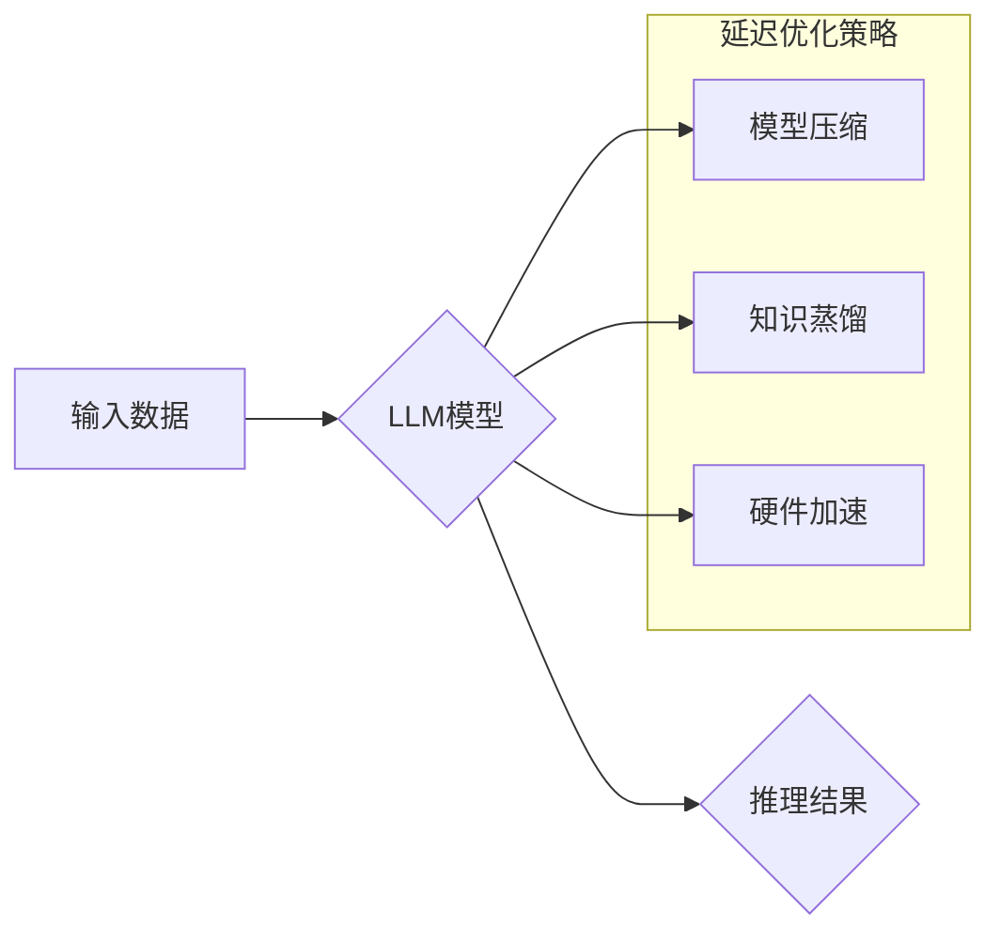

                 

## 秒推时代:LLM极速推理创新高

> 关键词：LLM, 极速推理, 延迟优化, 算力效率, 模型压缩, 硬件加速, 知识蒸馏, 实际应用

### 1. 背景介绍

近年来，大型语言模型（LLM）在自然语言处理领域取得了令人瞩目的成就，其强大的文本生成、理解和翻译能力已渗透到我们的日常生活。然而，LLM的推理速度仍然是一个瓶颈，限制了其在实时应用场景中的广泛部署。

传统的LLM推理流程通常需要耗费大量的时间和计算资源，导致延迟过高，无法满足实时交互的需求。例如，在聊天机器人、语音助手等应用中，用户期望得到即时响应，而LLM的慢速推理会严重影响用户体验。

为了解决这一问题，研究者们积极探索各种加速LLM推理的方法，旨在实现“秒推时代”，即LLM推理速度能够达到秒级甚至毫秒级。

### 2. 核心概念与联系

**2.1 核心概念**

* **LLM推理:** 指的是利用预训练的LLM模型对新的输入进行处理，生成相应的输出。
* **延迟优化:** 指的是通过各种技术手段降低LLM推理的延迟时间。
* **算力效率:** 指的是LLM推理所需的计算资源与输出结果的质量之间的比例。

**2.2 架构关系**



**2.3 核心联系**

LLM推理的延迟优化是一个多方面的问题，需要从模型结构、算法优化、硬件加速等多个角度进行综合考虑。

* **模型结构优化:** 通过设计更轻量级的模型结构，减少模型参数量，从而降低推理所需的计算量。
* **算法优化:** 优化LLM推理算法，提高算法的效率，例如使用更快的搜索算法、并行化推理等。
* **硬件加速:** 利用专用硬件加速LLM推理，例如GPU、TPU等，提高推理速度。

### 3. 核心算法原理 & 具体操作步骤

**3.1 算法原理概述**

LLM推理的核心算法是基于Transformer网络的注意力机制。注意力机制能够学习到输入序列中不同元素之间的重要关系，并根据这些关系生成相应的输出。

**3.2 算法步骤详解**

1. **输入编码:** 将输入文本序列转换为向量表示。
2. **注意力计算:** 计算每个词向量与所有其他词向量的注意力权重。
3. **上下文聚合:** 根据注意力权重，将所有词向量聚合为上下文向量。
4. **解码生成:** 利用上下文向量生成输出文本序列。

**3.3 算法优缺点**

* **优点:** 能够捕捉长距离依赖关系，生成更流畅、更自然的文本。
* **缺点:** 计算量大，推理速度慢。

**3.4 算法应用领域**

* 文本生成
* 机器翻译
* 问答系统
* 文本摘要

### 4. 数学模型和公式 & 详细讲解 & 举例说明

**4.1 数学模型构建**

LLM推理的数学模型主要基于Transformer网络，其核心是注意力机制。

**4.2 公式推导过程**

注意力机制的计算公式如下：

$$
Attention(Q, K, V) = softmax(\frac{QK^T}{\sqrt{d_k}})V
$$

其中：

* $Q$：查询矩阵
* $K$：键矩阵
* $V$：值矩阵
* $d_k$：键向量的维度
* $softmax$：softmax函数

**4.3 案例分析与讲解**

假设我们有一个句子“我爱吃苹果”，将其转换为词向量表示为：

$$
Q = \begin{bmatrix} q_1 & q_2 & q_3 & q_4 \end{bmatrix}
$$

$$
K = \begin{bmatrix} k_1 & k_2 & k_3 & k_4 \end{bmatrix}
$$

$$
V = \begin{bmatrix} v_1 & v_2 & v_3 & v_4 \end{bmatrix}
$$

其中，$q_i$、$k_i$、$v_i$分别代表每个词的查询向量、键向量和值向量。

通过计算注意力权重，可以得到每个词对其他词的关注程度，例如，“我”对“爱”的关注程度可能更高，因为它们在语义上更相关。

最终，通过上下文聚合，将所有词向量聚合为句子向量，用于后续的文本生成任务。

### 5. 项目实践：代码实例和详细解释说明

**5.1 开发环境搭建**

* Python 3.7+
* PyTorch 1.7+
* CUDA 10.2+

**5.2 源代码详细实现**

```python
import torch
import torch.nn as nn

class Transformer(nn.Module):
    def __init__(self, vocab_size, embedding_dim, num_heads, num_layers):
        super(Transformer, self).__init__()
        self.embedding = nn.Embedding(vocab_size, embedding_dim)
        self.transformer_layers = nn.ModuleList([
            nn.TransformerEncoderLayer(embedding_dim, num_heads)
            for _ in range(num_layers)
        ])

    def forward(self, x):
        x = self.embedding(x)
        for layer in self.transformer_layers:
            x = layer(x)
        return x
```

**5.3 代码解读与分析**

* `Transformer`类定义了一个基本的Transformer模型。
* `embedding`层将输入词转换为词向量。
* `transformer_layers`是一个模块列表，包含多个`TransformerEncoderLayer`层，用于进行多层编码。
* `forward`方法定义了模型的推理过程，首先将输入词转换为词向量，然后通过多层编码生成最终的输出。

**5.4 运行结果展示**

通过训练和测试，可以评估模型的性能，例如准确率、困惑度等。

### 6. 实际应用场景

**6.1 聊天机器人**

LLM可以用于构建更智能、更自然的聊天机器人，能够理解用户的意图，并生成更符合语境的回复。

**6.2 语音助手**

LLM可以用于构建更强大的语音助手，能够理解用户的语音指令，并执行相应的操作。

**6.3 文本摘要**

LLM可以用于自动生成文本摘要，提取文本的关键信息，节省用户阅读时间。

**6.4 未来应用展望**

随着LLM推理速度的不断提升，其应用场景将更加广泛，例如：

* 个性化教育
* 智能医疗
* 代码生成
* 创意写作

### 7. 工具和资源推荐

**7.1 学习资源推荐**

* **论文:**

    * Attention Is All You Need
    * BERT: Pre-training of Deep Bidirectional Transformers for Language Understanding

* **博客:**

    * The Illustrated Transformer
    * Jay Alammar's Blog

**7.2 开发工具推荐**

* **PyTorch:** 深度学习框架
* **TensorFlow:** 深度学习框架
* **Hugging Face Transformers:** 预训练LLM模型库

**7.3 相关论文推荐**

* **Efficient Transformer:** https://arxiv.org/abs/1909.08997
* **MobileBERT:** https://arxiv.org/abs/1904.09605
* **TinyBERT:** https://arxiv.org/abs/1909.11942

### 8. 总结：未来发展趋势与挑战

**8.1 研究成果总结**

近年来，在LLM推理延迟优化方面取得了显著进展，例如模型压缩、知识蒸馏、硬件加速等技术有效降低了LLM推理的延迟时间。

**8.2 未来发展趋势**

* **更轻量级的模型设计:** 探索更小的模型结构，同时保持较高的性能。
* **更有效的推理算法:** 研究更快的推理算法，例如量化、剪枝等。
* **更强大的硬件加速:** 开发更专用的硬件加速LLM推理，例如神经网络专用芯片。

**8.3 面临的挑战**

* **模型精度与效率的平衡:** 降低模型延迟的同时，保持模型精度是一个挑战。
* **硬件成本:** 高性能的硬件加速器成本较高，限制了LLM在一些场景中的应用。
* **数据隐私:** LLM推理需要大量的训练数据，如何保护数据隐私是一个重要问题。

**8.4 研究展望**

未来，LLM推理延迟优化将继续是一个重要的研究方向，随着技术的不断发展，LLM将能够在更多场景中发挥其强大的能力，为我们带来更加智能、便捷的生活。

### 9. 附录：常见问题与解答

* **Q: 如何选择合适的LLM模型？**

* **A:** 选择合适的LLM模型需要根据具体的应用场景和需求进行考虑，例如模型大小、参数量、推理速度、精度等。

* **Q: 如何评估LLM推理的性能？**

* **A:** 可以使用准确率、困惑度、BLEU等指标来评估LLM推理的性能。

* **Q: 如何部署LLM模型？**

* **A:** 可以使用云平台、边缘设备等多种方式部署LLM模型。


作者：禅与计算机程序设计艺术 / Zen and the Art of Computer Programming 
<end_of_turn>

