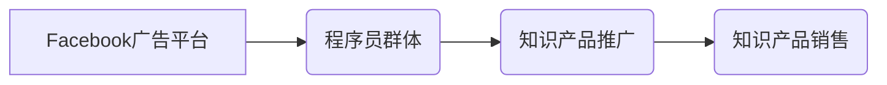

                 

## 程序员如何利用Facebook广告投放知识产品

> 关键词：Facebook广告、知识产品、程序员、精准投放、转化率、数据分析、ROI

## 1. 背景介绍

在当今数字时代，知识已成为最宝贵的资源之一。程序员作为科技领域的领军人物，拥有丰富的技术经验和专业技能。他们渴望不断学习新知识，提升自身竞争力。与此同时，越来越多的程序员开始将自己的技术经验和知识体系转化为知识产品，例如在线课程、电子书、技术博客、开源项目等，以分享经验、帮助他人，并获得经济回报。

然而，知识产品的推广和销售面临着诸多挑战。传统的营销方式难以精准触达目标用户，而互联网的碎片化信息环境使得知识产品在海量信息中难以脱颖而出。Facebook广告作为一种强大的线上营销工具，凭借其精准的定向投放能力、丰富的广告形式和强大的数据分析功能，为程序员提供了有效的知识产品推广途径。

## 2. 核心概念与联系

### 2.1 Facebook广告平台

Facebook广告平台是Facebook公司推出的面向企业和个人用户的广告投放平台。它提供多种广告形式，包括图片广告、视频广告、故事广告、动态广告等，可以根据不同的营销目标和预算进行灵活选择。

### 2.2 程序员群体特征

程序员群体是一个相对封闭、专业性强的群体，他们对技术信息敏感，乐于学习新知识，并愿意为优质的知识产品付费。

### 2.3 知识产品推广

知识产品推广是指通过各种渠道和方式，将知识产品推向目标用户，使其了解产品价值，并最终促成购买。

**核心概念关系图:**



## 3. 核心算法原理 & 具体操作步骤

### 3.1 算法原理概述

Facebook广告平台的核心算法原理是基于机器学习和深度学习技术，通过分析用户行为数据、兴趣偏好、社交关系等信息，精准匹配广告目标用户。

### 3.2 算法步骤详解

1. **数据收集与分析:** Facebook广告平台会收集用户的大量行为数据，包括浏览记录、点赞、评论、分享等，并通过机器学习算法进行分析，构建用户画像。
2. **目标用户定位:** 根据知识产品的目标用户群体，程序员可以利用Facebook广告平台的定向投放功能，精准定位目标用户，例如根据年龄、性别、职业、兴趣爱好、地理位置等进行筛选。
3. **广告素材设计:** 程序员需要设计吸引人的广告素材，包括图片、视频、文案等，突出知识产品的价值和优势，并与目标用户群体产生共鸣。
4. **竞价与展示:** 程序员需要设置广告预算和竞价策略，Facebook广告平台会根据竞价结果，将广告展示给目标用户。
5. **数据监测与优化:** 程序员需要持续监测广告数据，包括点击率、转化率、成本等指标，并根据数据反馈进行广告素材和投放策略的优化，提高广告效果。

### 3.3 算法优缺点

**优点:**

* 精准投放: Facebook广告平台可以精准定位目标用户，提高广告曝光效率。
* 多样化广告形式: 提供多种广告形式，可以根据不同的营销目标和预算进行选择。
* 数据分析功能强大: 提供丰富的广告数据分析功能，可以帮助程序员了解广告效果，并进行优化。

**缺点:**

* 成本较高: Facebook广告平台的广告成本相对较高，需要程序员进行合理的预算规划。
* 算法复杂: Facebook广告平台的算法比较复杂，需要程序员进行学习和掌握。
* 竞争激烈: Facebook广告平台的竞争非常激烈，需要程序员不断优化广告策略，才能获得良好的效果。

### 3.4 算法应用领域

Facebook广告算法广泛应用于各种领域，例如电商、教育、科技、金融等。对于程序员来说，Facebook广告可以用于推广以下知识产品:

* 在线课程: 针对特定编程语言、技术框架或开发工具的在线课程。
* 电子书: 分享程序员经验、技术技巧或编程最佳实践的电子书。
* 技术博客: 发布程序员技术文章、代码示例或项目案例的技术博客。
* 开源项目: 推广开源项目，吸引开发者参与贡献和使用。

## 4. 数学模型和公式 & 详细讲解 & 举例说明

### 4.1 数学模型构建

Facebook广告平台的算法模型是一个复杂的系统，涉及到机器学习、深度学习、统计学等多个学科。其中，一个关键的数学模型是**点击率预测模型**，用于预测用户点击广告的概率。

### 4.2 公式推导过程

点击率预测模型通常采用**逻辑回归**算法，其核心公式如下：

$$
P(Click) = \frac{1}{1 + e^{-(w_0 + w_1 * x_1 + w_2 * x_2 + ... + w_n * x_n)}}
$$

其中：

* $P(Click)$: 用户点击广告的概率
* $w_0$: 截距项
* $w_1, w_2, ..., w_n$: 各特征对应的权重
* $x_1, x_2, ..., x_n$: 用户特征向量

通过训练数据，模型会学习到每个特征对应的权重，从而预测用户点击广告的概率。

### 4.3 案例分析与讲解

假设我们有一个程序员群体，其中一些用户对Python编程感兴趣，一些用户对机器学习感兴趣。我们可以将这些特征作为输入，训练点击率预测模型。

如果模型学习到Python编程特征的权重较高，则意味着对Python编程感兴趣的用户更有可能点击与Python相关的广告。

## 5. 项目实践：代码实例和详细解释说明

### 5.1 开发环境搭建

为了实现Facebook广告投放，程序员需要搭建开发环境，包括：

* Facebook开发者账号: 注册Facebook开发者账号，并创建应用。
* Facebook广告账户: 创建Facebook广告账户，并进行资金充值。
* 开发工具: 使用Facebook提供的SDK或API进行开发，例如Facebook Ads API。

### 5.2 源代码详细实现

以下是一个简单的Python代码示例，演示如何使用Facebook Ads API创建广告:

```python
import facebook

# Facebook广告API配置
access_token = "YOUR_ACCESS_TOKEN"
graph = facebook.GraphAPI(access_token)

# 创建广告对象
ad_data = {
    "object_type": "ad",
    "name": "程序员知识产品广告",
    "creative": {
        "image_url": "https://example.com/image.jpg",
        "headline": "提升你的编程技能",
        "body": "学习最新的编程技术",
    },
    "targeting": {
        "interests": ["programming", "software development"],
    },
}

# 创建广告
response = graph.put_object("me", "ad", ad_data)

# 打印广告创建结果
print(response)
```

### 5.3 代码解读与分析

这段代码首先导入facebook库，并配置Facebook广告API的访问令牌。然后，定义广告数据，包括广告名称、创意素材、目标用户等信息。最后，使用Facebook Ads API的put_object方法创建广告。

### 5.4 运行结果展示

运行这段代码后，会返回广告创建结果，包括广告ID、状态等信息。程序员可以根据返回结果，查看广告是否创建成功，并进行后续的管理和优化。

## 6. 实际应用场景

### 6.1 案例分析

假设一位程序员开发了一套关于Python编程的在线课程，他可以使用Facebook广告平台进行推广。

* **目标用户:** 对Python编程感兴趣的程序员。
* **广告素材:** 使用Python代码示例、课程截图、学员评价等素材，突出课程的价值和优势。
* **定向投放:** 根据用户兴趣、职业、地理位置等信息进行精准定位，确保广告展示给目标用户。
* **竞价策略:** 根据预算和目标转化率，设置合理的竞价策略，优化广告效果。

### 6.2 实际效果

通过Facebook广告投放，程序员可以有效地触达目标用户，提高课程的曝光率和转化率，最终实现知识产品的销售目标。

### 6.4 未来应用展望

随着Facebook广告平台的不断发展，程序员可以利用更先进的广告技术和数据分析工具，进行更精准的知识产品推广，并实现更优的营销效果。

## 7. 工具和资源推荐

### 7.1 学习资源推荐

* Facebook广告官方文档: https://developers.facebook.com/docs/marketing-api
* Facebook广告学习课程: https://www.udemy.com/topic/facebook-ads/
* Facebook广告博客: https://www.facebook.com/business/blog

### 7.2 开发工具推荐

* Facebook Ads Manager: https://www.facebook.com/adsmanager
* Facebook Ads API: https://developers.facebook.com/docs/marketing-api/reference/ad-accounts

### 7.3 相关论文推荐

* "Deep Learning for Click-Through Rate Prediction"
* "A Survey of Click-Through Rate Prediction Models"

## 8. 总结：未来发展趋势与挑战

### 8.1 研究成果总结

Facebook广告平台为程序员提供了有效的知识产品推广途径，通过精准投放、数据分析和算法优化，可以帮助程序员提高知识产品的曝光率、转化率和ROI。

### 8.2 未来发展趋势

未来，Facebook广告平台将继续发展，提供更先进的广告技术和数据分析工具，例如：

* **人工智能驱动的广告投放:** 利用人工智能技术，更精准地预测用户行为，优化广告投放策略。
* **个性化广告体验:** 根据用户的兴趣和偏好，提供更个性化的广告体验。
* **跨平台广告投放:** 将广告投放扩展到Facebook生态系统中的其他平台，例如Instagram、WhatsApp等。

### 8.3 面临的挑战

Facebook广告平台也面临着一些挑战，例如：

* **广告屏蔽和过滤:** 用户越来越倾向于屏蔽广告，这会降低广告的曝光率。
* **数据隐私问题:** Facebook广告平台收集大量用户数据，如何保护用户隐私是一个重要的挑战。
* **算法更新:** Facebook广告平台的算法不断更新，程序员需要不断学习和适应新的算法变化。

### 8.4 研究展望

未来，研究者可以继续探索以下方向:

* **开发更有效的广告投放算法:** 研究更精准、更有效的广告投放算法，提高广告效果。
* **构建更安全的广告生态系统:** 研究如何保护用户隐私，构建更安全的广告生态系统。
* **探索新的广告形式:** 探索新的广告形式，例如沉浸式广告、增强现实广告等，提供更丰富的广告体验。

## 9. 附录：常见问题与解答

### 9.1 如何设置Facebook广告预算?

程序员可以通过Facebook Ads Manager设置广告预算，可以选择每日预算或总预算。

### 9.2 如何优化Facebook广告效果?

程序员可以通过以下方式优化Facebook广告效果:

* **测试不同的广告素材:** 尝试不同的图片、视频、文案等素材，找到最有效的组合。
* **调整目标用户群体:** 精准定位目标用户群体，提高广告曝光率。
* **优化竞价策略:** 根据预算和目标转化率，设置合理的竞价策略。
* **监测广告数据:** 持续监测广告数据，分析广告效果，并进行优化调整。

### 9.3 如何解决Facebook广告被屏蔽的问题?

程序员需要确保广告素材符合Facebook的广告政策，避免使用敏感内容或违规信息。


作者：禅与计算机程序设计艺术 / Zen and the Art of Computer Programming 
<end_of_turn>

