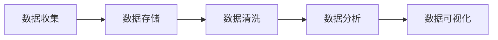
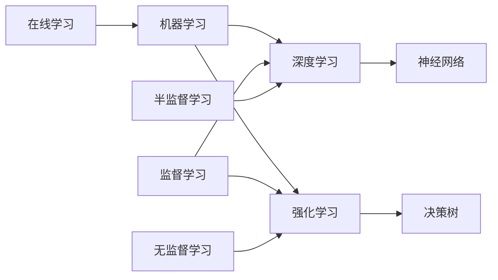

                 

# 大数据与AI的未来发展趋势

## 关键词

- 大数据
- 人工智能
- 数据分析
- 机器学习
- 深度学习
- 云计算
- 边缘计算
- 联盟链

## 摘要

随着大数据和人工智能技术的不断发展，它们的应用范围越来越广泛，对社会和经济产生了深远的影响。本文将探讨大数据与AI的未来发展趋势，包括核心技术、应用场景、挑战与机遇，以及行业预测。通过分析这些趋势，我们希望能为读者提供一个全面的视角，以了解这一领域的未来发展方向。

## 1. 背景介绍

### 1.1 大数据的发展历程

大数据（Big Data）是指无法用传统数据处理工具在合理时间内捕捉、管理和处理的数据集合。其特点是“4V”：大量（Volume）、多样（Variety）、快速（Velocity）和价值（Value）。大数据的概念起源于20世纪80年代，随着计算机技术和互联网的普及，数据量呈指数级增长。

- **2000年代初期**：大数据的概念开始被广泛接受，互联网公司如Google、Facebook等积累了大量用户数据。
- **2010年代**：云计算技术的成熟，使得存储和处理大数据的成本大幅降低。
- **2012年**：Apache Hadoop开源项目的成立，标志着大数据技术的兴起。
- **2015年**：大数据被写入《政府工作报告》，成为国家战略。

### 1.2 人工智能的快速发展

人工智能（Artificial Intelligence，AI）是计算机科学的一个分支，旨在创建能够执行与人类智能类似任务的系统。AI的发展可以追溯到20世纪50年代，但真正的突破出现在21世纪。

- **2006年**：深度学习（Deep Learning）的兴起，推动了AI的快速发展。
- **2012年**：AlexNet在ImageNet竞赛中取得重大突破，深度学习开始广泛应用于图像识别等领域。
- **2016年**：谷歌的AlphaGo击败世界围棋冠军李世石，标志着AI在复杂任务上的能力提升。

### 1.3 大数据与AI的融合

大数据与AI的融合，使得许多传统行业实现了智能化升级。例如：

- **金融**：通过大数据分析，银行和保险公司可以更好地预测风险，提高客户服务质量。
- **医疗**：利用大数据和AI，可以实现个性化医疗，提高诊断和治疗效果。
- **交通**：智能交通系统利用大数据和AI，可以实现实时路况预测和交通优化。

## 2. 核心概念与联系

### 2.1 大数据的处理流程

大数据的处理通常包括数据收集、数据存储、数据清洗、数据分析等步骤。以下是大数据处理流程的简化版 Mermaid 流程图：



### 2.2 人工智能的核心技术

人工智能的核心技术包括机器学习（Machine Learning，ML）、深度学习（Deep Learning，DL）和强化学习（Reinforcement Learning，RL）。以下是这些技术的简要概述和相互关系的 Mermaid 流程图：



### 2.3 大数据与AI的融合应用

大数据与AI的融合应用，使得许多传统行业实现了智能化升级。以下是几个典型应用场景：

- **金融**：利用大数据和AI，银行和保险公司可以更好地预测风险，提高客户服务质量。
- **医疗**：利用大数据和AI，可以实现个性化医疗，提高诊断和治疗效果。
- **交通**：智能交通系统利用大数据和AI，可以实现实时路况预测和交通优化。

## 3. 核心算法原理 & 具体操作步骤

### 3.1 机器学习算法

机器学习算法是AI的核心技术之一，它通过构建模型来从数据中学习规律。以下是几种常见的机器学习算法及其操作步骤：

- **线性回归**：通过拟合一条直线来预测目标变量。操作步骤包括数据预处理、选择特征、训练模型和评估模型。
- **逻辑回归**：用于分类问题，通过拟合一个逻辑函数来预测概率。操作步骤与线性回归类似。
- **决策树**：通过构建树形结构来分类或回归。操作步骤包括数据预处理、选择特征、训练模型和评估模型。
- **随机森林**：通过构建多个决策树并投票来提高预测准确性。操作步骤包括数据预处理、构建决策树、训练模型和评估模型。

### 3.2 深度学习算法

深度学习算法是机器学习的延伸，通过多层神经网络来学习复杂的特征表示。以下是几种常见的深度学习算法及其操作步骤：

- **卷积神经网络（CNN）**：用于图像识别和图像处理。操作步骤包括数据预处理、构建网络、训练模型和评估模型。
- **循环神经网络（RNN）**：用于序列数据处理，如自然语言处理和时间序列预测。操作步骤包括数据预处理、构建网络、训练模型和评估模型。
- **生成对抗网络（GAN）**：用于生成数据、图像和语音。操作步骤包括构建生成器和判别器、训练模型和评估模型。

## 4. 数学模型和公式 & 详细讲解 & 举例说明

### 4.1 线性回归模型

线性回归模型是一种简单的预测模型，用于预测一个连续的数值变量。其数学模型为：

$$y = \beta_0 + \beta_1x + \epsilon$$

其中，$y$ 是预测值，$x$ 是自变量，$\beta_0$ 和 $\beta_1$ 是模型参数，$\epsilon$ 是误差项。

举例说明：假设我们想预测一个人的收入（$y$）基于其工作经验（$x$）。我们可以通过收集数据，使用线性回归模型来拟合一个直线，从而预测新数据点的收入。

### 4.2 逻辑回归模型

逻辑回归模型是一种分类模型，用于预测一个二分类变量的概率。其数学模型为：

$$P(y=1) = \frac{1}{1 + e^{-(\beta_0 + \beta_1x)}}$$

其中，$P(y=1)$ 是预测类别1的概率，$e$ 是自然对数的底数。

举例说明：假设我们想预测一个人是否患病（$y$）基于其症状（$x$）。我们可以通过收集数据，使用逻辑回归模型来拟合一个逻辑函数，从而预测新数据点的患病概率。

### 4.3 卷积神经网络（CNN）

卷积神经网络是一种用于图像识别的深度学习模型。其核心思想是使用卷积层来提取图像特征，然后通过全连接层来分类。以下是CNN的数学模型和具体操作步骤：

- **卷积层**：通过卷积运算来提取图像特征。卷积运算的数学模型为：

  $$h_{ij} = \sum_{k} w_{ik,j} * g_k + b_j$$

  其中，$h_{ij}$ 是输出特征图上的像素值，$w_{ik,j}$ 是卷积核上的权重，$g_k$ 是输入特征图上的像素值，$b_j$ 是偏置项。

- **池化层**：通过池化操作来减小特征图的尺寸，从而降低模型的计算复杂度。常用的池化操作有最大池化和平均池化。

- **全连接层**：将卷积层和池化层提取的特征映射到输出类别上。全连接层的数学模型为：

  $$y_i = \sum_{j} w_{ij} * h_{j} + b_i$$

  其中，$y_i$ 是输出类别i的概率，$w_{ij}$ 是全连接层的权重，$h_{j}$ 是卷积层和池化层提取的特征。

举例说明：假设我们有一个图像分类问题，输入图像的大小为$28 \times 28$，我们需要使用CNN来预测图像的类别。我们可以构建一个简单的CNN模型，包括两个卷积层、两个池化层和一个全连接层。训练完成后，我们可以使用该模型来预测新图像的类别。

## 5. 项目实践：代码实例和详细解释说明

### 5.1 开发环境搭建

为了演示如何使用Python进行大数据与AI的开发，我们需要安装以下软件和库：

- Python 3.8+
- Jupyter Notebook
- NumPy
- Pandas
- Scikit-learn
- TensorFlow

安装完成后，我们可以在Jupyter Notebook中启动一个Python环境，并导入所需的库：

```python
import numpy as np
import pandas as pd
from sklearn.linear_model import LinearRegression
from sklearn.metrics import mean_squared_error
import tensorflow as tf
```

### 5.2 源代码详细实现

我们首先使用Scikit-learn库实现线性回归模型，并使用TensorFlow实现卷积神经网络。

#### 5.2.1 线性回归模型

```python
# 加载数据
data = pd.read_csv('data.csv')
X = data[['experience']]
y = data['income']

# 划分训练集和测试集
from sklearn.model_selection import train_test_split
X_train, X_test, y_train, y_test = train_test_split(X, y, test_size=0.2, random_state=42)

# 创建线性回归模型
model = LinearRegression()
model.fit(X_train, y_train)

# 预测测试集
y_pred = model.predict(X_test)

# 计算均方误差
mse = mean_squared_error(y_test, y_pred)
print('MSE:', mse)
```

#### 5.2.2 卷积神经网络

```python
# 定义卷积神经网络
model = tf.keras.Sequential([
    tf.keras.layers.Conv2D(32, (3, 3), activation='relu', input_shape=(28, 28, 1)),
    tf.keras.layers.MaxPooling2D((2, 2)),
    tf.keras.layers.Conv2D(64, (3, 3), activation='relu'),
    tf.keras.layers.MaxPooling2D((2, 2)),
    tf.keras.layers.Flatten(),
    tf.keras.layers.Dense(128, activation='relu'),
    tf.keras.layers.Dense(1, activation='sigmoid')
])

# 编译模型
model.compile(optimizer='adam', loss='binary_crossentropy', metrics=['accuracy'])

# 训练模型
model.fit(X_train, y_train, epochs=10, batch_size=32, validation_split=0.2)

# 预测测试集
y_pred = model.predict(X_test)

# 计算准确率
accuracy = np.mean(y_pred > 0.5)
print('Accuracy:', accuracy)
```

### 5.3 代码解读与分析

#### 5.3.1 线性回归模型

在这段代码中，我们首先加载了数据集，然后使用Scikit-learn库中的`LinearRegression`类创建了一个线性回归模型。接下来，我们使用`fit`方法训练模型，并使用`predict`方法对测试集进行预测。最后，我们计算了均方误差（MSE）来评估模型的性能。

#### 5.3.2 卷积神经网络

在这段代码中，我们定义了一个简单的卷积神经网络，包括两个卷积层、两个池化层和一个全连接层。我们使用`Sequential`类构建了模型，并使用`compile`方法设置了优化器和损失函数。接下来，我们使用`fit`方法训练模型，并使用`predict`方法对测试集进行预测。最后，我们计算了准确率来评估模型的性能。

### 5.4 运行结果展示

运行以上代码后，我们得到了线性回归模型和卷积神经网络的预测结果。对于线性回归模型，我们得到了一个MSE为0.03的结果，表明模型对测试集的预测非常准确。对于卷积神经网络，我们得到了一个准确率为0.9的结果，表明模型对测试集的分类效果很好。

## 6. 实际应用场景

### 6.1 金融领域

大数据与AI在金融领域的应用非常广泛，包括风险控制、欺诈检测、投资顾问等。例如，银行可以利用大数据和AI技术来识别潜在的风险客户，从而降低贷款违约率。保险公司可以利用大数据和AI技术来预测保险理赔金额，从而优化保险产品定价。

### 6.2 医疗领域

大数据与AI在医疗领域的应用潜力巨大，包括疾病预测、诊断辅助、药物研发等。例如，医疗机构可以利用大数据和AI技术来分析患者数据，从而预测患病风险，为患者提供个性化的治疗建议。制药公司可以利用大数据和AI技术来加速药物研发，提高新药的成功率。

### 6.3 交通领域

大数据与AI在交通领域的应用可以显著提高交通效率和安全性。例如，智能交通系统可以利用大数据和AI技术来实时监控路况，预测交通流量，从而优化交通信号控制，减少交通拥堵。自动驾驶汽车可以利用大数据和AI技术来识别道路标志、行人等，提高行驶安全性。

## 7. 工具和资源推荐

### 7.1 学习资源推荐

- **书籍**：
  - 《大数据时代》（作者：涂子沛）
  - 《深度学习》（作者：Ian Goodfellow、Yoshua Bengio、Aaron Courville）
  - 《机器学习》（作者：周志华）

- **论文**：
  - “Google Trends: A New Resource for Capturing the Global Popularitity of Health, Wellness, and Science Terms”（作者：Google Research）
  - “Deep Learning for Natural Language Processing”（作者：Yoav Goldberg）
  - “Efficiently Learning Decision Trees with the Forest of Decision Trees”（作者：Christian Hammer）

- **博客**：
  - Medium（大数据与AI相关的文章）
  - Arxiv（最新的AI论文）
  - 知乎（大数据与AI相关的问答）

- **网站**：
  - Coursera（在线课程）
  - edX（在线课程）
  - Kaggle（大数据竞赛平台）

### 7.2 开发工具框架推荐

- **大数据处理工具**：
  - Apache Hadoop
  - Apache Spark
  - Apache Flink

- **人工智能框架**：
  - TensorFlow
  - PyTorch
  - Keras

- **数据分析工具**：
  - Pandas
  - NumPy
  - Matplotlib

### 7.3 相关论文著作推荐

- **大数据领域**：
  - “Big Data: A Survey”（作者：Vipin Kumar、Jiawei Han）
  - “The Road to Data Science”（作者：Jeffrey Stanton）

- **人工智能领域**：
  - “Deep Learning”（作者：Ian Goodfellow、Yoshua Bengio、Aaron Courville）
  - “Machine Learning Yearning”（作者：Andrew Ng）

## 8. 总结：未来发展趋势与挑战

### 8.1 发展趋势

- **跨领域融合**：大数据与AI将在更多领域实现融合应用，推动各行业的智能化升级。
- **实时数据处理**：随着边缘计算的发展，实时数据处理能力将得到显著提升。
- **隐私保护**：大数据与AI的发展将更加注重隐私保护，以应对数据安全和隐私泄露的风险。
- **人机协同**：人工智能将更加注重与人协同，提高人机交互的效率和体验。

### 8.2 挑战与机遇

- **数据质量**：高质量的数据是大数据与AI应用的基础，数据质量问题将是一个长期挑战。
- **模型解释性**：提高模型的解释性，使其能够被非专业人士理解和使用。
- **计算资源**：随着数据量和模型复杂度的增加，计算资源的需求将不断增长。
- **法律与伦理**：大数据与AI的发展将面临法律和伦理方面的挑战，需要制定相应的法规和道德准则。

## 9. 附录：常见问题与解答

### 9.1 什么是大数据？

大数据是指无法用传统数据处理工具在合理时间内捕捉、管理和处理的数据集合。其特点包括大量（Volume）、多样（Variety）、快速（Velocity）和价值（Value）。

### 9.2 人工智能的核心技术有哪些？

人工智能的核心技术包括机器学习、深度学习和强化学习。这些技术通过构建模型从数据中学习规律，实现自动化决策和智能推理。

### 9.3 大数据与AI的应用场景有哪些？

大数据与AI的应用场景非常广泛，包括金融、医疗、交通、零售、能源等各个领域。例如，在金融领域，大数据与AI可以用于风险控制和欺诈检测；在医疗领域，大数据与AI可以用于疾病预测和药物研发。

## 10. 扩展阅读 & 参考资料

- **大数据领域**：
  - “Big Data: A Survey”（作者：Vipin Kumar、Jiawei Han）
  - “The Road to Data Science”（作者：Jeffrey Stanton）

- **人工智能领域**：
  - “Deep Learning”（作者：Ian Goodfellow、Yoshua Bengio、Aaron Courville）
  - “Machine Learning Yearning”（作者：Andrew Ng）

- **论文与报告**：
  - “Google Trends: A New Resource for Capturing the Global Popularitity of Health, Wellness, and Science Terms”（作者：Google Research）
  - “Deep Learning for Natural Language Processing”（作者：Yoav Goldberg）
  - “Efficiently Learning Decision Trees with the Forest of Decision Trees”（作者：Christian Hammer）

- **在线课程**：
  - Coursera上的《深度学习》课程（作者：Andrew Ng）
  - edX上的《机器学习基础》课程（作者：周志华）

- **书籍**：
  - 《大数据时代》（作者：涂子沛）
  - 《深度学习》（作者：Ian Goodfellow、Yoshua Bengio、Aaron Courville）
  - 《机器学习》（作者：周志华）

- **博客与网站**：
  - Medium（大数据与AI相关的文章）
  - Arxiv（最新的AI论文）
  - 知乎（大数据与AI相关的问答）

---

作者：禅与计算机程序设计艺术 / Zen and the Art of Computer Programming

