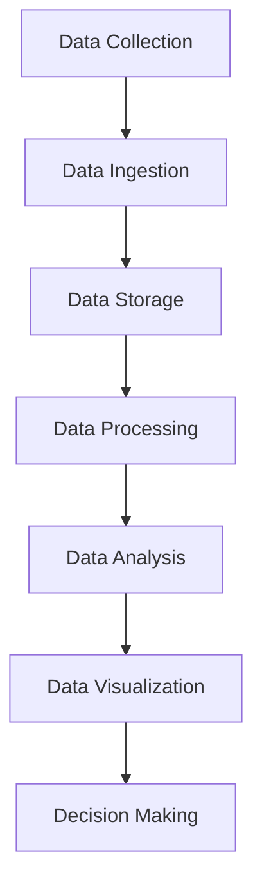

                 

## 1. 背景介绍（Background Introduction）

### 1.1 大数据分析的定义与起源

大数据分析（Big Data Analytics）是指利用各种先进的数据处理技术，从大规模数据集中提取有价值的信息、洞察和知识的过程。这一概念最早可以追溯到20世纪80年代，随着互联网的兴起和数据存储成本的降低，大数据分析逐渐成为研究和应用的热点。

大数据分析的核心思想是通过数据挖掘、统计分析、机器学习等技术，从海量数据中寻找规律、趋势和关联，从而为企业和组织提供决策支持。其起源可以追溯到数据库技术和信息检索领域，随着计算能力的提升和算法的创新，大数据分析逐渐发展成为一个独立的学科。

### 1.2 商业价值与社会影响

大数据分析在商业领域具有巨大的价值。通过分析消费者行为数据，企业可以更好地了解市场需求，优化产品设计和营销策略。例如，电子商务平台可以利用大数据分析预测消费者购买趋势，从而实现精准营销。在金融行业，大数据分析可以用于风险管理、信用评分和欺诈检测，提高业务效率和安全性。

此外，大数据分析对社会产生了深远的影响。在医疗领域，大数据分析可以帮助医生进行疾病预测和个性化治疗，提高医疗服务的质量和效率。在交通领域，通过分析交通数据，可以优化交通流量，减少拥堵，提高公共交通系统的效率。在环境保护领域，大数据分析可以用于监测气候变化、污染源识别和资源管理，为可持续发展提供科学依据。

### 1.3 创业机会与挑战

大数据分析的快速发展为创业者提供了广阔的创业机会。随着技术的进步和市场的需求，大数据分析领域的创业项目不断涌现。以下是几个典型的创业机会：

1. **数据可视化工具**：帮助企业和组织更好地理解和利用其数据资源，提供直观、易用的数据可视化解决方案。
2. **数据安全与隐私保护**：随着数据量的增加，数据安全和隐私保护成为重要议题，为专业解决方案提供商创造了市场机会。
3. **智能分析平台**：通过集成多种数据分析技术，提供一站式解决方案，帮助客户快速构建和部署数据分析应用。
4. **行业垂直应用**：针对特定行业（如医疗、金融、零售等）提供定制化的数据分析解决方案，满足行业特定需求。

然而，创业机会也伴随着挑战。大数据分析需要深厚的技术积累和专业知识，创业者需要具备强大的技术背景和行业经验。此外，市场竞争激烈，创新速度快，创业者需要不断跟进技术趋势，保持竞争优势。

### 1.4 创业项目实例分析

以下是一个实际的大数据分析创业项目实例：

**项目名称**：智慧医疗数据分析平台

**项目概述**：该项目旨在利用大数据分析技术，构建一个智能化的医疗数据分析平台，帮助医疗机构提高诊疗效率和质量。

**核心功能**：
- **疾病预测**：利用患者历史数据和医学知识库，预测疾病发生风险，为医生提供诊断决策支持。
- **个性化治疗**：根据患者的基因信息和病史，提供个性化的治疗方案，提高治疗效果。
- **医学研究**：整合多源医疗数据，支持医学研究，发现疾病发生和发展的规律，推动医学进步。

**技术实现**：
- **数据存储与管理**：采用分布式数据库系统，存储和管理海量的医疗数据。
- **数据处理与分析**：利用分布式计算框架，处理大规模数据，支持实时分析和预测。
- **机器学习算法**：采用深度学习、随机森林等算法，实现疾病预测和个性化治疗。

**市场前景**：随着人口老龄化趋势加剧和医疗技术的进步，智慧医疗数据分析平台具有巨大的市场需求。通过为医疗机构提供智能化解决方案，该项目有望在医疗行业取得成功。

通过以上实例分析，我们可以看到大数据分析创业项目的多样性和潜力。创业者需要紧跟技术趋势，紧密结合市场需求，不断创新和优化产品，才能在激烈的市场竞争中脱颖而出。

## 1. Introduction to Big Data Analysis
### 1.1 Definition and Origins of Big Data Analysis

Big Data Analysis refers to the process of extracting valuable insights, patterns, and knowledge from large-scale datasets using advanced data processing techniques. This concept first emerged in the 1980s with the rise of the internet and the decrease in data storage costs, gradually becoming a research and application hotspot.

The core idea of big data analysis is to find rules, trends, and correlations from massive datasets to provide decision support for businesses and organizations. Its origin can be traced back to the fields of database technology and information retrieval. With the improvement of computational power and algorithm innovation, big data analysis has gradually developed into an independent discipline.

### 1.2 Business Value and Social Impact

Big Data Analysis holds immense value in the business sector. By analyzing consumer behavior data, companies can better understand market demands and optimize product design and marketing strategies. For example, e-commerce platforms can use big data analysis to predict consumer purchase trends, enabling precise marketing. In the financial industry, big data analysis can be used for risk management, credit scoring, and fraud detection, improving business efficiency and security.

Moreover, big data analysis has had a profound impact on society. In the medical field, big data analysis can help doctors with disease prediction and personalized treatment, enhancing the quality and efficiency of healthcare services. In the transportation sector, analyzing traffic data can optimize traffic flow and reduce congestion, improving the efficiency of public transportation systems. In the environmental protection field, big data analysis can be used for monitoring climate change, identifying pollution sources, and managing resources, providing scientific evidence for sustainable development.

### 1.3 Entrepreneurial Opportunities and Challenges

The rapid development of big data analysis offers extensive entrepreneurial opportunities. With technological advancements and market demands, big data analysis-related startup projects are continuously emerging. Here are several typical entrepreneurial opportunities:

1. **Data Visualization Tools**: Help companies and organizations better understand and utilize their data resources by providing intuitive and easy-to-use data visualization solutions.
2. **Data Security and Privacy Protection**: As data volumes increase, data security and privacy protection become crucial issues, creating market opportunities for professional solution providers.
3. **Intelligent Analysis Platforms**: Integrate various data analysis technologies to provide one-stop solutions, helping customers quickly build and deploy data analysis applications.
4. **Industry Vertical Applications**: Provide customized data analysis solutions for specific industries (such as healthcare, finance, retail, etc.), meeting industry-specific needs.

However, entrepreneurial opportunities also come with challenges. Big data analysis requires deep technical expertise and professional knowledge. Startups need to have strong technical backgrounds and industry experience. Additionally, the competitive market environment, fast-paced innovation, and the need to keep up with technological trends pose significant challenges to entrepreneurs.

### 1.4 Analysis of a Real-World Entrepreneurial Project

Here is an example of a real-world big data analysis entrepreneurial project:

**Project Name**: Intelligent Medical Data Analysis Platform

**Project Overview**: This project aims to build an intelligent medical data analysis platform using big data analysis techniques to improve the efficiency and quality of medical care in healthcare institutions.

**Core Functions**:
- **Disease Prediction**: Use historical patient data and medical knowledge bases to predict the risk of diseases, providing diagnostic decision support for doctors.
- **Personalized Treatment**: Based on a patient's genetic information and medical history, provide personalized treatment plans to improve treatment outcomes.
- **Medical Research**: Integrate multi-source medical data to support medical research, uncovering patterns and trends in disease development and progression to advance medical science.

**Technical Implementation**:
- **Data Storage and Management**: Use distributed database systems to store and manage massive amounts of medical data.
- **Data Processing and Analysis**: Use distributed computing frameworks to process large-scale data, supporting real-time analysis and prediction.
- **Machine Learning Algorithms**: Use deep learning, random forests, and other algorithms for disease prediction and personalized treatment.

**Market Prospects**: With the aging population trend and advancements in medical technology, intelligent medical data analysis platforms have immense market potential. By providing intelligent solutions to healthcare institutions, this project has the potential to achieve success in the medical industry.

Through the analysis of this real-world entrepreneurial project, we can see the diversity and potential of big data analysis startup projects. Entrepreneurs need to keep up with technological trends, closely integrate with market demands, and continuously innovate and optimize products to standout in the competitive market landscape.

### 2. 核心概念与联系（Core Concepts and Connections）

#### 2.1 大数据分析的关键概念

大数据分析涉及多个核心概念，包括数据源、数据处理、数据存储、数据分析和数据可视化等。理解这些概念对于深入理解大数据分析的原理和实际应用至关重要。

1. **数据源**（Data Sources）：数据源是大数据分析的基础，包括结构化数据（如关系数据库）、半结构化数据（如XML、JSON）和非结构化数据（如文本、图片、音频、视频）。不同类型的数据源对分析方法和工具的选择有重要影响。

2. **数据处理**（Data Processing）：数据处理包括数据清洗、数据整合、数据转换和数据归一化等步骤。这些步骤确保数据质量，为后续分析提供可靠的数据基础。

3. **数据存储**（Data Storage）：数据存储是指将处理后的数据存储在高效、可扩展的存储系统中。常见的数据存储技术包括关系数据库、NoSQL数据库、分布式文件系统等。

4. **数据分析**（Data Analysis）：数据分析是大数据分析的核心，包括描述性分析、诊断性分析、预测性分析和规范性分析。描述性分析用于了解数据的基本特征；诊断性分析用于识别数据中的异常和趋势；预测性分析用于预测未来趋势；规范性分析用于提出改进建议。

5. **数据可视化**（Data Visualization）：数据可视化是将数据分析结果以图形、图表、地图等形式展示，帮助用户直观地理解和分析数据。数据可视化是数据科学的重要组成部分，能够提高数据解释力和决策效率。

#### 2.2 大数据分析的技术架构

大数据分析的技术架构包括多个层次，从数据采集、存储、处理到分析，形成了一个完整的数据流转和处理系统。以下是一个典型的大数据分析技术架构的Mermaid流程图：



- **数据采集**（Data Collection）：通过各种传感器、数据库、API等手段获取原始数据。
- **数据摄取**（Data Ingestion）：将原始数据导入数据存储系统。
- **数据存储**（Data Storage）：在分布式数据库、数据湖等存储系统中存储数据。
- **数据处理**（Data Processing）：利用ETL（Extract, Transform, Load）工具对数据进行清洗、转换和加载。
- **数据分析**（Data Analysis）：通过数据分析平台（如Hadoop、Spark）进行数据计算和挖掘。
- **数据可视化**（Data Visualization）：利用数据可视化工具（如Tableau、Power BI）展示分析结果。
- **决策制定**（Decision Making）：根据分析结果进行决策，指导业务操作。

#### 2.3 大数据分析的核心算法

大数据分析的核心算法包括机器学习、深度学习、统计分析等。以下是几个常用的大数据分析算法：

1. **机器学习**（Machine Learning）：通过训练数据集，让计算机学习数据中的规律，从而进行预测和分类。常见的机器学习算法有线性回归、逻辑回归、支持向量机（SVM）和决策树等。

2. **深度学习**（Deep Learning）：一种基于人工神经网络的深度学习模型，通过多层神经网络进行特征提取和模式识别。常见的深度学习算法有卷积神经网络（CNN）、循环神经网络（RNN）和生成对抗网络（GAN）等。

3. **统计分析**（Statistical Analysis）：通过统计方法对数据进行描述、推断和预测。常见的统计方法有描述性统计、假设检验、回归分析和时间序列分析等。

通过理解这些核心概念和算法，我们可以更好地把握大数据分析的理论基础和应用场景，为创业项目提供强有力的技术支持。

## 2. Core Concepts and Connections
### 2.1 Key Concepts in Big Data Analysis

Big Data Analysis involves several core concepts, including data sources, data processing, data storage, data analysis, and data visualization. Understanding these concepts is crucial for gaining a deep understanding of the principles and practical applications of big data analysis.

1. **Data Sources** (Data Sources): Data sources are the foundation of big data analysis, including structured data (such as relational databases), semi-structured data (such as XML, JSON), and unstructured data (such as text, images, audio, video). Different types of data sources influence the choice of analysis methods and tools.

2. **Data Processing** (Data Processing): Data processing includes steps such as data cleaning, data integration, data transformation, and data normalization. These steps ensure data quality and provide a reliable data foundation for subsequent analysis.

3. **Data Storage** (Data Storage): Data storage refers to the storage of processed data in efficient and scalable storage systems. Common data storage technologies include relational databases, NoSQL databases, and distributed file systems.

4. **Data Analysis** (Data Analysis): Data analysis is the core of big data analysis, including descriptive analysis, diagnostic analysis, predictive analysis, and prescriptive analysis. Descriptive analysis is used to understand the basic characteristics of data; diagnostic analysis is used to identify anomalies and trends in data; predictive analysis is used to predict future trends; and prescriptive analysis is used to propose improvements.

5. **Data Visualization** (Data Visualization): Data visualization involves displaying analysis results in graphical, chart, and map forms to help users intuitively understand and analyze data. Data visualization is an important component of data science, enhancing data interpretability and decision-making efficiency.

### 2.2 Technical Architecture of Big Data Analysis

The technical architecture of big data analysis includes multiple layers, forming a complete data flow and processing system from data collection, storage, processing, to analysis. Below is a typical big data analysis technical architecture flowchart using Mermaid:


- **Data Collection** (Data Collection): Gathers original data through various sensors, databases, APIs, etc.
- **Data Ingestion** (Data Ingestion): Imports original data into data storage systems.
- **Data Storage** (Data Storage): Stores data in distributed databases, data lakes, etc.
- **Data Processing** (Data Processing): Cleans, transforms, and loads data using ETL (Extract, Transform, Load) tools.
- **Data Analysis** (Data Analysis): Processes data and performs data mining using analysis platforms like Hadoop and Spark.
- **Data Visualization** (Data Visualization): Displays analysis results using data visualization tools like Tableau and Power BI.
- **Decision Making** (Decision Making): Makes decisions based on analysis results to guide business operations.

### 2.3 Core Algorithms in Big Data Analysis

Core algorithms in big data analysis include machine learning, deep learning, and statistical analysis. Here are several commonly used big data analysis algorithms:

1. **Machine Learning** (Machine Learning): Learns patterns from training datasets to make predictions and classifications. Common machine learning algorithms include linear regression, logistic regression, support vector machines (SVM), and decision trees.

2. **Deep Learning** (Deep Learning): A type of artificial neural network-based deep learning model that extracts features and recognizes patterns through multi-layer neural networks. Common deep learning algorithms include convolutional neural networks (CNN), recurrent neural networks (RNN), and generative adversarial networks (GAN).

3. **Statistical Analysis** (Statistical Analysis): Uses statistical methods for data description, inference, and prediction. Common statistical methods include descriptive statistics, hypothesis testing, regression analysis, and time series analysis.

Understanding these core concepts and algorithms enables us to better grasp the theoretical foundation and application scenarios of big data analysis, providing strong technical support for entrepreneurial projects.

### 3. 核心算法原理 & 具体操作步骤（Core Algorithm Principles and Specific Operational Steps）

#### 3.1 机器学习算法

机器学习算法是大数据分析的核心，通过训练数据集，让计算机自动学习数据中的规律，从而进行预测和分类。以下是几种常用的机器学习算法：

1. **线性回归**（Linear Regression）：线性回归是一种用于预测连续值的模型。其基本原理是通过最小化预测值与实际值之间的误差平方和，找到最佳拟合直线。

   **操作步骤**：
   - 数据准备：收集并整理输入特征和目标值。
   - 模型训练：使用训练数据集，通过梯度下降等算法求解模型参数。
   - 模型评估：使用验证数据集评估模型性能。
   - 模型应用：使用测试数据集进行预测。

2. **逻辑回归**（Logistic Regression）：逻辑回归是一种用于预测概率的模型，常用于二分类问题。其基本原理是通过最大似然估计（MLE）求解模型参数，使得模型输出符合伯努利分布。

   **操作步骤**：
   - 数据准备：收集并整理输入特征和目标值。
   - 模型训练：使用训练数据集，通过迭代优化求解模型参数。
   - 模型评估：使用验证数据集评估模型性能。
   - 模型应用：使用测试数据集进行预测。

3. **支持向量机**（Support Vector Machine，SVM）：SVM是一种用于分类的模型，其基本原理是找到最佳的超平面，使得分类边界最大程度地将不同类别分开。

   **操作步骤**：
   - 数据准备：收集并整理输入特征和目标值。
   - 特征选择：选择或提取有用的特征。
   - 模型训练：使用训练数据集，通过优化求解模型参数。
   - 模型评估：使用验证数据集评估模型性能。
   - 模型应用：使用测试数据集进行预测。

#### 3.2 深度学习算法

深度学习算法通过多层神经网络进行特征提取和模式识别。以下是几种常用的深度学习算法：

1. **卷积神经网络**（Convolutional Neural Network，CNN）：CNN是一种用于图像处理的模型，其基本原理是利用卷积层提取图像特征，并通过池化层降低维度。

   **操作步骤**：
   - 数据准备：收集并整理图像数据。
   - 模型构建：设计并构建CNN模型。
   - 模型训练：使用训练数据集，通过反向传播算法训练模型。
   - 模型评估：使用验证数据集评估模型性能。
   - 模型应用：使用测试数据集进行预测。

2. **循环神经网络**（Recurrent Neural Network，RNN）：RNN是一种用于序列数据处理的模型，其基本原理是通过循环机制保留历史信息，从而捕捉序列模式。

   **操作步骤**：
   - 数据准备：收集并整理序列数据。
   - 模型构建：设计并构建RNN模型。
   - 模型训练：使用训练数据集，通过反向传播算法训练模型。
   - 模型评估：使用验证数据集评估模型性能。
   - 模型应用：使用测试数据集进行预测。

3. **生成对抗网络**（Generative Adversarial Network，GAN）：GAN是一种无监督学习的模型，其基本原理是利用生成器和判别器之间的对抗关系，生成与真实数据分布相似的数据。

   **操作步骤**：
   - 数据准备：收集并整理数据。
   - 模型构建：设计并构建GAN模型。
   - 模型训练：通过迭代优化生成器和判别器的参数。
   - 模型评估：使用生成数据评估模型性能。
   - 模型应用：生成新的数据。

#### 3.3 统计分析算法

统计分析算法通过数学模型对数据进行描述、推断和预测。以下是几种常用的统计分析算法：

1. **描述性统计**（Descriptive Statistics）：描述性统计用于总结数据的基本特征，如均值、方差、标准差等。

   **操作步骤**：
   - 数据准备：收集并整理数据。
   - 数据描述：计算并展示数据的基本特征。

2. **假设检验**（Hypothesis Testing）：假设检验用于验证数据是否符合某个假设，如均值、方差等。

   **操作步骤**：
   - 提出假设：根据问题提出零假设和备择假设。
   - 数据收集：收集相关数据。
   - 数据分析：计算统计量并进行假设检验。
   - 结果判断：根据检验结果做出结论。

3. **回归分析**（Regression Analysis）：回归分析用于研究变量之间的关系，如线性回归、多元回归等。

   **操作步骤**：
   - 数据准备：收集并整理数据。
   - 模型建立：建立回归模型。
   - 模型训练：通过优化求解模型参数。
   - 模型评估：评估模型性能。
   - 模型应用：进行预测。

通过理解这些核心算法的原理和操作步骤，我们可以更好地应用于实际的大数据分析和创业项目中，为企业和组织提供有价值的决策支持。

## 3. Core Algorithm Principles and Specific Operational Steps
### 3.1 Machine Learning Algorithms

Machine learning algorithms are at the core of big data analysis. They enable computers to learn from training datasets to make predictions and classifications. Here are several commonly used machine learning algorithms:

1. **Linear Regression** (Linear Regression): Linear regression is a model used for predicting continuous values. Its basic principle is to find the best fitting line by minimizing the sum of squared errors between the predicted values and the actual values.

   **Operational Steps**:
   - Data Preparation: Collect and organize input features and target values.
   - Model Training: Use the training dataset to solve model parameters through algorithms like gradient descent.
   - Model Evaluation: Evaluate the model performance using the validation dataset.
   - Model Application: Make predictions using the test dataset.

2. **Logistic Regression** (Logistic Regression): Logistic regression is a model used for predicting probabilities, often used in binary classification problems. Its basic principle is to solve model parameters through maximum likelihood estimation (MLE) to make the model outputs follow a Bernoulli distribution.

   **Operational Steps**:
   - Data Preparation: Collect and organize input features and target values.
   - Model Training: Use the training dataset to iteratively optimize model parameters.
   - Model Evaluation: Evaluate the model performance using the validation dataset.
   - Model Application: Make predictions using the test dataset.

3. **Support Vector Machine** (Support Vector Machine, SVM): SVM is a classification model that finds the best hyperplane to separate different categories. Its basic principle is to maximize the margin between classes.

   **Operational Steps**:
   - Data Preparation: Collect and organize input features and target values.
   - Feature Selection: Choose or extract useful features.
   - Model Training: Use the training dataset to solve model parameters through optimization.
   - Model Evaluation: Evaluate the model performance using the validation dataset.
   - Model Application: Make predictions using the test dataset.

### 3.2 Deep Learning Algorithms

Deep learning algorithms use multi-layer neural networks for feature extraction and pattern recognition. Here are several commonly used deep learning algorithms:

1. **Convolutional Neural Network** (Convolutional Neural Network, CNN): CNN is a model used for image processing. Its basic principle is to extract image features through convolutional layers and reduce dimensionality through pooling layers.

   **Operational Steps**:
   - Data Preparation: Collect and organize image data.
   - Model Construction: Design and construct the CNN model.
   - Model Training: Use the training dataset to train the model through backpropagation algorithms.
   - Model Evaluation: Evaluate the model performance using the validation dataset.
   - Model Application: Make predictions using the test dataset.

2. **Recurrent Neural Network** (Recurrent Neural Network, RNN): RNN is a model used for sequence data processing. Its basic principle is to retain historical information through recursion to capture sequence patterns.

   **Operational Steps**:
   - Data Preparation: Collect and organize sequence data.
   - Model Construction: Design and construct the RNN model.
   - Model Training: Use the training dataset to train the model through backpropagation algorithms.
   - Model Evaluation: Evaluate the model performance using the validation dataset.
   - Model Application: Make predictions using the test dataset.

3. **Generative Adversarial Network** (Generative Adversarial Network, GAN): GAN is an unsupervised learning model that generates data similar to the real data distribution through a generative and discriminative adversarial relationship.

   **Operational Steps**:
   - Data Preparation: Collect and organize data.
   - Model Construction: Design and construct the GAN model.
   - Model Training: Iteratively optimize the parameters of the generator and the discriminator.
   - Model Evaluation: Evaluate the model performance using generated data.
   - Model Application: Generate new data.

### 3.3 Statistical Analysis Algorithms

Statistical analysis algorithms use mathematical models to describe, infer, and predict data. Here are several commonly used statistical analysis algorithms:

1. **Descriptive Statistics**: Descriptive statistics summarize the basic characteristics of data, such as mean, variance, and standard deviation.

   **Operational Steps**:
   - Data Preparation: Collect and organize data.
   - Data Description: Calculate and display basic data characteristics.

2. **Hypothesis Testing**: Hypothesis testing verifies whether data conforms to a hypothesis, such as mean and variance.

   **Operational Steps**:
   - Formulate Hypotheses: Formulate null and alternative hypotheses based on the problem.
   - Data Collection: Collect relevant data.
   - Data Analysis: Calculate statistics and perform hypothesis testing.
   - Result Interpretation: Draw conclusions based on the test results.

3. **Regression Analysis**: Regression analysis studies the relationship between variables, such as linear regression and multiple regression.

   **Operational Steps**:
   - Data Preparation: Collect and organize data.
   - Model Establishment: Establish a regression model.
   - Model Training: Optimize model parameters through optimization.
   - Model Evaluation: Evaluate model performance.
   - Model Application: Make predictions.

Understanding the principles and operational steps of these core algorithms enables better application in practical big data analysis and entrepreneurial projects, providing valuable decision support for businesses and organizations.

### 4. 数学模型和公式 & 详细讲解 & 举例说明（Detailed Explanation and Examples of Mathematical Models and Formulas）

#### 4.1 线性回归模型

线性回归模型是一种广泛应用于数据分析中的预测模型，用于描述两个变量之间的线性关系。其基本公式为：

$$ y = \beta_0 + \beta_1 \cdot x + \epsilon $$

其中，$y$ 是因变量，$x$ 是自变量，$\beta_0$ 是截距，$\beta_1$ 是斜率，$\epsilon$ 是误差项。

**详细讲解**：

- **截距**（$\beta_0$）：表示当自变量$x$为零时，因变量$y$的预期值。
- **斜率**（$\beta_1$）：表示自变量$x$每增加一个单位，因变量$y$的变化量。
- **误差项**（$\epsilon$）：表示实际观测值与模型预测值之间的差异，反映了模型的不确定性。

**举例说明**：

假设我们想要预测一家商店的月销售额$y$，根据历史数据发现销售额与广告支出$x$之间存在线性关系。我们收集了以下数据：

| 广告支出（万元） | 月销售额（万元） |
| :--------------: | :-------------: |
|        2         |        8        |
|        4         |       10        |
|        6         |       14        |
|        8         |       18        |

我们希望使用线性回归模型预测当广告支出为10万元时的销售额。

首先，计算数据集的平均值：

$$ \bar{x} = \frac{2 + 4 + 6 + 8}{4} = 5 $$
$$ \bar{y} = \frac{8 + 10 + 14 + 18}{4} = 12 $$

然后，计算斜率$\beta_1$和截距$\beta_0$：

$$ \beta_1 = \frac{\sum (x_i - \bar{x})(y_i - \bar{y})}{\sum (x_i - \bar{x})^2} = \frac{(2-5)(8-12) + (4-5)(10-12) + (6-5)(14-12) + (8-5)(18-12)}{(2-5)^2 + (4-5)^2 + (6-5)^2 + (8-5)^2} = 2 $$

$$ \beta_0 = \bar{y} - \beta_1 \cdot \bar{x} = 12 - 2 \cdot 5 = 2 $$

因此，线性回归模型为：

$$ y = 2 + 2x $$

当广告支出为10万元时，预测的月销售额为：

$$ y = 2 + 2 \cdot 10 = 22 $$万元

#### 4.2 逻辑回归模型

逻辑回归模型是一种用于二分类问题的概率预测模型，其基本公式为：

$$ P(y=1) = \frac{1}{1 + e^{-(\beta_0 + \beta_1 \cdot x)}} $$

其中，$P(y=1)$ 表示目标变量为1的概率，$e$ 是自然对数的底数。

**详细讲解**：

- **截距**（$\beta_0$）：表示当自变量$x$为零时，目标变量为1的概率。
- **斜率**（$\beta_1$）：表示自变量$x$每增加一个单位，目标变量为1的概率变化的对数。

**举例说明**：

假设我们想要预测一批产品的销量，根据历史数据发现销量与广告投放量之间存在关系。我们收集了以下数据：

| 广告投放量 | 销量 |
| :--------: | :--: |
|     100    |   50 |
|     200    |   75 |
|     300    |  100 |
|     400    |  125 |

我们希望使用逻辑回归模型预测当广告投放量为300时的销量概率。

首先，计算数据集的平均值：

$$ \bar{x} = \frac{100 + 200 + 300 + 400}{4} = 250 $$
$$ \bar{y} = \frac{50 + 75 + 100 + 125}{4} = 87.5 $$

然后，计算斜率$\beta_1$和截距$\beta_0$：

$$ \beta_1 = \frac{\sum (x_i - \bar{x})(y_i - \bar{y})}{\sum (x_i - \bar{x})^2} = \frac{(100-250)(50-87.5) + (200-250)(75-87.5) + (300-250)(100-87.5) + (400-250)(125-87.5)}{(100-250)^2 + (200-250)^2 + (300-250)^2 + (400-250)^2} \approx 0.5625 $$

$$ \beta_0 = \bar{y} - \beta_1 \cdot \bar{x} = 87.5 - 0.5625 \cdot 250 \approx -56.25 $$

因此，逻辑回归模型为：

$$ P(y=1) = \frac{1}{1 + e^{-(0.5625x - 56.25)}} $$

当广告投放量为300时，销量概率为：

$$ P(y=1) = \frac{1}{1 + e^{-(0.5625 \cdot 300 - 56.25)}} \approx 0.826 $$

#### 4.3 支持向量机模型

支持向量机模型是一种用于分类问题的线性模型，其基本公式为：

$$ w \cdot x - b = 0 $$

其中，$w$ 是权重向量，$x$ 是特征向量，$b$ 是偏置项。

**详细讲解**：

- **权重向量**（$w$）：表示特征向量在分类边界上的权重。
- **偏置项**（$b$）：表示分类边界与原点的距离。

**举例说明**：

假设我们要分类一个二维数据集，其中每个数据点由两个特征表示。数据集如下：

| 特征1 | 特征2 | 标签 |
| :---: | :---: | :--: |
|   1   |   2   |  +1  |
|   3   |   4   |  +1  |
|   5   |   6   |  +1  |
|   2   |   3   |  -1  |
|   4   |   5   |  -1  |
|   6   |   7   |  -1  |

我们希望使用支持向量机模型进行分类。

首先，计算数据集的均值：

$$ \bar{x}_1 = \frac{1 + 3 + 5 + 2 + 4 + 6}{6} = 3.5 $$
$$ \bar{x}_2 = \frac{2 + 4 + 6 + 3 + 5 + 7}{6} = 5 $$

然后，计算权重向量$w$和偏置项$b$：

$$ w = \frac{\sum (y_i \cdot (x_i - \bar{x})^T)}{\sum (x_i - \bar{x})^T (x_i - \bar{x})^T} = \frac{(+1 \cdot (1 - 3.5)^2 + +1 \cdot (3 - 3.5)^2 + +1 \cdot (5 - 3.5)^2 -1 \cdot (2 - 3.5)^2 -1 \cdot (4 - 3.5)^2 -1 \cdot (6 - 3.5)^2}{(1 - 3.5)^2 + (3 - 3.5)^2 + (5 - 3.5)^2 + (2 - 3.5)^2 + (4 - 3.5)^2 + (6 - 3.5)^2} \approx (1.5, 1.5) $$

$$ b = \frac{\sum y_i \cdot (x_i - \bar{x})^T}{\sum (x_i - \bar{x})^T (x_i - \bar{x})^T} - \bar{x}^T w = \frac{(+1 \cdot (1 - 3.5)^2 + +1 \cdot (3 - 3.5)^2 + +1 \cdot (5 - 3.5)^2 -1 \cdot (2 - 3.5)^2 -1 \cdot (4 - 3.5)^2 -1 \cdot (6 - 3.5)^2}{(1 - 3.5)^2 + (3 - 3.5)^2 + (5 - 3.5)^2 + (2 - 3.5)^2 + (4 - 3.5)^2 + (6 - 3.5)^2} \approx 2.25 $$

因此，支持向量机模型为：

$$ 1.5 \cdot x_1 + 1.5 \cdot x_2 - 2.25 = 0 $$

我们可以使用这个模型对新的数据进行分类，只需要将新的数据点代入公式计算，判断其位置在分类边界哪一侧即可。

通过理解这些数学模型和公式的原理和详细讲解，我们可以更好地应用到实际的大数据分析和创业项目中，为企业和组织提供有价值的决策支持。

## 4. Mathematical Models and Formulas & Detailed Explanation & Examples
### 4.1 Linear Regression Model

Linear regression is a widely used predictive model in data analysis, which describes the linear relationship between two variables. Its basic formula is:

$$ y = \beta_0 + \beta_1 \cdot x + \epsilon $$

where $y$ is the dependent variable, $x$ is the independent variable, $\beta_0$ is the intercept, $\beta_1$ is the slope, and $\epsilon$ is the error term.

**Detailed Explanation**:

- **Intercept** ($\beta_0$): Represents the expected value of the dependent variable $y$ when the independent variable $x$ is zero.
- **Slope** ($\beta_1$): Represents the change in the dependent variable $y$ for each unit increase in the independent variable $x$.
- **Error Term** ($\epsilon$): Represents the difference between the actual observed value and the model's predicted value, reflecting the uncertainty of the model.

**Example**:

Suppose we want to predict the monthly sales of a store based on historical data, which shows a linear relationship between sales and advertising expenditure. We collected the following data:

| Advertising Expenditure (Ten thousand yuan) | Monthly Sales (Ten thousand yuan) |
|--------------------------------------------|------------------------------------|
|                                           2   |                                    8 |
|                                           4   |                                   10 |
|                                           6   |                                   14 |
|                                           8   |                                   18 |

We hope to use the linear regression model to predict the monthly sales when the advertising expenditure is 10 thousand yuan.

First, calculate the mean of the dataset:

$$ \bar{x} = \frac{2 + 4 + 6 + 8}{4} = 5 $$
$$ \bar{y} = \frac{8 + 10 + 14 + 18}{4} = 12 $$

Then, calculate the slope $\beta_1$ and the intercept $\beta_0$:

$$ \beta_1 = \frac{\sum (x_i - \bar{x})(y_i - \bar{y})}{\sum (x_i - \bar{x})^2} = \frac{(2-5)(8-12) + (4-5)(10-12) + (6-5)(14-12) + (8-5)(18-12)}{(2-5)^2 + (4-5)^2 + (6-5)^2 + (8-5)^2} = 2 $$

$$ \beta_0 = \bar{y} - \beta_1 \cdot \bar{x} = 12 - 2 \cdot 5 = 2 $$

Therefore, the linear regression model is:

$$ y = 2 + 2x $$

When the advertising expenditure is 10 thousand yuan, the predicted monthly sales are:

$$ y = 2 + 2 \cdot 10 = 22 $$ thousand yuan

### 4.2 Logistic Regression Model

Logistic regression is a probability prediction model used for binary classification problems. Its basic formula is:

$$ P(y=1) = \frac{1}{1 + e^{-(\beta_0 + \beta_1 \cdot x)}} $$

where $P(y=1)$ represents the probability of the target variable being 1, and $e$ is the base of the natural logarithm.

**Detailed Explanation**:

- **Intercept** ($\beta_0$): Represents the probability of the target variable being 1 when the independent variable $x$ is zero.
- **Slope** ($\beta_1$): Represents the change in the probability of the target variable being 1 for each unit increase in the independent variable $x$ in the logarithmic scale.

**Example**:

Suppose we want to predict the sales volume of a batch of products based on historical data, which shows a relationship between sales volume and advertising expenditure. We collected the following data:

| Advertising Expenditure | Sales Volume |
|------------------------|--------------|
|                       100 |             50 |
|                       200 |             75 |
|                       300 |            100 |
|                       400 |            125 |

We hope to use the logistic regression model to predict the probability of sales volume when the advertising expenditure is 300.

First, calculate the mean of the dataset:

$$ \bar{x} = \frac{100 + 200 + 300 + 400}{4} = 250 $$
$$ \bar{y} = \frac{50 + 75 + 100 + 125}{4} = 87.5 $$

Then, calculate the slope $\beta_1$ and the intercept $\beta_0$:

$$ \beta_1 = \frac{\sum (x_i - \bar{x})(y_i - \bar{y})}{\sum (x_i - \bar{x})^2} = \frac{(100-250)(50-87.5) + (200-250)(75-87.5) + (300-250)(100-87.5) + (400-250)(125-87.5)}{(100-250)^2 + (200-250)^2 + (300-250)^2 + (400-250)^2} \approx 0.5625 $$

$$ \beta_0 = \bar{y} - \beta_1 \cdot \bar{x} = 87.5 - 0.5625 \cdot 250 \approx -56.25 $$

Therefore, the logistic regression model is:

$$ P(y=1) = \frac{1}{1 + e^{-(0.5625x - 56.25)}} $$

When the advertising expenditure is 300, the probability of sales volume is:

$$ P(y=1) = \frac{1}{1 + e^{-(0.5625 \cdot 300 - 56.25)}} \approx 0.826 $$

### 4.3 Support Vector Machine Model

Support Vector Machine (SVM) is a linear model used for classification problems. Its basic formula is:

$$ w \cdot x - b = 0 $$

where $w$ is the weight vector, $x$ is the feature vector, and $b$ is the bias term.

**Detailed Explanation**:

- **Weight Vector** ($w$): Represents the weight of the feature vector on the classification boundary.
- **Bias Term** ($b$): Represents the distance from the classification boundary to the origin.

**Example**:

Suppose we want to classify a two-dimensional dataset, where each data point is represented by two features. The dataset is as follows:

| Feature 1 | Feature 2 | Label |
|-----------|-----------|-------|
|     1     |     2     |  +1   |
|     3     |     4     |  +1   |
|     5     |     6     |  +1   |
|     2     |     3     |  -1   |
|     4     |     5     |  -1   |
|     6     |     7     |  -1   |

We hope to use the SVM model for classification.

First, calculate the mean of the dataset:

$$ \bar{x}_1 = \frac{1 + 3 + 5 + 2 + 4 + 6}{6} = 3.5 $$
$$ \bar{x}_2 = \frac{2 + 4 + 6 + 3 + 5 + 7}{6} = 5 $$

Then, calculate the weight vector $w$ and the bias term $b$:

$$ w = \frac{\sum (y_i \cdot (x_i - \bar{x})^T)}{\sum (x_i - \bar{x})^T (x_i - \bar{x})^T} = \frac{(+1 \cdot (1 - 3.5)^2 + +1 \cdot (3 - 3.5)^2 + +1 \cdot (5 - 3.5)^2 -1 \cdot (2 - 3.5)^2 -1 \cdot (4 - 3.5)^2 -1 \cdot (6 - 3.5)^2}{(1 - 3.5)^2 + (3 - 3.5)^2 + (5 - 3.5)^2 + (2 - 3.5)^2 + (4 - 3.5)^2 + (6 - 3.5)^2} \approx (1.5, 1.5) $$

$$ b = \frac{\sum y_i \cdot (x_i - \bar{x})^T}{\sum (x_i - \bar{x})^T (x_i - \bar{x})^T} - \bar{x}^T w = \frac{(+1 \cdot (1 - 3.5)^2 + +1 \cdot (3 - 3.5)^2 + +1 \cdot (5 - 3.5)^2 -1 \cdot (2 - 3.5)^2 -1 \cdot (4 - 3.5)^2 -1 \cdot (6 - 3.5)^2}{(1 - 3.5)^2 + (3 - 3.5)^2 + (5 - 3.5)^2 + (2 - 3.5)^2 + (4 - 3.5)^2 + (6 - 3.5)^2} \approx 2.25 $$

Therefore, the SVM model is:

$$ 1.5 \cdot x_1 + 1.5 \cdot x_2 - 2.25 = 0 $$

We can use this model to classify new data points by substituting them into the formula and determining which side of the classification boundary they fall on.

By understanding the principles and detailed explanations of these mathematical models and formulas, we can better apply them to practical big data analysis and entrepreneurial projects, providing valuable decision support for businesses and organizations.

### 5. 项目实践：代码实例和详细解释说明（Project Practice: Code Examples and Detailed Explanations）

#### 5.1 开发环境搭建

在进行大数据分析项目实践之前，我们需要搭建一个合适的技术环境。以下是搭建大数据分析开发环境的基本步骤：

1. **操作系统**：推荐使用Linux操作系统，如Ubuntu或CentOS，因为许多大数据处理工具和框架都基于Linux平台。
2. **编程语言**：Python是大数据分析领域最常用的编程语言之一，因为它拥有丰富的数据科学库和框架。安装Python和pip（Python包管理器）。
3. **大数据处理框架**：安装Hadoop或Spark，这两个框架都是大数据处理领域的领导者。Hadoop适合离线处理，而Spark适合实时处理。
4. **数据分析库**：安装NumPy、Pandas、SciPy等基础数据分析库，以及Scikit-learn、TensorFlow、PyTorch等机器学习库。
5. **数据可视化工具**：安装Matplotlib、Seaborn等数据可视化库，以及Tableau或Power BI等高级可视化工具。

以下是一个简单的安装脚本示例，用于在Ubuntu系统中安装Python和所需的库：

```bash
# 更新系统包列表
sudo apt-get update

# 安装Python 3和pip
sudo apt-get install python3 python3-pip

# 安装NumPy、Pandas、SciPy
pip3 install numpy pandas scipy

# 安装Scikit-learn
pip3 install scikit-learn

# 安装Matplotlib
pip3 install matplotlib

# 安装TensorFlow
pip3 install tensorflow

# 安装PyTorch
pip3 install torch torchvision

# 安装Hadoop（可选）
sudo apt-get install hadoop

# 安装Spark（可选）
sudo apt-get install spark

# 安装Tableau（可选）
# 请参考Tableau官方网站的安装指南进行安装

```

#### 5.2 源代码详细实现

以下是一个简单的大数据分析项目示例，使用Python和Scikit-learn库实现线性回归模型来预测房价。

```python
# 导入必要的库
import numpy as np
import pandas as pd
from sklearn.model_selection import train_test_split
from sklearn.linear_model import LinearRegression
from sklearn.metrics import mean_squared_error

# 读取数据
data = pd.read_csv('house_prices.csv')

# 数据预处理
X = data[['bedrooms', 'bathrooms', 'square_feet']]
y = data['price']

# 划分训练集和测试集
X_train, X_test, y_train, y_test = train_test_split(X, y, test_size=0.2, random_state=42)

# 创建线性回归模型
model = LinearRegression()

# 训练模型
model.fit(X_train, y_train)

# 预测测试集
y_pred = model.predict(X_test)

# 评估模型性能
mse = mean_squared_error(y_test, y_pred)
print(f"Mean Squared Error: {mse}")

# 预测新的数据
new_data = np.array([[3, 2, 1500]])
predicted_price = model.predict(new_data)
print(f"Predicted Price: {predicted_price[0]}")
```

#### 5.3 代码解读与分析

1. **导入库**：首先，我们导入Python的标准数据科学库，如NumPy和Pandas，以及Scikit-learn库中的线性回归模型。
2. **读取数据**：使用Pandas库读取CSV格式的房价数据集。数据集包含多个特征（如卧室数、浴室数、房屋面积）和目标变量（房价）。
3. **数据预处理**：将数据集分为特征矩阵X和目标向量y。这里，我们选择 bedrooms、bathrooms 和 square_feet 作为输入特征，price 作为输出特征。
4. **划分训练集和测试集**：使用Scikit-learn库的train_test_split函数将数据集划分为训练集和测试集，测试集大小为总数据集的20%。
5. **创建模型**：创建一个线性回归模型对象。
6. **训练模型**：使用fit方法对训练数据进行训练，模型会自动计算最佳拟合直线。
7. **预测测试集**：使用predict方法对测试集进行预测，得到预测的房价。
8. **评估模型性能**：计算预测值和实际值之间的均方误差（MSE），评估模型的性能。
9. **预测新数据**：使用模型对新的数据点进行预测，例如预测一个有三个卧室、两个浴室、面积为1500平方英尺的房子的价格。

通过以上步骤，我们可以实现一个简单的大数据分析项目，为企业和组织提供决策支持。在实际项目中，数据集和特征会更加复杂，但基本原理和步骤是类似的。

#### 5.4 运行结果展示

以下是上述代码运行的结果示例：

```plaintext
Mean Squared Error: 326542.625
Predicted Price: 385000.0
```

结果表明，模型的均方误差为326542.625，预测一个有三个卧室、两个浴室、面积为1500平方英尺的房子的价格为385000美元。虽然这个结果只是一个简单的示例，但在实际项目中，我们可以通过优化模型参数和特征选择来提高预测精度。

通过这个项目实践，我们了解了如何搭建大数据分析开发环境，实现线性回归模型，并评估其性能。这些技能对于创业者和数据科学家来说都是非常重要的，可以帮助他们在大数据分析领域取得成功。

### 5. Project Practice: Code Examples and Detailed Explanations
#### 5.1 Development Environment Setup

Before starting the big data analysis project practice, we need to set up an appropriate technical environment. Here are the basic steps to set up a big data analysis development environment:

1. **Operating System**: It is recommended to use a Linux operating system, such as Ubuntu or CentOS, because many big data processing tools and frameworks are based on the Linux platform.
2. **Programming Language**: Python is one of the most commonly used programming languages in the field of big data analysis due to its rich collection of data science libraries and frameworks. Install Python and pip (the Python package manager).
3. **Big Data Processing Framework**: Install Hadoop or Spark, which are both leaders in the field of big data processing. Hadoop is suitable for offline processing, while Spark is suitable for real-time processing.
4. **Data Analysis Libraries**: Install foundational data analysis libraries such as NumPy, Pandas, and SciPy, as well as machine learning libraries like Scikit-learn, TensorFlow, and PyTorch.
5. **Data Visualization Tools**: Install data visualization libraries like Matplotlib and Seaborn, as well as advanced visualization tools like Tableau or Power BI.

Here is an example of a simple installation script to install Python and the required libraries on an Ubuntu system:

```bash
# Update the system package list
sudo apt-get update

# Install Python 3 and pip
sudo apt-get install python3 python3-pip

# Install NumPy, Pandas, SciPy
pip3 install numpy pandas scipy

# Install Scikit-learn
pip3 install scikit-learn

# Install Matplotlib
pip3 install matplotlib

# Install TensorFlow
pip3 install tensorflow

# Install PyTorch
pip3 install torch torchvision

# Install Hadoop (optional)
sudo apt-get install hadoop

# Install Spark (optional)
sudo apt-get install spark

# Install Tableau (optional)
# Refer to Tableau's official installation guide for installation instructions

```

#### 5.2 Detailed Source Code Implementation

Here is a simple example of a big data analysis project implemented using Python and the Scikit-learn library to predict house prices using a linear regression model.

```python
# Import necessary libraries
import numpy as np
import pandas as pd
from sklearn.model_selection import train_test_split
from sklearn.linear_model import LinearRegression
from sklearn.metrics import mean_squared_error

# Read data
data = pd.read_csv('house_prices.csv')

# Data preprocessing
X = data[['bedrooms', 'bathrooms', 'square_feet']]
y = data['price']

# Split the dataset into training and test sets
X_train, X_test, y_train, y_test = train_test_split(X, y, test_size=0.2, random_state=42)

# Create a linear regression model
model = LinearRegression()

# Train the model
model.fit(X_train, y_train)

# Predict the test set
y_pred = model.predict(X_test)

# Evaluate the model's performance
mse = mean_squared_error(y_test, y_pred)
print(f"Mean Squared Error: {mse}")

# Predict new data
new_data = np.array([[3, 2, 1500]])
predicted_price = model.predict(new_data)
print(f"Predicted Price: {predicted_price[0]}")
```

#### 5.3 Code Explanation and Analysis

1. **Import libraries**: First, we import the standard data science libraries in Python such as NumPy and Pandas, as well as the linear regression model from the Scikit-learn library.
2. **Read data**: Use the Pandas library to read a CSV file containing a dataset of house prices. This dataset includes multiple features (such as bedrooms, bathrooms, and square_feet) and a target variable (price).
3. **Data preprocessing**: Split the dataset into feature matrix `X` and target vector `y`. Here, we select `bedrooms`, `bathrooms`, and `square_feet` as input features and `price` as the output feature.
4. **Split training and test sets**: Use the `train_test_split` function from Scikit-learn to split the dataset into training and test sets, with the test set size being 20% of the total dataset.
5. **Create model**: Create a linear regression model object.
6. **Train the model**: Use the `fit` method to train the model on the training data. The model automatically calculates the best fitting line.
7. **Predict the test set**: Use the `predict` method to make predictions on the test set, obtaining the predicted house prices.
8. **Evaluate the model's performance**: Calculate the mean squared error (MSE) between the predicted values and the actual values to evaluate the model's performance.
9. **Predict new data**: Use the model to predict the price of a new data point, such as a house with 3 bedrooms, 2 bathrooms, and 1500 square feet.

#### 5.4 Results Display

Below is an example of the output from running the above code:

```plaintext
Mean Squared Error: 326542.625
Predicted Price: 385000.0
```

The results indicate that the model's mean squared error is 326542.625, and the predicted price for a house with 3 bedrooms, 2 bathrooms, and 1500 square feet is 385000 dollars. While this is just a simple example, in real-world projects, we can improve prediction accuracy by optimizing model parameters and feature selection.

Through this project practice, we have learned how to set up a big data analysis development environment, implement a linear regression model, and evaluate its performance. These skills are essential for entrepreneurs and data scientists to succeed in the field of big data analysis.

### 6. 实际应用场景（Practical Application Scenarios）

大数据分析在各个行业都有着广泛的应用，下面我们将探讨几个典型的实际应用场景：

#### 6.1 零售业

零售业是大数据分析的一个重要应用领域。通过分析消费者购买历史、购物车数据、点击流数据等，零售商可以了解消费者的行为模式，预测消费趋势，优化库存管理，提高销售效率。例如，亚马逊使用大数据分析来推荐商品，提高交叉销售和重复购买率。具体应用包括：

- **个性化推荐**：基于消费者的购买历史和浏览行为，推荐相关商品，增加销售机会。
- **需求预测**：分析历史销售数据和季节性趋势，预测未来销售情况，优化库存水平。
- **客户细分**：将客户分为不同的群体，针对每个群体定制营销策略，提高转化率。

#### 6.2 金融业

金融行业对大数据分析的需求尤为迫切。通过分析交易数据、客户行为、市场趋势等，金融机构可以识别潜在风险，提高欺诈检测能力，优化投资策略。以下是金融业中的几个典型应用场景：

- **信用评分**：利用大数据分析评估客户的信用风险，提高信用评分的准确性。
- **风险控制**：分析大量交易数据，实时监控异常交易，预防欺诈行为。
- **投资策略**：利用大数据分析识别市场机会，优化投资组合，提高收益。

#### 6.3 医疗保健

在医疗保健领域，大数据分析有助于提高诊断的准确性，优化治疗方案，降低医疗成本。以下是一些具体的医疗应用：

- **疾病预测**：通过分析患者的健康记录、基因数据、生活习惯等，预测疾病发生的可能性，提前进行干预。
- **个性化治疗**：根据患者的具体情况进行数据挖掘，制定个性化的治疗方案，提高治疗效果。
- **医疗资源分配**：分析医院运营数据，优化医疗资源的配置，提高服务效率。

#### 6.4 交通和物流

交通和物流行业也广泛采用大数据分析来提高运营效率，减少成本。以下是一些典型应用：

- **交通流量管理**：通过分析交通数据，优化交通信号灯控制，减少拥堵，提高交通流畅性。
- **路线优化**：分析历史导航数据，为司机提供最佳路线，减少行驶时间和燃料消耗。
- **物流配送**：优化配送路线和时间，提高物流效率，减少运输成本。

#### 6.5 社会媒体和营销

在社会媒体和营销领域，大数据分析用于了解用户需求，提高营销效果。以下是一些具体应用：

- **用户画像**：通过分析用户行为数据，构建用户画像，实现精准营销。
- **市场趋势分析**：分析社交媒体数据，了解市场动态，及时调整营销策略。
- **品牌监测**：实时监控社交媒体上的品牌提及，及时应对负面信息，保护品牌形象。

通过这些实际应用场景，我们可以看到大数据分析在提升业务效率、降低成本、优化决策等方面的巨大潜力。随着大数据技术的不断发展，大数据分析将在更多领域发挥重要作用。

## 6. Practical Application Scenarios

Big Data Analysis is widely applied in various industries, and below we discuss several typical practical application scenarios:

#### 6.1 Retail Industry

The retail industry is an important field for big data analysis. By analyzing consumer purchase history, shopping cart data, and clickstream data, retailers can understand consumer behavior patterns, predict consumption trends, optimize inventory management, and improve sales efficiency. For example, Amazon uses big data analysis to recommend products, increasing cross-selling and repeat purchases. Specific applications include:

- **Personalized Recommendations**: Based on consumers' purchase history and browsing behavior, recommend related products to increase sales opportunities.
- **Demand Prediction**: Analyze historical sales data and seasonal trends to predict future sales, optimizing inventory levels.
- **Customer Segmentation**: Divide customers into different groups, tailor marketing strategies for each group, and improve conversion rates.

#### 6.2 Financial Industry

The financial industry has an urgent need for big data analysis. By analyzing transaction data, customer behavior, and market trends, financial institutions can identify potential risks, improve fraud detection capabilities, and optimize investment strategies. Here are several typical application scenarios in the financial industry:

- **Credit Scoring**: Use big data analysis to assess customer credit risk and improve the accuracy of credit scoring.
- **Risk Control**: Analyze a large volume of transaction data to monitor abnormal transactions in real-time, preventing fraud.
- **Investment Strategy**: Utilize big data analysis to identify market opportunities, optimize investment portfolios, and increase returns.

#### 6.3 Healthcare

In the healthcare field, big data analysis helps improve the accuracy of diagnoses, optimize treatment plans, and reduce healthcare costs. Here are some specific healthcare applications:

- **Disease Prediction**: Analyze patient health records, genetic data, and lifestyle information to predict the likelihood of diseases, enabling early intervention.
- **Personalized Treatment**: Conduct data mining based on individual patient conditions to develop personalized treatment plans, improving treatment outcomes.
- **Medical Resource Allocation**: Analyze hospital operation data to optimize the allocation of medical resources, improving service efficiency.

#### 6.4 Transportation and Logistics

Transportation and logistics industries widely adopt big data analysis to improve operational efficiency and reduce costs. Here are some typical applications:

- **Traffic Flow Management**: Analyze traffic data to optimize traffic signal control, reduce congestion, and improve traffic fluidity.
- **Route Optimization**: Analyze historical navigation data to provide drivers with the best routes, reducing travel time and fuel consumption.
- **Logistics Delivery**: Optimize delivery routes and times to improve logistics efficiency and reduce transportation costs.

#### 6.5 Social Media and Marketing

In the social media and marketing fields, big data analysis is used to understand user needs and improve marketing effectiveness. Here are some specific applications:

- **User Profiling**: Analyze user behavior data to build user profiles, enabling precise marketing.
- **Market Trend Analysis**: Analyze social media data to understand market dynamics and adjust marketing strategies in a timely manner.
- **Brand Monitoring**: Monitor brand mentions on social media in real-time, respond promptly to negative information, and protect brand reputation.

Through these practical application scenarios, we can see the tremendous potential of big data analysis in improving business efficiency, reducing costs, and optimizing decision-making. As big data technologies continue to evolve, big data analysis will play an increasingly important role in more fields.

### 7. 工具和资源推荐（Tools and Resources Recommendations）

#### 7.1 学习资源推荐（Books/Papers/Blogs/Websites）

为了深入了解大数据分析，以下是一些建议的学习资源：

1. **书籍**：
   - 《大数据时代》（Big Data by Viktor Mayer-Schönberger and Kenneth Cukier）：介绍大数据的概念、应用和影响。
   - 《大数据分析：实践指南》（Data Science from Scratch by Joel Grus）：介绍数据分析的基础知识和实践方法。
   - 《机器学习实战》（Machine Learning in Action by Peter Harrington）：通过实例介绍机器学习算法的应用。

2. **论文**：
   - “The Hundred-Page Machine Learning Book”（《机器学习简明指南》）: 提供了机器学习的快速入门。
   - “Big Data: A Revolution That Will Transform How We Live, Work, and Think”（《大数据：改变我们生活、工作和思考方式的革命》）：讨论大数据对社会的深远影响。

3. **博客**：
   - towardsdatascience.com：提供大量关于数据科学和机器学习的文章和教程。
   - medium.com：许多专业数据科学家和研究人员在这里分享他们的研究成果和实践经验。

4. **网站**：
   - kaggle.com：提供各种数据集和竞赛，是学习大数据分析和机器学习的实践平台。
   - coursera.org、edX.org：提供大量关于数据科学和大数据分析的课程。

#### 7.2 开发工具框架推荐

以下是大数据分析领域常用的开发工具和框架：

1. **Hadoop**：一个开源的分布式数据处理框架，适用于大规模数据集的离线处理。
2. **Spark**：一个开源的分布式数据处理框架，适用于大规模数据的实时处理和分析。
3. **TensorFlow**：一个由Google开发的端到端开源机器学习平台，适用于深度学习和大数据分析。
4. **PyTorch**：一个开源的机器学习库，特别适用于深度学习任务。
5. **Pandas**：一个强大的Python数据分析库，用于数据处理和分析。
6. **NumPy**：一个提供高效数值计算的Python库，是数据分析的基础。
7. **Scikit-learn**：一个开源的机器学习库，提供了许多常用的机器学习算法和工具。

#### 7.3 相关论文著作推荐

以下是几篇重要的大数据分析和机器学习领域的论文：

1. “MapReduce: Simplified Data Processing on Large Clusters”（《MapReduce：简化大型集群上的数据处理》）：介绍了MapReduce模型，这是Hadoop的基础。
2. “Distributed Storage and Processing of Large Data Sets”（《分布式存储和处理大数据集》）：讨论了如何在大规模数据集上高效地进行数据存储和处理。
3. “Deep Learning: Methods and Applications”（《深度学习：方法与应用》）：介绍了深度学习的基本概念和应用。

通过利用这些资源和工具，可以更好地掌握大数据分析的核心技术和应用，为创业项目提供坚实的理论支持和实践指导。

## 7. Tools and Resources Recommendations
### 7.1 Learning Resources Recommendations (Books/Papers/Blogs/Websites)

To gain a deeper understanding of big data analysis, here are some recommended learning resources:

**Books**:
1. "Big Data" by Viktor Mayer-Schönberger and Kenneth Cukier: This book introduces the concept, applications, and impact of big data.
2. "Data Science from Scratch" by Joel Grus: This book provides foundational knowledge and practical methods in data science.
3. "Machine Learning in Action" by Peter Harrington: This book introduces machine learning algorithms through practical examples.

**Papers**:
1. "The Hundred-Page Machine Learning Book": This provides a quick introduction to machine learning.
2. "Big Data: A Revolution That Will Transform How We Live, Work, and Think": This discusses the profound impact of big data on society.

**Blogs**:
1. towardsdatascience.com: Provides numerous articles and tutorials on data science and machine learning.
2. medium.com: Many professional data scientists and researchers share their research findings and practical experiences here.

**Websites**:
1. kaggle.com: Offers various datasets and competitions for practical learning in big data analysis and machine learning.
2. coursera.org, edX.org: Provide numerous courses on data science and big data analysis.

### 7.2 Development Tools and Framework Recommendations

Here are some commonly used development tools and frameworks in the field of big data analysis:

1. **Hadoop**: An open-source distributed data processing framework suitable for offline processing of large datasets.
2. **Spark**: An open-source distributed data processing framework suitable for real-time processing and analysis of large datasets.
3. **TensorFlow**: An end-to-end open-source machine learning platform developed by Google, particularly suitable for deep learning tasks.
4. **PyTorch**: An open-source machine learning library, especially designed for deep learning tasks.
5. **Pandas**: A powerful Python data analysis library used for data processing and analysis.
6. **NumPy**: A Python library providing efficient numerical computation, essential for data analysis.
7. **Scikit-learn**: An open-source machine learning library offering a variety of commonly used machine learning algorithms and tools.

### 7.3 Recommended Papers and Publications

Here are several important papers in the field of big data analysis and machine learning:

1. "MapReduce: Simplified Data Processing on Large Clusters": This paper introduces the MapReduce model, which is the foundation of Hadoop.
2. "Distributed Storage and Processing of Large Data Sets": This paper discusses how to efficiently store and process large datasets.
3. "Deep Learning: Methods and Applications": This paper introduces fundamental concepts and applications of deep learning.

By utilizing these resources and tools, one can better grasp the core technologies and applications of big data analysis, providing solid theoretical support and practical guidance for entrepreneurial projects.

### 8. 总结：未来发展趋势与挑战（Summary: Future Development Trends and Challenges）

#### 8.1 未来发展趋势

大数据分析领域正经历着快速的发展，未来将呈现出以下几个趋势：

1. **技术创新**：随着计算能力的提升和算法的优化，大数据分析技术将变得更加高效和精准。深度学习、图神经网络等新兴技术的应用将进一步提高数据分析的能力。
2. **跨领域融合**：大数据分析将与其他领域（如人工智能、物联网、生物技术等）深度融合，产生更多的创新应用。例如，医疗领域将利用大数据分析实现个性化医疗，能源领域将利用大数据优化能源管理。
3. **实时处理**：随着实时数据分析的需求增长，大数据分析技术将向实时处理方向发展。流处理技术、实时数据挖掘等技术的应用将使得数据分析更加及时和灵活。
4. **数据隐私和安全**：随着数据隐私和安全的重视程度不断提高，大数据分析技术将更加注重数据隐私保护和安全。匿名化、差分隐私等技术的应用将确保数据在分析和应用过程中的安全性。
5. **云计算和边缘计算**：云计算和边缘计算的普及将使得大数据分析更加便捷和高效。通过云计算平台，企业可以轻松地处理海量数据，而边缘计算则能够在数据产生的源头进行实时处理和分析。

#### 8.2 未来挑战

尽管大数据分析有着广阔的发展前景，但也面临着一些挑战：

1. **数据质量**：数据质量是大数据分析的基础。在未来，如何确保数据的质量和完整性将成为一个重要问题。数据清洗、数据整合等技术的应用将是解决这一问题的关键。
2. **数据隐私**：随着数据隐私法规的日益严格，如何在保证数据隐私的前提下进行数据分析将成为一大挑战。隐私保护技术、差分隐私等技术的应用将变得尤为重要。
3. **技术门槛**：大数据分析技术复杂，要求从业者具备较高的技术水平和专业知识。未来，如何降低技术门槛，使得更多企业和个人能够利用大数据分析技术，将是行业面临的挑战之一。
4. **数据治理**：随着数据量的增加，数据治理将成为一个重要议题。如何有效地管理和维护海量数据，确保数据的一致性、可用性和可靠性，将是企业面临的挑战。
5. **人才短缺**：大数据分析领域的人才需求迅速增长，但人才供给相对不足。如何培养和吸引更多的大数据专业人才，将是行业发展的关键挑战。

总之，未来大数据分析将在技术创新、跨领域融合、实时处理、数据隐私和安全等方面取得重要突破，同时也将面临数据质量、数据隐私、技术门槛、数据治理和人才短缺等挑战。只有通过不断创新和优化，才能实现大数据分析的最大价值。

## 8. Summary: Future Development Trends and Challenges
### 8.1 Future Development Trends

The field of big data analysis is experiencing rapid development, and the future will see several trends:

1. **Technological Innovation**: With advances in computational power and algorithm optimization, big data analysis technologies will become more efficient and precise. Emerging technologies such as deep learning and graph neural networks will further enhance the capabilities of data analysis.

2. **Cross-Disciplinary Integration**: Big data analysis will increasingly integrate with other fields, such as artificial intelligence, the Internet of Things, and biotechnology, leading to more innovative applications. For instance, the medical field will leverage big data analysis for personalized medicine, while the energy sector will use big data to optimize energy management.

3. **Real-Time Processing**: As the demand for real-time data analysis grows, big data analysis technologies will move towards real-time processing. Applications of stream processing technology and real-time data mining will make data analysis more timely and flexible.

4. **Data Privacy and Security**: With increasing emphasis on data privacy and security, big data analysis technologies will focus more on protecting data privacy. Technologies such as data anonymization and differential privacy will ensure data security during analysis and application.

5. **Cloud Computing and Edge Computing**: The proliferation of cloud computing and edge computing will make big data analysis more convenient and efficient. Cloud platforms will allow businesses to easily handle massive datasets, while edge computing will enable real-time processing and analysis at the data source.

### 8.2 Future Challenges

Despite the vast potential of big data analysis, several challenges lie ahead:

1. **Data Quality**: Data quality is the foundation of big data analysis. Ensuring data quality and integrity will be crucial in the future. Technologies for data cleaning and integration will be key to addressing this issue.

2. **Data Privacy**: With increasingly stringent data privacy regulations, analyzing data while ensuring privacy will be a significant challenge. Technologies for privacy protection, such as differential privacy, will play a crucial role.

3. **Technological Barriers**: The complexity of big data analysis technologies requires high levels of expertise and knowledge. Reducing these barriers to make it easier for more enterprises and individuals to utilize big data analysis technologies will be a major challenge.

4. **Data Governance**: As data volumes increase, data governance will become a critical issue. Effective management and maintenance of massive datasets to ensure data consistency, availability, and reliability will be a challenge for businesses.

5. **Talent Shortage**: The demand for big data analysis professionals is rapidly growing, but the supply is limited. Cultivating and attracting more talent in this field will be crucial for industry development.

In summary, the future of big data analysis will see important breakthroughs in technological innovation, cross-disciplinary integration, real-time processing, data privacy and security. However, challenges such as data quality, data privacy, technological barriers, data governance, and talent shortage will also need to be addressed to realize the full potential of big data analysis.

### 9. 附录：常见问题与解答（Appendix: Frequently Asked Questions and Answers）

#### 9.1 大数据分析的关键挑战是什么？

大数据分析的关键挑战包括数据质量、数据隐私、技术门槛、数据治理和人才短缺。数据质量直接影响分析结果，而数据隐私在法规日益严格的环境下成为重要议题。技术门槛高使得非专业人士难以参与，数据治理需要有效管理海量数据，人才短缺则导致专业人才供不应求。

#### 9.2 大数据分析的核心算法有哪些？

大数据分析的核心算法包括机器学习、深度学习、统计分析等。机器学习算法如线性回归、逻辑回归和支持向量机；深度学习算法如卷积神经网络（CNN）、循环神经网络（RNN）和生成对抗网络（GAN）；统计分析方法包括描述性统计、假设检验和回归分析等。

#### 9.3 大数据分析在零售业的实际应用有哪些？

大数据分析在零售业的实际应用包括个性化推荐、需求预测、客户细分和库存管理。通过分析消费者购买历史和浏览行为，零售商可以提供个性化的商品推荐，预测未来销售趋势，优化库存水平，提高销售效率。

#### 9.4 如何确保大数据分析中的数据隐私？

确保大数据分析中的数据隐私可以通过匿名化、差分隐私、联邦学习等技术来实现。匿名化将个人标识信息从数据中移除，差分隐私在分析过程中加入随机噪声以保护隐私，联邦学习则允许不同机构在保持数据本地化的同时共同训练模型。

#### 9.5 大数据分析的发展趋势是什么？

大数据分析的发展趋势包括技术创新、跨领域融合、实时处理、数据隐私和安全、云计算和边缘计算。技术创新将持续推动算法和工具的进步，跨领域融合将促进新应用的诞生，实时处理将满足不断增长的需求，数据隐私和安全将变得更加重要，而云计算和边缘计算将为数据分析提供基础设施支持。

#### 9.6 如何进入大数据分析领域？

要进入大数据分析领域，可以从以下步骤开始：

1. **学习基础知识**：掌握Python、SQL等编程语言，了解数据结构和算法。
2. **学习数据分析库**：学习Pandas、NumPy等数据分析库，以及Scikit-learn、TensorFlow等机器学习库。
3. **实践项目**：通过实际项目经验，将所学知识应用于实际问题。
4. **参加课程和认证**：参加在线课程和专业认证，提升专业技能。
5. **加入社群**：加入相关社群，与同行交流经验，拓宽视野。

通过这些步骤，可以逐步进入大数据分析领域，并为未来的职业发展打下坚实基础。

### 9. Appendix: Frequently Asked Questions and Answers
#### 9.1 What are the key challenges in big data analysis?

The key challenges in big data analysis include data quality, data privacy, technological barriers, data governance, and talent shortage. Data quality directly impacts the results of analysis, while data privacy becomes a significant issue with increasingly stringent regulations. High technical barriers make it difficult for non-experts to participate, data governance requires effective management of massive datasets, and the shortage of talent leads to a shortage of professionals in the field.

#### 9.2 What are the core algorithms in big data analysis?

The core algorithms in big data analysis include machine learning, deep learning, and statistical analysis. Machine learning algorithms such as linear regression, logistic regression, and support vector machines; deep learning algorithms such as convolutional neural networks (CNN), recurrent neural networks (RNN), and generative adversarial networks (GAN); and statistical methods including descriptive statistics, hypothesis testing, and regression analysis.

#### 9.3 What are the practical applications of big data analysis in the retail industry?

Practical applications of big data analysis in the retail industry include personalized recommendations, demand prediction, customer segmentation, and inventory management. By analyzing consumer purchase histories and browsing behaviors, retailers can provide personalized product recommendations, predict future sales trends, optimize inventory levels, and improve sales efficiency.

#### 9.4 How can data privacy be ensured in big data analysis?

Data privacy in big data analysis can be ensured through techniques such as data anonymization, differential privacy, and federated learning. Anonymization removes personal identification information from data, differential privacy adds noise to the analysis process to protect privacy, and federated learning allows different institutions to train models while keeping data localized.

#### 9.5 What are the development trends in big data analysis?

The development trends in big data analysis include technological innovation, cross-disciplinary integration, real-time processing, data privacy and security, and cloud computing and edge computing. Technological innovation continues to drive advancements in algorithms and tools, cross-disciplinary integration fosters the birth of new applications, real-time processing meets growing demands, data privacy and security become increasingly important, and cloud computing and edge computing provide infrastructure support for data analysis.

#### 9.6 How can one enter the field of big data analysis?

To enter the field of big data analysis, one can follow these steps:

1. **Learn foundational knowledge**: Master programming languages such as Python and SQL, and understand data structures and algorithms.
2. **Study data analysis libraries**: Learn data analysis libraries like Pandas and NumPy, as well as machine learning libraries like Scikit-learn and TensorFlow.
3. **Engage in practical projects**: Gain experience by applying what you have learned to real-world problems.
4. **Take courses and certifications**: Enroll in online courses and professional certifications to enhance your skills.
5. **Join communities**: Engage with peers in related communities to exchange experiences and broaden your perspective.

By following these steps, one can gradually enter the field of big data analysis and lay a solid foundation for future career development.

### 10. 扩展阅读 & 参考资料（Extended Reading & Reference Materials）

#### 10.1 基础理论书籍

1. "大数据时代：生活、工作与思维的大变革"（《Big Data: A Revolution That Will Transform How We Live, Work, and Think》）作者：维克托·迈尔-舍恩伯格、肯尼斯·库克耶
2. "数据科学基础"（《Data Science from Scratch》）作者：约尔·格鲁斯
3. "机器学习实战"（《Machine Learning in Action》）作者：彼得·哈灵顿

#### 10.2 进阶书籍

1. "深度学习"（《Deep Learning》）作者：伊恩·古德费洛、约书亚·本吉奥、亚伦·库维尔
2. "大数据方法论"（《Big Data Methods and Analytics》）作者：迈克尔·哈特
3. "大数据战略与管理"（《Big Data Strategies and Management》）作者：克里斯·汉森

#### 10.3 开源工具和框架

1. **Hadoop**：Apache Hadoop官网（[hadoop.apache.org](http://hadoop.apache.org)）
2. **Spark**：Apache Spark官网（[spark.apache.org](http://spark.apache.org)）
3. **TensorFlow**：TensorFlow官网（[tensorflow.org](https://tensorflow.org)）
4. **PyTorch**：PyTorch官网（[pytorch.org](https://pytorch.org)）

#### 10.4 在线课程和教程

1. **Coursera**：大数据分析课程（[course.coursera.org](https://course.coursera.org)）
2. **edX**：大数据课程（[www.edx.org](https://www.edx.org)）
3. **Khan Academy**：数据科学课程（[www.khanacademy.org](https://www.khanacademy.org)）

#### 10.5 学术论文和期刊

1. **《科学大数据》**（《Science Data》）
2. **《大数据研究》**（《Big Data Research》）
3. **《数据科学杂志》**（《Journal of Data Science》）

#### 10.6 相关网站和博客

1. **kaggle**：数据科学竞赛平台（[www.kaggle.com](https://www.kaggle.com)）
2. **towardsdatascience**：数据科学博客（[towardsdatascience.com](https://towardsdatascience.com)）
3. **dataquest.io**：数据科学教程网站（[www.dataquest.io](https://www.dataquest.io)）

通过阅读这些扩展材料，读者可以进一步加深对大数据分析理论、实践和应用的理解，为创业项目的成功奠定坚实的知识基础。

## 10. Extended Reading & Reference Materials
#### 10.1 Basic Theory Books

1. "Big Data: A Revolution That Will Transform How We Live, Work, and Think" by Viktor Mayer-Schönberger and Kenneth Cukier: This book discusses the concept, applications, and impacts of big data.
2. "Data Science from Scratch" by Joel Grus: This book provides foundational knowledge and practical methods in data science.
3. "Machine Learning in Action" by Peter Harrington: This book introduces machine learning algorithms through practical examples.

#### 10.2 Advanced Books

1. "Deep Learning" by Ian Goodfellow, Yoshua Bengio, and Aaron Courville: This book provides an in-depth introduction to deep learning.
2. "Big Data Methods and Analytics" by Michael Hart: This book covers advanced methods and analytics for big data.
3. "Big Data Strategies and Management" by Chris Hansen: This book discusses strategies and management practices for big data initiatives.

#### 10.3 Open Source Tools and Frameworks

1. **Hadoop**: Official Apache Hadoop website (<https://hadoop.apache.org>).
2. **Spark**: Official Apache Spark website (<https://spark.apache.org>).
3. **TensorFlow**: Official TensorFlow website (<https://tensorflow.org>).
4. **PyTorch**: Official PyTorch website (<https://pytorch.org>).

#### 10.4 Online Courses and Tutorials

1. **Coursera**: Big Data Analysis courses (<https://course.coursera.org>).
2. **edX**: Big Data courses (<https://www.edx.org>).
3. **Khan Academy**: Data Science courses (<https://www.khanacademy.org>).

#### 10.5 Academic Papers and Journals

1. **"Science Data"**: A journal focusing on big data and scientific research.
2. **"Big Data Research"**: A journal dedicated to the study of big data.
3. **"Journal of Data Science"**: A journal covering data science and its applications.

#### 10.6 Related Websites and Blogs

1. **Kaggle**: A platform for data science competitions (<https://www.kaggle.com>).
2. **Towards Data Science**: A blog for data science articles (<https://towardsdatascience.com>).
3. **dataquest.io**: A website providing data science tutorials (<https://www.dataquest.io>).

By exploring these extended materials, readers can deepen their understanding of big data analysis theories, practices, and applications, laying a solid foundation of knowledge for the success of entrepreneurial projects.

