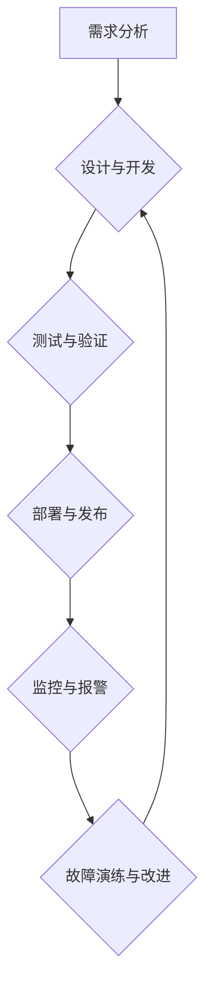

                 

## 站点可靠性工程挑战：大规模系统

> 关键词：可靠性工程, 大规模系统, 容错设计, 故障演练, 监控与报警, 自动化运维, 性能优化, 持续交付

### 1. 背景介绍

在当今数字时代，网站和应用程序已成为人们生活和工作不可或缺的一部分。随着互联网的蓬勃发展和用户需求的不断增长，大规模系统的可靠性问题日益凸显。大规模系统通常由众多相互依赖的组件组成，其复杂性极高，故障的发生和传播速度也更快。因此，如何确保大规模系统的稳定运行、快速恢复和持续可用性，成为站点可靠性工程面临的重大挑战。

传统的软件开发模式往往侧重于功能开发，而忽略了可靠性方面的考虑。随着系统规模的扩大，这种模式已难以满足现代用户的期望。站点可靠性工程 (Site Reliability Engineering，简称 SRE) 应运而生，它将软件工程和运维实践相结合，旨在通过自动化、监控和持续改进，提升系统的可靠性、可用性和性能。

### 2. 核心概念与联系

SRE 的核心概念包括：

* **可靠性 (Reliability):** 系统在预期条件下持续正常运行的能力。
* **可用性 (Availability):** 系统在任何给定时间内能够被用户访问和使用的概率。
* **性能 (Performance):** 系统在处理用户请求时的速度、效率和响应时间。
* **可维护性 (Maintainability):** 系统易于维护、升级和修复的能力。

SRE 强调将可靠性作为软件开发的优先级，并将其融入整个软件生命周期。

**Mermaid 流程图**



### 3. 核心算法原理 & 具体操作步骤

SRE 中常用的算法和技术包括：

**3.1 算法原理概述**

* **容错设计 (Fault Tolerance):** 通过冗余、备份和故障转移机制，确保系统在部分组件故障时仍能正常运行。
* **故障隔离 (Failure Isolation):** 将故障限制在最小范围，避免其影响到整个系统。
* **自动恢复 (Automatic Recovery):** 自动检测和修复故障，减少人工干预。
* **监控与报警 (Monitoring and Alerting):** 实时监控系统状态，并设置报警规则，以便及时发现潜在问题。

**3.2 算法步骤详解**

1. **需求分析:** 首先，需要明确系统的可靠性需求，例如可用性目标、故障恢复时间等。
2. **设计与开发:** 在设计阶段，应考虑容错设计、故障隔离等原则，并选择合适的技术架构和组件。
3. **测试与验证:** 进行全面的测试，包括功能测试、性能测试、可靠性测试等，以确保系统能够满足可靠性需求。
4. **部署与发布:** 使用自动化工具进行部署和发布，减少人为错误的可能性。
5. **监控与报警:** 设置监控指标和报警规则，实时监控系统状态，并及时发现潜在问题。
6. **故障演练与改进:** 定期进行故障演练，模拟各种故障场景，并根据演练结果改进系统设计和运营流程。

**3.3 算法优缺点**

* **优点:** 提高系统可靠性、可用性和性能，降低故障影响，提高运维效率。
* **缺点:** 需要投入更多时间和资源进行设计、开发和维护，需要具备一定的专业知识和技能。

**3.4 算法应用领域**

SRE 技术广泛应用于各种大规模系统，例如：

* 云计算平台
* 在线交易系统
* 社交媒体平台
* 游戏服务器
* 物联网平台

### 4. 数学模型和公式 & 详细讲解 & 举例说明

**4.1 数学模型构建**

可用性 (A) 可以用以下公式表示：

$$A = 1 - \frac{D}{T}$$

其中：

* D: 系统故障时间
* T: 系统运行时间

**4.2 公式推导过程**

可用性是指系统在给定时间段内能够正常运行的概率。如果系统在时间段 T 内发生故障 D 时间，那么系统可用时间为 T - D。因此，可用性可以表示为可用时间与总时间之比。

**4.3 案例分析与讲解**

假设一个网站的运行时间为 24 小时，在一天内发生故障 1 小时，那么其可用性为：

$$A = 1 - \frac{1}{24} = 0.9583$$

这意味着该网站在一天内能够正常运行 95.83% 的时间。

### 5. 项目实践：代码实例和详细解释说明

**5.1 开发环境搭建**

* 操作系统: Linux (Ubuntu 或 CentOS)
* 编程语言: Python
* 工具: Docker, Kubernetes, Prometheus, Grafana

**5.2 源代码详细实现**

以下是一个简单的监控系统代码示例，使用 Python 和 Prometheus 监控网站访问量：

```python
from prometheus_client import Gauge, start_http_server
import time

# 创建一个监控访问量的 Gauge
requests_count = Gauge('website_requests', 'Number of website requests')

# 每秒记录一次访问量
while True:
    requests_count.inc()
    time.sleep(1)

# 启动 Prometheus HTTP 服务器
start_http_server(8000)
```

**5.3 代码解读与分析**

* 该代码使用 Prometheus 的 Gauge 类型监控网站访问量。
* Gauge 类型可以记录一个数值指标，并随着时间的推移进行更新。
* 每秒钟，代码会将访问量加 1，并将其发送到 Prometheus 服务器。

**5.4 运行结果展示**

Prometheus 可以将收集到的监控数据可视化，例如使用 Grafana 创建一个图表，展示网站访问量的趋势。

### 6. 实际应用场景

SRE 技术广泛应用于各种实际场景，例如：

* **云计算平台:** 确保云平台的可靠性、可用性和性能，为用户提供稳定的服务。
* **在线交易系统:** 保证在线交易系统的安全性和可靠性，防止数据丢失和资金损失。
* **社交媒体平台:** 提高社交媒体平台的可用性和性能，确保用户能够流畅地使用平台。

**6.4 未来应用展望**

随着人工智能、机器学习等技术的不断发展，SRE 将更加智能化和自动化。未来，SRE 将更加注重：

* **预测性维护:** 利用机器学习算法预测潜在故障，并提前进行维护。
* **自愈式系统:** 系统能够自动检测和修复故障，无需人工干预。
* **可解释性:** 提高 SRE 系统的可解释性，以便更好地理解系统行为和故障原因。

### 7. 工具和资源推荐

**7.1 学习资源推荐**

* **书籍:**
    * 《Site Reliability Engineering》 by Google SRE Team
    * 《The Phoenix Project》 by Gene Kim, Kevin Behr, and George Spafford
* **在线课程:**
    * Coursera: Site Reliability Engineering Specialization
    * Udemy: Site Reliability Engineering Fundamentals

**7.2 开发工具推荐**

* **监控工具:** Prometheus, Grafana, Datadog, New Relic
* **自动化工具:** Ansible, Puppet, Chef
* **容器编排工具:** Docker, Kubernetes

**7.3 相关论文推荐**

* **Building a Self-Healing System** by Google SRE Team
* **The Site Reliability Engineering Handbook** by Google SRE Team

### 8. 总结：未来发展趋势与挑战

**8.1 研究成果总结**

SRE 已经取得了显著的成果，帮助企业提高了系统的可靠性、可用性和性能。

**8.2 未来发展趋势**

未来，SRE 将更加智能化、自动化和可解释性。

**8.3 面临的挑战**

* **人才短缺:** SRE 需要具备软件工程、运维和系统架构等方面的专业知识，人才短缺是一个普遍的挑战。
* **技术复杂性:** 大规模系统的复杂性不断增加，SRE 需要不断学习和掌握新的技术。
* **文化转变:** SRE 需要企业文化和工作流程的转变，才能真正发挥其价值。

**8.4 研究展望**

未来，SRE 研究将继续关注以下几个方面:

* **人工智能和机器学习在 SRE 中的应用**
* **自愈式系统的研究和开发**
* **SRE 工具和技术的开源和共享**

### 9. 附录：常见问题与解答

* **什么是 SRE?**

SRE (Site Reliability Engineering) 是将软件工程和运维实践相结合，旨在提升系统可靠性、可用性和性能的工程实践。

* **SRE 的目标是什么?**

SRE 的目标是确保系统能够稳定运行、快速恢复和持续可用，满足用户需求。

* **SRE 如何实现可靠性?**

SRE 通过容错设计、故障隔离、自动恢复、监控与报警等技术手段，实现系统的可靠性。


作者：禅与计算机程序设计艺术 / Zen and the Art of Computer Programming 
<end_of_turn>

