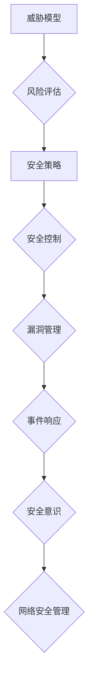

                 

## 网络安全管理：构建全面的数字防御体系

> 关键词：网络安全、威胁模型、风险评估、安全策略、安全控制、漏洞管理、事件响应、安全意识、云安全、数据保护

### 1. 背景介绍

在当今数字化时代，网络安全已成为至关重要的议题。随着互联网的普及和数字化转型进程的加速，网络攻击的频率和复杂性也在不断增加。从个人用户到大型企业，每个人和组织都面临着来自网络威胁的风险。

网络安全管理是指组织为保护其网络系统、数据和应用程序免受未经授权访问、使用、披露、修改或破坏等威胁而采取的一系列措施和策略。它是一个多方面的领域，涉及技术、流程和人员等多个方面。

### 2. 核心概念与联系

网络安全管理的核心概念包括：

* **威胁模型:**  威胁模型是一种描述可能攻击网络系统和数据的方式和手段的框架。它帮助组织识别潜在的威胁，并制定相应的防御策略。
* **风险评估:** 风险评估是指识别、分析和评估网络安全风险的过程。它有助于组织了解其网络安全状况，并优先考虑需要采取的措施。
* **安全策略:** 安全策略是一系列指导组织网络安全实践的原则和准则。它定义了组织对网络安全的期望，并为安全控制提供了框架。
* **安全控制:** 安全控制是指用于保护网络系统和数据的技术、程序和管理措施。它们可以分为技术控制、管理控制和人员控制等类别。
* **漏洞管理:** 漏洞管理是指识别、评估和修复网络系统中的安全漏洞的过程。它有助于降低网络攻击的成功概率。
* **事件响应:** 事件响应是指在发生网络安全事件时采取的措施和流程。它旨在快速识别、隔离和解决安全事件，并尽量减少其影响。
* **安全意识:** 安全意识是指员工对网络安全威胁和风险的了解和重视程度。提高员工的安全意识可以有效降低人为因素导致的安全事故的发生。

**Mermaid 流程图:**

### 3. 核心算法原理 & 具体操作步骤

#### 3.1  算法原理概述

网络安全管理中，许多算法和技术用于实现安全目标。例如，加密算法用于保护数据机密性，身份验证算法用于验证用户身份，入侵检测系统（IDS）使用机器学习算法识别恶意行为。

#### 3.2  算法步骤详解

具体算法的步骤详解取决于所使用的算法类型。例如，RSA加密算法的步骤包括：

1. 选择两个大素数p和q。
2. 计算模数n = p * q。
3. 计算欧拉函数φ(n) = (p - 1) * (q - 1)。
4. 选择一个整数e，满足1 < e < φ(n)且与φ(n)互质。
5. 计算整数d，满足d * e ≡ 1 (mod φ(n))。
6. 公钥为(n, e)，私钥为(n, d)。
7. 加密消息M：C = M^e mod n。
8. 解密消息C：M = C^d mod n。

#### 3.3  算法优缺点

不同的算法具有不同的优缺点。例如，RSA算法安全性高，但计算量大，速度较慢。AES算法速度快，但安全性相对较低。

#### 3.4  算法应用领域

网络安全管理中使用的算法广泛应用于各个领域，例如：

* **数据加密:** 保护数据机密性。
* **身份验证:** 验证用户身份。
* **入侵检测:** 识别恶意行为。
* **访问控制:** 控制用户对资源的访问权限。

### 4. 数学模型和公式 & 详细讲解 & 举例说明

#### 4.1  数学模型构建

网络安全管理中，可以使用数学模型来描述和分析安全问题。例如，可以构建一个概率模型来评估网络攻击的风险，或者构建一个博弈论模型来分析攻击者和防御者之间的博弈关系。

#### 4.2  公式推导过程

在构建数学模型时，需要使用相应的公式来描述模型的各个方面。例如，在风险评估模型中，可以使用以下公式来计算风险等级：

$$Risk Level = Threat Level * Vulnerability Level * Impact Level$$

其中：

* **Threat Level:** 威胁的严重程度。
* **Vulnerability Level:** 系统的脆弱性程度。
* **Impact Level:** 安全事件发生的潜在影响程度。

#### 4.3  案例分析与讲解

例如，假设一个网络系统面临着来自恶意软件的威胁，系统存在漏洞，并且一旦被攻击，可能会导致数据泄露。根据上述公式，我们可以计算出该系统的风险等级。

假设：

* **Threat Level:** 高
* **Vulnerability Level:** 中
* **Impact Level:** 高

则风险等级为：

$$Risk Level = High * Medium * High = High$$

因此，该系统面临着较高的安全风险，需要采取相应的措施来降低风险。

### 5. 项目实践：代码实例和详细解释说明

#### 5.1  开发环境搭建

网络安全管理项目实践通常需要搭建特定的开发环境，例如：

* **虚拟机:** 用于模拟网络环境。
* **网络安全工具:** 例如漏洞扫描工具、入侵检测系统等。
* **编程语言:** 例如Python、C++等。

#### 5.2  源代码详细实现

具体代码实现取决于项目的具体需求。例如，可以编写一个简单的脚本来扫描网络系统中的漏洞，或者开发一个入侵检测系统来识别恶意行为。

#### 5.3  代码解读与分析

需要对代码进行详细解读和分析，了解代码的功能、逻辑和潜在的风险。

#### 5.4  运行结果展示

需要运行代码并展示运行结果，例如漏洞扫描结果、入侵检测报告等。

### 6. 实际应用场景

网络安全管理在各个行业都有广泛的应用场景，例如：

* **金融行业:** 保护金融数据和交易安全。
* **医疗行业:** 保护患者隐私和医疗数据安全。
* **政府机构:** 保护国家机密和公共安全。
* **企业:** 保护企业数据和业务系统安全。

#### 6.4  未来应用展望

随着技术的不断发展，网络安全管理将面临新的挑战和机遇。例如：

* **云安全:** 云计算的普及带来了新的安全挑战，需要开发新的云安全解决方案。
* **物联网安全:** 物联网设备数量不断增加，需要加强物联网安全管理。
* **人工智能安全:** 人工智能技术的应用也带来了新的安全风险，需要研究人工智能安全问题。

### 7. 工具和资源推荐

#### 7.1  学习资源推荐

* **书籍:** 《网络安全基础》、《网络安全实战》、《计算机网络》等。
* **在线课程:** Coursera、edX、Udemy等平台提供网络安全相关的在线课程。
* **网站:** SANS Institute、NIST、OWASP等网站提供网络安全相关的资讯和资源。

#### 7.2  开发工具推荐

* **漏洞扫描工具:** Nessus、OpenVAS、Nikto等。
* **入侵检测系统:** Snort、Suricata、Zeek等。
* **安全信息和事件管理系统 (SIEM):** Splunk、LogRhythm、IBM QRadar等。

#### 7.3  相关论文推荐

* **网络安全相关论文:** 可以通过学术数据库如IEEE Xplore、ACM Digital Library等搜索相关论文。

### 8. 总结：未来发展趋势与挑战

#### 8.1  研究成果总结

网络安全管理领域取得了显著的成果，例如：

* **威胁模型和风险评估方法的完善:** 帮助组织更准确地识别和评估网络安全风险。
* **安全控制技术的不断发展:** 提供更有效的防护手段。
* **事件响应流程的优化:** 提高事件响应效率。

#### 8.2  未来发展趋势

未来网络安全管理的发展趋势包括：

* **人工智能和机器学习的应用:** 自动化安全检测和响应。
* **云安全和物联网安全的加强:** 面对新的安全挑战。
* **安全意识的提升:** 培养员工的安全意识和行为。

#### 8.3  面临的挑战

网络安全管理面临的挑战包括：

* **攻击手段的不断升级:** 需要不断更新安全技术和策略。
* **人才短缺:** 需要培养更多网络安全人才。
* **法律法规的完善:** 需要完善网络安全相关的法律法规。

#### 8.4  研究展望

未来网络安全管理的研究方向包括：

* **更有效的威胁模型和风险评估方法:** 帮助组织更全面地了解网络安全风险。
* **更智能的自动化安全系统:** 自动化安全检测和响应，提高效率和准确性。
* **更完善的网络安全法律法规:** 提供更有效的法律保障。

### 9. 附录：常见问题与解答

* **常见问题:** 
    * 如何选择合适的网络安全解决方案？
    * 如何提高员工的安全意识？
    * 如何应对网络攻击？

* **解答:** 
    * 选择网络安全解决方案时，需要根据组织的具体需求和环境进行评估。
    * 可以通过培训、宣传、案例分析等方式提高员工的安全意识。
    * 在发生网络攻击时，需要及时采取事件响应措施，并进行调查和分析，以防止进一步的损失。

作者：禅与计算机程序设计艺术 / Zen and the Art of Computer Programming 
<end_of_turn>

