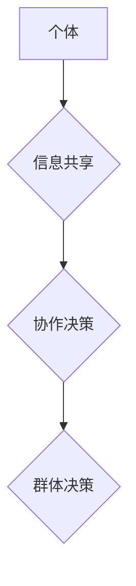

                 

## 群体智慧：集体决策的优势与陷阱

> 关键词：群体智慧、集体决策、算法、机器学习、人工智能、协作、优化、风险

### 1. 背景介绍

在当今数据爆炸和计算能力飞速发展的时代，群体智慧的概念逐渐成为人们关注的焦点。群体智慧是指由多个个体组成的群体，通过协作和信息共享，能够做出比单个个体更智能、更优的决策。这种现象在自然界中随处可见，例如蜂群的集体觅食、鸟群的集体迁徙等。

在计算机领域，群体智慧也展现出巨大的潜力。从机器学习算法的训练到网络安全威胁的检测，从金融市场预测到药物研发，群体智慧的应用场景日益广泛。然而，群体智慧的实现并非易事，它也面临着一些挑战和风险。

### 2. 核心概念与联系

群体智慧的核心概念是“集体决策”。它强调的是个体之间的协作和信息共享，以及如何从这些信息中提取出更有效的决策。

**群体智慧的架构**



**核心概念原理:**

* **个体多样性:** 群体成员的知识、经验和观点的多样性是群体智慧的关键。不同的个体能够提供不同的视角和解决方案，从而提高决策的质量。
* **信息共享:** 个体之间需要能够有效地共享信息，以便共同理解问题和探索解决方案。
* **协作机制:** 群体需要一套有效的协作机制，以确保个体能够有效地合作和决策。

### 3. 核心算法原理 & 具体操作步骤

群体智慧的实现离不开各种算法和技术。以下是一些常用的群体智慧算法：

#### 3.1  算法原理概述

* **蚁群算法:** 借鉴了蚂蚁寻找食物的群体行为，通过模拟蚂蚁在路径上的选择和信息传递，找到最优解。
* **粒子群算法:** 借鉴了鸟群的觅食行为，通过模拟粒子在搜索空间中的运动和更新，找到最优解。
* **遗传算法:** 借鉴了生物的进化机制，通过模拟基因突变、交叉和选择，找到最优解。

#### 3.2  算法步骤详解

以蚁群算法为例，其具体步骤如下：

1. **初始化:** 创建一个蚂蚁群体，每个蚂蚁随机选择一个起点。
2. **信息更新:** 蚂蚁在路径上留下信息素，信息素浓度越高，路径越容易被选择。
3. **路径选择:** 蚂蚁根据信息素浓度和路径长度选择下一个节点。
4. **循环迭代:** 重复步骤2和3，直到找到最优解。

#### 3.3  算法优缺点

* **优点:** 能够解决复杂优化问题，具有较强的鲁棒性。
* **缺点:** 算法参数的设置对结果影响较大，收敛速度较慢。

#### 3.4  算法应用领域

群体智慧算法广泛应用于以下领域：

* **机器学习:** 训练机器学习模型，例如分类、回归和聚类。
* **网络优化:** 优化网络路由、流量分配和资源调度。
* **金融预测:** 预测股票价格、汇率和风险。
* **工程设计:** 优化结构设计、生产流程和物流方案。

### 4. 数学模型和公式 & 详细讲解 & 举例说明

群体智慧算法的数学模型通常基于概率和统计学原理。以下是一些常用的数学模型和公式：

#### 4.1  数学模型构建

* **蚁群算法:** 蚂蚁在路径上的选择概率可以用以下公式表示：

$$p_{ij} = \frac{\tau_{ij}^{\alpha} \eta_{ij}^{\beta}}{\sum_{k \in \text{allowed}(i)} \tau_{ik}^{\alpha} \eta_{ik}^{\beta}}$$

其中：

* $p_{ij}$ 是蚂蚁从节点 $i$ 到节点 $j$ 的选择概率。
* $\tau_{ij}$ 是节点 $i$ 到节点 $j$ 的信息素浓度。
* $\eta_{ij}$ 是节点 $i$ 到节点 $j$ 的启发式信息，例如路径长度。
* $\alpha$ 和 $\beta$ 是控制信息素和启发式信息的权重的参数。

* **粒子群算法:** 粒子的速度和位置更新公式如下：

$$v_{i}(t+1) = w \cdot v_{i}(t) + c_1 \cdot r_1 \cdot (p_{best} - x_{i}(t)) + c_2 \cdot r_2 \cdot (g_{best} - x_{i}(t))$$

$$x_{i}(t+1) = x_{i}(t) + v_{i}(t+1)$$

其中：

* $v_{i}(t)$ 是粒子 $i$ 在时间 $t$ 的速度。
* $x_{i}(t)$ 是粒子 $i$ 在时间 $t$ 的位置。
* $w$ 是惯性权重。
* $c_1$ 和 $c_2$ 是学习因子。
* $r_1$ 和 $r_2$ 是随机数。
* $p_{best}$ 是粒子 $i$ 找到的最佳位置。
* $g_{best}$ 是整个群体的最佳位置。

#### 4.2  公式推导过程

这些公式的推导过程通常基于微积分和概率论的原理。

#### 4.3  案例分析与讲解

可以通过具体的案例分析，例如优化物流路线或预测股票价格，来解释这些数学模型和公式的应用。

### 5. 项目实践：代码实例和详细解释说明

#### 5.1  开发环境搭建

可以使用 Python 语言和相关的库，例如 PyAntColony 和 PySwarms，来实现群体智慧算法。

#### 5.2  源代码详细实现

以下是一个简单的蚁群算法的 Python 代码实例：

```python
import random

class AntColony:
    def __init__(self, num_ants, num_cities, alpha, beta):
        self.num_ants = num_ants
        self.num_cities = num_cities
        self.alpha = alpha
        self.beta = beta
        self.distances = [[random.randint(1, 10) for _ in range(num_cities)] for _ in range(num_cities)]
        self.pheromones = [[1 for _ in range(num_cities)] for _ in range(num_cities)]

    def run(self):
        for _ in range(100):
            for ant in range(self.num_ants):
                path = self.generate_path(ant)
                self.update_pheromones(path)

    def generate_path(self, ant):
        path = [random.randint(0, self.num_cities - 1)]
        visited = set([path[-1]])
        while len(path) < self.num_cities:
            next_city = self.choose_next_city(ant, visited)
            path.append(next_city)
            visited.add(next_city)
        return path

    def choose_next_city(self, ant, visited):
        probabilities = []
        for city in range(self.num_cities):
            if city not in visited:
                probability = self.calculate_probability(ant, city)
                probabilities.append(probability)
        return random.choices(range(self.num_cities), weights=probabilities)[0]

    def calculate_probability(self, ant, city):
        return (self.pheromones[path[-1]][city] ** self.alpha) * (1 / self.distances[path[-1]][city] ** self.beta)

    def update_pheromones(self, path):
        for i in range(len(path) - 1):
            self.pheromones[path[i]][path[i + 1]] += 1

```

#### 5.3  代码解读与分析

这段代码实现了蚁群算法的基本流程，包括初始化、路径生成、选择下一个城市和更新信息素。

#### 5.4  运行结果展示

运行这段代码可以得到一个最优路径，例如从城市 0 到城市 9 的最短路径。

### 6. 实际应用场景

群体智慧的应用场景非常广泛，以下是一些具体的例子：

#### 6.1  金融市场预测

利用群体智慧算法训练机器学习模型，可以预测股票价格、汇率和风险。

#### 6.2  网络安全威胁检测

通过模拟多个安全分析引擎的协作，可以提高网络安全威胁检测的准确性和效率。

#### 6.3  药物研发

群体智慧算法可以用于筛选潜在的药物候选物，加速药物研发过程。

#### 6.4  未来应用展望

随着人工智能和机器学习技术的不断发展，群体智慧的应用场景将更加广泛，例如：

* **自动驾驶:** 利用群体智慧算法训练自动驾驶系统的决策模型，提高其安全性、可靠性和智能性。
* **个性化推荐:** 基于用户的行为数据和偏好，利用群体智慧算法提供更精准的个性化推荐。
* **城市规划:** 利用群体智慧算法优化城市交通、能源和资源分配，提高城市效率和可持续性。

### 7. 工具和资源推荐

#### 7.1  学习资源推荐

* **书籍:**
    * 《群体智慧》 by  John Kennedy
    * 《人工智能：一种现代方法》 by Stuart Russell and Peter Norvig
* **在线课程:**
    * Coursera: Machine Learning
    * edX: Artificial Intelligence

#### 7.2  开发工具推荐

* **Python:** 
    * PyAntColony
    * PySwarms
* **R:** 
    * swarm

#### 7.3  相关论文推荐

* **Ant Colony Optimization: A Metaheuristic Approach to Problem Solving** by Marco Dorigo
* **Particle Swarm Optimization** by James Kennedy and Russell Eberhart

### 8. 总结：未来发展趋势与挑战

群体智慧作为一种新兴的智能技术，具有巨大的潜力，但也面临着一些挑战：

#### 8.1  研究成果总结

* 群体智慧算法能够解决复杂优化问题，具有较强的鲁棒性和泛化能力。
* 群体智慧的应用场景日益广泛，涵盖了多个领域，例如机器学习、网络优化、金融预测等。

#### 8.2  未来发展趋势

* **算法效率提升:** 研究更有效的群体智慧算法，提高其收敛速度和解的质量。
* **算法鲁棒性增强:** 研究更鲁棒的群体智慧算法，使其能够应对更复杂和不确定性的环境。
* **应用场景拓展:** 将群体智慧技术应用于更多新的领域，例如自动驾驶、个性化推荐、城市规划等。

#### 8.3  面临的挑战

* **算法参数设置:** 群体智慧算法的参数设置对结果影响较大，需要进行大量的实验和调优。
* **数据依赖性:** 群体智慧算法需要大量的训练数据，数据质量和数量直接影响算法的性能。
* **解释性问题:** 群体智慧算法的决策过程往往比较复杂，难以解释和理解。

#### 8.4  研究展望

未来研究将重点关注以下几个方面：

* **开发更有效的群体智慧算法:** 研究新的启发式策略、信息更新机制和群体结构，提高算法的效率和鲁棒性。
* **结合深度学习:** 将群体智慧算法与深度学习技术相结合，提高算法的学习能力和泛化能力。
* **增强算法的可解释性:** 研究群体智慧算法的决策机制，提高其可解释性和透明度。


### 9. 附录：常见问题与解答

#### 9.1  群体智慧算法与传统算法相比有什么优势？

群体智慧算法能够解决传统算法难以解决的复杂优化问题，具有较强的鲁棒性和泛化能力。

#### 9.2  群体智慧算法有哪些局限性？

群体智慧算法的算法参数设置对结果影响较大，需要进行大量的实验和调优。此外，群体智慧算法的数据依赖性强，需要大量的训练数据。

#### 9.3  群体智慧算法的应用场景有哪些？

群体智慧算法的应用场景非常广泛，例如机器学习、网络优化、金融预测、药物研发等。

作者：禅与计算机程序设计艺术 / Zen and the Art of Computer Programming


<end_of_turn>

