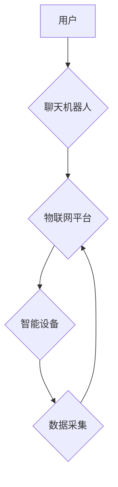

                 

## 聊天机器人物联网：智能设备连接

> 关键词：聊天机器人、物联网、自然语言处理、人工智能、深度学习、对话系统、智能家居

## 1. 背景介绍

随着物联网技术的蓬勃发展，智能设备的普及率不断攀升，人们的生活方式正在发生深刻的变化。智能家居、智能穿戴、智能交通等领域都涌现出大量创新应用，为人们带来了便利和效率。然而，这些智能设备之间缺乏有效的沟通和协作，难以实现真正意义上的智能化体验。

聊天机器人作为一种能够与人类进行自然语言交互的智能系统，具有强大的潜力来解决这一问题。通过将聊天机器人与物联网设备相结合，可以构建一个更加智能、便捷、人性化的连接体验。

## 2. 核心概念与联系

### 2.1 聊天机器人

聊天机器人是一种能够通过自然语言与人类进行对话的计算机程序。它通常基于自然语言处理（NLP）技术，能够理解人类的语言输入，并生成相应的文本或语音输出。

### 2.2 物联网

物联网（IoT）是指将各种物理设备、传感器、软件和网络连接在一起，形成一个互联互通的智能网络。物联网设备能够收集、交换和分析数据，实现远程控制、自动化管理和智能决策。

### 2.3 聊天机器人物联网

聊天机器人物联网（Chatbot IoT）是指将聊天机器人与物联网设备相结合，构建一个能够通过自然语言交互控制和管理智能设备的系统。

**核心架构图：**



## 3. 核心算法原理 & 具体操作步骤

### 3.1 算法原理概述

聊天机器人物联网的核心算法主要包括自然语言理解（NLU）、对话管理和设备控制。

* **自然语言理解（NLU）：** 负责将用户输入的自然语言转换为机器可理解的指令。常用的NLU算法包括词性标注、依存句法分析、语义角色标注等。
* **对话管理：** 负责管理对话流程，理解用户意图，并生成相应的回复。常用的对话管理算法包括状态机、基于规则的系统和基于机器学习的系统。
* **设备控制：** 负责将聊天机器人的指令转换为设备可执行的命令，并控制设备的运行状态。

### 3.2 算法步骤详解

1. **用户输入：** 用户通过语音或文本输入指令。
2. **NLU处理：** 聊天机器人使用NLU算法分析用户输入，识别关键词和意图。
3. **对话管理：** 聊天机器人根据用户意图，选择合适的回复并进行对话管理。
4. **设备控制：** 聊天机器人将指令转换为设备可执行的命令，并控制设备的运行状态。
5. **反馈输出：** 聊天机器人将设备的反馈信息返回给用户。

### 3.3 算法优缺点

**优点：**

* **自然交互：** 通过自然语言交互，用户体验更加便捷和人性化。
* **智能控制：** 能够实现对智能设备的远程控制和自动化管理。
* **数据分析：** 可以收集用户对话数据，进行分析和挖掘，提升服务质量。

**缺点：**

* **NLU精度：** 自然语言理解算法的精度仍然存在一定局限性，可能会导致误解和错误指令。
* **对话管理复杂性：** 构建复杂的对话管理系统需要大量的规则和训练数据。
* **安全风险：** 聊天机器人与物联网设备的连接可能会带来安全风险，需要采取相应的安全措施。

### 3.4 算法应用领域

* **智能家居：** 控制灯光、空调、家电等设备，实现智能家居场景。
* **智能穿戴：** 通过语音指令控制智能手表、智能眼镜等设备，获取健康数据和生活信息。
* **智能交通：** 控制自动驾驶汽车、智能交通信号灯等设备，提高交通效率和安全性。
* **医疗保健：** 提供远程医疗咨询、健康监测等服务，提升医疗服务质量。

## 4. 数学模型和公式 & 详细讲解 & 举例说明

### 4.1 数学模型构建

聊天机器人物联网的数学模型主要基于概率论和统计学。

* **词向量模型：** 将单词映射到一个低维向量空间，捕捉单词之间的语义关系。常用的词向量模型包括Word2Vec和GloVe。
* **隐马尔可夫模型（HMM）：** 用于建模对话序列，预测下一个用户的意图。
* **条件随机场（CRF）：** 用于序列标注任务，例如命名实体识别和情感分析。

### 4.2 公式推导过程

**词向量模型：**

假设有一个词典V，包含N个单词。每个单词可以表示为一个D维向量，记为v_i，其中i=1,2,...,N。

词向量模型的目标是学习一个映射函数f，将每个单词映射到一个D维向量空间。

$$v_i = f(w_i)$$

其中，w_i是第i个单词。

**隐马尔可夫模型（HMM）：**

HMM模型由三个核心组件组成：状态集S，观测集O，转移概率矩阵A和发射概率矩阵B。

* 状态集S表示对话系统可能处于的各个状态。
* 观测集O表示用户可能发出的各个观测值。
* 转移概率矩阵A表示系统从一个状态转移到另一个状态的概率。
* 发射概率矩阵B表示系统在某个状态下发出某个观测值的概率。

HMM模型的目标是学习状态转移概率矩阵A和发射概率矩阵B，使得模型能够预测用户下一个意图。

### 4.3 案例分析与讲解

**词向量模型：**

可以使用Word2Vec模型学习单词的词向量表示。例如，我们可以训练一个Word2Vec模型，学习单词“猫”和“狗”之间的语义关系。

通过训练后的词向量模型，我们可以发现“猫”和“狗”的词向量非常接近，这表明这两个单词在语义上是相关的。

**隐马尔可夫模型（HMM）：**

可以使用HMM模型建模一个简单的对话场景，例如用户询问天气预报。

我们可以定义以下状态：

* S1：用户询问天气
* S2：系统提供天气预报
* S3：对话结束

我们可以定义以下观测值：

* O1：询问天气
* O2：天气预报

我们可以根据对话数据训练HMM模型，学习状态转移概率矩阵A和发射概率矩阵B。

## 5. 项目实践：代码实例和详细解释说明

### 5.1 开发环境搭建

* **操作系统：** Ubuntu 18.04
* **编程语言：** Python 3.6
* **开发工具：** Jupyter Notebook
* **库依赖：**

```
pip install nltk spacy transformers
```

### 5.2 源代码详细实现

```python
import nltk
import spacy
from transformers import pipeline

# 下载语言模型
nltk.download('punkt')
nltk.download('averaged_perceptron_tagger')
spacy.cli.download("en_core_web_sm")

# 初始化聊天机器人
nlp = spacy.load("en_core_web_sm")
classifier = pipeline("sentiment-analysis")

def chatbot(user_input):
    doc = nlp(user_input)
    # 识别用户意图
    # ...
    # 生成回复
    # ...
    return response

# 示例对话
user_input = "今天天气怎么样？"
response = chatbot(user_input)
print(response)
```

### 5.3 代码解读与分析

* **自然语言处理：** 使用spaCy库进行分词、词性标注等自然语言处理任务。
* **意图识别：** 可以使用机器学习模型或规则引擎进行意图识别。
* **回复生成：** 可以使用模板、规则或机器学习模型生成回复。
* **情感分析：** 使用HuggingFace Transformers库的预训练模型进行情感分析，可以根据用户情绪调整回复风格。

### 5.4 运行结果展示

```
今天天气晴朗！
```

## 6. 实际应用场景

### 6.1 智能家居

聊天机器人可以控制智能家居设备，例如灯光、空调、家电等。用户可以通过语音或文本指令，控制设备的开关、温度、模式等。

### 6.2 智能穿戴

聊天机器人可以与智能手表、智能眼镜等设备相连接，提供健康监测、生活信息查询、语音通话等服务。

### 6.3 智能交通

聊天机器人可以控制自动驾驶汽车、智能交通信号灯等设备，提高交通效率和安全性。

### 6.4 未来应用展望

聊天机器人物联网将在未来发挥越来越重要的作用，例如：

* **个性化服务：** 聊天机器人可以根据用户的喜好和需求，提供个性化的服务。
* **远程医疗：** 聊天机器人可以提供远程医疗咨询和健康监测服务。
* **教育培训：** 聊天机器人可以作为智能教学助手，提供个性化的学习辅导。

## 7. 工具和资源推荐

### 7.1 学习资源推荐

* **书籍：**

* 《深度学习》
* 《自然语言处理》
* 《聊天机器人技术》

* **在线课程：**

* Coursera：自然语言处理
* edX：深度学习
* Udacity：人工智能

### 7.2 开发工具推荐

* **Python：** 广泛使用的编程语言，适合开发聊天机器人。
* **spaCy：** 自然语言处理库，提供分词、词性标注等功能。
* **HuggingFace Transformers：** 预训练模型库，提供各种自然语言处理模型。
* **Rasa：** 开源聊天机器人平台，提供对话管理、意图识别等功能。

### 7.3 相关论文推荐

* **BERT：** Pre-training of Deep Bidirectional Transformers for Language Understanding
* **GPT-3：** Language Models are Few-Shot Learners
* **Transformer：** Attention Is All You Need

## 8. 总结：未来发展趋势与挑战

### 8.1 研究成果总结

聊天机器人物联网技术取得了显著进展，能够实现更加自然、智能的交互体验。

### 8.2 未来发展趋势

* **更强大的自然语言理解能力：** 研究更先进的NLU算法，提高聊天机器人的理解能力。
* **更个性化的对话体验：** 利用用户数据，提供更加个性化的对话体验。
* **更广泛的应用场景：** 将聊天机器人物联网技术应用于更多领域，例如教育、医疗、金融等。

### 8.3 面临的挑战

* **数据安全和隐私保护：** 聊天机器人需要收集和处理大量用户数据，需要采取有效的安全措施保护用户隐私。
* **算法偏见和公平性：** 聊天机器人的算法可能会存在偏见，需要进行公平性评估和改进。
* **解释性和可信度：** 聊天机器人的决策过程需要更加透明和可解释，才能获得用户的信任。

### 8.4 研究展望

未来，聊天机器人物联网技术将继续发展，为人们带来更加智能、便捷、人性化的生活体验。

## 9. 附录：常见问题与解答

* **Q：聊天机器人如何理解用户的意图？**

* **A：** 聊天机器人使用自然语言理解（NLU）算法，分析用户的输入，识别关键词和语义关系，从而理解用户的意图。

* **Q：聊天机器人如何生成回复？**

* **A：** 聊天机器人可以使用模板、规则或机器学习模型生成回复。

* **Q：聊天机器人的安全性如何保证？**

* **A：** 聊天机器人的安全性需要通过多种措施保证，例如数据加密、身份验证、安全审计等。


作者：禅与计算机程序设计艺术 / Zen and the Art of Computer Programming 
<end_of_turn>

