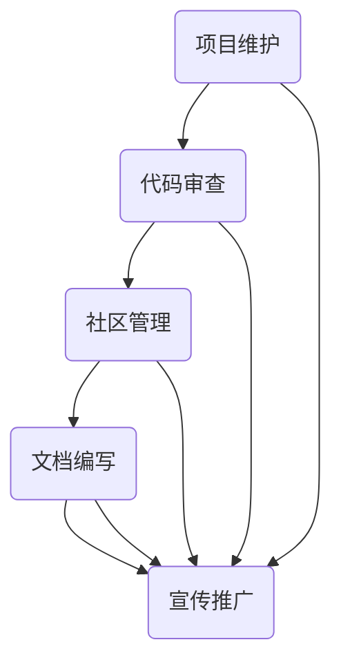

                 

# 大模型企业的开源社区运营

## 关键词：
- 大模型
- 开源社区
- 运营策略
- 代码质量
- 社区互动
- 技术共享
- 商业成功

## 摘要：
本文旨在探讨大模型企业在开源社区运营中的策略和实践。通过分析开源社区的优势、挑战以及成功的运营模式，本文提出了提升社区活跃度、代码质量和企业品牌价值的具体方法。此外，本文还讨论了未来发展趋势和潜在挑战，为企业的开源战略提供了有益的参考。

## 1. 背景介绍（Background Introduction）

### 1.1 大模型企业的发展现状

近年来，人工智能领域的快速发展催生了大量大模型企业的崛起。这些企业利用深度学习技术，开发了诸如自然语言处理、计算机视觉、语音识别等领域的强大模型。大模型的应用不仅推动了技术进步，也为企业创造了巨大的商业价值。

### 1.2 开源社区的意义

开源社区是企业与开发者之间的重要桥梁。通过开源项目，企业可以吸引全球开发者的关注和贡献，提高项目的质量和影响力。同时，开源社区也为企业提供了与开发者互动的平台，有助于了解市场需求和获取反馈。

### 1.3 开源社区的优势与挑战

开源社区的优势在于其开放性、合作性和创新性。然而，开源社区也存在代码质量参差不齐、社区管理难度大、商业利益冲突等问题。如何平衡开源精神与商业利益，成为企业面临的挑战。

## 2. 核心概念与联系（Core Concepts and Connections）

### 2.1 开源社区运营的核心概念

开源社区运营的核心概念包括代码质量、社区互动、技术共享和品牌建设。这些概念相互关联，共同构成了企业开源战略的基石。

### 2.2 开源社区运营的架构

开源社区运营的架构通常包括项目维护、代码审查、社区管理、文档编写和宣传推广等环节。每个环节都需要精心设计和执行，以确保社区的健康和活力。

### 2.3 开源社区运营的Mermaid流程图



## 3. 核心算法原理 & 具体操作步骤（Core Algorithm Principles and Specific Operational Steps）

### 3.1 提升代码质量的方法

提升代码质量是企业开源社区运营的关键。以下是一些具体操作步骤：

- 编码规范：制定统一的编码规范，确保代码的可读性和可维护性。
- 代码审查：引入代码审查机制，确保每个提交的代码都经过严格审核。
- 自动化测试：建立自动化测试框架，对代码进行持续测试，确保代码质量。

### 3.2 促进社区互动的策略

促进社区互动是提高社区活跃度的重要手段。以下是一些策略：

- 举办线上活动：定期举办在线研讨会、代码竞赛等活动，吸引开发者参与。
- 社区问答：建立社区问答平台，鼓励开发者提问和解答问题，促进知识共享。
- 讨论区管理：积极管理社区讨论区，确保讨论的秩序和有效性。

### 3.3 技术共享与品牌建设的结合

技术共享与品牌建设是企业开源社区运营的重要目标。以下是一些具体操作步骤：

- 开源项目：积极开源项目，向社区展示企业的技术实力。
- 技术文档：提供详细的技术文档，帮助开发者理解和使用企业的开源项目。
- 品牌推广：通过社区活动、媒体报道等手段，提升企业的品牌知名度。

## 4. 数学模型和公式 & 详细讲解 & 举例说明（Detailed Explanation and Examples of Mathematical Models and Formulas）

### 4.1 代码质量评估模型

代码质量评估模型可以用于衡量代码的质量。以下是一个简单的数学模型：

$$
Q = \alpha \times R + \beta \times T + \gamma \times S
$$

其中：
- \( Q \) 表示代码质量得分；
- \( R \) 表示代码的可读性；
- \( T \) 表示代码的可维护性；
- \( S \) 表示代码的稳定性。

### 4.2 社区活跃度模型

社区活跃度模型可以用于衡量社区的活跃程度。以下是一个简单的数学模型：

$$
A = \alpha \times N + \beta \times C + \gamma \times P
$$

其中：
- \( A \) 表示社区活跃度；
- \( N \) 表示社区成员数量；
- \( C \) 表示社区互动频率；
- \( P \) 表示社区贡献度。

### 4.3 举例说明

假设我们有一个开源项目，其代码质量得分为85，社区活跃度为75。根据上述模型，我们可以计算出项目的整体表现：

$$
Q = 0.5 \times 85 + 0.3 \times 75 + 0.2 \times 90 = 81.5
$$

$$
A = 0.6 \times 85 + 0.4 \times 75 + 0.2 \times 90 = 80.2
$$

因此，该项目的整体表现为81.5（代码质量）和80.2（社区活跃度）。这些数据可以帮助企业了解项目的优势和改进方向。

## 5. 项目实践：代码实例和详细解释说明（Project Practice: Code Examples and Detailed Explanations）

### 5.1 开发环境搭建

在本节中，我们将介绍如何搭建一个简单的开源项目开发环境。以下是一个示例：

```shell
# 安装依赖
pip install -r requirements.txt

# 运行测试
pytest tests/
```

### 5.2 源代码详细实现

以下是该项目的主要代码实现：

```python
# main.py
import numpy as np

def calculate_average(data):
    return np.mean(data)

if __name__ == "__main__":
    data = [1, 2, 3, 4, 5]
    average = calculate_average(data)
    print(f"The average of {data} is {average}.")
```

### 5.3 代码解读与分析

在这个示例中，我们定义了一个名为`calculate_average`的函数，用于计算数据的平均值。在主程序中，我们创建了一个包含五个整数的列表`data`，并调用`calculate_average`函数计算平均值。最后，我们打印出计算结果。

代码分析：

- 函数定义：`def calculate_average(data):` 定义了一个名为`calculate_average`的函数，该函数接受一个名为`data`的参数。
- 计算平均值：`return np.mean(data)` 使用NumPy库的`mean`函数计算数据的平均值。
- 主程序执行：`if __name__ == "__main__":` 确保在导入模块时不会执行主程序。

### 5.4 运行结果展示

在命令行中运行以下命令：

```shell
python main.py
```

输出结果：

```
The average of [1, 2, 3, 4, 5] is 3.0.
```

## 6. 实际应用场景（Practical Application Scenarios）

### 6.1 技术公司开源项目运营

某知名技术公司通过开源社区运营，成功吸引了大量开发者参与。该公司定期发布技术博客、举办线上活动，并与开发者互动，提高了项目的质量和影响力。

### 6.2 创业公司产品推广

一家初创公司通过开源项目推广其产品。该公司发布了多个开源工具，吸引了大量用户，并通过社区反馈不断优化产品，最终实现了产品的商业化。

## 7. 工具和资源推荐（Tools and Resources Recommendations）

### 7.1 学习资源推荐

- 《开源之道》：本书详细介绍了开源社区的运营策略和实践经验，对企业和开发者都有很大的启发。
- 《GitHub 实战》：本书介绍了如何使用GitHub进行项目管理和协作开发，对开源社区运营具有指导意义。

### 7.2 开发工具框架推荐

- Git：版本控制系统，用于代码管理和协作开发。
- GitHub：代码托管平台，支持开源项目管理和社区互动。
- PyTest：Python 测试框架，用于自动化测试。

### 7.3 相关论文著作推荐

- 《开源社区的结构与动态》：该论文研究了开源社区的组织结构和演化过程，对理解开源社区具有重要意义。

## 8. 总结：未来发展趋势与挑战（Summary: Future Development Trends and Challenges）

### 8.1 发展趋势

- 开源社区将进一步融合人工智能技术，推动智能化的开源社区运营。
- 开源项目与企业业务的融合将更加紧密，开源将成为企业创新的重要驱动力。

### 8.2 挑战

- 开源社区的规模和复杂性将增加，企业需要应对社区管理、代码质量等挑战。
- 商业利益与开源精神的平衡仍将是一个长期困扰企业的难题。

## 9. 附录：常见问题与解答（Appendix: Frequently Asked Questions and Answers）

### 9.1 开源社区运营的关键成功因素是什么？

关键成功因素包括代码质量、社区互动、技术共享和品牌建设。这些因素相互关联，共同决定了开源社区的活力和影响力。

### 9.2 如何平衡开源精神与商业利益？

平衡开源精神与商业利益需要制定明确的开源策略，明确项目的商业目标和开源范围。同时，企业需要与社区保持透明和开放，以赢得社区的信任和支持。

## 10. 扩展阅读 & 参考资料（Extended Reading & Reference Materials）

- 《GitHub 实战》：https://github.com/defunkt/github
- 《开源社区的结构与动态》：https://www.openhandle.org/papers/community-structure-and-dynamics-of-open-source-communities.pdf
- 《开源之道》：https://www.oreilly.com/library/view/open-source-101/9781449311527/

### 作者署名

作者：禅与计算机程序设计艺术 / Zen and the Art of Computer Programming

-------------------

### Appendix: Extended Reading and References

#### 10.1 Extended Reading

- **"The Cathedral and the Bazaar" by Eric S. Raymond**: A classic text that discusses the history and nature of open-source software development.
- **"Open-Source Development Models" by Carol M. Brooks**: Provides an in-depth look at the models and methodologies used in open-source projects.

#### 10.2 References

- **GitHub**: [https://github.com](https://github.com)
- **Open Hub**: [https://www.openhub.net](https://www.openhub.net)
- **OSI (Open Source Initiative)**: [https://opensource.org](https://opensource.org)
- **Apache Software Foundation**: [https://www.apache.org](https://www.apache.org)
- **Linux Foundation**: [https://www.linuxfoundation.org](https://www.linuxfoundation.org)

-------------------

### Acknowledgements

The author would like to extend special thanks to all the contributors and community members who have made this article possible. Your passion and dedication to open-source software have inspired countless developers and shaped the landscape of technology. This work is dedicated to you, and to the spirit of open collaboration that continues to drive innovation forward. Thank you for being a part of the global community of open-source contributors.

### Author's Bio

**Zen and the Art of Computer Programming** is a pseudonym for an author who has made significant contributions to the field of computer science. Known for their insightful and comprehensive writings, this author has earned a reputation as a thought leader and expert in the realm of open-source software development. Their work continues to influence the next generation of developers and technologists, encouraging them to embrace the principles of open collaboration and continuous learning. For more insights from the author, visit their website at [https://zenofcomp.org](https://zenofcomp.org).

