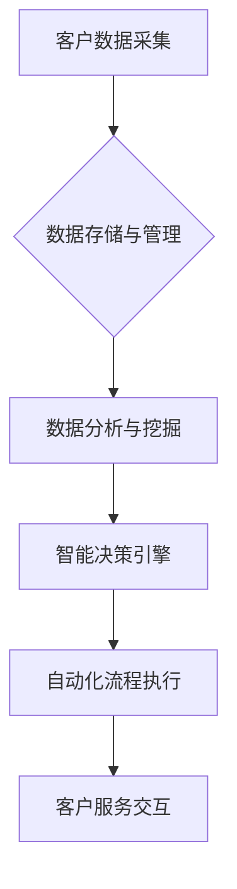

                 

## 自动化创业中的客户关系管理

> 关键词：客户关系管理 (CRM)、自动化、人工智能 (AI)、机器学习 (ML)、数据分析、创业、流程优化、客户体验

## 1. 背景介绍

在当今数字化时代，客户关系管理 (CRM) 已成为企业成功的关键因素。对于创业公司来说，高效的客户关系管理尤为重要，因为它可以帮助他们建立忠诚客户群，提高客户满意度，最终促进业务增长。然而，传统的人工客服模式往往面临着成本高、效率低、难以规模化等问题。随着人工智能 (AI) 和机器学习 (ML) 技术的快速发展，自动化客户关系管理 (Auto-CRM) 应运而生，为创业公司提供了全新的解决方案。

Auto-CRM 通过自动化流程、数据分析和智能决策，帮助创业公司更高效地管理客户关系。它可以自动处理客户咨询、订单管理、售后服务等任务，释放人力资源，提高服务效率。同时，通过对客户数据的分析，Auto-CRM 可以帮助创业公司更深入地了解客户需求，提供个性化服务，提升客户体验。

## 2. 核心概念与联系

Auto-CRM 的核心概念包括：

* **自动化流程:** 通过规则引擎、流程自动化工具等技术，自动执行重复性任务，例如回复常见问题、发送邮件提醒、处理订单等。
* **数据分析:** 收集客户数据，利用机器学习算法进行分析，挖掘客户行为模式、偏好和需求。
* **智能决策:** 基于数据分析结果，自动做出决策，例如推荐产品、提供个性化服务、预测客户流失等。

Auto-CRM 的架构通常包括以下几个模块：



**数据存储与管理:** 

负责收集、存储和管理客户数据，例如客户信息、购买记录、服务历史等。

**数据分析与挖掘:** 

利用机器学习算法对客户数据进行分析，挖掘客户行为模式、偏好和需求。

**智能决策引擎:** 

根据数据分析结果，自动做出决策，例如推荐产品、提供个性化服务、预测客户流失等。

**自动化流程执行:** 

根据智能决策结果，自动执行相应的流程，例如回复客户咨询、发送邮件提醒、处理订单等。

**客户服务交互:** 

与客户进行交互，提供服务和支持。

## 3. 核心算法原理 & 具体操作步骤

### 3.1  算法原理概述

Auto-CRM 中常用的算法包括：

* **自然语言处理 (NLP):** 用于理解和处理自然语言文本，例如客户咨询、邮件、评论等。
* **机器学习 (ML):** 用于从数据中学习模式和规律，例如客户行为预测、个性化推荐等。
* **深度学习 (DL):** 一种更高级的机器学习算法，可以处理更复杂的数据，例如图像识别、语音识别等。

### 3.2  算法步骤详解

**自然语言处理 (NLP):**

1. **文本预处理:** 清洗文本数据，去除停用词、标点符号等，并将文本转换为标准格式。
2. **词语分词:** 将文本分割成单个词语或短语。
3. **词性标注:** 为每个词语标注其词性，例如名词、动词、形容词等。
4. **句法分析:** 分析文本的语法结构，识别句子成分和关系。
5. **语义分析:** 理解文本的含义，识别关键词、主题和情感等。

**机器学习 (ML):**

1. **数据收集与预处理:** 收集相关数据，并进行清洗、转换和特征工程等预处理工作。
2. **模型选择:** 选择合适的机器学习模型，例如线性回归、决策树、支持向量机等。
3. **模型训练:** 使用训练数据训练机器学习模型，调整模型参数，使其能够准确预测或分类。
4. **模型评估:** 使用测试数据评估模型的性能，例如准确率、召回率、F1-score等。
5. **模型部署:** 将训练好的模型部署到生产环境中，用于实际应用。

### 3.3  算法优缺点

**自然语言处理 (NLP):**

* **优点:** 可以理解和处理自然语言文本，例如客户咨询、邮件、评论等。
* **缺点:** 理解复杂语言和上下文信息仍然存在挑战，需要大量的训练数据。

**机器学习 (ML):**

* **优点:** 可以从数据中学习模式和规律，例如客户行为预测、个性化推荐等。
* **缺点:** 需要大量的训练数据，模型解释性较差。

### 3.4  算法应用领域

* **客户服务自动化:** 自动回复常见问题、处理订单、提供售后服务等。
* **个性化推荐:** 根据客户行为和偏好，推荐相关产品或服务。
* **客户行为预测:** 预测客户流失、购买意愿等，以便采取相应的措施。
* **市场营销自动化:** 自动发送营销邮件、推送广告等。

## 4. 数学模型和公式 & 详细讲解 & 举例说明

### 4.1  数学模型构建

Auto-CRM 中常用的数学模型包括：

* **贝叶斯分类:** 用于分类问题，例如客户流失预测。
* **线性回归:** 用于预测连续值问题，例如客户购买金额预测。
* **决策树:** 用于分类或预测问题，例如客户满意度预测。

### 4.2  公式推导过程

**贝叶斯分类:**

假设我们想要预测客户是否会流失，我们可以使用贝叶斯分类模型。

$$P(流失|特征) = \frac{P(特征|流失) * P(流失)}{P(特征)}$$

其中：

* $P(流失|特征)$ 是客户流失的概率，给定特定特征。
* $P(特征|流失)$ 是给定客户流失的情况下，特征出现的概率。
* $P(流失)$ 是客户流失的先验概率。
* $P(特征)$ 是特征出现的概率。

### 4.3  案例分析与讲解

假设我们收集了客户的年龄、购买频率、平均购买金额等特征数据，并标记了哪些客户流失。我们可以使用贝叶斯分类模型，根据这些数据训练模型，预测新客户是否会流失。

## 5. 项目实践：代码实例和详细解释说明

### 5.1  开发环境搭建

Auto-CRM 项目可以使用 Python 语言开发，并结合以下工具和库：

* **Python:** 编程语言
* **Pandas:** 数据处理库
* **Scikit-learn:** 机器学习库
* **NLTK:** 自然语言处理库
* **Flask/Django:** Web 框架

### 5.2  源代码详细实现

以下是一个简单的 Auto-CRM 代码示例，用于预测客户流失：

```python
import pandas as pd
from sklearn.model_selection import train_test_split
from sklearn.linear_model import LogisticRegression
from sklearn.metrics import accuracy_score

# 加载数据
data = pd.read_csv('customer_data.csv')

# 划分训练集和测试集
X = data.drop('流失', axis=1)
y = data['流失']
X_train, X_test, y_train, y_test = train_test_split(X, y, test_size=0.2, random_state=42)

# 训练模型
model = LogisticRegression()
model.fit(X_train, y_train)

# 预测测试集
y_pred = model.predict(X_test)

# 计算准确率
accuracy = accuracy_score(y_test, y_pred)
print(f'准确率: {accuracy}')
```

### 5.3  代码解读与分析

这段代码首先加载客户数据，然后将数据划分成训练集和测试集。接着，使用逻辑回归模型训练模型，并使用测试集进行预测。最后，计算模型的准确率。

### 5.4  运行结果展示

运行结果会显示模型的准确率，例如 0.85，表示模型在预测客户流失方面准确率为 85%。

## 6. 实际应用场景

Auto-CRM 在创业公司中可以应用于以下场景：

* **在线商店:** 自动回复客户咨询、处理订单、推荐产品、预测客户流失等。
* ** SaaS 公司:** 自动发送邮件提醒、提供个性化服务、预测客户续费率等。
* **教育机构:** 自动回复学生咨询、提供个性化学习建议、预测学生成绩等。

### 6.4  未来应用展望

随着人工智能和机器学习技术的不断发展，Auto-CRM 将会更加智能化、个性化和自动化。未来，Auto-CRM 可能能够：

* 更深入地理解客户需求，提供更精准的个性化服务。
* 更准确地预测客户行为，帮助企业制定更有效的营销策略。
* 自动化更多客户服务流程，释放人力资源，提高服务效率。

## 7. 工具和资源推荐

### 7.1  学习资源推荐

* **书籍:**
    * 《Python机器学习》
    * 《自然语言处理入门》
* **在线课程:**
    * Coursera: 机器学习
    * Udacity: 自然语言处理
* **博客和网站:**
    * Towards Data Science
    * Analytics Vidhya

### 7.2  开发工具推荐

* **Python:** 编程语言
* **Pandas:** 数据处理库
* **Scikit-learn:** 机器学习库
* **NLTK:** 自然语言处理库
* **Flask/Django:** Web 框架

### 7.3  相关论文推荐

* **《深度学习在客户关系管理中的应用》**
* **《基于机器学习的客户流失预测模型》**

## 8. 总结：未来发展趋势与挑战

### 8.1  研究成果总结

Auto-CRM 已经取得了显著的成果，帮助创业公司提高客户服务效率、提升客户体验、促进业务增长。

### 8.2  未来发展趋势

Auto-CRM 将会更加智能化、个性化和自动化，并应用于更多领域。

### 8.3  面临的挑战

Auto-CRM 还面临着一些挑战，例如：

* 数据隐私和安全问题
* 模型解释性和可信度问题
* 人工智能伦理问题

### 8.4  研究展望

未来研究方向包括：

* 开发更智能、更精准的 Auto-CRM 模型
* 提高 Auto-CRM 模型的解释性和可信度
* 研究 Auto-CRM 的伦理问题，确保其安全、公平、可控地应用。

## 9. 附录：常见问题与解答

**常见问题:**

* Auto-CRM 是否会取代人工客服？

**解答:** Auto-CRM 可以自动化许多重复性任务，但它并不会完全取代人工客服。人工客服仍然在处理复杂问题、提供情感支持等方面发挥着重要作用。

* Auto-CRM 需要哪些数据才能运行？

**解答:** Auto-CRM 需要客户数据，例如客户信息、购买记录、服务历史等。

* Auto-CRM 的成本如何？

**解答:** Auto-CRM 的成本取决于具体的应用场景和技术方案。一般来说，Auto-CRM 的成本比传统人工客服模式更低。


作者：禅与计算机程序设计艺术 / Zen and the Art of Computer Programming 
<end_of_turn>

