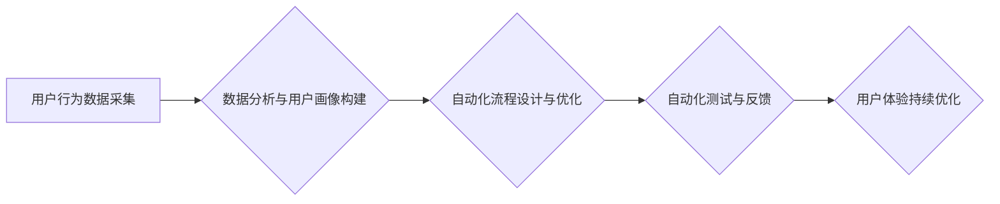

                 

## 自动化创业中的用户旅程优化

> 关键词：用户旅程优化、自动化、机器学习、数据分析、创业、流程自动化、体验设计

## 1. 背景介绍

在当今快速发展的科技时代，创业者面临着前所未有的机遇和挑战。如何快速建立品牌、吸引用户、提升用户体验，成为创业成功的关键因素。用户旅程优化（User Journey Optimization，UJO）作为一种提升用户体验的有效方法，在自动化创业中扮演着越来越重要的角色。

传统的用户旅程优化通常依赖于人工分析和测试，效率低下，难以应对快速变化的市场需求。而自动化创业则强调利用技术手段，构建高效、智能的运营体系。将用户旅程优化与自动化技术相结合，可以实现更精准、更有效的用户体验提升，从而加速创业项目的成功。

## 2. 核心概念与联系

### 2.1 用户旅程优化 (UJO)

用户旅程优化是指从用户视角出发，分析用户在与产品或服务交互过程中所经历的各个阶段，并通过优化这些阶段的流程、体验和交互方式，最终提升用户满意度、忠诚度和转化率。

### 2.2 自动化

自动化是指利用技术手段，将重复性、规则性、高效率的任务自动化执行，从而解放人力，提高效率和准确性。

### 2.3 自动化用户旅程优化 (AUJO)

自动化用户旅程优化是指将用户旅程优化过程中的分析、测试、优化等环节，通过自动化技术手段实现，从而实现更快速、更精准、更有效的用户体验提升。

**Mermaid 流程图**



## 3. 核心算法原理 & 具体操作步骤

### 3.1 算法原理概述

自动化用户旅程优化的核心算法原理主要基于以下几个方面：

* **机器学习**: 利用机器学习算法，从用户行为数据中挖掘用户偏好、需求和痛点，并预测用户未来的行为。
* **数据分析**: 对用户行为数据进行分析，识别用户旅程中的关键节点和潜在问题，并为优化提供数据支持。
* **流程自动化**: 利用自动化工具和技术，将用户旅程中的重复性、规则性任务自动化执行，提高效率和准确性。
* **A/B 测试**: 通过A/B测试，比较不同版本的优化方案，并选择效果最佳的方案进行实施。

### 3.2 算法步骤详解

1. **数据采集**: 收集用户在与产品或服务交互过程中产生的各种数据，例如用户行为日志、点击记录、反馈信息等。
2. **数据清洗与预处理**: 对收集到的数据进行清洗、预处理，去除噪声数据、缺失值等，并将其转换为机器学习算法可以处理的格式。
3. **用户画像构建**: 利用机器学习算法，对用户数据进行分析，构建用户画像，并根据用户画像进行用户细分。
4. **用户旅程分析**: 分析用户在不同阶段的交互行为，识别用户旅程中的关键节点和潜在问题。
5. **自动化流程设计**: 根据用户旅程分析结果，设计自动化流程，将用户旅程中的重复性、规则性任务自动化执行。
6. **自动化测试**: 利用自动化测试工具，对自动化流程进行测试，确保流程的正确性和有效性。
7. **用户体验优化**: 根据测试结果和用户反馈，对自动化流程进行优化，不断提升用户体验。

### 3.3 算法优缺点

**优点**:

* **效率提升**: 自动化用户旅程优化可以大幅提升用户旅程优化效率，减少人工成本。
* **精准度提升**: 利用机器学习算法，可以更精准地分析用户行为，识别用户需求和痛点。
* **持续优化**: 自动化流程可以持续运行，并根据用户反馈进行动态调整，实现用户体验的持续优化。

**缺点**:

* **技术门槛**: 自动化用户旅程优化需要一定的技术基础，例如机器学习、数据分析、流程自动化等。
* **数据依赖**: 自动化用户旅程优化需要大量用户行为数据作为支撑，数据质量直接影响算法效果。
* **伦理问题**: 自动化用户旅程优化可能会涉及到用户隐私和数据安全问题，需要谨慎处理。

### 3.4 算法应用领域

自动化用户旅程优化可以应用于各个行业，例如：

* **电商**: 优化用户购物流程，提高转化率。
* **金融**: 优化用户金融服务体验，提升用户满意度。
* **教育**: 优化用户学习体验，提高学习效率。
* **医疗**: 优化用户医疗服务体验，提高用户满意度。

## 4. 数学模型和公式 & 详细讲解 & 举例说明

### 4.1 数学模型构建

用户旅程优化的数学模型可以基于用户行为数据和机器学习算法构建。例如，可以使用**贝叶斯网络**来建模用户在不同阶段的决策过程，并预测用户未来的行为。

**贝叶斯网络**是一种概率图模型，可以表示变量之间的依赖关系。在用户旅程优化中，可以将用户行为数据作为输入，构建一个贝叶斯网络模型，并根据模型预测用户在不同阶段的决策和行为。

### 4.2 公式推导过程

贝叶斯网络的推导过程涉及到概率论和统计学知识，例如**贝叶斯定理**、**条件概率**等。

**贝叶斯定理**:

$$P(A|B) = \frac{P(B|A)P(A)}{P(B)}$$

其中：

* $P(A|B)$ 是在已知事件 B 发生的情况下，事件 A 发生的概率。
* $P(B|A)$ 是在已知事件 A 发生的情况下，事件 B 发生的概率。
* $P(A)$ 是事件 A 发生的概率。
* $P(B)$ 是事件 B 发生的概率。

### 4.3 案例分析与讲解

例如，假设我们想要预测用户是否会购买商品。我们可以构建一个贝叶斯网络模型，其中变量包括用户浏览商品、加入购物车、查看评价等行为，以及用户是否购买商品。

通过分析用户行为数据，我们可以估计每个变量之间的条件概率，例如用户浏览商品后加入购物车的概率。然后，我们可以利用贝叶斯定理，根据用户在不同阶段的行为，预测用户是否会购买商品。

## 5. 项目实践：代码实例和详细解释说明

### 5.1 开发环境搭建

* **操作系统**: Ubuntu 20.04 LTS
* **编程语言**: Python 3.8
* **机器学习库**: scikit-learn
* **数据分析库**: pandas, numpy
* **自动化工具**: Apache Airflow

### 5.2 源代码详细实现

```python
# 导入必要的库
import pandas as pd
from sklearn.model_selection import train_test_split
from sklearn.linear_model import LogisticRegression

# 加载用户行为数据
data = pd.read_csv('user_behavior.csv')

# 选择特征和目标变量
features = ['浏览商品', '加入购物车', '查看评价']
target = '购买商品'

# 将数据分割为训练集和测试集
X_train, X_test, y_train, y_test = train_test_split(data[features], data[target], test_size=0.2)

# 训练逻辑回归模型
model = LogisticRegression()
model.fit(X_train, y_train)

# 对测试集进行预测
y_pred = model.predict(X_test)

# 计算模型准确率
accuracy = model.score(X_test, y_test)
print(f'模型准确率: {accuracy}')

# 将模型部署到 Apache Airflow 中
# ...
```

### 5.3 代码解读与分析

这段代码演示了如何使用机器学习算法，预测用户是否会购买商品。

首先，我们加载用户行为数据，并选择特征和目标变量。然后，我们将数据分割为训练集和测试集，并使用逻辑回归模型训练模型。最后，我们对测试集进行预测，并计算模型准确率。

### 5.4 运行结果展示

运行结果会显示模型的准确率，例如：

```
模型准确率: 0.85
```

这表示模型在预测用户是否购买商品方面，准确率为 85%。

## 6. 实际应用场景

### 6.1 电商平台

* **个性化推荐**: 根据用户的浏览历史、购买记录等数据，推荐用户可能感兴趣的商品。
* **购物车优化**: 分析用户购物车中的商品组合，提供个性化的商品搭配建议，提高用户购买意愿。
* **退货率降低**: 通过分析用户退货原因，优化产品描述、物流服务等环节，降低退货率。

### 6.2 金融服务

* **客户风险评估**: 分析客户的财务状况、信用记录等数据，评估客户的风险等级，为贷款、保险等服务提供参考。
* **欺诈检测**: 利用机器学习算法，识别异常交易行为，防止金融欺诈。
* **个性化理财**: 根据用户的风险偏好、投资目标等数据，提供个性化的理财建议。

### 6.3 教育行业

* **个性化学习**: 根据学生的学习进度、知识掌握情况等数据，提供个性化的学习内容和学习计划。
* **学习效率提升**: 分析学生的学习行为，识别学习瓶颈，提供针对性的学习指导。
* **在线考试优化**: 利用机器学习算法，识别作弊行为，确保考试公平公正。

### 6.4 未来应用展望

随着人工智能技术的不断发展，自动化用户旅程优化将应用于更多领域，例如医疗、交通、娱乐等。未来，自动化用户旅程优化将更加智能化、个性化，为用户提供更便捷、更优质的体验。

## 7. 工具和资源推荐

### 7.1 学习资源推荐

* **书籍**:
    * 《机器学习》 - 周志华
    * 《深度学习》 - Ian Goodfellow
* **在线课程**:
    * Coursera: Machine Learning
    * edX: Artificial Intelligence
* **博客**:
    * Towards Data Science
    * Machine Learning Mastery

### 7.2 开发工具推荐

* **数据分析工具**:
    * Jupyter Notebook
    * Apache Spark
* **机器学习库**:
    * scikit-learn
    * TensorFlow
    * PyTorch
* **自动化工具**:
    * Apache Airflow
    * Jenkins

### 7.3 相关论文推荐

* **User Journey Optimization with Machine Learning**: https://arxiv.org/abs/1908.08123
* **Automated User Journey Analysis and Optimization**: https://dl.acm.org/doi/10.1145/3313276.3316371

## 8. 总结：未来发展趋势与挑战

### 8.1 研究成果总结

自动化用户旅程优化是一个新兴的领域，近年来取得了显著进展。机器学习算法在用户行为分析、预测和优化方面发挥着越来越重要的作用。自动化工具和技术也使得用户旅程优化更加高效、精准。

### 8.2 未来发展趋势

* **更智能的自动化**: 利用深度学习等更先进的机器学习算法，实现更智能的自动化用户旅程优化。
* **更个性化的体验**: 基于用户画像和行为数据，提供更个性化的用户体验。
* **跨平台协同**: 将用户旅程优化扩展到多个平台，实现跨平台协同优化。

### 8.3 面临的挑战

* **数据隐私和安全**: 自动化用户旅程优化需要大量用户数据，如何保护用户隐私和数据安全是一个重要的挑战。
* **算法解释性和可信度**: 许多机器学习算法是黑箱模型，难以解释其决策过程，这可能会影响用户对算法的信任。
* **技术人才短缺**: 自动化用户旅程优化需要具备机器学习、数据分析、流程自动化等方面的专业知识，技术人才短缺是一个制约发展的瓶颈。

### 8.4 研究展望

未来，自动化用户旅程优化将继续朝着更智能、更个性化、更安全的方向发展。研究者需要关注以下几个方面：

* **开发更透明、可解释的机器学习算法。**
* **构建更完善的用户数据安全保护机制。**
* **培养更多专业的自动化用户旅程优化人才。**


## 9. 附录：常见问题与解答

**Q1: 自动化用户旅程优化需要哪些技术技能？**

**A1:** 自动化用户旅程优化需要具备以下技术技能：

* **机器学习**: 了解机器学习算法的基本原理，例如分类、回归、聚类等。
* **数据分析**: 能够使用数据分析工具，对用户行为数据进行分析和挖掘。
* **流程自动化**: 了解流程自动化工具和技术，能够设计和实现自动化流程。
* **编程**: 具备一定的编程能力，例如 Python 等。

**Q2: 自动化用户旅程优化有哪些风险？**

**A2:** 自动化用户旅程优化存在以下风险：

* **数据隐私和安全风险**: 自动化用户旅程优化需要收集和处理大量用户数据，需要采取措施保护用户隐私和数据安全。
* **算法偏差风险**: 机器学习算法可能会存在偏差，导致优化方案不公平或不准确。
* **过度自动化风险**: 过度依赖自动化，可能会导致用户体验下降。

**Q3: 如何评估自动化用户旅程优化的效果？**

**A3:** 可以通过以下指标评估自动化用户旅程优化的效果：

* **用户转化率**: 用户完成目标任务的比例。
* **用户满意度**: 用户对产品或服务的满意程度。
* **用户留存率**: 用户持续使用产品的比例。
* **成本效益**: 自动化带来的成本节约和效益提升。


作者：禅与计算机程序设计艺术 / Zen and the Art of Computer Programming 
<end_of_turn>

