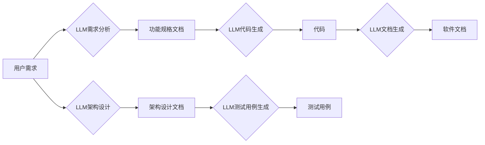

                 

## 自动化设计：LLM 驱动的创新

> 关键词：大型语言模型 (LLM)、自动化设计、代码生成、软件架构、人工智能、软件开发、创新

## 1. 背景介绍

软件开发行业正经历着前所未有的变革。随着技术进步和用户需求的不断变化，传统的软件开发模式面临着越来越多的挑战。开发周期长、成本高、维护复杂等问题制约着软件行业的持续发展。 

大型语言模型 (LLM) 的出现为软件开发带来了新的希望。LLM 拥有强大的文本理解和生成能力，能够理解自然语言指令，并生成高质量的代码、文档和设计方案。这为自动化设计提供了全新的可能性，有望彻底改变软件开发的流程和模式。

## 2. 核心概念与联系

**2.1  LLM 的核心概念**

大型语言模型 (LLM) 是一种基于深度学习的强大人工智能模型，通过训练海量文本数据，学习语言的语法、语义和上下文关系。LLM 可以理解和生成人类语言，并执行各种自然语言处理任务，例如文本分类、机器翻译、问答系统和代码生成。

**2.2  自动化设计的概念**

自动化设计是指利用人工智能技术，自动生成软件设计方案、代码和文档的过程。它旨在减少人工干预，提高开发效率和软件质量。

**2.3  LLM 在自动化设计中的应用**

LLM 可以应用于软件开发的各个阶段，例如：

* **需求分析:**  LLM 可以理解用户需求描述，并自动生成软件功能规格文档。
* **架构设计:**  LLM 可以根据需求和技术规范，自动生成软件架构图和设计文档。
* **代码生成:**  LLM 可以根据设计方案，自动生成代码，并进行代码格式化和代码风格检查。
* **测试用例生成:**  LLM 可以根据代码和设计文档，自动生成测试用例，并进行测试用例覆盖率分析。
* **文档生成:**  LLM 可以自动生成软件用户手册、API 文档和技术文档。

**2.4  LLM 自动化设计架构**



## 3. 核心算法原理 & 具体操作步骤

**3.1  算法原理概述**

LLM 自动化设计的核心算法是基于 Transformer 架构的深度学习模型。Transformer 模型通过自注意力机制学习文本的上下文关系，并能够捕捉长距离依赖关系。

**3.2  算法步骤详解**

1. **数据预处理:**  收集和预处理软件开发相关数据，例如代码、设计文档、需求描述等。
2. **模型训练:**  使用 Transformer 模型训练，输入预处理后的数据，学习语言模式和软件开发知识。
3. **模型评估:**  使用测试数据评估模型性能，例如代码生成质量、设计方案合理性等。
4. **模型部署:**  将训练好的模型部署到生产环境，用于自动化设计任务。

**3.3  算法优缺点**

**优点:**

* **自动化程度高:**  能够自动生成软件设计方案、代码和文档，大幅提高开发效率。
* **代码质量提升:**  LLM 训练数据包含大量高质量代码，能够生成更规范、更易维护的代码。
* **降低开发成本:**  减少人工干预，降低软件开发成本。

**缺点:**

* **数据依赖性强:**  模型性能依赖于训练数据的质量和数量。
* **解释性差:**  LLM 的决策过程难以解释，难以理解模型生成的代码和设计方案背后的逻辑。
* **安全风险:**  LLM 可能生成包含安全漏洞的代码，需要进行严格的安全测试。

**3.4  算法应用领域**

LLM 自动化设计技术在以下领域具有广泛的应用前景：

* **Web 开发:**  自动生成网站代码、页面布局和交互逻辑。
* **移动应用开发:**  自动生成移动应用代码、界面设计和功能实现。
* **数据科学:**  自动生成数据分析脚本、机器学习模型和数据可视化图表。
* **游戏开发:**  自动生成游戏场景、游戏逻辑和游戏角色。

## 4. 数学模型和公式 & 详细讲解 & 举例说明

**4.1  数学模型构建**

LLM 的核心数学模型是 Transformer，它基于自注意力机制和多头注意力机制，能够捕捉文本的上下文关系和长距离依赖关系。

**4.2  公式推导过程**

Transformer 模型的注意力机制公式如下：

$$
Attention(Q, K, V) = softmax(\frac{QK^T}{\sqrt{d_k}})V
$$

其中：

* $Q$：查询矩阵
* $K$：键矩阵
* $V$：值矩阵
* $d_k$：键向量的维度
* $softmax$：softmax 函数

**4.3  案例分析与讲解**

假设我们有一个句子 "The cat sat on the mat"，我们想要计算每个词对句子整体语义的影响。

使用 Transformer 模型的注意力机制，我们可以计算每个词与其他词之间的注意力权重。例如，"cat" 与 "sat" 之间的注意力权重较高，因为它们在语义上密切相关。

## 5. 项目实践：代码实例和详细解释说明

**5.1  开发环境搭建**

* Python 3.7+
* PyTorch 或 TensorFlow
* CUDA 和 cuDNN (可选，用于 GPU 加速)

**5.2  源代码详细实现**

```python
# 代码生成示例
import torch
from transformers import GPT2LMHeadModel, GPT2Tokenizer

# 加载预训练模型和词典
model_name = "gpt2"
tokenizer = GPT2Tokenizer.from_pretrained(model_name)
model = GPT2LMHeadModel.from_pretrained(model_name)

# 输入文本提示
prompt = "def function_name(arg1, arg2):"

# 生成代码
input_ids = tokenizer.encode(prompt, return_tensors="pt")
output = model.generate(input_ids, max_length=100)

# 解码生成代码
generated_code = tokenizer.decode(output[0], skip_special_tokens=True)

# 打印生成代码
print(generated_code)
```

**5.3  代码解读与分析**

* 该代码示例使用预训练的 GPT-2 模型进行代码生成。
* 首先加载预训练模型和词典。
* 然后输入文本提示，例如函数定义的开头。
* 使用模型的 `generate` 方法生成代码，并设置最大长度限制。
* 最后解码生成代码，并打印输出。

**5.4  运行结果展示**

运行该代码后，模型会根据输入提示生成一段代码，例如：

```python
def function_name(arg1, arg2):
    # 代码逻辑
    return arg1 + arg2
```

## 6. 实际应用场景

**6.1  代码生成工具**

LLM 可以用于开发代码生成工具，例如 GitHub Copilot 和 Tabnine。这些工具可以根据代码上下文自动生成代码建议，提高开发效率。

**6.2  软件架构设计工具**

LLM 可以用于开发软件架构设计工具，例如 DeepCode 和 CodeGuru。这些工具可以根据需求和技术规范，自动生成软件架构图和设计文档。

**6.3  测试用例生成工具**

LLM 可以用于开发测试用例生成工具，例如 Diffblue 和 Testim.io。这些工具可以根据代码和设计文档，自动生成测试用例，并进行测试用例覆盖率分析。

**6.4  未来应用展望**

LLM 自动化设计技术在未来将有更广泛的应用场景，例如：

* **个性化软件开发:**  根据用户的需求和偏好，自动生成个性化的软件解决方案。
* **低代码开发:**  降低软件开发门槛，让非专业人员也能参与软件开发。
* **代码可解释性:**  提高 LLMs 代码生成的解释性，帮助开发者理解模型生成的代码逻辑。

## 7. 工具和资源推荐

**7.1  学习资源推荐**

* **论文:**  "Attention Is All You Need" (Vaswani et al., 2017)
* **书籍:**  "Deep Learning" (Goodfellow et al., 2016)
* **在线课程:**  Coursera, edX, Udacity

**7.2  开发工具推荐**

* **Hugging Face Transformers:**  https://huggingface.co/transformers/
* **OpenAI API:**  https://beta.openai.com/docs/api-reference/introduction

**7.3  相关论文推荐**

* "CodeBERT: A Pretrained Language Model for Code" (Liu et al., 2021)
* "GPT-3: Language Models are Few-Shot Learners" (Brown et al., 2020)

## 8. 总结：未来发展趋势与挑战

**8.1  研究成果总结**

LLM 自动化设计技术取得了显著进展，能够自动生成高质量的代码、设计方案和文档。

**8.2  未来发展趋势**

* **模型规模和性能提升:**  未来 LLMs 将拥有更大的规模和更强的性能，能够处理更复杂的任务。
* **多模态自动化设计:**  LLMs 将融合图像、音频等多模态数据，实现更全面的自动化设计。
* **可解释性增强:**  研究人员将致力于提高 LLMs 代码生成的解释性，帮助开发者理解模型的决策过程。

**8.3  面临的挑战**

* **数据安全和隐私:**  LLMs 训练数据可能包含敏感信息，需要确保数据安全和隐私。
* **模型偏见和公平性:**  LLMs 可能存在偏见和不公平性，需要进行针对性的研究和改进。
* **伦理问题:**  LLMs 自动化设计技术可能带来伦理问题，例如工作岗位替代和算法滥用，需要进行深入的探讨和规范。

**8.4  研究展望**

未来研究将重点关注以下几个方面:

* **开发更安全、更可靠的 LLMs 自动化设计系统。**
* **研究 LLMs 在不同领域和应用场景的潜力。**
* **探讨 LLMs 自动化设计技术带来的社会影响，并制定相应的伦理规范。**


## 9. 附录：常见问题与解答

**9.1  LLM 自动化设计是否会取代软件开发人员？**

LLM 自动化设计技术可以提高开发效率，但不会完全取代软件开发人员。软件开发是一个复杂的过程，需要人类的创造力、创新能力和解决问题的能力。LLM 可以帮助开发人员完成重复性工作，释放他们的精力去关注更高级的任务。

**9.2  LLM 自动化设计生成的代码质量如何？**

LLM 自动化设计生成的代码质量取决于模型的训练数据和训练方法。高质量的训练数据和训练方法可以生成高质量的代码。但是，生成的代码仍然需要经过人工 review 和测试，以确保其正确性和安全性。

**9.3  LLM 自动化设计技术有哪些安全风险？**

LLM 自动化设计技术可能存在以下安全风险：

* **代码注入攻击:**  攻击者可以利用 LLMs 生成包含恶意代码的代码。
* **数据泄露:**  LLMs 训练数据可能包含敏感信息，需要确保数据安全和隐私。
* **算法滥用:**  LLMs 可以被用于生成恶意软件或其他有害内容。

需要采取相应的安全措施来 mitigate 这些风险。


作者：禅与计算机程序设计艺术 / Zen and the Art of Computer Programming 
<end_of_turn>

