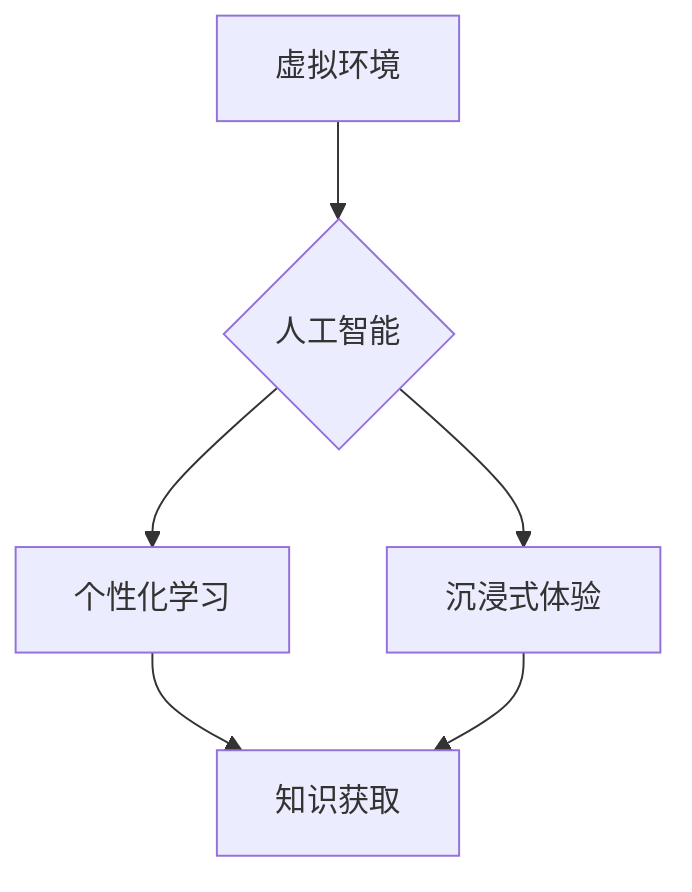

                 

## 虚拟教育:全球脑时代的知识获取

> 关键词：虚拟教育、全球脑、知识获取、人工智能、机器学习、神经网络、沉浸式学习、个性化学习

## 1. 背景介绍

随着科技的飞速发展，人工智能（AI）和虚拟现实（VR）技术取得了突破性进展，为教育领域带来了前所未有的机遇。虚拟教育，作为一种利用虚拟环境和数字技术进行教学的新模式，正逐渐成为未来教育发展的重要趋势。

全球脑时代即将到来，人类将与人工智能深度融合，知识获取方式也将发生根本性改变。虚拟教育将成为连接人类智慧和机器智能的重要桥梁，为每个人提供个性化、高效、沉浸式的学习体验。

## 2. 核心概念与联系

虚拟教育的核心概念包括虚拟环境、人工智能、个性化学习和沉浸式体验。

* **虚拟环境:**  指利用计算机技术构建的模拟现实世界或特定场景的虚拟空间。虚拟环境可以提供丰富的交互体验，让学生身临其境地感受学习内容。

* **人工智能:**  指能够模拟人类智能行为的计算机系统。在虚拟教育中，人工智能可以用于智能辅导、个性化学习路径推荐、自动评估和反馈等方面。

* **个性化学习:**  是指根据学生的学习特点、兴趣和目标，定制化的学习内容和学习路径。虚拟教育可以利用人工智能技术，对学生的学习行为进行分析，并根据分析结果提供个性化的学习建议和支持。

* **沉浸式体验:**  指通过虚拟现实技术，让学生身临其境地体验学习内容。沉浸式体验可以增强学生的学习兴趣和记忆效果。

**核心概念与联系流程图:**



## 3. 核心算法原理 & 具体操作步骤

### 3.1  算法原理概述

虚拟教育的核心算法原理主要包括：

* **机器学习算法:** 用于分析学生的学习行为，识别学习模式，并根据学习模式提供个性化学习建议。常见的机器学习算法包括：

    * **监督学习:** 利用标记数据训练模型，例如预测学生的学习成绩。
    * **非监督学习:**  用于发现数据中的隐藏模式，例如学生学习兴趣的聚类分析。
    * **强化学习:**  通过奖励和惩罚机制训练模型，例如个性化学习路径推荐。

* **自然语言处理算法:** 用于理解和生成自然语言，例如与学生进行对话式学习，解答学生的疑问。

* **计算机视觉算法:** 用于识别和理解图像和视频，例如虚拟环境中的交互行为识别。

### 3.2  算法步骤详解

以机器学习算法为例，其具体操作步骤如下：

1. **数据收集:** 收集学生的学习行为数据，例如学习时间、学习内容、学习成绩等。
2. **数据预处理:** 对收集到的数据进行清洗、转换和特征提取。
3. **模型选择:** 根据学习任务选择合适的机器学习算法模型。
4. **模型训练:** 利用训练数据训练机器学习模型。
5. **模型评估:** 利用测试数据评估模型的性能。
6. **模型部署:** 将训练好的模型部署到虚拟教育平台中。

### 3.3  算法优缺点

**优点:**

* **个性化学习:**  根据学生的学习特点提供定制化的学习内容和学习路径。
* **高效学习:**  利用人工智能技术，提高学习效率，节省学习时间。
* **沉浸式体验:**  通过虚拟现实技术，增强学生的学习兴趣和记忆效果。

**缺点:**

* **数据依赖:**  机器学习算法需要大量的数据进行训练，数据质量直接影响算法性能。
* **算法复杂性:**  一些机器学习算法比较复杂，需要专业的技术人员进行开发和维护。
* **伦理问题:**  虚拟教育的应用可能会引发一些伦理问题，例如数据隐私保护和算法偏见。

### 3.4  算法应用领域

虚拟教育的算法应用领域非常广泛，例如：

* **在线教育平台:**  提供个性化学习路径推荐、智能辅导和自动评估等功能。
* **游戏化学习:**  利用游戏机制，提高学生的学习兴趣和参与度。
* **远程医疗教育:**  为医学生提供虚拟手术模拟和远程医疗培训。
* **职业技能培训:**  为企业员工提供虚拟环境下的技能培训和模拟练习。

## 4. 数学模型和公式 & 详细讲解 & 举例说明

### 4.1  数学模型构建

虚拟教育中的知识获取过程可以抽象为一个数学模型，其中学生知识的增长可以表示为一个函数，该函数受多种因素影响，例如学习时间、学习内容、学习方法和个体差异。

一个简单的数学模型可以表示为：

$$K(t) = K_0 + \int_0^t \alpha(t') \cdot L(t') dt'$$

其中：

* $K(t)$ 表示学生在时间 $t$ 时的知识量。
* $K_0$ 表示学生在初始时间 $t=0$ 时的知识量。
* $\alpha(t')$ 表示在时间 $t'$ 时学习效率，受多种因素影响，例如学习内容的难度、学习方法的有效性以及学生的学习状态。
* $L(t')$ 表示在时间 $t'$ 时学习内容的量。

### 4.2  公式推导过程

该公式的推导过程基于微积分的积分概念。

* $K_0$ 表示学生初始知识量，是一个常数。
* $\alpha(t') \cdot L(t')$ 表示在时间 $t'$ 时学习到的知识量，受学习效率和学习内容量的影响。
* $\int_0^t \alpha(t') \cdot L(t') dt'$ 表示从时间 $0$ 到时间 $t$ 累积学习到的知识量。

### 4.3  案例分析与讲解

假设一个学生学习一门新的编程语言，初始知识量为 $K_0 = 0$。学习效率 $\alpha(t')$ 可以根据学习内容的难度和学生的学习状态进行调整，例如学习难度较高的内容时，学习效率 $\alpha(t')$ 会降低。学习内容量 $L(t')$ 可以根据学习计划进行设定。

通过对该公式的分析，我们可以得出以下结论：

* 学生的知识增长速度取决于学习效率和学习内容量。
* 学习效率受多种因素影响，例如学习内容的难度、学习方法的有效性和学生的学习状态。
* 为了提高学习效率，需要根据学生的学习特点和学习内容的特点，选择合适的学习方法和学习策略。

## 5. 项目实践：代码实例和详细解释说明

### 5.1  开发环境搭建

虚拟教育平台的开发环境搭建需要考虑以下几个方面：

* **操作系统:**  可以选择 Linux、Windows 或 macOS 等操作系统。
* **编程语言:**  可以选择 Python、Java、C++ 等编程语言。
* **框架和库:**  可以选择 Django、Flask、Spring Boot 等框架，以及 TensorFlow、PyTorch 等机器学习库。
* **虚拟现实技术:**  可以选择 Unity、Unreal Engine 等虚拟现实引擎。

### 5.2  源代码详细实现

以下是一个简单的 Python 代码示例，用于实现个性化学习路径推荐：

```python
import pandas as pd
from sklearn.cluster import KMeans

# 加载学生学习行为数据
data = pd.read_csv('student_data.csv')

# 提取特征
features = data[['学习时间', '学习内容', '学习成绩']]

# 使用 KMeans 算法进行聚类
kmeans = KMeans(n_clusters=3)
kmeans.fit(features)

# 获取聚类结果
labels = kmeans.labels_

# 根据聚类结果推荐学习路径
for i in range(len(labels)):
    if labels[i] == 0:
        # 推荐基础学习路径
        print(f'学生 {i+1} 推荐学习路径: 基础学习路径')
    elif labels[i] == 1:
        # 推荐进阶学习路径
        print(f'学生 {i+1} 推荐学习路径: 进阶学习路径')
    else:
        # 推荐高级学习路径
        print(f'学生 {i+1} 推荐学习路径: 高级学习路径')
```

### 5.3  代码解读与分析

该代码首先加载学生学习行为数据，然后提取特征，例如学习时间、学习内容和学习成绩。接着使用 KMeans 算法进行聚类，将学生分成不同的学习类型。最后根据聚类结果，为每个学生推荐不同的学习路径。

### 5.4  运行结果展示

运行该代码后，会输出每个学生的推荐学习路径。例如，如果学生被聚类到类别 0，则会推荐基础学习路径。

## 6. 实际应用场景

虚拟教育的应用场景非常广泛，例如：

* **在线教育平台:**  例如 Coursera、edX 等平台，利用虚拟环境和人工智能技术，提供个性化学习体验和智能辅导功能。
* **游戏化学习:**  例如 Khan Academy、Duolingo 等平台，利用游戏机制，提高学生的学习兴趣和参与度。
* **远程医疗教育:**  例如远程手术模拟、远程医疗培训等，为医学生提供虚拟环境下的学习体验。
* **职业技能培训:**  例如虚拟工厂模拟、虚拟客服训练等，为企业员工提供虚拟环境下的技能培训和模拟练习。

### 6.4  未来应用展望

未来，虚拟教育将更加智能化、个性化和沉浸式。

* **人工智能技术的进一步发展:**  将使虚拟教育平台更加智能化，能够更好地理解学生的学习需求，提供更加个性化的学习建议和支持。
* **虚拟现实技术的普及:**  将使虚拟教育更加沉浸式，能够为学生提供更加真实的学习体验。
* **混合式学习模式的兴起:**  将结合线上和线下学习资源，提供更加灵活和高效的学习体验。

## 7. 工具和资源推荐

### 7.1  学习资源推荐

* **在线课程:**  Coursera、edX、Udacity 等平台提供丰富的虚拟教育课程。
* **书籍:**  《虚拟现实技术》、《人工智能基础》、《机器学习实战》等书籍可以帮助读者了解虚拟教育相关知识。
* **博客和论坛:**  VR/AR 相关的博客和论坛可以提供最新的技术资讯和实践经验。

### 7.2  开发工具推荐

* **虚拟现实引擎:**  Unity、Unreal Engine 等引擎可以用于开发虚拟教育平台。
* **机器学习库:**  TensorFlow、PyTorch 等库可以用于开发虚拟教育平台的智能功能。
* **编程语言:**  Python、Java、C++ 等编程语言可以用于开发虚拟教育平台。

### 7.3  相关论文推荐

* **《虚拟现实技术在教育中的应用》**
* **《人工智能在教育中的应用》**
* **《个性化学习路径推荐算法研究》**

## 8. 总结：未来发展趋势与挑战

### 8.1  研究成果总结

虚拟教育作为一种新兴的教育模式，在全球脑时代具有重要的发展意义。通过人工智能、虚拟现实等技术的应用，虚拟教育可以提供个性化、高效、沉浸式的学习体验，为每个人提供更便捷、更有效的学习机会。

### 8.2  未来发展趋势

未来，虚拟教育将朝着以下几个方向发展：

* **更加智能化:**  人工智能技术的进一步发展将使虚拟教育平台更加智能化，能够更好地理解学生的学习需求，提供更加个性化的学习建议和支持。
* **更加沉浸式:**  虚拟现实技术的普及将使虚拟教育更加沉浸式，能够为学生提供更加真实的学习体验。
* **更加个性化:**  虚拟教育将更加注重学生的个性化需求，提供更加定制化的学习内容和学习路径。

### 8.3  面临的挑战

虚拟教育的发展也面临一些挑战：

* **技术难题:**  虚拟现实技术、人工智能技术等仍处于发展阶段，需要不断突破技术瓶颈。
* **内容建设:**  虚拟教育平台需要丰富的、高质量的学习内容，这需要大量的投入和时间。
* **伦理问题:**  虚拟教育的应用可能会引发一些伦理问题，例如数据隐私保护和算法偏见，需要引起重视和解决。

### 8.4  研究展望

未来，虚拟教育的研究方向将包括：

* **更先进的人工智能算法:**  开发更智能、更精准的个性化学习推荐算法。
* **更逼真的虚拟环境:**  构建更加沉浸式、更加真实的虚拟学习环境。
* **更有效的学习方法:**  研究更有效的虚拟学习方法，提高学生的学习效率和学习效果。

## 9. 附录：常见问题与解答

**Q1: 虚拟教育是否会取代传统教育？**

A1: 虚拟教育和传统教育各有优缺点，两者不会完全取代对方。虚拟教育可以提供更加灵活、更加个性化的学习体验，但传统教育仍然具有不可替代的价值，例如人际交往、团队合作等。未来，虚拟教育和传统教育将更加融合，共同推动教育的发展。

**Q2: 虚拟教育的成本高吗？**

A2: 虚拟教育的成本取决于具体的应用场景和技术方案。一些简单的虚拟教育平台可以利用开源软件和云计算平台，降低成本。随着技术的进步，虚拟教育的成本将逐渐降低，更加普及。

**Q3: 虚拟教育对学生的学习效果有什么影响？**

A3: 虚拟教育可以提高学生的学习效率和学习效果，但效果取决于学生的学习态度、学习方法和学习环境。一些研究表明，虚拟教育可以帮助学生更好地理解概念、提高记忆力和解决问题的能力。


作者：禅与计算机程序设计艺术 / Zen and the Art of Computer Programming 
<end_of_turn>

