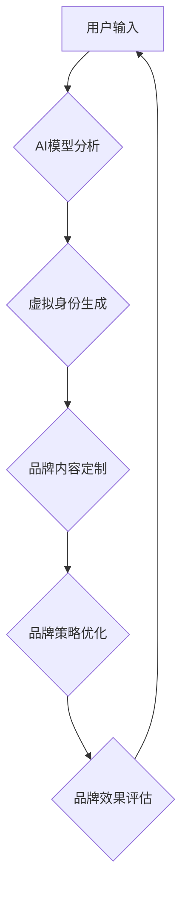

                 

## 虚拟身份设计师：AI时代的个人品牌塑造

> 关键词：虚拟身份、AI、个人品牌、品牌塑造、数字孪生、元宇宙、深度学习、自然语言处理

### 1. 背景介绍

在数字时代，个人品牌已成为个人价值和社会地位的重要体现。随着互联网和社交媒体的普及，人们可以通过线上平台展示自我，建立个人影响力。然而，在信息爆炸的时代，如何打造一个独特的、有吸引力的个人品牌，并使其在竞争激烈的网络环境中脱颖而出，成为了一个新的挑战。

人工智能技术的快速发展为个人品牌塑造提供了全新的可能性。AI可以帮助我们更好地理解用户需求，个性化定制品牌内容，并通过数据分析优化品牌策略。虚拟身份设计师作为一种基于AI的全新工具，将彻底改变个人品牌塑造的方式，赋予每个人构建虚拟身份、塑造个人品牌的全新能力。

### 2. 核心概念与联系

**2.1 虚拟身份**

虚拟身份是指在数字世界中，个人通过网络平台构建的数字化形象。它可以是基于现实身份的虚拟化，也可以是完全虚构的，并拥有独特的个性、经历和价值观。

**2.2 个人品牌**

个人品牌是指个人在特定领域或群体中的独特形象和声誉。它包含个人价值观、技能、经验、成就以及与他人建立的关系等多方面要素。

**2.3 AI时代的个人品牌塑造**

AI技术可以帮助我们更好地理解用户需求，个性化定制品牌内容，并通过数据分析优化品牌策略。虚拟身份设计师利用AI技术，可以帮助用户：

* **构建个性化的虚拟身份：**根据用户的兴趣爱好、价值观、职业目标等信息，AI算法可以生成个性化的虚拟形象，包括头像、昵称、背景故事等。
* **定制品牌内容：**AI可以根据用户的目标受众，自动生成符合其兴趣和需求的品牌内容，例如博客文章、社交媒体帖子、视频脚本等。
* **优化品牌策略：**AI可以分析用户的行为数据，例如阅读习惯、点赞行为、评论内容等，帮助用户了解目标受众的喜好，并优化品牌策略。

**2.4  核心架构**



### 3. 核心算法原理 & 具体操作步骤

**3.1 算法原理概述**

虚拟身份设计师的核心算法基于深度学习和自然语言处理技术。

* **深度学习**：用于分析用户的个人信息、兴趣爱好、价值观等数据，并生成个性化的虚拟身份特征。
* **自然语言处理**：用于理解用户的品牌需求，生成符合其目标受众的品牌内容，并分析用户反馈数据，优化品牌策略。

**3.2 算法步骤详解**

1. **数据收集与预处理**: 收集用户的个人信息、兴趣爱好、价值观等数据，并进行清洗、转换、格式化等预处理操作。
2. **特征提取**: 利用深度学习模型，从用户的个人信息中提取关键特征，例如性格类型、兴趣标签、价值观倾向等。
3. **虚拟身份生成**: 根据提取的特征，利用AI算法生成个性化的虚拟身份，包括头像、昵称、背景故事等。
4. **品牌内容定制**: 根据用户的品牌目标和目标受众，利用自然语言处理模型生成符合其需求的品牌内容，例如博客文章、社交媒体帖子、视频脚本等。
5. **品牌策略优化**: 分析用户的行为数据，例如阅读习惯、点赞行为、评论内容等，利用AI算法优化品牌策略，例如内容主题、发布频率、传播渠道等。
6. **品牌效果评估**: 持续监测品牌效果，例如品牌知名度、用户参与度、转化率等，并根据评估结果不断优化品牌策略。

**3.3 算法优缺点**

**优点:**

* **个性化定制**: AI算法可以根据用户的个人信息和需求，生成个性化的虚拟身份和品牌内容。
* **数据驱动**: AI算法可以利用数据分析，优化品牌策略，提高品牌效果。
* **效率提升**: AI可以自动化完成许多品牌塑造任务，例如内容生成、数据分析等，提高工作效率。

**缺点:**

* **数据依赖**: AI算法需要大量的数据进行训练，如果数据质量不高，算法效果会受到影响。
* **伦理风险**: AI生成的虚拟身份可能会与现实世界产生冲突，例如虚假信息传播、身份盗用等，需要谨慎处理。
* **技术门槛**: 开发和使用AI算法需要一定的技术门槛，需要专业人员进行操作和维护。

**3.4 算法应用领域**

* **个人品牌塑造**: 帮助个人打造独特的个人品牌，提升个人影响力。
* **企业品牌营销**: 帮助企业定制个性化的品牌内容，提高品牌知名度和用户参与度。
* **虚拟社交**: 构建虚拟社交平台，让用户可以创建虚拟身份，与他人互动交流。
* **游戏开发**: 为游戏角色生成个性化的虚拟身份，提升游戏体验。

### 4. 数学模型和公式 & 详细讲解 & 举例说明

**4.1 数学模型构建**

虚拟身份设计师的数学模型可以基于用户特征和品牌目标构建，例如：

* **用户特征向量**:  $u = (u_1, u_2, ..., u_n)$，其中 $u_i$ 代表用户的第 $i$ 个特征，例如年龄、性别、兴趣爱好、价值观等。
* **品牌目标向量**: $b = (b_1, b_2, ..., b_m)$，其中 $b_j$ 代表品牌的第 $j$ 个目标，例如品牌知名度、用户参与度、转化率等。

**4.2 公式推导过程**

可以使用机器学习算法，例如支持向量机 (SVM) 或深度神经网络 (DNN)，将用户特征向量和品牌目标向量映射到虚拟身份和品牌内容的生成空间。

例如，可以使用 SVM 算法，找到一个最佳的分隔超平面，将用户特征向量分类到不同的虚拟身份类别中。

**4.3 案例分析与讲解**

假设我们有一个用户 $u = (25, \text{女性}, \text{科技爱好者}, \text{追求创新})$，目标品牌是科技产品公司，目标是提升品牌知名度和用户参与度。

通过训练好的 SVM 模型，可以将用户 $u$ 分到一个虚拟身份类别中，例如 "科技达人"。

然后，根据这个虚拟身份类别，AI算法可以生成相应的虚拟形象，例如头像、昵称、背景故事等，并生成符合用户兴趣和品牌目标的品牌内容，例如科技产品测评、技术分享等。

### 5. 项目实践：代码实例和详细解释说明

**5.1 开发环境搭建**

* 操作系统：Windows/macOS/Linux
* Python 版本：3.7+
* 必要的库：TensorFlow/PyTorch、NLTK、Scikit-learn

**5.2 源代码详细实现**

```python
# 导入必要的库
import tensorflow as tf
from sklearn.svm import SVC

# 定义用户特征向量
user_features = [
    (25, '女性', '科技爱好者', '追求创新'),
    (30, '男性', '游戏爱好者', '追求娱乐'),
    # ...
]

# 定义品牌目标向量
brand_targets = [
    '科技达人',
    '游戏玩家',
    # ...
]

# 训练 SVM 模型
model = SVC()
model.fit(user_features, brand_targets)

# 使用模型预测新的用户虚拟身份
new_user_features = (28, '女性', '音乐爱好者', '追求艺术')
predicted_identity = model.predict([new_user_features])
print(f"Predicted identity: {predicted_identity}")
```

**5.3 代码解读与分析**

* 该代码示例展示了如何使用 SVM 算法，将用户特征向量映射到虚拟身份类别中。
* 首先，需要定义用户特征向量和品牌目标向量。
* 然后，使用 `SVC()` 类创建 SVM 模型，并使用 `fit()` 方法训练模型。
* 最后，使用 `predict()` 方法预测新的用户虚拟身份。

**5.4 运行结果展示**

运行该代码后，会输出预测的用户虚拟身份类别。例如，如果 `new_user_features` 为 (28, '女性', '音乐爱好者', '追求艺术'), 则预测结果可能为 "艺术爱好者"。

### 6. 实际应用场景

**6.1 个人品牌塑造**

* **社交媒体营销**: 利用虚拟身份设计师，打造个性化的社交媒体形象，吸引目标受众，提升品牌影响力。
* **内容创作**: 根据虚拟身份特点，生成符合其风格和定位的内容，例如博客文章、视频脚本、音频节目等。
* **个人网站建设**: 利用虚拟身份信息，设计个性化的个人网站，展示个人品牌和价值观。

**6.2 企业品牌营销**

* **虚拟代言人**: 创建虚拟代言人，进行品牌宣传和产品推广，提升品牌形象和用户粘性。
* **个性化营销**: 根据用户的虚拟身份特征，定制个性化的营销内容，提高营销效果。
* **虚拟体验**: 利用虚拟身份，构建虚拟体验场景，让用户沉浸式体验品牌产品和服务。

**6.3 未来应用展望**

随着元宇宙的兴起，虚拟身份设计师将发挥更加重要的作用。

* **虚拟世界社交**: 在元宇宙中，虚拟身份将成为人们社交和互动的重要方式，虚拟身份设计师可以帮助用户打造更具个性和吸引力的虚拟形象。
* **虚拟身份经济**: 虚拟身份将成为一种新的资产，可以进行交易和投资，虚拟身份设计师可以帮助用户管理和优化他们的虚拟身份资产。
* **虚拟身份认证**: 虚拟身份可以用于身份认证和安全验证，虚拟身份设计师可以帮助用户创建安全的虚拟身份，并进行身份验证。

### 7. 工具和资源推荐

**7.1 学习资源推荐**

* **书籍**:
    * 《深度学习》 - Ian Goodfellow, Yoshua Bengio, Aaron Courville
    * 《自然语言处理》 - Jurafsky & Martin
* **在线课程**:
    * Coursera: Deep Learning Specialization
    * Udacity: Natural Language Processing Nanodegree
* **开源项目**:
    * TensorFlow: https://www.tensorflow.org/
    * PyTorch: https://pytorch.org/

**7.2 开发工具推荐**

* **Python**: https://www.python.org/
* **Jupyter Notebook**: https://jupyter.org/
* **TensorFlow**: https://www.tensorflow.org/
* **PyTorch**: https://pytorch.org/

**7.3 相关论文推荐**

* **Generative Adversarial Networks** - Ian Goodfellow et al. (2014)
* **Attention Is All You Need** - Ashish Vaswani et al. (2017)
* **BERT: Pre-training of Deep Bidirectional Transformers for Language Understanding** - Jacob Devlin et al. (2018)

### 8. 总结：未来发展趋势与挑战

**8.1 研究成果总结**

虚拟身份设计师作为一种基于AI的全新工具，为个人品牌塑造提供了全新的可能性。通过深度学习和自然语言处理技术，可以帮助用户构建个性化的虚拟身份，定制品牌内容，并优化品牌策略。

**8.2 未来发展趋势**

* **更个性化的虚拟身份**: 未来，虚拟身份设计师将能够生成更加个性化的虚拟身份，甚至可以根据用户的实时情绪和行为进行动态调整。
* **更智能的品牌策略**: AI算法将能够更加智能地分析用户数据，提供更精准的品牌策略建议。
* **更沉浸式的虚拟体验**: 随着元宇宙的兴起，虚拟身份设计师将与虚拟现实和增强现实技术结合，提供更加沉浸式的虚拟体验。

**8.3 面临的挑战**

* **数据隐私**: 虚拟身份设计师需要收集大量的用户数据，如何保护用户隐私是一个重要的挑战。
* **算法偏见**: AI算法可能会存在偏见，导致虚拟身份和品牌内容不公平或不准确。
* **伦理风险**: 虚拟身份可能会与现实世界产生冲突，例如虚假信息传播、身份盗用等，需要谨慎处理。

**8.4 研究展望**

未来，虚拟身份设计师的研究将继续深入，探索更个性化、更智能、更安全的虚拟身份构建和品牌塑造方法。


### 9. 附录：常见问题与解答

**9.1 如何创建虚拟身份？**

可以使用虚拟身份设计师的平台或应用程序，输入您的个人信息和品牌目标，AI算法会根据您的需求生成个性化的虚拟身份。

**9.2 如何使用虚拟身份进行品牌塑造？**

您可以使用虚拟身份进行社交媒体营销、内容创作、个人网站建设等，并根据虚拟身份特点，定制符合其风格和定位的品牌内容。

**9.3 虚拟身份是否会取代现实身份？**

虚拟身份是数字世界的虚拟形象，不会取代现实身份。它可以帮助人们在数字世界中更好地表达自我，建立个人品牌，但不会影响现实世界的身份认同。


作者：禅与计算机程序设计艺术 / Zen and the Art of Computer Programming 
<end_of_turn>

