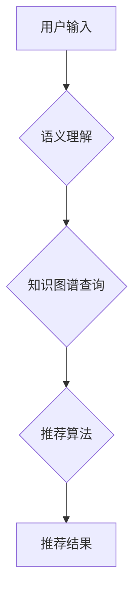

                 

## 跨类目搜索:AI电商的新挑战

> 关键词：跨类目搜索、电商推荐、人工智能、自然语言处理、知识图谱、机器学习、深度学习

## 1. 背景介绍

随着电商平台的蓬勃发展，用户对商品的搜索需求日益多样化。传统的基于关键词的搜索方式已经难以满足用户对更精准、更智能的搜索体验的需求。跨类目搜索作为一种新兴的搜索技术，旨在突破商品分类的限制，帮助用户更方便地找到与他们需求相匹配的商品，无论这些商品属于哪个类别。

跨类目搜索的核心挑战在于理解用户搜索意图，并将其映射到商品的语义特征。传统的搜索引擎主要依赖关键词匹配，而跨类目搜索需要更深入地理解用户需求，例如用户可能搜索“运动鞋”，但实际上是想购买“适合跑步的运动鞋”。

## 2. 核心概念与联系

跨类目搜索的核心概念包括：

* **语义理解:** 理解用户搜索词背后的含义，识别用户真正想要查找的商品属性和特征。
* **知识图谱:** 建立商品之间的语义关系网络，例如“运动鞋”属于“鞋类”，“跑步”属于“运动”，“运动鞋”与“跑步”存在关联关系。
* **推荐算法:** 基于用户搜索历史、浏览记录、购买行为等数据，推荐与用户需求相匹配的商品。

**跨类目搜索架构**



## 3. 核心算法原理 & 具体操作步骤

### 3.1  算法原理概述

跨类目搜索算法通常基于机器学习和深度学习技术，通过训练模型来学习用户搜索意图和商品特征之间的关系。常见的算法包括：

* **协同过滤:** 基于用户相似性和商品相似性进行推荐。
* **内容过滤:** 基于商品的属性和特征进行推荐。
* **混合推荐:** 结合协同过滤和内容过滤算法进行推荐。

### 3.2  算法步骤详解

以协同过滤算法为例，其具体操作步骤如下：

1. **数据收集:** 收集用户搜索历史、浏览记录、购买行为等数据。
2. **用户和商品打分:** 将用户和商品进行打分，例如用户对商品的评分、购买次数等。
3. **相似性计算:** 计算用户之间的相似度和商品之间的相似度。
4. **推荐生成:** 根据用户相似度和商品相似度，推荐与用户兴趣相匹配的商品。

### 3.3  算法优缺点

**优点:**

* 可以推荐用户可能感兴趣但未曾接触过的商品。
* 可以根据用户的历史行为进行个性化推荐。

**缺点:**

* 需要大量的用户数据进行训练。
* 对于新用户或新商品，推荐效果可能较差。

### 3.4  算法应用领域

跨类目搜索算法广泛应用于电商平台、搜索引擎、推荐系统等领域。

## 4. 数学模型和公式 & 详细讲解 & 举例说明

### 4.1  数学模型构建

协同过滤算法通常使用矩阵分解模型进行建模。假设用户集合为U，商品集合为I，用户-商品交互矩阵为R，其中R(u,i)表示用户u对商品i的评分。

目标是将用户-商品交互矩阵分解为两个低维矩阵，分别表示用户特征矩阵和商品特征矩阵。

### 4.2  公式推导过程

用户特征矩阵为P，商品特征矩阵为Q，则R(u,i)可以表示为：

$$R(u,i) = P(u) \cdot Q(i)$$

其中，P(u)表示用户u的特征向量，Q(i)表示商品i的特征向量。

通过最小化预测误差与实际评分之间的差值，可以学习到用户特征矩阵和商品特征矩阵。

### 4.3  案例分析与讲解

假设用户A对商品1评分为4，对商品2评分为3，用户B对商品1评分为5，对商品2评分为4。

可以使用协同过滤算法学习到用户A和用户B的特征向量，以及商品1和商品2的特征向量。

通过这些特征向量，可以预测用户A对商品2的评分，以及用户B对商品1的评分。

## 5. 项目实践：代码实例和详细解释说明

### 5.1  开发环境搭建

跨类目搜索项目可以使用Python语言进行开发，常用的库包括：

* **Scikit-learn:** 机器学习库
* **TensorFlow:** 深度学习库
* **PyTorch:** 深度学习库

### 5.2  源代码详细实现

以下是一个使用协同过滤算法实现跨类目搜索的简单代码示例：

```python
from sklearn.metrics.pairwise import cosine_similarity

# 用户-商品交互矩阵
ratings = [[4, 3], [5, 4]]

# 计算用户相似度
user_similarity = cosine_similarity(ratings)

# 获取用户A的相似用户
similar_users = user_similarity[0].argsort()[::-1][1:]

# 获取用户A对商品2的评分
user_a_rating = ratings[0][1]

# 计算用户A对商品2的预测评分
predicted_rating = sum([ratings[i][1] for i in similar_users]) / len(similar_users)

print(f"用户A对商品2的预测评分: {predicted_rating}")
```

### 5.3  代码解读与分析

该代码首先定义了一个用户-商品交互矩阵，然后使用cosine_similarity函数计算用户之间的相似度。

通过获取用户A的相似用户，可以计算用户A对商品2的预测评分。

### 5.4  运行结果展示

运行该代码后，可以得到用户A对商品2的预测评分。

## 6. 实际应用场景

跨类目搜索在电商平台的实际应用场景非常广泛，例如：

* **商品推荐:** 根据用户的搜索历史和浏览记录，推荐与用户需求相匹配的商品，即使这些商品属于不同的类别。
* **搜索结果优化:** 提升搜索结果的准确性和相关性，帮助用户更快速地找到所需商品。
* **个性化购物体验:** 提供个性化的商品推荐和搜索结果，提升用户的购物体验。

### 6.4  未来应用展望

随着人工智能技术的不断发展，跨类目搜索技术将更加智能化、个性化。未来，跨类目搜索将应用于更多领域，例如：

* **医疗保健:** 根据患者的症状和病史，推荐相关的医疗服务和药品。
* **教育:** 根据学生的学习情况和兴趣，推荐相关的学习资源和课程。
* **金融:** 根据用户的财务状况和投资目标，推荐相关的金融产品和服务。

## 7. 工具和资源推荐

### 7.1  学习资源推荐

* **Stanford CS229: Machine Learning:** https://cs229.stanford.edu/
* **Coursera: Machine Learning by Andrew Ng:** https://www.coursera.org/learn/machine-learning

### 7.2  开发工具推荐

* **Scikit-learn:** https://scikit-learn.org/
* **TensorFlow:** https://www.tensorflow.org/
* **PyTorch:** https://pytorch.org/

### 7.3  相关论文推荐

* **Collaborative Filtering for Implicit Feedback Datasets**
* **Neural Collaborative Filtering**
* **Knowledge Graph Embedding Techniques**

## 8. 总结：未来发展趋势与挑战

### 8.1  研究成果总结

跨类目搜索技术在电商平台的应用取得了显著成果，提升了用户购物体验，提高了商品推荐的准确性。

### 8.2  未来发展趋势

未来，跨类目搜索技术将朝着以下方向发展：

* **更深层次的语义理解:** 利用自然语言处理和深度学习技术，更深入地理解用户搜索意图。
* **更精准的商品推荐:** 基于用户行为、商品属性、知识图谱等多方面信息，进行更精准的商品推荐。
* **个性化搜索体验:** 提供个性化的搜索结果和推荐，满足不同用户的需求。

### 8.3  面临的挑战

跨类目搜索技术也面临一些挑战：

* **数据稀疏性:** 用户-商品交互数据往往是稀疏的，难以训练有效的模型。
* **冷启动问题:** 对于新用户和新商品，推荐效果较差。
* **解释性问题:** 跨类目搜索模型的决策过程难以解释，难以获得用户的信任。

### 8.4  研究展望

未来，需要进一步研究解决跨类目搜索技术面临的挑战，例如：

* 开发新的数据处理和模型训练方法，解决数据稀疏性和冷启动问题。
* 研究可解释性强的跨类目搜索模型，提高模型的透明度和可信度。
* 将跨类目搜索技术与其他人工智能技术结合，例如强化学习、生成对抗网络等，进一步提升推荐效果。

## 9. 附录：常见问题与解答

**Q1: 跨类目搜索和传统搜索有什么区别？**

**A1:** 传统的搜索引擎主要依赖关键词匹配，而跨类目搜索则更注重理解用户搜索意图，并将其映射到商品的语义特征。

**Q2: 跨类目搜索算法有哪些？**

**A2:** 常见的跨类目搜索算法包括协同过滤、内容过滤和混合推荐算法。

**Q3: 跨类目搜索技术有哪些应用场景？**

**A3:** 跨类目搜索技术广泛应用于电商平台、搜索引擎、推荐系统等领域。

作者：禅与计算机程序设计艺术 / Zen and the Art of Computer Programming 


<end_of_turn>

