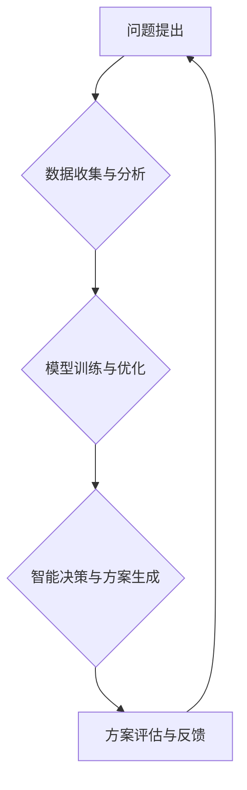

                 

## 集体智慧：探索解决复杂问题的创新路径

> 关键词：集体智慧、协同计算、分布式算法、机器学习、人工智能、复杂系统、创新路径

## 1. 背景介绍

在当今科技日新月异的时代，人类面临着越来越多的复杂问题，从气候变化到疾病预防，从金融危机到社会不平等，这些问题都具有高度的复杂性和非线性性，难以通过传统单一方法得到有效解决。面对这些挑战，我们需要探索新的解决问题的路径，而“集体智慧”的概念正逐渐成为一种重要的解决方案。

集体智慧是指由多个个体协同合作，通过信息共享、知识融合和智能交互，最终达到超越单个个体能力的智慧水平。这种智慧并非简单的个体能力的叠加，而是通过群体协同作用，激发出新的思维模式、创新点子和解决方案。

## 2. 核心概念与联系

### 2.1 集体智慧的本质

集体智慧的核心在于“协同”。它强调个体之间的相互作用和信息传递，通过群体智慧的涌现，实现超越单个个体能力的智慧水平。

### 2.2 集体智慧的实现路径

实现集体智慧需要多种技术手段和方法，包括：

* **协同计算:** 利用分布式计算模型，将任务分解成多个子任务，由多个个体并行处理，最终汇集结果。
* **机器学习:** 利用机器学习算法，从海量数据中学习模式和规律，帮助个体更好地理解问题和做出决策。
* **人工智能:** 利用人工智能技术，模拟人类的认知能力，实现智能交互和知识共享。

**Mermaid 流程图**



## 3. 核心算法原理 & 具体操作步骤

### 3.1 算法原理概述

**蚁群算法**是一种模拟蚂蚁觅食行为的启发式算法，通过蚂蚁在环境中移动和信息传递，找到最优路径。

### 3.2 算法步骤详解

1. **初始化:** 创建一个蚂蚁群体，每个蚂蚁随机选择一个起点。
2. **信息更新:** 蚂蚁在移动过程中，会根据路径的质量留下信息素，信息素浓度越高，路径越优。
3. **路径选择:** 蚂蚁选择下一个节点时，会根据信息素浓度和随机性进行选择。
4. **循环迭代:** 重复步骤2和3，直到找到最优路径。

### 3.3 算法优缺点

**优点:**

* 能够解决复杂路径规划问题。
* 具有并行性和鲁棒性。

**缺点:**

* 算法收敛速度较慢。
* 容易陷入局部最优解。

### 3.4 算法应用领域

* **路径规划:** 导航系统、物流配送、机器人路径规划等。
* **资源分配:** 优化资源分配、调度任务等。
* **网络优化:** 优化网络拓扑结构、路由算法等。

## 4. 数学模型和公式 & 详细讲解 & 举例说明

### 4.1 数学模型构建

**信息素更新公式:**

$$
\tau_{ij}(t) = (1 - \rho) \tau_{ij}(t-1) + \sum_{k=1}^{m} \Delta \tau_{ij}^k
$$

其中:

* $\tau_{ij}(t)$: 节点 i 到节点 j 的信息素浓度在时间 t。
* $\rho$: 信息素挥发系数。
* $\Delta \tau_{ij}^k$: 蚂蚁 k 从节点 i 到节点 j 留下信息素的量。

**蚂蚁选择路径概率公式:**

$$
p_{ij}^k = \frac{\tau_{ij}^{\alpha} \eta_{ij}^{\beta}}{\sum_{l \in N_i} \tau_{il}^{\alpha} \eta_{il}^{\beta}}
$$

其中:

* $p_{ij}^k$: 蚂蚁 k 从节点 i 到节点 j 的选择概率。
* $\alpha$: 信息素权重。
* $\beta$: 节点启发式权重。
* $N_i$: 节点 i 的邻居节点集合。
* $\eta_{ij}$: 节点 i 到节点 j 的启发式值。

### 4.2 公式推导过程

信息素更新公式基于信息素的挥发和蚂蚁的贡献。信息素挥发系数 $\rho$ 控制信息素的衰减速度，而蚂蚁贡献 $\Delta \tau_{ij}^k$ 则根据蚂蚁选择的路径质量进行调整。

蚂蚁选择路径概率公式基于信息素浓度和节点启发式值。信息素浓度反映了路径的质量，启发式值反映了节点的吸引力。

### 4.3 案例分析与讲解

假设我们有一个城市地图，需要找到从起点到终点的最短路径。我们可以使用蚁群算法来解决这个问题。

* **信息素:** 信息素浓度代表路径的质量，初始时所有路径的信息素浓度相同。
* **启发式值:** 启发式值代表节点的吸引力，例如距离终点的距离越短，启发式值越高。
* **蚂蚁:** 蚂蚁从起点出发，根据信息素浓度和启发式值选择下一个节点，并留下信息素。
* **迭代:** 重复上述步骤，直到找到最短路径。

## 5. 项目实践：代码实例和详细解释说明

### 5.1 开发环境搭建

* Python 3.x
* NetworkX 库

### 5.2 源代码详细实现

```python
import networkx as nx

# 创建图
graph = nx.Graph()
graph.add_edges_from([(1, 2), (1, 3), (2, 4), (2, 5), (3, 6), (4, 7), (5, 8)])

# 设置信息素浓度和启发式值
alpha = 1
beta = 2
rho = 0.5
tau = {edge: 1 for edge in graph.edges()}
eta = {edge: 1 for edge in graph.edges()}

# 蚂蚁数量
num_ants = 10

# 迭代次数
num_iterations = 100

# 运行蚁群算法
for iteration in range(num_iterations):
    for ant in range(num_ants):
        # 随机选择起点
        start_node = 1

        # 蚂蚁路径
        path = [start_node]

        # 遍历所有节点
        while len(path) < len(graph.nodes()):
            # 选择下一个节点
            next_node = select_next_node(graph, path, tau, eta, alpha, beta)

            # 更新路径
            path.append(next_node)

        # 更新信息素浓度
        update_tau(graph, path, tau, rho)

# 输出最优路径
best_path = nx.shortest_path(graph, source=1, target=8, weight='weight')
print(f"最优路径: {best_path}")
```

### 5.3 代码解读与分析

* **图创建:** 使用 NetworkX 库创建图，并添加边。
* **参数设置:** 设置信息素权重、启发式值权重、信息素挥发系数、初始信息素浓度和启发式值。
* **蚂蚁循环:** 每个蚂蚁从起点出发，选择下一个节点，并留下信息素。
* **信息素更新:** 根据蚂蚁选择的路径质量，更新信息素浓度。
* **最优路径输出:** 使用 NetworkX 库的 shortest_path 函数，找到最短路径。

### 5.4 运行结果展示

运行代码后，会输出最短路径。

## 6. 实际应用场景

* **物流配送:** 优化配送路线，提高效率和降低成本。
* **交通规划:** 建立智能交通系统，优化交通流量和缓解拥堵。
* **网络安全:** 检测和防御网络攻击，提高网络安全水平。

### 6.4 未来应用展望

* **个性化推荐:** 基于用户行为和偏好，提供个性化推荐服务。
* **医疗诊断:** 辅助医生进行疾病诊断，提高诊断准确率。
* **科学研究:** 探索复杂系统，发现新的科学规律。

## 7. 工具和资源推荐

### 7.1 学习资源推荐

* **书籍:**
    * 《集体智慧：探索解决复杂问题的创新路径》
    * 《人工智能：一种现代方法》
* **在线课程:**
    * Coursera: 人工智能
    * edX: 机器学习

### 7.2 开发工具推荐

* **Python:** 广泛应用于人工智能和机器学习领域。
* **TensorFlow:** 深度学习框架。
* **PyTorch:** 深度学习框架。

### 7.3 相关论文推荐

* **Ant Colony Optimization: A Metaheuristic Approach to Problem Solving**
* **Collective Intelligence: Searching for Optimal Solutions to Complex Problems**

## 8. 总结：未来发展趋势与挑战

### 8.1 研究成果总结

集体智慧的概念和技术正在快速发展，为解决复杂问题提供了新的思路和方法。

### 8.2 未来发展趋势

* **更强大的计算能力:** 随着计算能力的提升，集体智慧算法能够处理更复杂的问题。
* **更智能的算法:** 研究更智能的集体智慧算法，提高算法的效率和准确性。
* **更广泛的应用场景:** 集体智慧技术将应用于更多领域，例如医疗、教育、金融等。

### 8.3 面临的挑战

* **数据安全和隐私保护:** 集体智慧算法需要处理大量数据，因此数据安全和隐私保护是一个重要的挑战。
* **算法可解释性和透明度:** 集体智慧算法的决策过程往往比较复杂，缺乏可解释性和透明度，这可能会导致人们对算法的信任度降低。
* **伦理问题:** 集体智慧技术可能会带来一些伦理问题，例如算法偏见、决策责任等。

### 8.4 研究展望

未来，我们需要继续深入研究集体智慧技术，解决上述挑战，并将其应用于更多领域，为人类社会创造更大的价值。

## 9. 附录：常见问题与解答

**Q1: 集体智慧和人工智能有什么区别？**

**A1:** 集体智慧强调个体之间的协同合作，通过信息共享和知识融合，实现超越单个个体能力的智慧水平。人工智能则更侧重于模拟人类的认知能力，例如学习、推理和决策。

**Q2: 集体智慧算法的优缺点是什么？**

**A2:** 集体智慧算法的优点是能够解决复杂问题，具有并行性和鲁棒性。缺点是算法收敛速度较慢，容易陷入局部最优解。

**Q3: 集体智慧技术有哪些应用场景？**

**A3:** 集体智慧技术应用场景广泛，例如物流配送、交通规划、网络安全、个性化推荐、医疗诊断等。


作者：禅与计算机程序设计艺术 / Zen and the Art of Computer Programming 
<end_of_turn>

