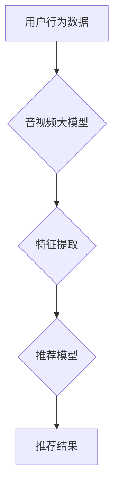

                 

## 音视频领域大模型推荐的机遇与挑战

> 关键词：大模型、音视频推荐、深度学习、Transformer、多模态学习、个性化推荐、公平性、可解释性

## 1. 背景介绍

近年来，深度学习技术取得了飞速发展，特别是大模型的涌现，为人工智能领域带来了革命性的变革。大模型，指的是参数规模庞大、训练数据海量的人工智能模型，其强大的学习能力和泛化能力使其在自然语言处理、计算机视觉等领域取得了突破性进展。

音视频内容作为互联网时代最重要的信息载体之一，其消费量持续增长，推荐系统在用户获取优质内容、平台内容运营等方面发挥着至关重要的作用。传统的音视频推荐系统主要依赖于基于内容的推荐、协同过滤等方法，但这些方法在个性化推荐、冷启动问题等方面存在局限性。

大模型的出现为音视频推荐领域带来了新的机遇。大模型能够学习到更丰富的音视频特征，并进行跨模态的知识融合，从而实现更精准、更个性化的推荐。

## 2. 核心概念与联系

### 2.1 音视频大模型

音视频大模型是指在海量音视频数据上训练的深度学习模型，其参数规模庞大，能够学习到复杂的音视频特征和语义关系。

### 2.2 多模态学习

多模态学习是指让模型学习多种模态数据（如文本、图像、音频）之间的关系，从而获得更全面的理解和表示。

### 2.3 音视频推荐系统

音视频推荐系统是指利用机器学习算法，根据用户的历史行为、偏好等信息，推荐用户感兴趣的音视频内容。

**Mermaid 流程图**



## 3. 核心算法原理 & 具体操作步骤

### 3.1 算法原理概述

音视频大模型推荐系统通常采用基于深度学习的推荐算法，例如Transformer、BERT等。这些算法能够学习到音视频内容之间的语义关系，并根据用户的历史行为和偏好进行个性化推荐。

### 3.2 算法步骤详解

1. **数据预处理:** 收集用户行为数据、音视频内容数据，并进行清洗、格式转换等预处理操作。
2. **特征提取:** 利用预训练的音视频大模型提取音视频内容的特征，例如文本描述、图像视觉特征、音频声学特征等。
3. **推荐模型训练:** 利用提取的特征和用户行为数据训练推荐模型，例如基于用户的协同过滤、基于内容的推荐、深度学习推荐等。
4. **推荐结果生成:** 将训练好的推荐模型应用于新的用户请求，生成个性化的推荐结果。

### 3.3 算法优缺点

**优点:**

* **个性化推荐:** 大模型能够学习到用户的个性化偏好，提供更精准的推荐结果。
* **跨模态融合:** 大模型能够融合多种模态数据，例如文本、图像、音频，获得更全面的内容理解。
* **冷启动问题缓解:** 大模型能够通过学习全局的语义关系，缓解冷启动问题。

**缺点:**

* **训练成本高:** 大模型的训练需要大量的计算资源和数据。
* **可解释性差:** 大模型的决策过程较为复杂，难以解释推荐结果背后的原因。
* **公平性问题:** 大模型可能存在偏见，导致推荐结果不公平。

### 3.4 算法应用领域

* **视频推荐:** 推荐用户感兴趣的视频内容，例如短视频、电视剧、电影等。
* **音乐推荐:** 推荐用户喜欢的音乐，例如歌曲、专辑、歌手等。
* **直播推荐:** 推荐用户感兴趣的直播内容，例如游戏直播、音乐直播、教育直播等。
* **音视频搜索:** 根据用户输入的关键词或语音指令，搜索相关音视频内容。

## 4. 数学模型和公式 & 详细讲解 & 举例说明

### 4.1 数学模型构建

音视频大模型推荐系统通常采用基于用户的协同过滤或基于内容的推荐模型。

**基于用户的协同过滤模型:**

假设用户集合为U，物品集合为I，用户对物品的评分矩阵为R。协同过滤模型的目标是预测用户u对物品i的评分。

**基于内容的推荐模型:**

假设音视频内容的特征向量为V，用户的特征向量为U。基于内容的推荐模型的目标是计算用户u与物品i的相似度，并根据相似度进行推荐。

### 4.2 公式推导过程

**基于用户的协同过滤模型:**

可以使用矩阵分解的方法来预测用户对物品的评分。

$$
R_{ui} = \mathbf{p}_u^T \mathbf{q}_i + \epsilon
$$

其中，$R_{ui}$表示用户u对物品i的评分，$\mathbf{p}_u$表示用户u的隐向量，$\mathbf{q}_i$表示物品i的隐向量，$\epsilon$表示误差项。

**基于内容的推荐模型:**

可以使用余弦相似度来计算用户与物品的相似度。

$$
\text{similarity}(u, i) = \frac{\mathbf{u}^T \mathbf{v}_i}{\|\mathbf{u}\| \|\mathbf{v}_i\|}
$$

其中，$\mathbf{u}$表示用户的特征向量，$\mathbf{v}_i$表示物品i的特征向量。

### 4.3 案例分析与讲解

**案例:**

假设有一个用户u，他喜欢观看动作片和科幻片。

**基于用户的协同过滤模型:**

如果系统中有其他用户也喜欢观看动作片和科幻片，那么模型会预测用户u也喜欢观看这些用户的评分高的电影。

**基于内容的推荐模型:**

如果系统中有动作片和科幻片的特征向量，那么模型会根据用户u的特征向量与这些特征向量的相似度，推荐用户u可能喜欢的电影。

## 5. 项目实践：代码实例和详细解释说明

### 5.1 开发环境搭建

* Python 3.7+
* TensorFlow/PyTorch
* CUDA/cuDNN

### 5.2 源代码详细实现

```python
# 导入必要的库
import tensorflow as tf

# 定义模型结构
class AudioVideoRecommender(tf.keras.Model):
    def __init__(self, embedding_dim, num_users, num_items):
        super(AudioVideoRecommender, self).__init__()
        self.user_embedding = tf.keras.layers.Embedding(num_users, embedding_dim)
        self.item_embedding = tf.keras.layers.Embedding(num_items, embedding_dim)
        self.dense = tf.keras.layers.Dense(1)

    def call(self, user_ids, item_ids):
        user_embeddings = self.user_embedding(user_ids)
        item_embeddings = self.item_embedding(item_ids)
        similarity = tf.reduce_sum(user_embeddings * item_embeddings, axis=1)
        return self.dense(similarity)

# 实例化模型
model = AudioVideoRecommender(embedding_dim=64, num_users=1000, num_items=10000)

# 训练模型
model.compile(optimizer='adam', loss='mse')
model.fit(x=[user_ids, item_ids], y=ratings, epochs=10)

# 预测评分
predictions = model.predict([user_ids, item_ids])
```

### 5.3 代码解读与分析

* 该代码实现了一个简单的基于用户的协同过滤模型。
* 模型使用Embedding层将用户和物品映射到低维向量空间。
* 使用Dense层计算用户和物品的相似度。
* 使用MSE损失函数和Adam优化器训练模型。

### 5.4 运行结果展示

* 训练完成后，模型可以用于预测用户对物品的评分。
* 可以将预测评分与实际评分进行比较，评估模型的性能。

## 6. 实际应用场景

### 6.1 视频平台推荐

* 推荐用户感兴趣的视频内容，例如短视频、电视剧、电影等。
* 根据用户的观看历史、点赞、评论等行为，个性化推荐视频。

### 6.2 音乐平台推荐

* 推荐用户喜欢的音乐，例如歌曲、专辑、歌手等。
* 根据用户的播放历史、收藏、分享等行为，个性化推荐音乐。

### 6.3 直播平台推荐

* 推荐用户感兴趣的直播内容，例如游戏直播、音乐直播、教育直播等。
* 根据用户的观看历史、点赞、打赏等行为，个性化推荐直播。

### 6.4 未来应用展望

* **更精准的个性化推荐:** 利用更先进的深度学习算法和多模态学习技术，实现更精准的个性化推荐。
* **跨平台推荐:** 将音视频内容跨平台推荐，例如将视频平台的推荐结果推荐到音乐平台。
* **增强现实/虚拟现实推荐:** 利用增强现实/虚拟现实技术，为用户提供更沉浸式的音视频推荐体验。

## 7. 工具和资源推荐

### 7.1 学习资源推荐

* **书籍:**
    * 深度学习
    * 自然语言处理
    * 计算机视觉
* **在线课程:**
    * Coursera
    * edX
    * Udacity

### 7.2 开发工具推荐

* **TensorFlow:** 开源深度学习框架
* **PyTorch:** 开源深度学习框架
* **Keras:** 高级深度学习API

### 7.3 相关论文推荐

* BERT: Pre-training of Deep Bidirectional Transformers for Language Understanding
* Transformer: Attention Is All You Need
* Multimodal Learning with Deep Neural Networks

## 8. 总结：未来发展趋势与挑战

### 8.1 研究成果总结

音视频大模型推荐系统取得了显著的进展，能够实现更精准、更个性化的推荐。

### 8.2 未来发展趋势

* **模型规模和能力的提升:** 随着计算资源的不断发展，音视频大模型的规模和能力将不断提升，能够学习到更丰富的音视频特征和语义关系。
* **多模态学习的深入研究:** 多模态学习将成为音视频大模型推荐系统的重要研究方向，能够融合文本、图像、音频等多种模态数据，实现更全面的内容理解。
* **个性化推荐的进一步增强:** 利用用户行为数据、偏好数据等，实现更精准、更个性化的推荐。

### 8.3 面临的挑战

* **数据获取和标注:** 音视频数据获取和标注成本较高，需要开发更有效的标注方法。
* **模型可解释性:** 大模型的决策过程较为复杂，难以解释推荐结果背后的原因，需要研究更可解释的推荐模型。
* **公平性问题:** 大模型可能存在偏见，导致推荐结果不公平，需要研究解决公平性问题的算法和方法。

### 8.4 研究展望

音视频大模型推荐系统是一个充满机遇和挑战的领域，未来将会有更多创新和突破。


## 9. 附录：常见问题与解答

### 9.1 如何选择合适的音视频大模型？

选择合适的音视频大模型需要考虑以下因素:

* **模型规模:** 模型规模越大，学习能力越强，但训练成本也越高。
* **模型架构:** 不同的模型架构适用于不同的任务，例如Transformer适用于文本处理，而CNN适用于图像处理。
* **预训练数据:** 预训练数据越多，模型的泛化能力越强。

### 9.2 如何解决音视频数据标注问题？

音视频数据标注成本较高，可以考虑以下方法:

* **利用自动标注工具:** 利用自动标注工具进行初步标注，然后由人工进行校对。
* **构建标注平台:** 建立一个专门的音视频数据标注平台，方便管理和协作。
* **与第三方标注公司合作:** 与第三方标注公司合作，进行数据标注。

### 9.3 如何评估音视频大模型推荐系统的性能？

音视频大模型推荐系统的性能可以评估以下指标:

* **准确率:** 推荐结果与用户实际偏好相符的比例。
* **召回率:** 推荐结果包含用户实际喜欢的物品的比例。
* **点击率:** 用户点击推荐结果的比例。
* **转化率:** 用户通过推荐结果完成购买或其他目标行为的比例。


作者：禅与计算机程序设计艺术 / Zen and the Art of Computer Programming 
<end_of_turn>

