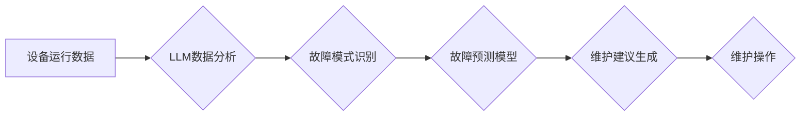

                 

## 关键词：预测性维护、LLM、工业设备管理、机器学习、数据分析、故障预测、设备寿命

## 1. 背景介绍

随着工业互联网和数字化转型时代的到来，工业设备管理面临着前所未有的挑战。传统设备维护模式，例如时间驱动维护和故障修复维护，往往存在维护成本高、效率低、停机时间长等问题。预测性维护 (Predictive Maintenance) 作为一种基于数据分析和机器学习的先进维护模式，逐渐成为工业设备管理的趋势。

预测性维护的核心思想是通过对设备运行数据的分析，预测设备潜在的故障风险，并提前进行维护，从而避免设备故障导致的停机损失和安全隐患。传统的预测性维护方法主要依赖于规则引擎和统计模型，但这些方法往往难以处理复杂、非线性的设备运行数据，并且需要大量的专家经验进行模型构建和维护。

近年来，大语言模型 (LLM) 的快速发展为预测性维护带来了新的机遇。LLM 拥有强大的文本理解和生成能力，能够从海量设备运行数据中提取关键信息，识别故障模式，并生成预测性维护建议。

## 2. 核心概念与联系

### 2.1 预测性维护

预测性维护是指利用数据分析和机器学习技术，预测设备故障的发生时间和类型，并根据预测结果制定相应的维护计划，以避免设备故障导致的停机损失和安全隐患。

### 2.2 LLM

大语言模型 (LLM) 是一种基于深度学习的强大人工智能模型，能够理解和生成人类语言。LLM 通过训练大量的文本数据，学习语言的语法、语义和上下文关系，从而具备强大的文本理解、生成、翻译、问答等能力。

### 2.3 连接

LLM 在预测性维护中的应用主要体现在以下几个方面：

* **数据分析和特征提取:** LLM 可以从设备运行数据中提取关键特征，例如温度、压力、振动等，并识别潜在的故障模式。
* **故障预测:** LLM 可以利用提取的特征和历史故障数据，构建故障预测模型，预测设备故障的发生时间和类型。
* **维护建议生成:** LLM 可以根据预测结果，生成个性化的维护建议，例如更换部件、调整参数等。

**Mermaid 流程图**



## 3. 核心算法原理 & 具体操作步骤

### 3.1 算法原理概述

LLM 在预测性维护中的应用主要基于以下核心算法：

* **自然语言处理 (NLP):** LLM 利用 NLP 技术对设备运行数据进行文本化处理，提取关键信息和特征。
* **机器学习 (ML):** LLM 利用 ML 算法，例如回归分析、分类算法、时间序列分析等，构建故障预测模型。
* **深度学习 (DL):** LLM 可以采用深度学习算法，例如循环神经网络 (RNN)、长短期记忆网络 (LSTM) 等，处理复杂、非线性的设备运行数据。

### 3.2 算法步骤详解

1. **数据收集:** 收集设备运行数据，包括传感器数据、日志数据、历史维护记录等。
2. **数据预处理:** 对收集到的数据进行清洗、转换、特征工程等预处理操作，以提高数据质量和模型性能。
3. **数据分析:** 利用 LLM 的 NLP 技术，对预处理后的数据进行分析，提取关键特征和故障模式。
4. **模型构建:** 利用 ML 或 DL 算法，构建故障预测模型，并对模型进行训练和评估。
5. **预测和建议:** 将训练好的模型应用于新的设备运行数据，进行故障预测，并根据预测结果生成维护建议。
6. **维护操作:** 根据 LLM 生成的维护建议，进行相应的维护操作，例如更换部件、调整参数等。

### 3.3 算法优缺点

**优点:**

* 能够处理复杂、非线性的设备运行数据。
* 具有强大的故障模式识别和预测能力。
* 可以生成个性化的维护建议。

**缺点:**

* 需要大量的训练数据。
* 模型训练和部署成本较高。
* 对数据质量要求较高。

### 3.4 算法应用领域

LLM 在预测性维护领域的应用领域广泛，包括：

* 制造业
* 能源行业
* 交通运输业
* 医疗保健业

## 4. 数学模型和公式 & 详细讲解 & 举例说明

### 4.1 数学模型构建

在预测性维护中，常用的数学模型包括回归模型、分类模型和时间序列模型。

* **回归模型:** 用于预测连续型变量，例如设备寿命、故障发生时间等。常用的回归模型包括线性回归、多项式回归、支持向量回归等。
* **分类模型:** 用于预测离散型变量，例如设备故障类型、维护优先级等。常用的分类模型包括逻辑回归、决策树、随机森林、支持向量机等。
* **时间序列模型:** 用于预测时间序列数据，例如设备运行参数、故障发生频率等。常用的时间序列模型包括ARIMA、SARIMA、LSTM等。

### 4.2 公式推导过程

由于篇幅限制，这里只列举一个简单的线性回归模型的公式推导过程：

**目标:** 预测设备寿命 $y$，根据设备运行参数 $x$ 进行预测。

**假设:** 设备寿命 $y$ 与设备运行参数 $x$ 呈线性关系。

**模型:** $y = \beta_0 + \beta_1 x + \epsilon$

其中:

* $y$：设备寿命
* $x$：设备运行参数
* $\beta_0$：截距
* $\beta_1$：斜率
* $\epsilon$：随机误差

**参数估计:** 使用最小二乘法估计模型参数 $\beta_0$ 和 $\beta_1$。

### 4.3 案例分析与讲解

假设我们收集了 100 台设备的运行数据，包括设备运行参数 $x$ 和设备寿命 $y$。我们可以使用线性回归模型对这些数据进行拟合，并得到设备寿命预测模型。

例如，假设我们得到以下模型：

$y = 5000 + 10x$

这意味着，设备运行参数 $x$ 每增加 1，设备寿命 $y$ 就会增加 10。

## 5. 项目实践：代码实例和详细解释说明

### 5.1 开发环境搭建

* Python 3.7+
* TensorFlow 2.0+
* PyTorch 1.0+
* scikit-learn 0.20+
* Jupyter Notebook

### 5.2 源代码详细实现

```python
# 导入必要的库
import pandas as pd
from sklearn.model_selection import train_test_split
from sklearn.linear_model import LinearRegression
from sklearn.metrics import mean_squared_error

# 加载设备运行数据
data = pd.read_csv('device_data.csv')

# 选择特征和目标变量
X = data[['运行参数1', '运行参数2']]
y = data['设备寿命']

# 将数据划分为训练集和测试集
X_train, X_test, y_train, y_test = train_test_split(X, y, test_size=0.2, random_state=42)

# 创建线性回归模型
model = LinearRegression()

# 训练模型
model.fit(X_train, y_train)

# 对测试集进行预测
y_pred = model.predict(X_test)

# 计算模型性能
mse = mean_squared_error(y_test, y_pred)
print(f'模型均方误差: {mse}')

# 生成预测结果
predictions = pd.DataFrame({'实际寿命': y_test, '预测寿命': y_pred})
print(predictions)
```

### 5.3 代码解读与分析

* 代码首先导入必要的库，然后加载设备运行数据。
* 选择特征和目标变量，并将数据划分为训练集和测试集。
* 创建线性回归模型，并使用训练集训练模型。
* 对测试集进行预测，并计算模型性能。
* 最后，生成预测结果并打印出来。

### 5.4 运行结果展示

运行结果将显示模型的均方误差以及预测寿命和实际寿命的比较。

## 6. 实际应用场景

LLM 在预测性维护领域的应用场景非常广泛，例如：

* **风力发电机组:** 利用 LLM 分析风力发电机组的运行数据，预测叶片故障、齿轮磨损等问题，并提前进行维护，避免停机损失。
* **燃气轮机:** 利用 LLM 分析燃气轮机的运行数据，预测燃烧室故障、涡轮叶片损坏等问题，并提前进行维护，提高燃气轮机的可靠性和寿命。
* **工业机器人:** 利用 LLM 分析工业机器人的运行数据，预测关节故障、电机损坏等问题，并提前进行维护，确保机器人的稳定运行。

### 6.4 未来应用展望

随着 LLM 技术的不断发展，其在预测性维护领域的应用将更加广泛和深入。未来，LLM 可能能够：

* 更准确地预测设备故障，并提供更个性化的维护建议。
* 自动识别设备故障模式，并提供故障诊断建议。
* 与其他人工智能技术结合，实现更智能的设备管理。

## 7. 工具和资源推荐

### 7.1 学习资源推荐

* **书籍:**
    * Deep Learning by Ian Goodfellow, Yoshua Bengio, and Aaron Courville
    * Natural Language Processing with Python by Steven Bird, Ewan Klein, and Edward Loper
* **在线课程:**
    * Coursera: Machine Learning by Andrew Ng
    * Udacity: Deep Learning Nanodegree
    * fast.ai: Practical Deep Learning for Coders

### 7.2 开发工具推荐

* **Python:** 广泛用于机器学习和深度学习开发。
* **TensorFlow:** 开源深度学习框架，提供丰富的工具和资源。
* **PyTorch:** 开源深度学习框架，以其灵活性和易用性而闻名。
* **scikit-learn:** 开源机器学习库，提供各种算法和工具。

### 7.3 相关论文推荐

* **BERT: Pre-training of Deep Bidirectional Transformers for Language Understanding**
* **GPT-3: Language Models are Few-Shot Learners**
* **Attention Is All You Need**

## 8. 总结：未来发展趋势与挑战

### 8.1 研究成果总结

LLM 在预测性维护领域取得了显著的成果，能够有效地分析设备运行数据，预测设备故障，并生成个性化的维护建议。

### 8.2 未来发展趋势

未来，LLM 在预测性维护领域的应用将更加广泛和深入，例如：

* 更准确的故障预测
* 自动化的故障诊断
* 智能化的设备管理

### 8.3 面临的挑战

LLM 在预测性维护领域也面临一些挑战，例如：

* 数据质量问题
* 模型训练成本
* 伦理和安全问题

### 8.4 研究展望

未来研究方向包括：

* 开发更强大的 LLMs，提高故障预测的准确性。
* 研究更有效的 LLMs 训练方法，降低训练成本。
* 探索 LLMs 在预测性维护中的伦理和安全问题。

## 9. 附录：常见问题与解答

* **Q1: LLM 在预测性维护中有哪些优势？**

A1: LLM 在预测性维护中具有以下优势：

* 能够处理复杂、非线性的设备运行数据。
* 具有强大的故障模式识别和预测能力。
* 可以生成个性化的维护建议。

* **Q2: LLM 在预测性维护中有哪些局限性？**

A2: LLM 在预测性维护中也存在一些局限性：

* 需要大量的训练数据。
* 模型训练和部署成本较高。
* 对数据质量要求较高。

* **Q3: 如何选择合适的 LLM 模型？**

A3: 选择合适的 LLM 模型需要考虑以下因素：

* 数据规模和类型
* 预测任务的复杂度
* 计算资源和成本


作者：禅与计算机程序设计艺术 / Zen and the Art of Computer Programming 
<end_of_turn>

