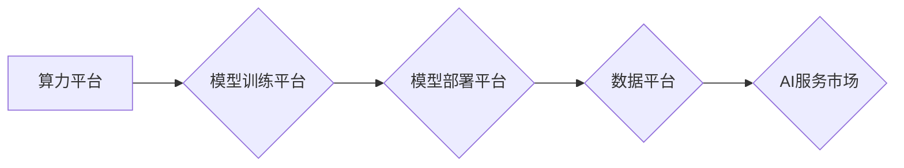

                 

## '见过猪跑，养过猪'：Lepton AI团队的优势，深度参与云与AI发展

> 关键词：Lepton AI, 云计算, 人工智能, 深度学习, 模型训练, 算法优化, 算力平台, 

## 1. 背景介绍

近年来，云计算和人工智能（AI）技术蓬勃发展，成为推动数字经济转型升级的重要驱动力。云计算为AI提供了强大的算力基础和数据支撑，而AI则赋予云计算以更智能、更灵活的应用能力。在这种背景下，Lepton AI 团队应运而生，致力于打造领先的云原生AI平台，为开发者和企业提供便捷、高效的AI解决方案。

Lepton AI 团队由一群经验丰富的AI专家、软件工程师和云计算架构师组成，他们拥有丰富的行业经验和深厚的技术底蕴。团队成员曾参与过多个知名AI项目的研发和落地，积累了丰富的实战经验。Lepton AI 团队秉承“见过猪跑，养过猪”的理念，不仅对AI技术有深入的理解，更注重将理论知识转化为实际应用，为用户提供真正可用的AI解决方案。

## 2. 核心概念与联系

Lepton AI 平台的核心概念是将AI技术与云计算平台深度融合，构建一个端到端的AI开发和部署平台。该平台提供了一系列功能，包括：

* **算力平台:** 提供高性能的GPU和TPU算力资源，支持大规模模型训练和推理。
* **模型训练平台:** 提供丰富的模型训练框架和工具，支持多种深度学习算法和模型架构。
* **模型部署平台:** 提供便捷的模型部署和管理工具，支持多种部署方式，如容器化部署、边缘部署等。
* **数据平台:** 提供数据存储、处理和管理服务，支持海量数据的处理和分析。
* **AI服务市场:** 提供丰富的预训练模型和AI服务，方便用户快速接入AI能力。

Lepton AI 平台的架构设计遵循微服务架构的原则，各个模块之间通过API进行通信，实现高可扩展性和高可用性。



## 3. 核心算法原理 & 具体操作步骤

Lepton AI 平台的核心算法原理基于深度学习技术，主要包括卷积神经网络（CNN）、循环神经网络（RNN）和Transformer等模型架构。

### 3.1  算法原理概述

深度学习算法通过多层神经网络结构，学习数据中的复杂特征和模式。每个神经元接收来自上一层的输入信号，并通过激活函数进行处理，输出到下一层。通过不断训练和迭代，神经网络能够学习到越来越复杂的特征表示，从而实现对数据的分类、识别、预测等任务。

### 3.2  算法步骤详解

Lepton AI 平台的模型训练流程主要包括以下步骤：

1. **数据预处理:** 对原始数据进行清洗、转换和格式化，使其适合模型训练。
2. **模型选择:** 根据任务需求选择合适的模型架构，如CNN、RNN或Transformer。
3. **模型参数初始化:** 为模型参数赋予初始值，通常采用随机初始化或预训练模型的权重。
4. **模型训练:** 使用训练数据训练模型，通过反向传播算法更新模型参数，降低模型的损失函数值。
5. **模型评估:** 使用验证数据评估模型的性能，并根据评估结果调整模型参数或训练策略。
6. **模型部署:** 将训练好的模型部署到生产环境，用于进行预测或推理。

### 3.3  算法优缺点

**优点:**

* **高精度:** 深度学习算法能够学习到数据中的复杂特征，实现高精度的预测和识别。
* **自动化学习:** 深度学习算法能够自动学习数据特征，无需人工特征工程。
* **可扩展性:** 深度学习算法能够利用云计算平台的强大算力，进行大规模模型训练。

**缺点:**

* **数据依赖:** 深度学习算法对数据质量和数量有很高的要求。
* **训练成本高:** 深度学习模型训练需要大量的计算资源和时间。
* **可解释性差:** 深度学习模型的决策过程难以解释，缺乏透明度。

### 3.4  算法应用领域

Lepton AI 平台的深度学习算法应用于多个领域，包括：

* **图像识别:** 人脸识别、物体检测、图像分类等。
* **自然语言处理:** 文本分类、情感分析、机器翻译等。
* **语音识别:** 语音转文本、语音合成等。
* **推荐系统:** 商品推荐、内容推荐等。
* **医疗诊断:** 病情预测、疾病诊断等。

## 4. 数学模型和公式 & 详细讲解 & 举例说明

深度学习算法的核心是神经网络模型，其数学模型基于线性变换和非线性激活函数。

### 4.1  数学模型构建

一个神经网络由多个层组成，每层包含多个神经元。每个神经元接收来自上一层的输入信号，并通过权重进行加权求和，然后应用激活函数进行非线性变换，输出到下一层。

假设一个神经网络有 L 层，第 l 层有 N_l 个神经元，则第 l 层的输出可以表示为：

$$
z^{(l)} = f^{(l)}(W^{(l)}x^{(l-1)} + b^{(l)})
$$

其中：

* $z^{(l)}$ 是第 l 层的输出向量。
* $x^{(l-1)}$ 是第 l-1 层的输出向量。
* $W^{(l)}$ 是第 l 层的权重矩阵。
* $b^{(l)}$ 是第 l 层的偏置向量。
* $f^{(l)}$ 是第 l 层的激活函数。

### 4.2  公式推导过程

深度学习算法的训练过程是通过反向传播算法来更新模型参数的。反向传播算法的核心思想是利用梯度下降法，不断调整模型参数，使得模型的损失函数值最小化。

损失函数通常定义为预测值与真实值的差值，例如均方误差（MSE）。

$$
L = \frac{1}{N} \sum_{i=1}^{N} (y_i - \hat{y}_i)^2
$$

其中：

* $L$ 是损失函数值。
* $N$ 是样本数量。
* $y_i$ 是第 i 个样本的真实值。
* $\hat{y}_i$ 是第 i 个样本的预测值。

通过链式法则，可以计算出每个参数的梯度，并根据梯度更新参数值。

### 4.3  案例分析与讲解

例如，在图像分类任务中，可以使用卷积神经网络（CNN）模型进行训练。CNN 模型通过卷积层和池化层来提取图像特征，并通过全连接层进行分类。

在训练过程中，可以使用反向传播算法来更新模型参数，使得模型能够准确地识别图像类别。

## 5. 项目实践：代码实例和详细解释说明

Lepton AI 平台提供了丰富的API和工具，方便开发者进行模型训练和部署。以下是一个简单的代码实例，演示如何使用Lepton AI 平台训练一个简单的线性回归模型。

### 5.1  开发环境搭建

Lepton AI 平台支持多种开发环境，包括Python、Java和C++。

以下示例使用Python环境进行开发。

需要安装Lepton AI SDK和必要的Python库，例如NumPy、Pandas和Scikit-learn。

### 5.2  源代码详细实现

```python
import leptonai as la

# 创建Lepton AI客户端
client = la.Client("your_api_key")

# 加载数据集
data = pd.read_csv("data.csv")

# 定义模型
model = la.LinearRegression()

# 训练模型
model.fit(data["feature"], data["target"])

# 预测结果
predictions = model.predict(data["feature"])

# 评估模型性能
mse = la.mean_squared_error(data["target"], predictions)
print(f"Mean Squared Error: {mse}")
```

### 5.3  代码解读与分析

这段代码首先创建了一个Lepton AI客户端，然后加载了数据集。

接着，定义了一个线性回归模型，并使用`fit()`方法训练模型。

训练完成后，使用`predict()`方法预测新的数据，并使用`mean_squared_error()`方法评估模型性能。

### 5.4  运行结果展示

运行这段代码后，会输出模型的均方误差值，表示模型的预测精度。

## 6. 实际应用场景

Lepton AI 平台的云原生AI解决方案已广泛应用于多个行业，例如：

### 6.1  金融行业

* **欺诈检测:** 利用深度学习算法识别异常交易行为，降低金融风险。
* **信用评分:** 基于用户行为数据和财务记录，预测用户的信用风险。
* **投资决策:** 分析市场数据和用户偏好，提供智能投资建议。

### 6.2  医疗行业

* **疾病诊断:** 利用图像识别和自然语言处理技术，辅助医生进行疾病诊断。
* **药物研发:** 利用机器学习算法分析药物数据，加速药物研发进程。
* **个性化医疗:** 基于患者基因信息和病史，提供个性化的医疗方案。

### 6.3  零售行业

* **商品推荐:** 基于用户购买历史和浏览记录，推荐个性化的商品。
* **库存管理:** 利用预测模型预测商品需求，优化库存管理。
* **客户服务:** 利用聊天机器人技术提供智能客户服务。

### 6.4  未来应用展望

Lepton AI 平台将继续深耕云原生AI领域，不断推出更先进的AI技术和解决方案，助力企业数字化转型升级。

未来，Lepton AI 平台将重点关注以下几个方向：

* **边缘计算:** 将AI模型部署到边缘设备，实现更低延迟、更高效率的AI应用。
* **联邦学习:** 保护用户隐私，实现数据安全共享的AI训练方式。
* **AI芯片:** 开发自主研发的AI芯片，提升模型训练和推理性能。

## 7. 工具和资源推荐

### 7.1  学习资源推荐

* **Lepton AI 官方文档:** https://docs.leptonai.com/
* **Lepton AI GitHub 仓库:** https://github.com/LeptonAI
* **深度学习课程:** Coursera、edX、Udacity 等平台提供丰富的深度学习课程。

### 7.2  开发工具推荐

* **Python:** 深度学习开发的常用语言。
* **Jupyter Notebook:** 用于深度学习代码开发和实验的交互式环境。
* **TensorFlow:** 开源深度学习框架。
* **PyTorch:** 开源深度学习框架。

### 7.3  相关论文推荐

* **ImageNet Classification with Deep Convolutional Neural Networks:** https://arxiv.org/abs/1202.1409
* **Attention Is All You Need:** https://arxiv.org/abs/1706.03762
* **BERT: Pre-training of Deep Bidirectional Transformers for Language Understanding:** https://arxiv.org/abs/1810.04805

## 8. 总结：未来发展趋势与挑战

### 8.1  研究成果总结

Lepton AI 团队在云原生AI领域取得了显著成果，构建了领先的AI平台，并将其应用于多个行业。

团队成员在深度学习算法、模型训练、部署和优化等方面积累了丰富的经验。

### 8.2  未来发展趋势

未来，Lepton AI 平台将继续深耕云原生AI领域，关注边缘计算、联邦学习和AI芯片等前沿技术，为用户提供更智能、更便捷的AI解决方案。

### 8.3  面临的挑战

Lepton AI 平台也面临着一些挑战，例如：

* **数据安全和隐私保护:** 随着AI技术的应用越来越广泛，数据安全和隐私保护问题日益突出。Lepton AI 平台需要加强数据安全措施，保障用户数据安全。
* **模型可解释性:** 深度学习模型的决策过程难以解释，缺乏透明度。Lepton AI 平台需要研究模型可解释性技术，提高模型的信任度。
* **人才短缺:** AI领域人才需求量大，但人才供给相对不足。Lepton AI 平台需要积极培养AI人才，构建一支强大的技术团队。

### 8.4  研究展望

Lepton AI 团队将继续致力于云原生AI技术的研发和应用，为推动数字经济发展贡献力量。

## 9. 附录：常见问题与解答

### 9.1  常见问题

* **Lepton AI 平台的收费标准是什么？**

Lepton AI 平台提供免费试用和付费订阅两种服务模式。

* **Lepton AI 平台支持哪些编程语言？**

Lepton AI 平台支持Python、Java和C++等编程语言。

* **Lepton AI 平台的模型训练平台支持哪些深度学习框架？**

Lepton AI 平台支持TensorFlow、PyTorch等主流深度学习框架。

### 9.2  解答

* **Lepton AI 平台的收费标准**

Lepton AI 平台提供免费试用和付费订阅两种服务模式。免费试用用户可以体验Lepton AI 平台的基本功能，付费订阅用户可以享受更高级的功能和服务，例如更大的算力资源、更专业的技术支持等。

* **Lepton AI 平台支持哪些编程语言**

Lepton AI 平台支持Python、Java和C++等编程语言。

* **Lepton AI 平台的模型训练平台支持哪些深度学习框架**

Lepton AI 平台支持TensorFlow、PyTorch等主流深度学习框架。

作者：禅与计算机程序设计艺术 / Zen and the Art of Computer Programming


<end_of_turn>

