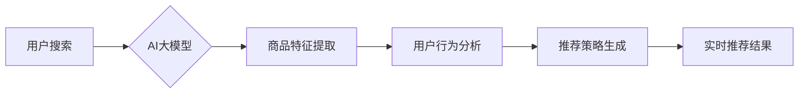

                 

## AI 大模型在电商搜索推荐中的实时推荐策略：抓住用户瞬时需求与行为意图

> 关键词：电商搜索推荐、AI大模型、实时推荐、用户行为意图、推荐策略、深度学习、Transformer模型

## 1. 背景介绍

在当今数字经济时代，电商平台已成为人们获取商品和服务的首选渠道。搜索推荐作为电商平台的核心功能之一，直接影响着用户体验和商业转化率。传统的搜索推荐系统主要依赖于基于规则和协同过滤等方法，难以捕捉用户瞬时需求和复杂的商品关联性。

随着人工智能技术的飞速发展，特别是深度学习技术的突破，AI大模型在电商搜索推荐领域展现出巨大的潜力。AI大模型，例如Transformer模型，能够学习用户行为、商品特征和语义关系等海量数据，构建更精准、更智能的推荐策略。

实时推荐策略是指在用户搜索或浏览商品时，根据其实时行为和上下文信息，即时提供个性化推荐结果的策略。实时推荐能够更好地满足用户个性化需求，提升用户体验，并促进电商平台的商业转化。

## 2. 核心概念与联系

### 2.1  电商搜索推荐

电商搜索推荐是指在电商平台上，根据用户的搜索词、浏览历史、购买记录等信息，为用户推荐相关商品的系统。其目标是帮助用户快速找到所需商品，并提升用户的购物体验。

### 2.2  AI大模型

AI大模型是指在海量数据上训练的深度学习模型，具有强大的学习和泛化能力。常见的AI大模型包括Transformer模型、BERT模型、GPT模型等。

### 2.3  实时推荐

实时推荐是指在用户交互发生时，根据用户的实时行为和上下文信息，即时提供个性化推荐结果的策略。实时推荐能够更好地满足用户个性化需求，提升用户体验，并促进电商平台的商业转化。

**核心概念与架构流程图**



## 3. 核心算法原理 & 具体操作步骤

### 3.1  算法原理概述

在电商搜索推荐中，AI大模型可以用于学习用户行为、商品特征和语义关系等信息，并构建个性化的推荐策略。常用的算法包括：

* **深度神经网络:** 深度神经网络能够学习复杂的非线性关系，并对用户行为和商品特征进行多层次的特征提取。
* **Transformer模型:** Transformer模型能够捕捉序列数据中的长距离依赖关系，适用于处理用户搜索词和商品描述等文本数据。
* **协同过滤:** 协同过滤算法基于用户的历史行为和商品的相似度进行推荐。

### 3.2  算法步骤详解

1. **数据预处理:** 收集用户行为数据、商品信息数据等，并进行清洗、转换、编码等预处理操作。
2. **特征工程:** 从原始数据中提取用户行为特征、商品特征、语义特征等，并构建特征向量。
3. **模型训练:** 使用深度学习算法训练AI大模型，并根据训练结果进行模型评估和调优。
4. **实时推荐:** 当用户进行搜索或浏览商品时，根据用户的实时行为和上下文信息，调用训练好的AI大模型进行推荐。

### 3.3  算法优缺点

**优点:**

* 能够学习用户行为和商品特征的复杂关系，提供更精准的推荐结果。
* 能够处理海量数据，并进行实时推荐。
* 能够根据用户行为进行动态调整，提升推荐效果。

**缺点:**

* 训练数据量大，需要强大的计算资源。
* 模型训练时间长，需要专业的技术人员进行操作。
* 对数据质量要求高，数据偏差会影响推荐效果。

### 3.4  算法应用领域

* **电商搜索推荐:** 为用户推荐相关商品，提升用户体验和商业转化率。
* **内容推荐:** 为用户推荐相关新闻、视频、文章等内容，提升用户粘性和活跃度。
* **广告推荐:** 为用户推荐相关广告，提升广告点击率和转化率。

## 4. 数学模型和公式 & 详细讲解 & 举例说明

### 4.1  数学模型构建

在电商搜索推荐中，可以使用协同过滤算法构建数学模型。协同过滤算法基于用户的历史行为和商品的相似度进行推荐。

**用户-商品交互矩阵:**

用户-商品交互矩阵是一个二维矩阵，其中每一行代表一个用户，每一列代表一个商品。矩阵中的元素表示用户对商品的交互行为，例如评分、购买、浏览等。

**用户相似度计算:**

可以使用余弦相似度等方法计算用户之间的相似度。

$$
\text{相似度} = \frac{\mathbf{u_i} \cdot \mathbf{u_j}}{\|\mathbf{u_i}\| \|\mathbf{u_j}\|}
$$

其中，$\mathbf{u_i}$ 和 $\mathbf{u_j}$ 分别表示用户 $i$ 和用户 $j$ 的特征向量。

**商品相似度计算:**

可以使用余弦相似度等方法计算商品之间的相似度。

$$
\text{相似度} = \frac{\mathbf{p_i} \cdot \mathbf{p_j}}{\|\mathbf{p_i}\| \|\mathbf{p_j}\|}
$$

其中，$\mathbf{p_i}$ 和 $\mathbf{p_j}$ 分别表示商品 $i$ 和商品 $j$ 的特征向量。

### 4.2  公式推导过程

协同过滤算法的推荐策略基于用户相似度和商品相似度。

**基于用户相似度的推荐:**

对于用户 $u$，找到与其行为最相似的用户 $v$，并推荐用户 $v$ 喜欢的商品，但用户 $u$ 尚未交互过的商品。

**基于商品相似度的推荐:**

对于用户 $u$，找到与用户 $u$ 之前交互过的商品 $i$ 最相似的商品 $j$，并推荐商品 $j$。

### 4.3  案例分析与讲解

假设有一个电商平台，用户 $A$ 喜欢购买运动鞋，用户 $B$ 也喜欢购买运动鞋，并且用户 $A$ 和用户 $B$ 的购买记录非常相似。

根据协同过滤算法，我们可以计算用户 $A$ 和用户 $B$ 的相似度，并发现其相似度很高。因此，我们可以推荐用户 $A$ 用户 $B$ 之前购买过的，但用户 $A$ 尚未交互过的运动鞋。

## 5. 项目实践：代码实例和详细解释说明

### 5.1  开发环境搭建

* **操作系统:** Linux/macOS/Windows
* **编程语言:** Python
* **深度学习框架:** TensorFlow/PyTorch
* **数据存储:** MySQL/MongoDB

### 5.2  源代码详细实现

```python
# 导入必要的库
import numpy as np
from sklearn.metrics.pairwise import cosine_similarity

# 定义用户-商品交互矩阵
user_item_matrix = np.array([
    [1, 0, 1, 0, 0],
    [0, 1, 1, 1, 0],
    [1, 0, 0, 1, 1],
    [0, 1, 1, 0, 1],
    [1, 1, 0, 0, 0]
])

# 计算用户相似度
user_similarity = cosine_similarity(user_item_matrix)

# 获取用户 A 的相似用户
user_a_index = 0
similar_users = np.argsort(user_similarity[user_a_index])[::-1][1:]

# 推荐用户 A 尚未交互过的商品
# ...
```

### 5.3  代码解读与分析

* **用户-商品交互矩阵:** 存储了用户对商品的交互行为，例如评分、购买、浏览等。
* **cosine_similarity:** 计算用户之间的余弦相似度。
* **np.argsort:** 返回数组元素从小到大排序的索引。

### 5.4  运行结果展示

运行代码后，可以得到用户 A 的相似用户列表，并根据这些用户的交互行为，推荐用户 A 尚未交互过的商品。

## 6. 实际应用场景

### 6.1  电商平台搜索推荐

在电商平台上，AI大模型可以用于构建实时推荐系统，为用户提供个性化的商品推荐。

### 6.2  内容推荐系统

在内容推荐系统中，AI大模型可以用于推荐用户感兴趣的新闻、视频、文章等内容。

### 6.3  广告推荐系统

在广告推荐系统中，AI大模型可以用于推荐用户感兴趣的广告，提升广告点击率和转化率。

### 6.4  未来应用展望

随着AI技术的不断发展，AI大模型在电商搜索推荐领域的应用将更加广泛和深入。未来，AI大模型将能够更好地理解用户需求，提供更精准、更个性化的推荐结果，并与其他技术，例如增强现实、虚拟现实等结合，打造更加沉浸式的购物体验。

## 7. 工具和资源推荐

### 7.1  学习资源推荐

* **书籍:**
    * 深度学习
    * 自然语言处理
* **在线课程:**
    * Coursera
    * edX
    * Udacity

### 7.2  开发工具推荐

* **深度学习框架:** TensorFlow, PyTorch
* **数据处理工具:** Pandas, NumPy
* **云计算平台:** AWS, Azure, GCP

### 7.3  相关论文推荐

* Attention Is All You Need
* BERT: Pre-training of Deep Bidirectional Transformers for Language Understanding
* Transformer-XL: Attentive Language Modeling Beyond Millions of Tokens

## 8. 总结：未来发展趋势与挑战

### 8.1  研究成果总结

AI大模型在电商搜索推荐领域取得了显著的成果，能够提供更精准、更个性化的推荐结果，提升用户体验和商业转化率。

### 8.2  未来发展趋势

* **模型规模和能力提升:** 未来，AI大模型的规模和能力将进一步提升，能够处理更复杂的数据，并提供更精准的推荐结果。
* **多模态融合:** 未来，AI大模型将融合文本、图像、视频等多模态数据，提供更加全面的用户体验。
* **个性化推荐增强:** 未来，AI大模型将更加注重用户个性化需求，提供更加精准、更加个性化的推荐结果。

### 8.3  面临的挑战

* **数据质量和隐私问题:** AI大模型的训练需要海量数据，而数据质量和隐私问题是需要解决的关键挑战。
* **模型解释性和可解释性:** AI大模型的决策过程往往是复杂的，缺乏可解释性，这可能会导致用户对推荐结果的信任度降低。
* **计算资源和成本:** 训练大型AI大模型需要大量的计算资源和成本，这对于中小企业来说是一个挑战。

### 8.4  研究展望

未来，AI大模型在电商搜索推荐领域的研究将更加注重数据质量、模型可解释性和计算效率，并探索新的应用场景和技术方向。


## 9. 附录：常见问题与解答

**Q1: AI大模型的训练需要多少数据？**

A1: AI大模型的训练数据量取决于模型的规模和复杂度。一般来说，需要百万甚至数百万级别的样本数据才能训练出有效的模型。

**Q2: 如何解决AI大模型的解释性和可解释性问题？**

A2: 

* 使用可解释性模型，例如线性回归模型。
* 使用模型解释技术，例如SHAP值、LIME等。
* 提供用户友好的解释界面，帮助用户理解推荐结果背后的逻辑。

**Q3: 如何降低AI大模型的训练成本？**

A3: 

* 使用云计算平台，共享计算资源。
* 采用模型压缩和加速技术。
* 使用预训练模型，减少训练时间和数据量。


作者：禅与计算机程序设计艺术 / Zen and the Art of Computer Programming 
<end_of_turn>

