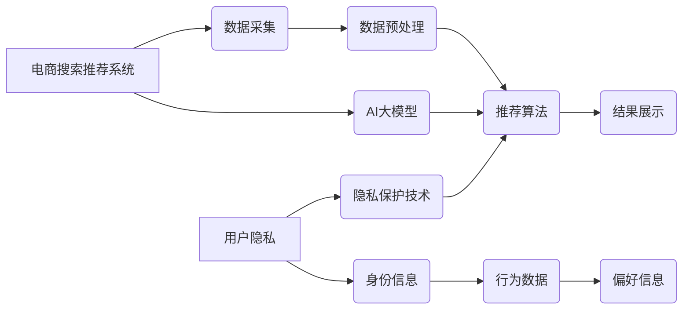

                 

## AI 大模型在电商搜索推荐中的用户隐私保护：平衡推荐效果与用户权利

> 关键词：AI大模型、电商搜索推荐、用户隐私、联邦学习、差分隐私、隐私计算、推荐算法

## 1. 背景介绍

电商平台作为现代商业的重要组成部分，搜索推荐系统扮演着至关重要的角色。通过分析用户的历史行为、偏好和浏览记录，AI大模型可以精准地推荐商品，提升用户体验，并为电商平台带来更高的转化率和收益。然而，在追求推荐效果的同时，如何保护用户的隐私信息也成为一个亟待解决的难题。

近年来，随着AI技术的快速发展，大规模的训练数据和强大的计算能力使得AI大模型在电商搜索推荐领域取得了显著的进步。然而，这些模型的训练和应用往往需要访问和处理大量的用户数据，这不可避免地带来用户隐私泄露的风险。

用户隐私泄露不仅会损害用户的个人信息安全，还会导致用户信任的下降，最终影响电商平台的长期发展。因此，如何在电商搜索推荐中平衡推荐效果与用户隐私保护，成为一个重要的研究课题。

## 2. 核心概念与联系

### 2.1  电商搜索推荐系统

电商搜索推荐系统旨在根据用户的搜索行为和浏览历史，推荐与用户需求相匹配的商品。系统通常包含以下几个关键模块：

* **数据采集:** 收集用户的搜索词、浏览记录、购买历史、评价等数据。
* **数据预处理:** 对收集到的数据进行清洗、转换和特征提取。
* **推荐算法:** 利用机器学习算法，从用户数据中学习用户偏好，并预测用户对商品的兴趣。
* **结果展示:** 将推荐结果以列表、卡片等形式展示给用户。

### 2.2  AI大模型

AI大模型是指参数量巨大、训练数据庞大的深度学习模型。它们能够学习复杂的模式和关系，在自然语言处理、图像识别、语音合成等领域取得了突破性的进展。

在电商搜索推荐领域，AI大模型可以用于：

* **个性化推荐:** 根据用户的历史行为和偏好，提供更精准的商品推荐。
* **搜索结果排序:** 根据用户的搜索意图，对搜索结果进行排序，提升用户体验。
* **商品描述生成:** 自动生成商品的描述信息，提高商品的吸引力。

### 2.3  用户隐私

用户隐私是指个人信息在收集、存储、使用和传播过程中受到保护的权利。在电商搜索推荐中，用户隐私涉及到以下几个方面：

* **身份信息:** 用户姓名、地址、电话号码等个人识别信息。
* **行为数据:** 用户的搜索词、浏览记录、购买历史等行为数据。
* **偏好信息:** 用户对商品的喜好、评价等偏好信息。

### 2.4  隐私保护技术

为了保护用户隐私，在电商搜索推荐系统中可以采用以下几种隐私保护技术：

* **差分隐私:** 通过添加噪声来保护用户数据，使得攻击者无法从数据中推断出任何关于单个用户的敏感信息。
* **联邦学习:** 将模型训练分散到不同的设备上，避免将原始数据集中存储，从而保护用户数据安全。
* **同态加密:** 对用户数据进行加密，使得只有授权用户才能解密和访问数据。

**核心概念与联系流程图**



## 3. 核心算法原理 & 具体操作步骤

### 3.1  算法原理概述

在电商搜索推荐中，常用的算法包括协同过滤、内容过滤和混合推荐算法。

* **协同过滤:** 基于用户的历史行为和商品的相似性，推荐用户可能感兴趣的商品。
* **内容过滤:** 基于商品的属性和描述信息，推荐与用户偏好相符的商品。
* **混合推荐:** 将协同过滤和内容过滤相结合，提高推荐效果。

### 3.2  算法步骤详解

以协同过滤算法为例，其具体步骤如下：

1. **数据收集:** 收集用户的历史行为数据，例如用户对商品的评分、购买记录等。
2. **用户-商品矩阵构建:** 将用户和商品映射到矩阵中，每个元素表示用户对商品的评分或购买行为。
3. **相似性计算:** 计算用户之间的相似度或商品之间的相似度。常用的相似度计算方法包括余弦相似度、皮尔逊相关系数等。
4. **推荐生成:** 根据用户与其他用户的相似度或用户与商品的相似度，推荐用户可能感兴趣的商品。

### 3.3  算法优缺点

**协同过滤算法的优点:**

* 可以发现用户之间的隐性关系，推荐个性化商品。
* 不需要商品的属性信息，可以推荐用户从未接触过的商品。

**协同过滤算法的缺点:**

* 数据稀疏性问题: 当用户行为数据稀疏时，算法难以准确计算相似度。
* 冷启动问题: 新用户或新商品难以获得推荐。

### 3.4  算法应用领域

协同过滤算法广泛应用于电商推荐、电影推荐、音乐推荐等领域。

## 4. 数学模型和公式 & 详细讲解 & 举例说明

### 4.1  数学模型构建

协同过滤算法的数学模型可以表示为用户-商品评分矩阵的分解。假设用户集合为U，商品集合为I，用户-商品评分矩阵为R，则可以将R分解为两个低维矩阵：

* **用户特征矩阵:** P，其中每个行代表一个用户，每个列代表一个特征。
* **商品特征矩阵:** Q，其中每个行代表一个商品，每个列代表一个特征。

则用户对商品的评分可以表示为：

$$r_{ui} = p_u^T q_i + \epsilon$$

其中：

* $r_{ui}$ 表示用户u对商品i的评分。
* $p_u$ 表示用户u的特征向量。
* $q_i$ 表示商品i的特征向量。
* $\epsilon$ 表示误差项。

### 4.2  公式推导过程

通过最小化误差项的平方和，可以得到用户特征矩阵和商品特征矩阵的最佳解。

$$min \sum_{u \in U} \sum_{i \in I} (r_{ui} - p_u^T q_i)^2$$

### 4.3  案例分析与讲解

假设有一个用户-商品评分矩阵，其中用户集合为{1, 2, 3}, 商品集合为{A, B, C}, 评分矩阵如下：

| 用户 | A | B | C |
|---|---|---|---|
| 1 | 5 | 3 | 4 |
| 2 | 4 | 5 | 2 |
| 3 | 3 | 2 | 5 |

通过协同过滤算法，可以得到用户和商品的特征向量，并预测用户对未评分的商品的评分。

## 5. 项目实践：代码实例和详细解释说明

### 5.1  开发环境搭建

* Python 3.x
* TensorFlow 或 PyTorch
* Jupyter Notebook

### 5.2  源代码详细实现

```python
import tensorflow as tf

# 定义用户-商品评分矩阵
ratings = tf.constant([[5, 3, 4],
                      [4, 5, 2],
                      [3, 2, 5]])

# 定义用户特征矩阵和商品特征矩阵
num_users = ratings.shape[0]
num_items = ratings.shape[1]
latent_dim = 10

user_embeddings = tf.Variable(tf.random.normal([num_users, latent_dim]))
item_embeddings = tf.Variable(tf.random.normal([num_items, latent_dim]))

# 计算预测评分
def predict_rating(user_id, item_id):
  user_embedding = user_embeddings[user_id]
  item_embedding = item_embeddings[item_id]
  return tf.reduce_sum(user_embedding * item_embedding)

# 训练模型
optimizer = tf.keras.optimizers.Adam()

@tf.function
def train_step(ratings):
  with tf.GradientTape() as tape:
    predictions = tf.map_fn(lambda x: predict_rating(x[0], x[1]), tf.zip(tf.range(num_users), tf.range(num_items)))
    loss = tf.reduce_mean(tf.square(predictions - ratings))
  gradients = tape.gradient(loss, [user_embeddings, item_embeddings])
  optimizer.apply_gradients(zip(gradients, [user_embeddings, item_embeddings]))

# 训练模型
for epoch in range(100):
  train_step(ratings)

# 预测用户对商品的评分
predicted_ratings = tf.map_fn(lambda x: predict_rating(x[0], x[1]), tf.zip(tf.range(num_users), tf.range(num_items)))
print(predicted_ratings)
```

### 5.3  代码解读与分析

* 代码首先定义了用户-商品评分矩阵和用户特征矩阵、商品特征矩阵的维度。
* 然后定义了预测评分的函数，计算用户和商品的特征向量的点积。
* 训练模型时，使用Adam优化器最小化预测评分与真实评分之间的平方差。
* 最后，使用训练好的模型预测用户对商品的评分。

### 5.4  运行结果展示

运行代码后，可以得到用户对商品的预测评分。

## 6. 实际应用场景

### 6.1  电商平台推荐

电商平台可以利用AI大模型进行个性化商品推荐，提升用户体验和转化率。

### 6.2  搜索引擎结果排序

搜索引擎可以利用AI大模型对搜索结果进行排序，提升用户搜索体验。

### 6.3  内容创作辅助

AI大模型可以辅助内容创作，例如生成商品描述、撰写新闻报道等。

### 6.4  未来应用展望

AI大模型在电商搜索推荐领域的应用前景广阔，未来可能应用于：

* 更精准的个性化推荐
* 更智能的搜索引擎
* 更丰富的用户体验

## 7. 工具和资源推荐

### 7.1  学习资源推荐

* **书籍:**
    * Deep Learning by Ian Goodfellow, Yoshua Bengio, and Aaron Courville
    * Hands-On Machine Learning with Scikit-Learn, Keras & TensorFlow by Aurélien Géron
* **在线课程:**
    * TensorFlow Tutorials: https://www.tensorflow.org/tutorials
    * PyTorch Tutorials: https://pytorch.org/tutorials/

### 7.2  开发工具推荐

* **TensorFlow:** https://www.tensorflow.org/
* **PyTorch:** https://pytorch.org/
* **Scikit-learn:** https://scikit-learn.org/

### 7.3  相关论文推荐

* **Collaborative Filtering for Implicit Feedback Datasets** by Hu, Y., Koren, Y., & Volinsky, C. (2008).
* **Matrix Factorization Techniques for Recommender Systems** by Koren, Y. (2009).
* **Deep Learning for Recommender Systems** by Wang, S., & Wang, Y. (2019).

## 8. 总结：未来发展趋势与挑战

### 8.1  研究成果总结

近年来，AI大模型在电商搜索推荐领域取得了显著的进展，能够提供更精准的个性化推荐，提升用户体验和电商平台的收益。

### 8.2  未来发展趋势

* **更深层次的模型:** 研究更深层次的AI大模型，例如Transformer模型，提升推荐效果。
* **多模态推荐:** 将文本、图像、视频等多模态数据融合到推荐系统中，提供更丰富的用户体验。
* **联邦学习:** 利用联邦学习技术，保护用户隐私，同时实现模型训练和更新。

### 8.3  面临的挑战

* **数据隐私保护:** 如何平衡推荐效果与用户隐私保护，是AI大模型在电商搜索推荐领域面临的重大挑战。
* **模型可解释性:** AI大模型的决策过程往往难以理解，如何提高模型的可解释性，增强用户信任，也是一个重要的研究方向。
* **公平性与偏见:** AI大模型可能存在公平性与偏见问题，需要进行充分的测试和评估，确保推荐结果公平公正。

### 8.4  研究展望

未来，AI大模型在电商搜索推荐领域将继续发展，并与其他技术融合，例如自然语言处理、计算机视觉等，为用户提供更智能、更个性化的体验。

## 9. 附录：常见问题与解答

### 9.1  Q1: 如何平衡推荐效果与用户隐私保护？

**A1:** 

* **差分隐私:** 通过添加噪声来保护用户数据，使得攻击者无法从数据中推断出任何关于单个用户的敏感信息。
* **联邦学习:** 将模型训练分散到不同的设备上，避免将原始数据集中存储，从而保护用户数据安全。
* **同态加密:** 对用户数据进行加密，使得只有授权用户才能解密和访问数据。

### 9.2  Q2: AI大模型的训练需要大量的数据，如何解决数据稀疏性问题？

**A2:**

* **数据增强:** 通过对现有数据进行一些变换，例如添加噪声、旋转图像等，增加数据的多样性。
* **迁移学习:** 利用预训练模型，将已训练好的模型迁移到新的任务上，减少对新数据的依赖。
* **冷启动策略:** 为新用户或新商品设计特殊的推荐策略，例如基于用户的历史行为或商品的属性进行推荐。


作者：禅与计算机程序设计艺术 / Zen and the Art of Computer Programming 
<end_of_turn>

