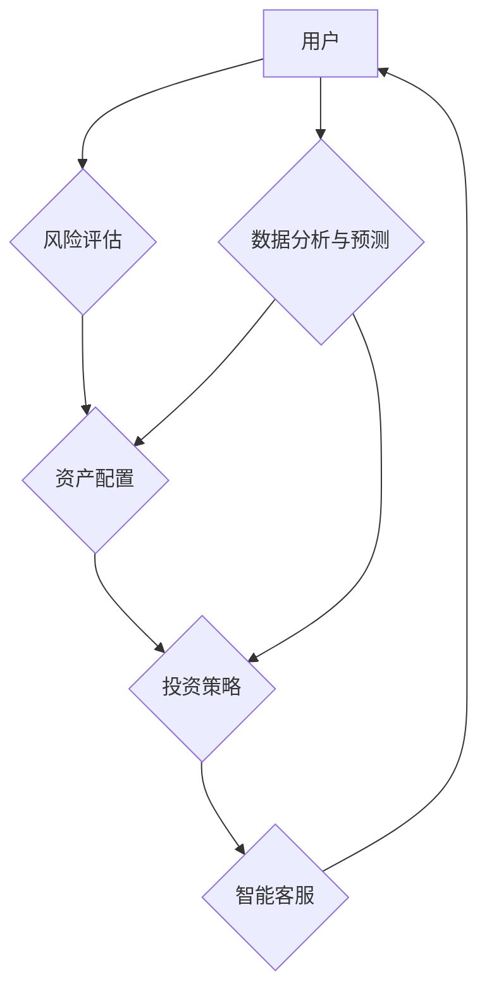

                 

## AIGC赋能智能投顾服务

> 关键词：AIGC, 智能投顾, 金融科技, 机器学习, 自然语言处理, 风险管理, 个性化服务

## 1. 背景介绍

随着人工智能技术的飞速发展，特别是生成式人工智能（AIGC）的兴起，金融科技领域迎来了前所未有的变革。智能投顾服务作为金融科技的重要组成部分，正在逐渐改变人们对财富管理的认知和体验。传统投顾服务往往受限于人力成本、服务范围和个性化程度，而AIGC技术则为智能投顾服务提供了强大的赋能工具，使其能够更加智能化、高效化和个性化。

AIGC技术能够通过学习海量金融数据，识别市场趋势和投资规律，为用户提供更精准、更有效的投资建议。同时，AIGC技术还可以通过自然语言处理（NLP）技术，与用户进行更自然的交互，理解用户的需求和风险偏好，从而提供更个性化的服务。

## 2. 核心概念与联系

**2.1 智能投顾服务概述**

智能投顾服务是指利用人工智能技术，为用户提供个性化的投资建议和财富管理服务的平台或系统。其核心功能包括：

* **风险评估:** 通过分析用户的投资经验、风险承受能力、财务状况等信息，评估用户的投资风险偏好。
* **资产配置:** 根据用户的风险偏好和投资目标，制定合理的资产配置方案，并进行动态调整。
* **投资策略:** 基于市场分析和数据驱动，制定个性化的投资策略，并进行实时监控和调整。
* **智能客服:** 利用NLP技术，与用户进行自然语言交互，解答用户疑问，提供投资咨询服务。

**2.2 AIGC技术赋能智能投顾**

AIGC技术能够在智能投顾服务中发挥多方面的作用：

* **数据分析与预测:** AIGC模型能够学习海量金融数据，识别市场趋势和投资规律，为智能投顾系统提供更精准的投资建议。
* **个性化服务:** AIGC技术可以理解用户的需求和风险偏好，为用户提供更加个性化的投资方案和服务。
* **自动化运营:** AIGC技术可以自动化执行投资策略，降低人工成本，提高服务效率。
* **内容生成:** AIGC技术可以生成投资报告、市场分析、风险提示等内容，为用户提供更丰富的投资信息。

**2.3 架构图**



## 3. 核心算法原理 & 具体操作步骤

**3.1 算法原理概述**

智能投顾服务中常用的核心算法包括：

* **机器学习算法:** 用于分析金融数据，识别市场趋势和投资规律。常见的机器学习算法包括回归算法、分类算法、聚类算法等。
* **深度学习算法:** 用于处理复杂的数据结构，例如文本数据和图像数据。常见的深度学习算法包括卷积神经网络（CNN）、循环神经网络（RNN）等。
* **强化学习算法:** 用于优化投资策略，使其能够在不断变化的市场环境中获得最大收益。

**3.2 算法步骤详解**

以机器学习算法为例，其具体操作步骤如下：

1. **数据收集与预处理:** 收集海量金融数据，并进行清洗、转换、特征提取等预处理操作。
2. **模型选择与训练:** 选择合适的机器学习算法，并根据训练数据进行模型训练。
3. **模型评估与优化:** 使用测试数据评估模型性能，并根据评估结果进行模型优化。
4. **模型部署与应用:** 将训练好的模型部署到智能投顾系统中，用于提供投资建议和服务。

**3.3 算法优缺点**

* **优点:**

    * 能够处理海量数据，识别复杂模式。
    * 能够不断学习和优化，提高投资建议的准确性。
    * 能够提供个性化的服务，满足不同用户的需求。

* **缺点:**

    * 需要大量的训练数据，数据质量对模型性能有很大影响。
    * 模型训练过程复杂，需要专业的技术人员进行操作。
    * 模型的解释性较差，难以理解模型的决策逻辑。

**3.4 算法应用领域**

* **股票投资:** 预测股票价格走势，推荐股票投资策略。
* **基金投资:** 选择合适的基金产品，进行基金组合投资。
* **债券投资:** 分析债券市场风险，推荐债券投资策略。
* **资产配置:** 根据用户的风险偏好和投资目标，制定合理的资产配置方案。

## 4. 数学模型和公式 & 详细讲解 & 举例说明

**4.1 数学模型构建**

智能投顾服务中常用的数学模型包括：

* **风险模型:** 用于评估投资风险，常见的风险模型包括标准差、夏普比率、贝塔系数等。
* **收益模型:** 用于预测投资收益，常见的收益模型包括资本资产定价模型（CAPM）、阿尔法模型等。
* **资产配置模型:** 用于优化资产配置，常见的资产配置模型包括现代资产配置理论、均值方差优化等。

**4.2 公式推导过程**

以CAPM模型为例，其公式如下：

$$
R_i = R_f + \beta_i (R_m - R_f)
$$

其中：

* $R_i$：资产i的预期收益率
* $R_f$：无风险利率
* $\beta_i$：资产i的系统风险
* $R_m$：市场平均收益率

该公式表明，资产的预期收益率等于无风险利率加上系统风险的倍数乘以市场风险溢价。

**4.3 案例分析与讲解**

假设A股市场平均收益率为10%，无风险利率为3%，某股票的系统风险为1.2，则该股票的预期收益率为：

$$
R_i = 3\% + 1.2 (10\% - 3\%) = 3\% + 8.4\% = 11.4\%
$$

## 5. 项目实践：代码实例和详细解释说明

**5.1 开发环境搭建**

智能投顾服务项目开发环境通常包括：

* **操作系统:** Linux、Windows等
* **编程语言:** Python、Java等
* **机器学习框架:** TensorFlow、PyTorch等
* **数据库:** MySQL、MongoDB等

**5.2 源代码详细实现**

以下是一个简单的Python代码示例，用于实现股票价格预测：

```python
import pandas as pd
from sklearn.model_selection import train_test_split
from sklearn.linear_model import LinearRegression

# 加载股票价格数据
data = pd.read_csv('stock_price.csv')

# 选择特征和目标变量
features = ['Open', 'High', 'Low', 'Volume']
target = 'Close'

# 将数据分割为训练集和测试集
X_train, X_test, y_train, y_test = train_test_split(data[features], data[target], test_size=0.2)

# 创建线性回归模型
model = LinearRegression()

# 训练模型
model.fit(X_train, y_train)

# 预测测试集数据
y_pred = model.predict(X_test)

# 评估模型性能
print('模型准确率:', model.score(X_test, y_test))
```

**5.3 代码解读与分析**

该代码首先加载股票价格数据，然后选择特征和目标变量。接着将数据分割为训练集和测试集，并创建线性回归模型。最后，训练模型并预测测试集数据，并评估模型性能。

**5.4 运行结果展示**

运行该代码后，会输出模型的准确率。准确率越高，模型的预测性能越好。

## 6. 实际应用场景

**6.1 个人理财**

AIGC技术可以帮助个人投资者进行风险评估、资产配置、投资策略制定等，提供个性化的理财建议，帮助个人投资者实现财富增值目标。

**6.2 基金管理**

AIGC技术可以帮助基金经理进行市场分析、投资组合优化、风险控制等，提高基金管理效率，提升基金收益率。

**6.3 风险管理**

AIGC技术可以帮助金融机构识别和评估投资风险，制定有效的风险管理策略，降低金融机构的投资风险。

**6.4 未来应用展望**

随着AIGC技术的不断发展，其在智能投顾服务中的应用场景将更加广泛，例如：

* **更精准的投资建议:** AIGC模型能够学习更复杂的金融数据，提供更精准的投资建议。
* **更个性化的服务:** AIGC技术能够更好地理解用户的需求和风险偏好，提供更个性化的服务。
* **更智能的客服:** AIGC技术可以实现更智能的客服，能够解答用户的各种问题，提供更便捷的服务。

## 7. 工具和资源推荐

**7.1 学习资源推荐**

* **书籍:**

    * 《深度学习》
    * 《机器学习实战》
    * 《Python机器学习》

* **在线课程:**

    * Coursera
    * edX
    * Udacity

**7.2 开发工具推荐**

* **编程语言:** Python
* **机器学习框架:** TensorFlow、PyTorch
* **数据库:** MySQL、MongoDB

**7.3 相关论文推荐**

* **A Survey of Deep Learning for Financial Forecasting**
* **Reinforcement Learning for Portfolio Optimization**
* **Natural Language Processing for Financial Text Analysis**

## 8. 总结：未来发展趋势与挑战

**8.1 研究成果总结**

AIGC技术在智能投顾服务领域取得了显著的成果，能够提供更精准、更个性化的投资建议，提高投资效率和收益率。

**8.2 未来发展趋势**

* **模型更加复杂:** AIGC模型将更加复杂，能够处理更复杂的金融数据，提供更精准的投资建议。
* **服务更加个性化:** AIGC技术将更加深入地理解用户的需求和风险偏好，提供更加个性化的服务。
* **应用场景更加广泛:** AIGC技术将应用于更多金融领域，例如风险管理、欺诈检测等。

**8.3 面临的挑战**

* **数据质量:** AIGC模型的性能依赖于数据的质量，需要不断收集和清洗高质量的金融数据。
* **模型解释性:** AIGC模型的决策逻辑难以理解，需要提高模型的解释性，增强用户对模型的信任。
* **监管政策:** AIGC技术在金融领域的应用需要符合相关监管政策，需要与监管机构加强合作，制定相应的规范和标准。

**8.4 研究展望**

未来，我们将继续研究AIGC技术在智能投顾服务领域的应用，努力开发更智能、更安全、更可靠的金融服务产品，为用户提供更优质的金融体验。

## 9. 附录：常见问题与解答

**9.1 如何评估AIGC模型的性能？**

AIGC模型的性能可以通过多种指标进行评估，例如准确率、召回率、F1-score等。

**9.2 AIGC模型是否能够完全替代人类投资顾问？**

目前，AIGC模型还无法完全替代人类投资顾问，因为AIGC模型缺乏人类的经验、判断力和情感理解能力。

**9.3 AIGC技术在金融领域的应用是否安全可靠？**

AIGC技术的应用需要符合相关监管政策，并采取相应的安全措施，确保数据的安全性和模型的可靠性。


作者：禅与计算机程序设计艺术 / Zen and the Art of Computer Programming 
<end_of_turn>

