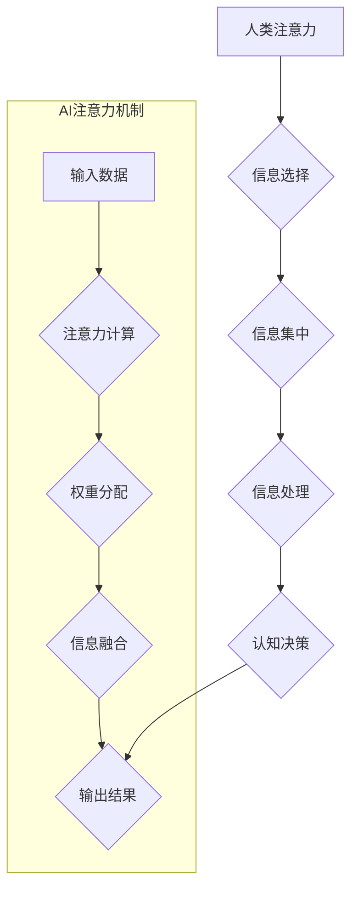

                 

## AI与人类注意力流：未来的教育与技能发展

> 关键词：人工智能、注意力流、教育、技能发展、深度学习、神经网络、认知科学、未来趋势

## 1. 背景介绍

在信息爆炸的时代，人类面临着前所未有的信息洪流。如何有效地获取、处理和利用信息，成为了至关重要的生存技能。而注意力，作为人类认知的核心能力之一，在信息时代显得尤为重要。

人工智能（AI）技术的快速发展，为我们提供了全新的视角和工具，来理解和影响人类注意力流。从个性化学习推荐系统到沉浸式虚拟现实体验，AI正在深刻地改变着我们获取和处理信息的方式。

## 2. 核心概念与联系

### 2.1 人类注意力流

人类注意力流是一个复杂而动态的过程，涉及到多个认知模块的协同作用。它受多种因素影响，包括个体差异、环境刺激、任务需求等。

**注意力流的三个关键要素：**

* **选择性:** 注意力能够从众多刺激中选择性地关注特定信息。
* **集中性:** 注意力能够集中在特定目标上，排除干扰。
* **可塑性:** 注意力能够根据任务需求和环境变化进行调整。

### 2.2 人工智能与注意力机制

人工智能领域，特别是深度学习领域，近年来涌现出许多基于注意力机制的模型，例如Transformer、BERT等。这些模型能够学习到文本或序列数据的关键信息，并根据其重要性分配不同的注意力权重。

**注意力机制的原理:**

注意力机制的核心思想是，在处理信息时，并非所有信息都具有同等重要性。通过学习每个信息的重要性权重，模型能够更加有效地关注关键信息，从而提高处理效率和准确性。

**Mermaid 流程图:**



## 3. 核心算法原理 & 具体操作步骤

### 3.1 算法原理概述

注意力机制的具体实现方式多种多样，其中一种常见的实现方式是**自注意力机制**。自注意力机制能够学习到序列中不同元素之间的关系，并根据这些关系分配注意力权重。

**自注意力机制的步骤:**

1. **查询、键、值矩阵:** 将输入序列映射到三个矩阵：查询矩阵（Q）、键矩阵（K）和值矩阵（V）。
2. **注意力分数计算:** 计算每个查询向量与所有键向量的点积，并通过softmax函数将其归一化，得到注意力分数。
3. **权重分配:** 使用注意力分数作为权重，对值矩阵进行加权求和，得到输出向量。

### 3.2 算法步骤详解

**1. 查询、键、值矩阵的构建:**

* 将输入序列中的每个元素映射到三个向量空间：查询空间、键空间和值空间。
* 使用线性变换矩阵将每个元素映射到对应的向量空间。

**2. 注意力分数的计算:**

* 计算每个查询向量与所有键向量的点积。
* 使用缩放因子对点积进行缩放，以避免梯度爆炸。
* 通过softmax函数将点积归一化，得到注意力分数。

**3. 权重分配:**

* 使用注意力分数作为权重，对值矩阵进行加权求和。
* 加权求和的结果即为输出向量。

### 3.3 算法优缺点

**优点:**

* 能够学习到序列中不同元素之间的关系。
* 可以有效地关注关键信息，提高处理效率和准确性。

**缺点:**

* 计算复杂度较高，训练时间较长。
* 对长序列数据处理效果有限。

### 3.4 算法应用领域

* 自然语言处理：机器翻译、文本摘要、问答系统等。
* 图像识别：目标检测、图像分类等。
* 时间序列分析：股票预测、天气预报等。

## 4. 数学模型和公式 & 详细讲解 & 举例说明

### 4.1 数学模型构建

**自注意力机制的数学模型:**

* 输入序列：$X = \{x_1, x_2, ..., x_n\}$
* 查询矩阵：$Q = W_Q X$
* 键矩阵：$K = W_K X$
* 值矩阵：$V = W_V X$
* 注意力分数：$Attention(Q, K, V) = softmax(\frac{Q K^T}{\sqrt{d_k}})$
* 输出向量：$O = Attention(Q, K, V) V$

其中：

* $W_Q$, $W_K$, $W_V$ 是线性变换矩阵。
* $d_k$ 是键向量的维度。

### 4.2 公式推导过程

**注意力分数的计算:**

* 点积：$Q_i K_j^T$ 表示查询向量 $Q_i$ 与键向量 $K_j$ 的点积。
* 缩放因子：$\frac{1}{\sqrt{d_k}}$ 用于防止梯度爆炸。
* softmax函数：将点积归一化，得到注意力分数。

**输出向量的计算:**

* 加权求和：使用注意力分数作为权重，对值矩阵进行加权求和。

### 4.3 案例分析与讲解

**举例说明:**

假设我们有一个输入序列 $X = \{“我”, “喜欢”, “编程”\}$，其中每个单词都映射到三个向量空间：查询空间、键空间和值空间。

* 查询矩阵：$Q = \{[q_1], [q_2], [q_3]\}$
* 键矩阵：$K = \{[k_1], [k_2], [k_3]\}$
* 值矩阵：$V = \{[v_1], [v_2], [v_3]\}$

通过计算注意力分数，我们可以得到每个单词对其他单词的注意力权重。例如，单词“编程”可能对单词“喜欢”和“编程”本身的注意力权重较高。

最终，通过加权求和，我们可以得到一个新的输出向量，该向量包含了序列中所有单词的信息，并根据注意力权重进行了加权。

## 5. 项目实践：代码实例和详细解释说明

### 5.1 开发环境搭建

* Python 3.6+
* TensorFlow 或 PyTorch 深度学习框架
* Jupyter Notebook 或 VS Code 开发环境

### 5.2 源代码详细实现

```python
import tensorflow as tf

# 定义自注意力机制
def self_attention(query, key, value, mask=None):
    # 计算注意力分数
    attention_scores = tf.matmul(query, key, transpose_b=True) / tf.math.sqrt(tf.cast(key.shape[-1], tf.float32))
    if mask is not None:
        attention_scores += (mask * -1e9)
    attention_weights = tf.nn.softmax(attention_scores, axis=-1)
    # 计算输出向量
    output = tf.matmul(attention_weights, value)
    return output

# 示例代码
query = tf.random.normal([3, 4])
key = tf.random.normal([3, 4])
value = tf.random.normal([3, 4])
output = self_attention(query, key, value)
print(output)
```

### 5.3 代码解读与分析

* `self_attention` 函数实现了自注意力机制的核心逻辑。
* `attention_scores` 计算了每个查询向量与所有键向量的点积，并通过缩放因子进行归一化。
* `attention_weights` 使用 softmax 函数将点积归一化，得到注意力分数。
* `output` 使用注意力分数作为权重，对值矩阵进行加权求和。

### 5.4 运行结果展示

运行上述代码，会输出一个形状为 `(3, 4)` 的张量，表示自注意力机制的输出向量。

## 6. 实际应用场景

### 6.1 个性化学习推荐系统

AI 可以分析学生的学习行为和知识点掌握情况，并根据学生的注意力流特征，推荐个性化的学习内容和学习路径。

### 6.2 沉浸式虚拟现实体验

AI 可以根据用户的注意力流，动态调整虚拟现实场景的细节和内容，提供更加沉浸式和个性化的体验。

### 6.3 脑机接口

AI 可以通过监测用户的脑电波，理解用户的注意力流，并将其转化为控制指令，实现脑机接口。

### 6.4 未来应用展望

随着 AI 技术的不断发展，注意力流分析和应用将更加广泛，例如：

* **精准医疗:** 根据患者的注意力流特征，个性化制定治疗方案。
* **自动驾驶:** 驾驶员的注意力流分析，提高自动驾驶系统的安全性。
* **人机协作:** AI 可以根据用户的注意力流，提供更加有效的协作支持。

## 7. 工具和资源推荐

### 7.1 学习资源推荐

* **书籍:**
    * 《深度学习》
    * 《Attention Is All You Need》
* **在线课程:**
    * Coursera: 深度学习
    * Udacity: 自然语言处理
* **博客:**
    * TensorFlow Blog
    * PyTorch Blog

### 7.2 开发工具推荐

* **TensorFlow:** 开源深度学习框架
* **PyTorch:** 开源深度学习框架
* **Jupyter Notebook:** 交互式编程环境
* **VS Code:** 代码编辑器

### 7.3 相关论文推荐

* Attention Is All You Need
* BERT: Pre-training of Deep Bidirectional Transformers for Language Understanding
* Transformer-XL: Attentive Language Models Beyond a Fixed-Length Context

## 8. 总结：未来发展趋势与挑战

### 8.1 研究成果总结

近年来，AI 与注意力机制取得了显著进展，为理解和影响人类注意力流提供了新的工具和视角。

### 8.2 未来发展趋势

* **更精准的注意力流分析:** 利用脑机接口等技术，更加精准地监测和分析用户的注意力流。
* **更个性化的注意力流干预:** 根据用户的注意力流特征，提供更加个性化的干预措施，例如学习推荐、注意力训练等。
* **更广泛的应用场景:** 将注意力流分析应用于更多领域，例如医疗、教育、自动驾驶等。

### 8.3 面临的挑战

* **数据隐私和安全:** 注意力流数据具有高度的个人敏感性，需要妥善保护用户隐私和数据安全。
* **伦理问题:** AI 对注意力流的干预可能会引发伦理问题，例如信息茧房、注意力操控等。
* **技术瓶颈:** 目前，注意力流分析和干预技术还存在一些技术瓶颈，例如对长序列数据的处理能力有限。

### 8.4 研究展望

未来，AI 与注意力流的研究将继续深入，为我们提供更加深刻的认知和更强大的工具，帮助我们更好地理解和掌控信息时代的人类注意力。

## 9. 附录：常见问题与解答

* **什么是注意力流？**

注意力流是指人类在信息处理过程中，选择性地关注特定信息，并根据任务需求进行调整的过程。

* **AI 如何理解和影响注意力流？**

AI 可以通过分析用户的行为数据、脑电波等，理解用户的注意力流模式。然后，通过个性化推荐、沉浸式体验等方式，影响用户的注意力流。

* **注意力流分析和干预有哪些应用场景？**

注意力流分析和干预可以应用于个性化学习、沉浸式体验、脑机接口等领域。

* **AI 对注意力流的干预有哪些伦理问题？**

AI 对注意力流的干预可能会引发信息茧房、注意力操控等伦理问题，需要谨慎对待。


作者：禅与计算机程序设计艺术 / Zen and the Art of Computer Programming 
<end_of_turn>

