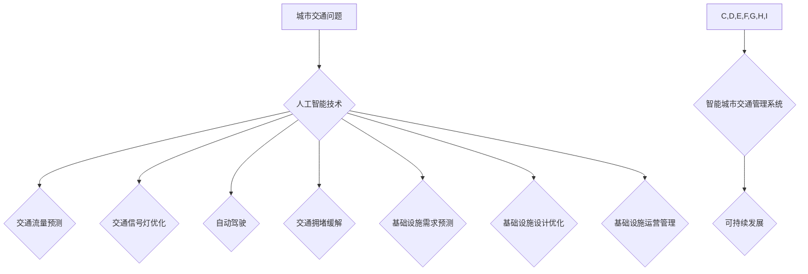

                 

## AI与人类计算：打造可持续发展的城市交通管理系统与基础设施建设与规划

> 关键词：人工智能、城市交通、交通管理、基础设施建设、可持续发展、机器学习、深度学习、预测模型、优化算法

## 1. 背景介绍

随着全球人口的持续增长和城市化的加速推进，城市交通拥堵、交通事故频发、基础设施老化等问题日益突出，严重影响着城市居民的生活质量和经济发展。传统交通管理模式已难以满足日益复杂的需求，亟需引入先进的技术手段进行革新。人工智能（AI）作为一门新兴技术，凭借其强大的数据处理能力、学习能力和决策能力，为解决城市交通问题提供了新的思路和解决方案。

城市交通管理系统是城市基础设施的重要组成部分，其目标是优化交通流量，提高道路通行效率，降低交通拥堵和事故发生率，同时保障交通安全和环境友好。传统的交通管理系统主要依赖于人工干预和规则设定，效率低下，难以应对突发事件和复杂情况。而AI技术可以利用大数据分析、机器学习、深度学习等方法，实现对交通流量的实时监测、预测和控制，从而构建更加智能、高效、可持续的城市交通管理系统。

基础设施建设与规划是城市可持续发展的重要保障。城市基础设施的建设和更新需要考虑多种因素，例如人口增长、经济发展、环境保护等。AI技术可以帮助城市规划者进行更精准的预测和分析，优化基础设施建设方案，提高资源利用效率，降低建设成本，并实现基础设施的智能化管理和维护。

## 2. 核心概念与联系

### 2.1 人工智能与城市交通

人工智能（AI）是指模拟人类智能行为的计算机系统。在城市交通领域，AI技术主要应用于以下几个方面：

* **交通流量预测:** 利用历史交通数据和实时路况信息，预测未来交通流量变化趋势，为交通管理提供决策依据。
* **交通信号灯优化:** 根据实时交通流量情况，动态调整交通信号灯的绿灯时间，提高道路通行效率。
* **自动驾驶:** 利用传感器、机器学习算法和深度学习模型，实现车辆自动驾驶，提高交通安全性和效率。
* **交通拥堵缓解:** 通过智能交通管理系统，实时监测交通拥堵情况，并采取措施进行疏导，例如引导车辆选择最佳路线、调整交通信号灯等。

### 2.2 人工智能与基础设施建设

AI技术在基础设施建设与规划方面主要应用于以下几个方面：

* **基础设施需求预测:** 利用人口增长、经济发展等数据，预测未来基础设施的需求量，为基础设施建设提供规划依据。
* **基础设施设计优化:** 利用AI算法，优化基础设施的设计方案，提高结构强度、降低建设成本、提高资源利用效率。
* **基础设施运营管理:** 利用传感器、物联网技术和AI算法，实现基础设施的智能化监控和管理，提高运营效率、降低维护成本。

### 2.3 人工智能与人类计算

AI技术与人类计算的结合，可以发挥各自优势，构建更加高效、智能的城市交通管理系统和基础设施建设与规划体系。

* **人类计算的优势:** 人类拥有丰富的经验、创造力和解决问题的能力，可以为AI系统提供决策支持、制定策略和进行风险评估。
* **AI计算的优势:** AI系统可以快速处理海量数据、识别模式、进行预测和决策，可以为人类提供更精准、更有效的决策支持。

通过将AI技术与人类计算相结合，可以构建更加智能、高效、可持续的城市交通管理系统和基础设施建设与规划体系。

**核心概念与联系流程图**



## 3. 核心算法原理 & 具体操作步骤

### 3.1 算法原理概述

在城市交通管理系统中，常用的AI算法包括：

* **机器学习算法:** 

    * **回归算法:** 用于预测连续值，例如交通流量、道路拥堵程度等。常见的回归算法包括线性回归、逻辑回归、支持向量机等。
    * **分类算法:** 用于分类数据，例如车辆类型、交通事故类型等。常见的分类算法包括决策树、随机森林、支持向量机等。
    * **聚类算法:** 用于将数据分组，例如将车辆按照行驶速度、路线等特征进行分组。常见的聚类算法包括K-means聚类、层次聚类等。

* **深度学习算法:** 

    * **卷积神经网络 (CNN):** 用于图像识别和处理，例如识别交通信号灯、车辆类型等。
    * **循环神经网络 (RNN):** 用于处理序列数据，例如预测交通流量变化趋势。
    * **强化学习算法:** 用于训练智能体，例如自动驾驶车辆，使其能够在复杂环境中做出最优决策。

### 3.2 算法步骤详解

以交通流量预测为例，详细说明机器学习算法的具体操作步骤：

1. **数据收集:** 收集历史交通数据，例如时间、地点、交通流量等。
2. **数据预处理:** 对收集到的数据进行清洗、转换和特征工程，例如处理缺失值、归一化数据、提取特征等。
3. **模型选择:** 选择合适的机器学习算法，例如线性回归、支持向量机等。
4. **模型训练:** 利用训练数据训练模型，调整模型参数，使模型能够准确预测交通流量。
5. **模型评估:** 利用测试数据评估模型的预测精度，例如使用均方误差、R-squared等指标。
6. **模型部署:** 将训练好的模型部署到生产环境中，用于实时预测交通流量。

### 3.3 算法优缺点

**机器学习算法:**

* **优点:** 能够从数据中学习模式，预测未来趋势，适应不断变化的环境。
* **缺点:** 需要大量的训练数据，训练过程复杂，难以解释模型决策过程。

**深度学习算法:**

* **优点:** 能够处理更复杂的数据，学习更深层次的特征，预测精度更高。
* **缺点:** 需要更多的计算资源和数据，训练过程更复杂，难以解释模型决策过程。

### 3.4 算法应用领域

* **交通流量预测:** 预测未来交通流量变化趋势，为交通管理提供决策依据。
* **交通信号灯优化:** 根据实时交通流量情况，动态调整交通信号灯的绿灯时间，提高道路通行效率。
* **自动驾驶:** 利用传感器、机器学习算法和深度学习模型，实现车辆自动驾驶，提高交通安全性和效率。
* **交通拥堵缓解:** 通过智能交通管理系统，实时监测交通拥堵情况，并采取措施进行疏导，例如引导车辆选择最佳路线、调整交通信号灯等。
* **基础设施需求预测:** 利用人口增长、经济发展等数据，预测未来基础设施的需求量，为基础设施建设提供规划依据。
* **基础设施设计优化:** 利用AI算法，优化基础设施的设计方案，提高结构强度、降低建设成本、提高资源利用效率。
* **基础设施运营管理:** 利用传感器、物联网技术和AI算法，实现基础设施的智能化监控和管理，提高运营效率、降低维护成本。

## 4. 数学模型和公式 & 详细讲解 & 举例说明

### 4.1 数学模型构建

交通流量预测模型通常采用时间序列分析方法，将交通流量数据视为时间序列，并利用数学模型进行预测。常见的数学模型包括：

* **ARIMA模型:** 自回归移动平均模型 (Autoregressive Integrated Moving Average)，是一种经典的时间序列预测模型，可以捕捉时间序列中的趋势、季节性和随机波动。
* **SARIMA模型:** 季节性ARIMA模型 (Seasonal ARIMA)，是ARIMA模型的扩展，可以处理具有季节性特征的时间序列数据。
* **Prophet模型:** Facebook开发的开源时间序列预测模型，能够处理具有趋势、季节性和异常值的时间序列数据。

### 4.2 公式推导过程

ARIMA模型的公式推导过程较为复杂，这里只列出其基本公式：

$$
y_t = c + \phi_1 y_{t-1} + \phi_2 y_{t-2} + ... + \phi_p y_{t-p} + \theta_1 \epsilon_{t-1} + \theta_2 \epsilon_{t-2} + ... + \theta_q \epsilon_{t-q} + \epsilon_t
$$

其中：

* $y_t$ 表示时间t的交通流量值。
* $c$ 表示截距项。
* $\phi_i$ 表示自回归系数。
* $p$ 表示自回归阶数。
* $\theta_i$ 表示移动平均系数。
* $q$ 表示移动平均阶数。
* $\epsilon_t$ 表示时间t的随机误差项。

### 4.3 案例分析与讲解

假设我们想要预测某条道路的未来交通流量，可以使用ARIMA模型进行预测。首先，我们需要收集该道路的历史交通流量数据，并进行数据预处理。然后，我们可以使用ARIMA模型的识别方法，确定模型的阶数p和q。最后，我们可以利用训练好的ARIMA模型，预测未来交通流量。

## 5. 项目实践：代码实例和详细解释说明

### 5.1 开发环境搭建

* **操作系统:** Ubuntu 20.04 LTS
* **编程语言:** Python 3.8
* **库依赖:** pandas, numpy, scikit-learn, matplotlib

### 5.2 源代码详细实现

```python
import pandas as pd
from sklearn.model_selection import train_test_split
from sklearn.linear_model import LinearRegression
from sklearn.metrics import mean_squared_error

# 加载交通流量数据
data = pd.read_csv('traffic_data.csv')

# 选择特征和目标变量
features = ['hour', 'weekday', 'temperature']
target = 'traffic_volume'

# 将数据分为训练集和测试集
X_train, X_test, y_train, y_test = train_test_split(data[features], data[target], test_size=0.2)

# 创建线性回归模型
model = LinearRegression()

# 训练模型
model.fit(X_train, y_train)

# 预测测试集数据
y_pred = model.predict(X_test)

# 计算模型精度
mse = mean_squared_error(y_test, y_pred)
print(f'Mean Squared Error: {mse}')

# 可视化预测结果
import matplotlib.pyplot as plt
plt.scatter(y_test, y_pred)
plt.xlabel('Actual Traffic Volume')
plt.ylabel('Predicted Traffic Volume')
plt.title('Linear Regression Model Performance')
plt.show()
```

### 5.3 代码解读与分析

这段代码演示了如何使用线性回归模型预测交通流量。首先，我们加载交通流量数据，选择特征和目标变量。然后，我们将数据分为训练集和测试集，并使用线性回归模型训练模型。最后，我们使用训练好的模型预测测试集数据，并计算模型精度。

### 5.4 运行结果展示

运行代码后，会输出模型的均方误差值，以及预测结果与实际值的散点图。

## 6. 实际应用场景

### 6.1 智能交通信号灯控制

利用AI技术，可以根据实时交通流量情况，动态调整交通信号灯的绿灯时间，提高道路通行效率，减少交通拥堵。例如，在拥堵路段，可以延长绿灯时间，在空旷路段，可以缩短绿灯时间。

### 6.2 自动驾驶车辆

自动驾驶车辆利用传感器、机器学习算法和深度学习模型，能够感知周围环境，做出最优决策，实现车辆自动驾驶。自动驾驶车辆可以提高交通安全性和效率，减少交通事故发生率。

### 6.3 交通拥堵缓解

通过智能交通管理系统，实时监测交通拥堵情况，并采取措施进行疏导，例如引导车辆选择最佳路线、调整交通信号灯等。

### 6.4 未来应用展望

* **城市交通大脑:** 建立一个集成了各种交通数据和AI算法的城市交通大脑，实现对城市交通的全面感知、分析和控制。
* **个性化交通服务:** 根据用户的出行需求和习惯，提供个性化的交通服务，例如推荐最佳出行路线、预订交通工具等。
* **无人机交通:** 利用无人机进行城市交通配送、巡逻等任务，提高交通效率和安全性。

## 7. 工具和资源推荐

### 7.1 学习资源推荐

* **书籍:**
    * 《深度学习》 - Ian Goodfellow, Yoshua Bengio, Aaron Courville
    * 《机器学习》 - Tom Mitchell
* **在线课程:**
    * Coursera: Machine Learning by Andrew Ng
    * edX: Artificial Intelligence by Columbia University
* **开源平台:**
    * TensorFlow: https://www.tensorflow.org/
    * PyTorch: https://pytorch.org/

### 7.2 开发工具推荐

* **Python:** 
    * Jupyter Notebook: https://jupyter.org/
    * Spyder: https://www.spyder-ide.org/
* **数据可视化工具:**
    * Matplotlib: https://matplotlib.org/
    * Seaborn: https://seaborn.pydata.org/

### 7.3 相关论文推荐

* **交通流量预测:**
    * "Traffic Flow Prediction Using Deep Learning" - Wang et al.
    * "A Hybrid ARIMA-LSTM Model for Traffic Flow Forecasting" - Chen et al.
* **智能交通信号灯控制:**
    * "Adaptive Traffic Signal Control Using Deep Reinforcement Learning" - Li et al.
    * "A Machine Learning Approach to Adaptive Traffic Signal Control" - Zhang et al.

## 8. 总结：未来发展趋势与挑战

### 8.1 研究成果总结

近年来，AI技术在城市交通管理系统和基础设施建设与规划方面取得了显著成果，例如交通流量预测、智能交通信号灯控制、自动驾驶车辆等。这些成果为提高城市交通效率、安全性、可持续性提供了新的思路和解决方案。

### 8.2 未来发展趋势

* **更精准的预测模型:** 利用更先进的机器学习算法和深度学习模型，提高交通流量预测的精度和可靠性。
* **更智能的交通管理系统:** 利用AI技术，构建更加智能的交通管理系统，实现对城市交通的全面感知、分析和控制。
* **更安全的自动驾驶技术:** 进一步提高自动驾驶技术的安全性、可靠性和智能化水平，推动自动驾驶车辆的普及应用。
* **更可持续的基础设施建设:** 利用AI技术，优化基础设施建设方案，提高资源利用效率，降低环境影响。

### 8.3 面临的挑战

* **数据获取和隐私保护:** AI技术依赖于海量数据，如何获取高质量的交通数据，并保障数据隐私安全是一个重要的挑战。
* **算法解释性和可信度:** 许多AI算法难以解释其决策过程，如何提高算法的解释性和可信度，赢得公众信任是一个重要的挑战。
* **技术标准和规范:** AI技术在城市交通管理系统和基础设施建设与规划方面的应用，需要制定相应的技术标准和规范，确保系统互操作性和安全性。
* **伦理和社会影响:** AI技术的发展可能带来一些伦理和社会影响，例如就业问题、算法偏见等，需要进行深入研究和探讨。

### 8.4 研究展望

未来，AI技术将在城市交通管理系统和基础设施建设与规划方面发挥更加重要的作用，为构建更加智能、高效、可持续的城市交通体系提供强大的技术支撑。


## 9. 附录：常见问题与解答

**Q1: AI技术是否能够完全取代人类在城市交通管理中的作用？**

A1: AI技术可以辅助人类进行城市交通管理，提高效率和准确性，但无法完全取代人类的作用。人类的经验、创造力和决策能力仍然不可替代。

**Q2: AI技术在城市交通管理中的应用会带来哪些伦理问题？**

A2: AI技术在城市交通管理中的应用可能会带来一些伦理问题，例如算法偏见、数据隐私安全、自动驾驶车辆的责任归属等，需要进行深入研究和探讨，制定相应的伦理规范和法律法规。

**Q3: 如何确保AI技术在城市交通管理中的安全性和可靠性？**

A3: 确保AI技术在城市交通管理中的安全性和可靠性需要从多个方面入手，例如算法的可靠性验证、数据质量控制、系统安全防护、人机协作机制等。

**作者：禅与计算机程序设计艺术 / Zen and the Art of Computer Programming**<end_of_turn>


