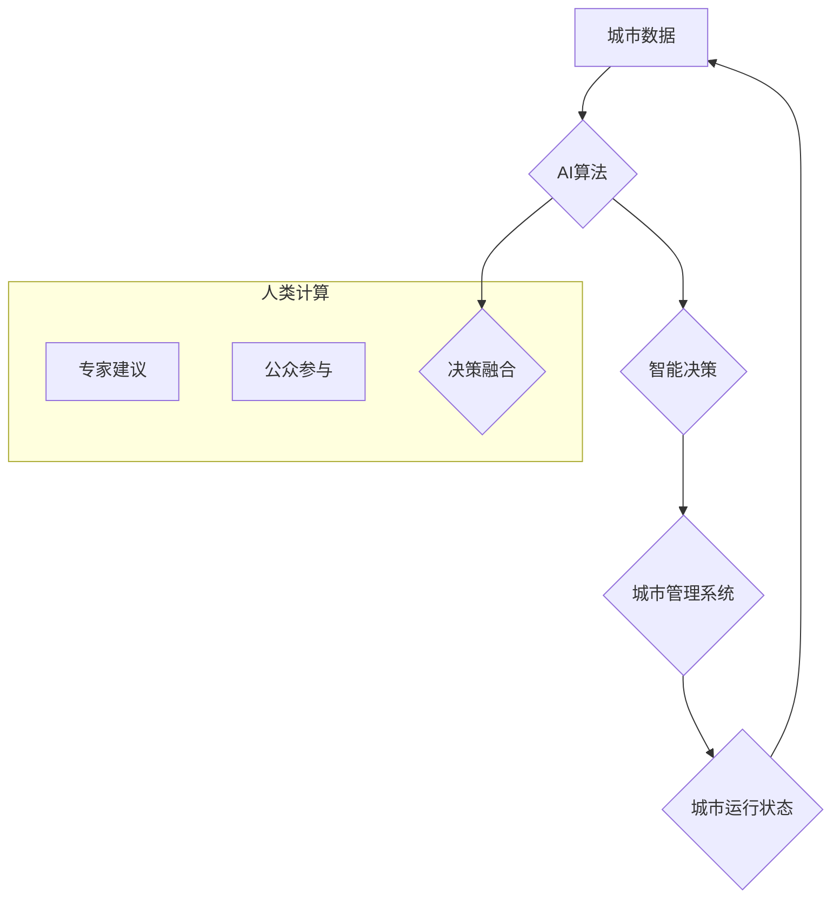

                 

## AI与人类计算：打造可持续发展的城市生活

> 关键词：人工智能、城市计算、可持续发展、数据驱动、智能优化、人类计算、协同智能、城市规划、资源管理、环境保护

### 1. 背景介绍

城市化进程的加速和人口增长的持续推动着城市规模的不断扩大，也带来了资源消耗、环境污染、交通拥堵等一系列挑战。传统城市管理模式难以有效应对这些问题，迫切需要引入新的技术和理念来构建更加智慧、可持续的城市生活。

人工智能（AI）作为一种新兴技术，凭借其强大的数据处理、学习和决策能力，为城市管理和发展提供了新的机遇。AI技术可以帮助城市更好地收集、分析和利用数据，实现对城市运行的智能化管理和优化，从而提升城市效率、降低成本、改善居民生活质量，并促进城市的可持续发展。

### 2. 核心概念与联系

**2.1 城市计算与AI融合**

城市计算是指利用传感器、网络、数据分析等技术，对城市运行状态进行实时监测、分析和决策，以实现城市管理的智能化和优化。AI技术可以赋能城市计算，使其更加智能化和高效化。

**2.2 人类计算与AI协同**

人类计算是指人类利用其认知能力、经验和创造力，对数据进行理解、分析和决策。AI技术可以辅助人类计算，提升其效率和准确性。

**2.3 可持续发展目标**

可持续发展目标（SDGs）是联合国提出的2030年可持续发展议程，旨在解决全球面临的经济、社会和环境问题。AI技术可以为实现SDGs目标提供支持，例如：

* **环境保护:** 利用AI技术监测环境污染、预测自然灾害、优化能源使用等。
* **经济发展:** 利用AI技术促进创新、提高生产效率、创造就业机会等。
* **社会公平:** 利用AI技术改善医疗保健、教育资源分配、保障弱势群体权益等。

**2.4 架构图**



### 3. 核心算法原理 & 具体操作步骤

**3.1 算法原理概述**

城市计算与AI融合的核心算法包括：

* **机器学习:** 利用算法从数据中学习模式和规律，进行预测和决策。
* **深度学习:** 基于多层神经网络，能够处理更复杂的数据，实现更精准的预测和识别。
* **强化学习:** 通过试错学习，优化决策策略，实现智能控制。

**3.2 算法步骤详解**

1. **数据采集:** 利用传感器、摄像头、社交媒体等收集城市运行数据，例如交通流量、空气质量、能源消耗等。
2. **数据预处理:** 对采集到的数据进行清洗、转换、特征提取等处理，使其适合算法训练。
3. **模型训练:** 选择合适的AI算法，利用预处理后的数据进行模型训练，学习城市运行的规律和模式。
4. **模型评估:** 利用测试数据评估模型的性能，并进行调整和优化。
5. **模型部署:** 将训练好的模型部署到城市管理系统中，实现对城市运行的智能化管理和优化。

**3.3 算法优缺点**

**优点:**

* **数据驱动:** 基于海量数据分析，决策更加科学和精准。
* **智能化:** 自动化处理城市运行数据，提高效率和降低成本。
* **可持续性:** 优化资源利用，降低环境污染，促进城市可持续发展。

**缺点:**

* **数据依赖:** 算法性能依赖于数据质量和数量。
* **算法黑盒:** 某些AI算法难以解释其决策过程，缺乏透明度。
* **伦理问题:** AI算法可能存在偏见和歧视，需要进行伦理审查和监管。

**3.4 算法应用领域**

* **交通管理:** 智能交通信号灯控制、车辆导航、交通拥堵预测等。
* **环境监测:** 空气质量监测、水质监测、噪声污染监测等。
* **能源管理:** 智能电网、建筑节能、能源消耗预测等。
* **公共安全:** 犯罪预测、公共安全事件预警、应急救援等。
* **城市规划:** 城市发展规划、土地利用规划、人口流动预测等。

### 4. 数学模型和公式 & 详细讲解 & 举例说明

**4.1 数学模型构建**

城市计算与AI融合的数学模型通常基于以下几个方面：

* **数据建模:** 利用统计学和概率论等方法，构建城市运行数据的数学模型，例如交通流量模型、空气质量模型等。
* **预测模型:** 利用机器学习算法，构建城市运行状态的预测模型，例如交通拥堵预测模型、能源消耗预测模型等。
* **优化模型:** 利用运筹学和数学规划等方法，构建城市资源分配和管理的优化模型，例如交通流量优化模型、能源分配优化模型等。

**4.2 公式推导过程**

例如，交通流量预测模型可以使用ARIMA模型，其核心公式如下：

$$y_t = c + \sum_{i=1}^p a_i y_{t-i} + \sum_{j=1}^q b_j \epsilon_{t-j}$$

其中：

* $y_t$ 是时间t的交通流量
* $c$ 是常数项
* $a_i$ 是自回归系数
* $b_j$ 是移动平均系数
* $\epsilon_{t-j}$ 是时间t-j的随机误差项

**4.3 案例分析与讲解**

利用ARIMA模型预测城市交通流量，可以帮助交通管理部门制定更合理的交通规划，例如调整信号灯控制策略、引导车辆流向等，从而缓解交通拥堵。

### 5. 项目实践：代码实例和详细解释说明

**5.1 开发环境搭建**

* 操作系统: Ubuntu 20.04
* Python 版本: 3.8
* 必要的库: pandas, numpy, scikit-learn, matplotlib

**5.2 源代码详细实现**

```python
import pandas as pd
from sklearn.model_selection import train_test_split
from sklearn.linear_model import LinearRegression
from sklearn.metrics import mean_squared_error

# 加载交通流量数据
data = pd.read_csv('traffic_data.csv')

# 选择特征变量和目标变量
features = ['hour', 'weekday', 'temperature']
target = 'traffic_volume'

# 将数据分为训练集和测试集
X_train, X_test, y_train, y_test = train_test_split(data[features], data[target], test_size=0.2)

# 创建线性回归模型
model = LinearRegression()

# 训练模型
model.fit(X_train, y_train)

# 预测测试集数据
y_pred = model.predict(X_test)

# 计算模型性能
mse = mean_squared_error(y_test, y_pred)
print(f'Mean Squared Error: {mse}')

# 可视化预测结果
import matplotlib.pyplot as plt
plt.scatter(y_test, y_pred)
plt.xlabel('Actual Traffic Volume')
plt.ylabel('Predicted Traffic Volume')
plt.title('Traffic Volume Prediction')
plt.show()
```

**5.3 代码解读与分析**

这段代码实现了基于线性回归模型的交通流量预测。

1. 首先加载交通流量数据，并选择特征变量和目标变量。
2. 将数据分为训练集和测试集，用于训练和评估模型。
3. 创建线性回归模型，并使用训练集数据进行模型训练。
4. 利用训练好的模型预测测试集数据，并计算模型性能。
5. 可视化预测结果，观察模型的预测精度。

**5.4 运行结果展示**

运行代码后，会输出模型的均方误差值，以及预测结果的散点图。

### 6. 实际应用场景

**6.1 交通管理**

* **智能交通信号灯控制:** 根据实时交通流量数据，智能调整信号灯的绿灯时间，优化交通流量，减少拥堵。
* **车辆导航:** 利用AI算法预测交通拥堵情况，为驾驶员提供最优的导航路线。
* **交通拥堵预测:** 利用历史交通流量数据和实时路况信息，预测未来交通拥堵情况，为交通管理部门提供决策依据。

**6.2 环境监测**

* **空气质量监测:** 利用传感器数据和AI算法，实时监测空气质量，并发布预警信息。
* **水质监测:** 利用传感器数据和AI算法，实时监测水质，并及时发现污染源。
* **噪声污染监测:** 利用传感器数据和AI算法，实时监测噪声污染情况，并采取措施降低噪音。

**6.3 能源管理**

* **智能电网:** 利用AI算法优化电力调度，提高电网效率，降低能源消耗。
* **建筑节能:** 利用AI算法分析建筑能耗数据，优化建筑设计和运营，降低能源消耗。
* **能源消耗预测:** 利用历史能源消耗数据和天气预报等信息，预测未来能源消耗，为能源管理部门提供决策依据。

**6.4 未来应用展望**

随着AI技术的不断发展，其在城市计算领域的应用将更加广泛和深入，例如：

* **城市安全:** 利用AI技术实现城市安全监控、犯罪预测、应急救援等。
* **城市规划:** 利用AI技术优化城市布局、交通规划、资源分配等。
* **智慧医疗:** 利用AI技术实现远程医疗、疾病诊断、个性化治疗等。
* **智慧教育:** 利用AI技术实现个性化学习、智能辅导、在线教育等。

### 7. 工具和资源推荐

**7.1 学习资源推荐**

* **在线课程:** Coursera, edX, Udacity 等平台提供丰富的AI相关课程。
* **书籍:** 《深度学习》、《机器学习实战》等书籍是学习AI的基础教材。
* **开源社区:** TensorFlow, PyTorch 等开源社区提供丰富的学习资源和代码示例。

**7.2 开发工具推荐**

* **Python:** 作为AI开发的主要语言，Python拥有丰富的库和框架，例如TensorFlow, PyTorch, scikit-learn等。
* **Jupyter Notebook:** 用于编写和运行Python代码的交互式环境，方便进行数据分析和模型开发。
* **云计算平台:** AWS, Azure, GCP 等云计算平台提供强大的计算资源和AI服务，方便进行大规模数据处理和模型训练。

**7.3 相关论文推荐**

* **《Attention Is All You Need》:** 介绍了Transformer模型，在自然语言处理领域取得了突破性进展。
* **《Deep Residual Learning for Image Recognition》:** 介绍了ResNet模型，在图像识别领域取得了突破性进展。
* **《Generative Adversarial Networks》:** 介绍了GAN模型，在图像生成、文本生成等领域取得了突破性进展。

### 8. 总结：未来发展趋势与挑战

**8.1 研究成果总结**

城市计算与AI融合取得了显著成果，例如：

* **交通管理:** 智能交通信号灯控制、车辆导航、交通拥堵预测等。
* **环境监测:** 空气质量监测、水质监测、噪声污染监测等。
* **能源管理:** 智能电网、建筑节能、能源消耗预测等。

**8.2 未来发展趋势**

* **边缘计算:** 将AI算法部署到边缘设备，实现更快速的决策和响应。
* **联邦学习:** 在不共享原始数据的情况下，利用多个设备协同训练AI模型，提高模型性能和隐私保护。
* **多模态融合:** 将不同类型的数据（例如文本、图像、音频）融合在一起，构建更全面的城市模型。

**8.3 面临的挑战**

* **数据质量:** AI算法的性能依赖于数据质量，需要解决城市数据采集、清洗和标准化等问题。
* **算法透明度:** 某些AI算法难以解释其决策过程，缺乏透明度，需要研究更可解释的AI算法。
* **伦理问题:** AI算法可能存在偏见和歧视，需要进行伦理审查和监管。

**8.4 研究展望**

未来，城市计算与AI融合将继续深入发展，为构建更加智慧、可持续的城市生活提供新的技术支撑。


### 9. 附录：常见问题与解答

**9.1 如何获取城市运行数据？**

城市运行数据可以从以下几个方面获取：

* **传感器网络:** 利用传感器网络实时采集城市运行数据，例如交通流量、空气质量、温度湿度等。
* **公共数据库:** 许多城市政府会公开发布城市运行数据，例如人口统计数据、交通数据、能源数据等。
* **社交媒体:** 利用社交媒体数据，例如微博、微信等，收集城市居民的意见和反馈。

**9.2 如何选择合适的AI算法？**

选择合适的AI算法需要根据具体应用场景和数据特点进行选择。例如：

* **预测问题:** 可以使用ARIMA模型、LSTM模型等时间序列预测模型。
* **分类问题:** 可以使用决策树、支持向量机、神经网络等分类模型。
* **回归问题:** 可以使用线性回归、逻辑回归、神经网络等回归模型。

**9.3 如何解决AI算法的透明度问题？**

解决AI算法的透明度问题可以通过以下几种方法：

* **使用可解释的AI算法:** 例如决策树、线性回归等算法，其决策过程相对透明。
* **进行模型解释:** 利用模型解释技术，例如LIME、SHAP等，解释AI模型的决策过程。
* **建立AI伦理规范:** 制定AI伦理规范，要求AI算法的设计和应用要透明、可解释、公平公正。


作者：禅与计算机程序设计艺术 / Zen and the Art of Computer Programming 
<end_of_turn>

